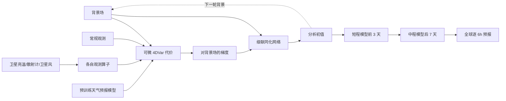

# XiChen：以 4DVar 梯度连接异构观测、同化与中期预报

> Wuxin Wang、Weicheng Ni、Ben Fei、Tao Han、Lilan Huang 等，*XiChen: A global weather observation-to-forecast machine learning system via four-dimensional variational gradient-guided flexible assimilation*，arXiv:2507.09202，[v3，2026-02-08](https://arxiv.org/html/2507.09202v3)。初稿 v1 为 2025-07-12；本笔记以 v3 为准，阅读于 2026-09-24。仍是预印本，未把摘要/作者自述当成独立业务验收。

## 核心判断与版本纠偏

XiChen 解决的不是再造一个从 ERA5 状态出发的预报网络，而是让**观测→初始分析场→预报**成为可循环的机器学习系统。核心接口是 4DVar 代价函数对背景场的梯度：来自常规资料、微波亮温、散射计风等不同观测的误差信息，经各自观测算子投影到同一个气象状态空间，再交给同化网络。v3 的 2023 年试验报告：若用 ERA5 初值，Z500 ACC>0.6 可超过 **10.25 天**；若用 XiChen 自己同化出的初值，则是超过 **8.75 天**。两者不是同一个端到端成绩。旧追踪表所记“同化到预报约 15 秒”在当前 v3 正文中没有找到相同表述，故不作为本笔记结论。[结果 2.2、讨论](https://arxiv.org/html/2507.09202v3)

## 1. 模型方法：为何梯度能统一异构观测

4DVar 同时惩罚分析初值偏离背景和由预报/观测算子算出的观测不匹配。传统数值系统需要切线性与伴随；XiChen 用可微预报模型和观测算子通过自动微分得到代价函数对背景场的梯度。此梯度已在网格状态空间中编码各观测对初值的敏感度，DA 网络以“背景 + 梯度”生成分析场，因此不用为每种传感器把原始观测直接拼成同一固定通道。**不是完全不需要传感器特定模块**：新增卫星仍要微调相应观测算子和 DA 组件，但不必重训整个级联。[图 1、方法 4.3–4.6](https://arxiv.org/html/2507.09202v3)

作者依序同化 GDAS prepbufr 常规观测、MHS 亮温、ASCAT 风、AMSU-A 亮温及 SATWND 卫星风；某类资料缺失时可移除该级联单元。这种模块化不同于原始影像直接到格点的黑箱编码。预报主干先以多种 lead（1、3、6、12、24 小时）条件化预训练，再训练短/中滚动版本；对自生分析场，前 3 天使用 XiChen-Short，后 7 天使用 XiChen-Medium。论文的“基础模型”角色主要是共享预报、观测算子和同化的初始化，而非证明完全不依赖传统资料。[图 1、方法 4.4](https://arxiv.org/html/2507.09202v3)

### 图：依据图 1 重绘的观测—分析—预报链

以下为本仓库的**事实性流程重绘**，不是原图转载。[原文图 1](https://arxiv.org/html/2507.09202v3)

## 2. 训练、数据与科学一致性检查

预报主干以约 **12 年 ERA5、1.40625°** 数据训练，采用纬度/变量加权 L1；对比 Pangu、GraphCast、FengWu 等 0.25° 模型时应记住训练网格和初始场条件并不相同。作者报告预训练用 8 张 A100-40GB 约 45 小时、预报微调约 94 小时；每个卫星观测算子微调约 13.3 小时。以上是训练阶段成本，不是端到端推理延迟。[方法 4.4–4.5](https://arxiv.org/html/2507.09202v3)

物理一致性证据之一是 2023-07-24 台风杜苏芮附近对单个 AMSU-A/MHS 通道施加 +5 K 扰动：温度敏感通道产生相应温度增量，湿度敏感通道改变水汽，响应沿水平和垂直及背景流传播。它检验的是局部观测敏感性和一定的流依赖特征；一个案例与若干通道不能单独证明所有卫星资料、所有天气型的动力平衡。作者在讨论中也承认仍有场平滑。[结果 2.1、图 2](https://arxiv.org/html/2507.09202v3)

## 3. 性能表：务必区分“好初值”与“自生初值”

下表重排原文图 3、图 4、图 6 及正文给出的**明确数字/方向**，没有从曲线反推不可核验的小数。评估年份为 2023，天气预报按 6 小时间隔，8 个变量对 ERA5 评分；台风路径另以 IBTrACS 比较。[结果 2.2–2.4](https://arxiv.org/html/2507.09202v3)

| 试验与原文位置 | 结果 | 正确解读 |
| --- | --- | --- |
| ERA5 初值，Z500 ACC>0.6（图 3 正文） | **>10.25 天** | 这是预报模型吃外部高质量初值，**不是**纯观测端到端成果 |
| XiChen 自生成分析初值，Z500 ACC>0.6（图 3） | **>8.75 天**；GFS **8.25 天** | 是端到端链更相关的时效；与 IFS 在全部变量上胜出不能等同 |
| Q500 RMSE（图 3 正文） | 第 **2 天后**优于 GFS，第 **4 天后**优于 IFS HRES | 长 lead 误差低可能部分受场平滑影响 |
| Z500 RMSE（图 3 正文） | 前 6 天差于两基线；第 **7 天后**优于 GFS、第 **8 天后**优于 IFS HRES | 早期劣势不可隐藏；指标只是一种大尺度场评分 |
| 观测移除消融（图 4） | 移除每种资料均增误，GDAS prepbufr 影响最大 | 说明资料有边际作用，但受资料数量/质量影响 |
| 2023 年台风分析检出（图 6） | IBTrACS 81 个；ERA5 识别 **64.2%**、轨迹偏差 **0.66°**；XiChen 分析识别 **61.73%**、偏差 **0.79°** | 自生分析仍落后 ERA5，不能只写个别新增检出的台风 |

图 6 还显示卫星资料相对只用 GDAS 改善台风路径，但最大风速与最低海平面气压的改进小；ERA5 初值整体预报技巧仍最高。作者把这与预报网络主要在 ERA5 上训练、强度场平滑相关联，提示“同化更多观测”不必然解决极端强度偏弱。[结果 2.4、图 6](https://arxiv.org/html/2507.09202v3)

## 4. 我的判断、局限和复现顺序

XiChen 的真正增量是把可解释的变分梯度作为**可增减观测类型的状态空间接口**，而不是 10 天分数本身。其边界也清楚：预报网络仍依赖 ERA5 学习目标；资料集合远小于 GFS/IFS 业务系统；比较有网格和输入差异；v3 的自生初值 Z500 技巧是 8.75 天级，尚非稳定跨过 10–15 天；长期循环与极端强度平滑需要继续测试。[讨论](https://arxiv.org/html/2507.09202v3)

复现时先严格重现四组初值（ERA5、仅 GDAS、GDAS+各卫星、全观测）与 2023 年相同起报时刻，再分别报告分析误差、前 48 小时的“初始化代价”、逐 lead RMSE/ACC、台风检出率与强度、推理时延。下一步应做跨年份实时资料流与新传感器“只微调局部组件”的实际时间/性能测试，才能验证可扩展性主张。

[返回仓库首页](../README.md) · [返回总追踪表](../气象大模型_中期预报论文追踪.md)
