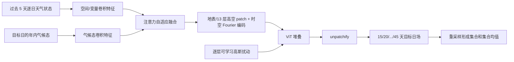

# TianQuan-S2S：气候态注意力融合与逐层随机扰动的 15–45 天预报

> Guowen Li、Xintong Liu、Yang Liu、Mengxuan Chen、Shilei Cao 等，*TianQuan-S2S: A Subseasonal-to-Seasonal Global Weather Model via Incorporate Climatology State*，arXiv:2504.09940，初版 2025-04-14；本笔记据 [v6，2026-03-12](https://arxiv.org/html/2504.09940v6) 阅读于 2026-09-24。该作已列入 [ICLR 2026 正式论文列表](https://iclr.cc/virtual/2026/papers.html)；[作者项目页](https://github.com/zhangminglang42/TianQuan)截至本次核对仍说明训练代码尚未公开。旧追踪表使用早期名称 “TianQuan-Climate”；以下实验数值以 v6 为准，不默认等同于会议定稿每项表格。

## 核心判断

本工作针对 15–45 天 S2S，不是把中期 6 小时步长无限滚动：输入最近 5 天状态与对应年内气候态，训练多个按目标时效单步输出的模型，再组合这些输出。气候态提供远期低频背景，Transformer 每层可学习噪声幅度以形成集合和减轻过度平滑。论文表 2 有一条必须保留的负面结果：**Wind10 的集合均值 RMSE 在 15–40 天均高于气候态基线**，所以摘要“总体优于气候态”不能扩展成所有变量。[摘要、表 2、讨论](https://arxiv.org/html/2504.09940v6)

## 1. 问题设定与模型数据流

作者认为 S2S 的可预报性同时来自初始大气状态与缓慢变化、季节相关的气候背景。只靠初值，到两三周后高频天气细节会失去可预报性；只回归到平均气候态，又会让异常型态与局地信息消失。模型取过去 5 天逐日状态，使用 1979–2016 资料生成 366 个年内日气候态，对输入场与气候态各做卷积特征提取，再用注意力权重自适应融合，而非固定相加。[第 2–3 节、图 2](https://arxiv.org/html/2504.09940v6)

融合后把地表和 13 层高空变量分 patch，加经纬度与时间 Fourier 编码送入 ViT。每个 Transformer block 除确定性注意力更新，还加入由网络 $g_n(E)$ 学得幅度的高斯噪声，即 $E_{n+1}=E_n+h_n(E_n)+g_n(E_n)\epsilon$。与仅扰动初始场不同，这个噪声贯穿深层表示，旨在长时效维持样本多样性。输出侧 unpatchify 还原物理变量，损失为纬度加权 MSE。按 15、20、25、30、35、40、45 天分别训练对应单步模型；因此这不是单个“任意 lead 通用模型”，且多模型输出的一致性值得检查。[第 3 节、训练细节](https://arxiv.org/html/2504.09940v6)

### 图：依据原文图 2 与第 3 节事实重绘

下图是本仓库自行绘制的机制示意，非原图截图或视觉改图。[原文图 2](https://arxiv.org/html/2504.09940v6)

## 2. 数据、基线、成员数与可比性

ERA5 时段为 1979–2018；训练 1979–2015、验证 2016、测试 2017–2018。作者从 6 小时资料聚合为逐日平均，再降采样到 1.40625° 和 5.625° 两档；这与 0.25°、逐 6 小时的中期业务预报不同，也会使短时极端被时间平均稀释。气候态计算使用 1979–2016；其是否包含验证年以及气候态对试验协议的作用，复现时须保持与对照一致。训练报告使用 8 张 80 GB GPU，AdamW、100,000 步调度；这不等于所有 7 个 lead 模型加起来的完整成本。基线含 ECMWF-S2S、FuXi-S2S、ClimaX、气候态。[第 2、4 节](https://arxiv.org/html/2504.09940v6)

确定性比较用一次输出；集合试验作者描述为原始成员加 50 个随机扰动，共 **51 成员**，并引入各层随机噪声。ClimaX 通过扰动初始状态做集合，FuXi-S2S 原有集合机制不同，因而必须核对成员数、初始化、后处理与同一验证期，不能只看一个 CRPS 说某种概率机制必然更强。论文在第 15–45 天报告 RMSE、ACC；集合部分还给 CRPS、spread mean error 和 relative quantile error。[第 4 节、表 1–2](https://arxiv.org/html/2504.09940v6)

## 3. 关键性能表：好结果与坏结果都保留

以下选摘原文 [表 1–3](https://arxiv.org/html/2504.09940v6) 的明确单元格。RMSE/CRPS 越低越好，ACC 越高越好；不同表的“单次预测”“集合均值”“概率评分”不能直接互换。Z500 的表 3 是消融设置，数值口径与表 2 集合均值不相同。

| 表/指标与变量 | Lead | 对照 | TianQuan-S2S | 读法 |
| --- | ---: | ---: | ---: | --- |
| 表 1，T2m CRPS | 15 天 | FuXi-S2S **2.238** | **2.256** | 这一格略差于 FuXi，非“全面领先” |
| 表 1，T2m CRPS | 30 天 | FuXi-S2S **2.359** | **2.297** | 较长 lead 优势出现 |
| 表 2，T2m 集合均值 RMSE | 30 天 | FuXi-S2S **2.520**；气候态 **2.610** | **2.502** | 两项对照均优，但差距不大 |
| 表 2，Z500 集合均值 RMSE | 30 天 | FuXi-S2S **807**；气候态 **820** | **798** | 大尺度场有改善 |
| 表 2，Wind10 集合均值 RMSE | 30 天 | FuXi-S2S **3.678**；气候态 **2.430** | **3.711** | 差于两者，重要失败项 |
| 表 3，Z500 单模型消融 RMSE/ACC | 45 天 | 无噪声且无气候态：**1048 / 0.441** | 全模型：**921 / 0.535** | 联合设计长 lead 增益明显 |

作者正文称第 45 天 Wind10 ACC：ClimaX **0.172**、ECMWF-S2S **0.112**、TianQuan **0.297**。这个“比基线高”与 Wind10 集合均值 RMSE 差于气候态并不矛盾：ACC 是异常空间相关，RMSE 是量值误差，且比较对象也不同。另一个值得警惕的表述是正文“集合均值 RMSE 在 T2m/T850/Z500 高于气候态基线”按上下文应理解为**技巧更高/误差更低**，不能把“RMSE 数值高于”照字面复制；表 2 的具体数值才是准绳。[结果 4.1、表 2](https://arxiv.org/html/2504.09940v6)

## 4. 消融、诊断与科学局限

表 3 对 Z500 45 天的比较显示：只去噪声为 RMSE **940**，只去气候态为 **972**，两者都去为 **1048**，全模型 **921**；在该设置下两个模块均有贡献且存在叠加收益。不过“气候态帮助远期”的陈述还要在每个变量和区域上验证，不能仅由 Z500 与 T2m 的消融推到全部变量。表 4 比较了直接拼接、门控、只扰动初值、固定层噪声和不同注噪层数；全模型在该表所列 T2m/Z500 指标较优，但不同方案的模型容量/训练预算须复核。[表 3–4](https://arxiv.org/html/2504.09940v6)

Figure 4 的 30 天地图说明模型不只输出均值平滑场，Figure 5 的点散图比较相关与偏差；但少数时刻的视觉例子不能代替多年极端事件、MJO/ENSO 遥相关或区域雨量评估。模型第 15 天才开始预测，因此它补充的是中期之后的 S2S，不应与 0–10 天模型逐日同场比较。更关键的是：气候态对风的强基线仍难超越，若只挑 T2m/Z500 会高估跨变量泛化。[第 4 节与附录](https://arxiv.org/html/2504.09940v6)

复现建议：固定训练年、366 日气候态和逐日平均口径，公开每个目标 lead 的独立模型及参数量；逐变量画 lead–RMSE/ACC/CRPS 和 spread–skill，并在强风/温度极端、不同纬带、不同季节单独评分。还应加入同成员数、相同训练成本的“只用气候态”“只扰动初值”“无逐层噪声”对照，量化性能收益相对七模型总计算开销是否值得。

[返回仓库首页](../README.md) · [返回总追踪表](../气象大模型_中期预报论文追踪.md)
