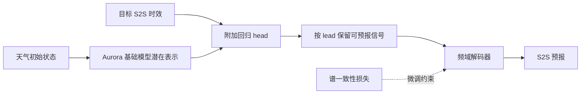

# Xaurora：Aurora 的谱一致性 S2S 微调（EGU 摘要解读）

> Eliot Walt、Wessel Bruinsma、Maurice Schmeits、Efstratios Gavves、Dim Coumou，*Xaurora: Advancing subseasonal-to-seasonal forecasting by fine-tuning foundation weather models with spectral consistency*，[EGU25-9956 官方摘要](https://doi.org/10.5194/egusphere-egu25-9956)，会议 2025-04-27 至 05-02；页面标注 2025-03-15 更新。阅读于 2026-09-24。**资料级别仅为会议摘要，不是完整研究论文**；以下不会填充摘要未公开的表格或网络超参数。

## 研究问题与最小可核验结论

Aurora 已在中期天气预报表现较强，但把自回归天气基础模型带到两周至三个月 S2S 时，问题由“保留精细瞬时天气”转为“保留仍可预报的低频异常和遥相关”。EGU 摘要提出 Xaurora，意为 extended Aurora：在 Aurora 基座上做 S2S 微调，使潜在表征按目标时效聚焦可预报信号，并通过频域解码器与损失约束空间频谱一致性。摘要称会用消融、确定性/概率评分及遥相关指数评估，并“展示初步结果”，**但未披露任何具体指标数值、测试年、显著性区间或成绩表**。[官方摘要](https://meetingorganizer.copernicus.org/EGU25/EGU25-9956.html)

## 方法流程与能够推断、不能推断之处

公开摘要明确写了两个模块。第一是在潜在嵌入上添加回归 head，以 lead time 为条件保留可预报部分；第二是频域解码器和谱一致性损失，目标是让输出聚焦更可预报的频率。这可作为一种结构假设：远期天气的小尺度高频分量易失去相位技巧，过分追逐像素细节可能损害低频信号。然而**摘要没有公开频域变换选择、具体损失公式、谱段权重、回归头的训练标签或最终预报输出频率**，不能据关键词自行补写 FFT 权重公式或模型参数量。[官方摘要](https://meetingorganizer.copernicus.org/EGU25/EGU25-9956.html)

### 图：只包含摘要明确披露环节的概念流程

本图为本仓库根据[EGU 官方摘要](https://meetingorganizer.copernicus.org/EGU25/EGU25-9956.html)自行绘制的**高层流程**，不是未经公开的网络结构图。

该图不能说明具体层数、频域变换或是否同时存在独立概率生成器；摘要对此均未给出。更不能把原 Aurora 的 **10 天正式论文天气成绩**算作 Xaurora 的 14–90 天实测成绩。[Aurora 正式论文](https://doi.org/10.1038/s41586-025-09005-y)、[EGU 摘要](https://doi.org/10.5194/egusphere-egu25-9956)

## 性能与实验披露表

| 应核验项目 | 当前官方摘要实际披露 | 对性能判断的影响 |
| --- | --- | --- |
| 目标范围 | S2S，约两周至三个月 | 是研究目标，不等于逐 lead 已证实技巧 |
| 微调基座 | Aurora | 可讨论迁移策略，但需基座版本/权重 |
| 对照 | 提及与原 Aurora 做谱一致性微调消融 | 无具体对照模型设置和数值 |
| 确定性/概率评分 | 表示会提供标准分数 | **未给指标名称、数值、样本量** |
| 遥相关指标 | 表示会考察 | 未给 MJO/ENSO 等具体指数和结果 |
| 数据切分/分辨率/成员数/成本 | 未披露 | 无法复现，也不能画准确性能曲线 |

因此这是一条**值得跟进的研究线索，不是已证实提升多少天的结果**。对照天津 Quan 的气候态融合、Aurora 的长滚动微调可提出研究假说，但没有相同数据和指标，不能放入统一排名。[EGU 摘要](https://doi.org/10.5194/egusphere-egu25-9956)

## 下一步检索与评审清单

首先查作者新预印本或正式论文是否沿用 Xaurora 名称，并区分其他同名或后续不同作者组合的工作。完整稿出现后应核对：频域损失公式和谱段、可预报信号标签的定义、与原 Aurora 相同起报与训练期资料、2/3/4/6 周技巧曲线、概率集合生成与 CRPS/可靠性、MJO/ENSO/NAO 指数以及跨年份显著性。目前这些均属**未公开证据**，不能用“摘要说会评估”替代已完成评估结果。

[返回仓库首页](../README.md) · [返回总追踪表](../气象大模型_中期预报论文追踪.md)
