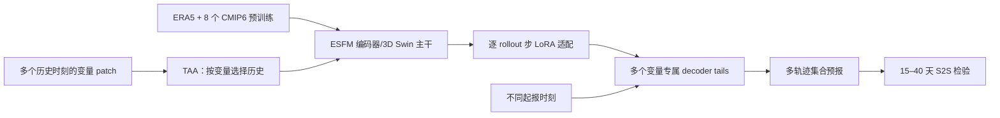

# ESFM 的 S2S 策略：多尾解码、步长适配与慢变量时序注意力（EGU 摘要/海报）

> Piotr Wilczyński、Fanny Lehmann、Firat Ozdemir、Salman Mohebi、Yun Cheng 等，*Subseasonal-to-Seasonal strategies for the Earth System Foundation Model (ESFM)*，[EGU26-14846 官方摘要](https://doi.org/10.5194/egusphere-egu26-14846)，会议 2026-05-03 至 05-08；另有[作者上传的会议海报](https://presentations.copernicus.org/EGU26/EGU26-14846_supplement-h402909.pdf)。阅读于 2026-09-24。**证据层级是摘要加海报，不是完整论文和可复现的正式实验报告。**

## 核心判断

研究目标是把预训练于 ERA5 与八套 CMIP6 数据的 ESFM 从天气时效延伸到 S2S：用多解码尾与不同起报初值产生集合，为后续 rollout 步训练 LoRA 适配器，并使慢变量的编码器能够关注更长历史。海报明确展示 **38 天海平面气压 rollout、96 个集合成员**，但没有可从正文直接抄录的完整逐变量 RPSS/CRPS 数字表；不能把“合理零样本 15–40 天”或海报图像等同于业务上已达到统一技巧门槛。[EGU 摘要](https://meetingorganizer.copernicus.org/EGU26/EGU26-14846.html)、[海报](https://presentations.copernicus.org/EGU26/EGU26-14846_supplement-h402909.pdf)

## 1. 基座与三个 S2S 扩展方向

ESFM 基座为 Transformer 地球系统模型，输入两个相邻时刻的多变量状态预测下一时刻；会议海报更具体写成潜空间编码 → 3D Swin Transformer → 解码物理变量，预训练源是 ERA5 加八个 CMIP6 气候数据集。这样的多源数据可能帮助模型学到更慢的地球系统变化，但仅凭预训练来源不能证明对具体 S2S 异常存在技巧。[摘要、海报 Introduction 与 ESFM architecture](https://presentations.copernicus.org/EGU26/EGU26-14846_supplement-h402909.pdf)

第一条是概率集合：每种变量可有多个 decoder tails，在一次前向中生成不同未来轨迹；再叠加不同初始时刻的 rollout 以增加成员。它有别于只向初值加随机噪声；但多尾间是否足够多样、各成员是否有相同权重、96 成员如何具体构成，公开海报没有可完整复现的表。第二条是按后续 rollout 步训练 LoRA 适配器，使远期状态不必完全沿用一步预报参数；理论上可以更高效，但需要逐步成本和消融才能判定。第三条是 Temporal Attention Aggregator（TAA），从任意长度的历史 patch 嵌入里为每个变量挑有用时刻：风等快变量偏近时刻，海表温度/土壤湿度/海冰等慢变量可能受更远历史影响。[EGU 摘要、海报](https://meetingorganizer.copernicus.org/EGU26/EGU26-14846.html)

### 图：据摘要和海报文字重绘的高层路径

下图为本仓库的机制梳理，不是会议海报原图截图。[摘要与海报](https://presentations.copernicus.org/EGU26/EGU26-14846_supplement-h402909.pdf)

这个流程标示了**公开材料所描述的模块关系**，不声称所有模块同时在一项最终实验中得到独立验证；TAA 如何与 LoRA 共享权重、tail 数与训练目标仍须正式稿确认。

## 2. 海报结果证据表及不能读取的数字

| 项目 | 来源明确写出的事实 | 未披露/不能推断 |
| --- | --- | --- |
| 零样本 S2S | 摘要称原 ESFM 有“合理”的 **15–40 天**预测 | 无数值化 ACC/RPSS 门槛和区域分布 |
| MSLP 实例 | 海报给出 **38 天** rollout 与 **96 成员**不确定性轨迹 | 单个案例不足以证明集合可靠性、极端校准 |
| AI Weather Quest | 海报图标注 **2025-12 至 2026-02** 的选定模型 RPSS 比较 | 未提供可复算的逐变量数字表与所有起报日期 |
| TAA 诊断 | 海报比较 mixed lead 训练与 6h lead 的 RMSE | 缺数据切分、具体变量全表、置信区间 |
| LoRA 成本与收益 | 摘要称长 lead 有改善且成本增量不大 | 无逐步参数量、显存、时延、显著性数字 |

海报说集合初始 spread 低、随 rollout 加宽；这是合理的可视化现象，却不等于 spread 与实际误差匹配。对概率预报真正有用的是逐 lead 的 CRPS/RPSS、rank histogram、极端阈值可靠性和与相同成员数业务集合的比较。仅见海报曲线而无可读取数据时，不从图片像素倒推出“改进 X%”。[会议海报](https://presentations.copernicus.org/EGU26/EGU26-14846_supplement-h402909.pdf)

## 3. 与中期/S2S 的关系及下一步核验

这条路线把 S2S 可预报性拆成三个层次：预训练含气候模拟、远期步骤特定适配、慢变量长记忆。若各模块确实互补，可能比简单拉长 6 小时自回归更稳；不过目前唯一可坚实引用的是**会议阶段提出并演示了 38 天/96 成员案例**。后续完整论文应给出相同起报时刻/网格/变量下的基座、+tail、+LoRA、+TAA 逐项消融；第 2–6 周的 RPSS/CRPS/ACC；多年度/多季节显著性；慢变量注意力是否与已知物理时间尺度一致；以及每个成员实际推理代价。[EGU 摘要](https://meetingorganizer.copernicus.org/EGU26/EGU26-14846.html)

[返回仓库首页](../README.md) · [返回总追踪表](../气象大模型_中期预报论文追踪.md)
