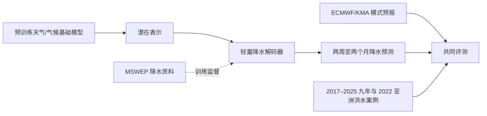

# 用天气/气候基础模型预测 S2S 降水：MSWEP 与轻量解码器（EGU 摘要解读）

> Ebony Lee、Seulgi Kim、Donggeon Lee、Venkatesh Budamala、Hyunglok Kim，*Weather and Climate Foundation Models Enhance Subseasonal-to-Seasonal (S2S) Precipitation Prediction Using Multi-Source Satellite Observations*，[EGU26-18057 官方摘要](https://doi.org/10.5194/egusphere-egu26-18057)，会议 2026-05-03 至 05-08；页面标注 2026-03-14 更新。阅读于 2026-09-24。**目前仅公开会议摘要，题名里的“Enhance”不能被当成已报告量化增益。**

## 核心判断

这个项目想检验：能否用预训练天气/气候基础模型的潜在表示和一个轻量降水解码器，在两周至两个月的 S2S 范围内改善区域降水预报，并与 ECMWF、韩国气象厅（KMA）模式比较。官方摘要明确写到使用 MSWEP 多源加权集合降水数据集训练解码器、2017–2025 九年比较、分析 2022 年亚洲洪水案例；**但没有给出基座模型名、输入资料和测试切分、降水评分数值、相对 ECMWF/KMA 的胜负与统计显著性**。因此本条是工作线索和评测设计说明，不是可以加入性能排行榜的成品。[EGU 官方摘要](https://meetingorganizer.copernicus.org/EGU26/EGU26-18057.html)

## 1. 任务动机和公开的方法链

S2S 降水处于初值记忆已经减弱、季节边界条件影响渐强的区域，对洪涝预警很重要，又比大尺度 Z500/T2m 更受对流、地形和区域水循环影响。摘要指出动力 S2S 降水受分辨率、物理参数化与模式不确定性限制，因此比较基础模型与 ECMWF/KMA 的表现。潜在表征可能承载大尺度环流信息，轻量解码器把它映射到降水；使用 MSWEP 作为多源降水产品训练/验证，意在借更贴近降水的监督弥合大气状态与影响量之间的差距。[EGU 官方摘要](https://meetingorganizer.copernicus.org/EGU26/EGU26-18057.html)

需要严格区分题名的“多源卫星观测”与摘要**实际披露**的输入：已明确的是 MSWEP 数据集被用于训练轻量解码器，未明确原始卫星通道是否直接喂入基础模型、MSWEP 是否同时作验证真值、不同卫星如何加权。不能据题名自行画出“卫星 1/2/3 → cross-attention → 雷达”之类未发表网络结构，也不能假定这是新的全球降水基础模型。[EGU 官方摘要](https://meetingorganizer.copernicus.org/EGU26/EGU26-18057.html)

### 图：仅依据摘要事实的最小流程

以下为本仓库自行绘制的**高层实验关系图**，不是论文未公开的具体网络图。[官方摘要](https://doi.org/10.5194/egusphere-egu26-18057)

虚线“训练监督”反映摘要“MSWEP 用于训练解码器”的说法；图中**没有**假设特定模型如 Aurora/ClimaX，也没有假设逐日/逐周输出、具体输入卫星通道或集合成员，因为这些尚未公开。

## 2. 当前性能材料：披露表而不是伪造的成绩表

| 评测要素 | 摘要给出的内容 | 尚无法核验之处 |
| --- | --- | --- |
| 目标时效 | S2S，约 **2 周–2 个月** | 哪些 lead 有独立分数、每周/每日输出频率 |
| 监督数据 | **MSWEP** 多源降水数据用于轻量解码器 | 产品版本、空间/时间分辨率、训练与测试重叠控制 |
| 对照系统 | **ECMWF 与 KMA** 预报 | 具体系统版本、回报日期、后处理与集合成员数 |
| 评测跨度 | **2017–2025** 九年比较 | 哪些年训练、验证、独立测试；滚动回报还是实时样本 |
| 极端案例 | **2022 亚洲洪水** | 事件选择、雨量阈值、空间域、命中与虚警 |
| 性能指标/数值 | **未披露** | RMSE/ACC/CRPS、Brier/可靠性、显著性均未知 |

摘要原文结尾用“we will show”引出预期比较，不能改写成“已证明对所有亚洲洪水有改进”。对 2017–2025 的说法也只能确认比较时段，不可自行推断训练 2017–2023、测试 2024–2025；这会直接决定是否存在目标泄漏。[官方摘要](https://meetingorganizer.copernicus.org/EGU26/EGU26-18057.html)

## 3. 完整论文出现后最需要核对的事项

一是**资料独立性**：MSWEP 既可能作为训练监督，又可能被用作验证参照；如果原始卫星观测也在输入端，需说明与目标产品共享传感器的程度及时间重叠。二是**公平对照**：ECMWF/KMA 预报的初始化、降水累积窗口、空间网格、后处理和重预报样本必须对齐。三是**业务有用性**：逐 lead/区域/季节的降水技巧、洪水强降水阈值的 CSI/FAR/Brier、集合可靠性和 2022 案例是否可推广。四是区分大尺度 S2S 降水异常技巧与具体洪峰水文预报；气象模型领先不自动等于流域灾害决策领先。目前公开证据不足，不能画带实测数值的模型性能图。[官方摘要](https://doi.org/10.5194/egusphere-egu26-18057)

[返回仓库首页](../README.md) · [返回总追踪表](../气象大模型_中期预报论文追踪.md)
