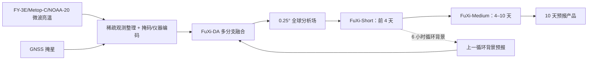

# FuXi Weather：从真实卫星观测到 10 天全球预报的循环系统

> Xiuyu Sun、Xiaohui Zhong、Xiaoze Xu、Yuanqing Huang、Hao Li 等，*A data-to-forecast machine learning system for global weather*，*Nature Communications* 16, 6658，2025-07-19，[正式论文](https://doi.org/10.1038/s41467-025-62024-1)。方法/逐 lead 数字对照[作者 arXiv:2408.05472v2（2024-11-18）](https://arxiv.org/html/2408.05472v2)；本笔记阅读于 2026-09-24。预印本先于 2025 正式发表，按两者共同证据记录；若结论有差异以期刊正式版为准。

## 核心判断

FuXi Weather 的贡献是将真实极轨卫星微波亮温、GNSS 掩星、机器学习数据同化（FuXi-DA）与 FuXi 预报器组成**每 6 小时循环**的全球系统，在 2023-07-03 至 2024-06-30 连续约一年测试 0.25°、至 10 天预报。它说明少量卫星源也能在观测稀疏地区发挥作用，但“全球技巧领先”并非每变量、每 lead 都成立：Z500 的 ACC>0.6 技巧时效在预印本中仅从 IFS HRES 的 **9.25 天**延至 **9.50 天**，且早期分析误差更高。它也不是不依赖传统 NWP：训练真值仍是 ERA5，且同化**需要背景预报**。[正式论文摘要、结果](https://www.nature.com/articles/s41467-025-62024-1)

## 1. 系统架构与同化循环

观测源为 FY-3E、Metop-C、NOAA-20 上五种微波仪器的亮温，加 GNSS-RO。作者用改造的 PointPillars 思路，把时空稀疏的观测和扫描几何组织成格点/掩码张量；不同仪器和变量由专用分支编码。FuXi-DA 将卫星表征与前一循环的背景预报表征融合，输出分析场；FuXi-Short/FuXi-Medium 从该分析场继续预报，短期结果又成为下一次同化背景。论文描述每个分析时刻使用约 **8 小时观测窗口**（起报前 3 小时到后 4 小时），00/06/12/18 UTC 各一次。这个窗口包括分析时刻后的观测，因此做伪业务或历史循环时必须核实资料到报延迟，不能默认 00 UTC 预报可即时用未来 4 小时数据。[正式论文引言；预印本第 2 节](https://arxiv.org/html/2408.05472v2)

FuXi-DA 以 ERA5 作为参考训练，短程 FuXi-Short 再以 FuXi-DA 自生分析场微调以减小初值分布差异；每月重放/增量更新同化网络，适应卫星资料变化。作者没有在这里重新微调整个 10–15 天 FuXi 原系统：FuXi Weather 用微调过的 Short 前 **4 天**，再交给 Medium 做 4–10 天；原 FuXi 系统还有 Long（10–15 天），但本文主实验止于 **10 天**，不能将原系统 15 天时效自动赋给观测端到端链。[预印本补充方法 2.3、3.3](https://arxiv.org/html/2408.05472v2)

### 图：依据正式论文图 1 与方法节重绘

下图是本仓库基于事实自行绘制的流程示意，非原图转载。[原文图 1](https://www.nature.com/articles/s41467-025-62024-1)

## 2. 训练与评测协议

预印本补充材料说明 FuXi-DA 使用 **2022-06-01 至 2023-06-30** 训练；测试从 2023-07-01 启动，但初两天视为 spin-up 排除，实际评分 2023-07-03 至 2024-06-30。ERA5 在 0.25° 网格作参考，预报器输出 5 个高空变量 × 13 层，加 T2m、海平面气压、10 米风与总降水等地表变量，共 **70 个预报量**。总体汇报又主要展示高空五变量在 300/500/850 hPa 的 15 个目标，因此不能用这组评分代替所有 70 通道表现。[预印本补充方法 1.1、结果 3.2](https://arxiv.org/html/2408.05472v2)

评估用纬度加权 RMSE/ACC；IFS HRES 对照评估其 0 小时分析时序（HRES-fc0），这天然使其前几个 lead 更占优，作者也明说这一点。FuXi Weather 的初值则是自己同化的分析场。可比性不能只看相同网格：双方同化的观测数量、ERA5/IFS 分析真值、预报时间和未来观测窗口都影响结论。正式论文另做有/无背景预报消融、卫星资料剔除、单点亮温扰动，而不只报告端到端最终分数。[正式论文 Results](https://www.nature.com/articles/s41467-025-62024-1)

## 3. 图表数据：变量和地区分开报告

下表整理作者[预印本结果图 2–3 及其正文](https://arxiv.org/html/2408.05472v2)，与期刊摘要的总体表述交叉核对；只列可直接读取的数字或明确方向，不从曲线估小数。ACC>0.6 是大尺度异常型态的技巧阈值，非降水准确率。

| 评估对象 | 论文报告 | 限制或反例 |
| --- | --- | --- |
| 全球 Z500 的 ACC>0.6 技巧时效 | 有背景 FuXi Weather **9.50 天**；IFS HRES **9.25 天**；无背景版本 **8.25 天** | 改善是 **0.25 天**，不是全部变量大幅延长 |
| 全球 15 个高空变量/层目标 | **7/15** 的技巧时效延长，**6/15** 持平 | 其余目标并未报道为延长 |
| 相对 IFS HRES 的 Z 场 RMSE 交叉 | Z300 **8.00 天**、Z500 **7.75 天**、Z850 **7.50 天**后较低 | 前期 IFS 更好，长 lead 误差优势可能混入平滑效应 |
| 相对 IFS HRES 的湿度 R 场 RMSE 交叉 | R300 **2.00 天**、R500 **3.25 天**、R850 **2.25 天**后较低 | 变量强依赖微波湿度信息，不代表风/地表同样早获益 |
| 中非 U850/T2m/MSL | 文中称多数 lead RMSE/ACC 优于 IFS HRES，ACC 在所示三变量 **10 天内 >0.6**；HRES 约 **2 天** | 区域 15°E–35°E、10°S–10°N；不可泛化全非洲或所有变量 |

最有说服力的机制消融是：去掉背景场后分析误差增加，缺测卫星时还出现更尖锐误差峰，说明“只有观测即可预报”的说法过强；同化需要先验约束。单点 +5 K ATMS 扰动的湿度响应符合辐射传输的通道高度敏感性，却只能说明局部合理响应，不等于全球物理守恒。比较中非并未纳入当地高质量地面真值统一验证的所有气象量；ERA5 本身在观测稀疏地区也不完美。[正式论文图 1–4](https://www.nature.com/articles/s41467-025-62024-1)

## 4. 与 XiChen/Aardvark 的差别及复现建议

FuXi Weather 保留“背景预报 + 观测融合”的同化逻辑，以专用卫星分支接入真实亮温；XiChen 则试图用 4DVar 梯度作为跨观测通用接口。两者训练都依赖再分析，并都要谨慎拆开“外部优质初值”和“自生分析场”的成绩。相较纯从观测直接生成预报的 Aardvark，FuXi Weather 的背景场有助于稳定分析，但系统复杂度和观测维护也更高。完整复现应固定相同卫星下载/质控、资料到报时延、连续循环而非独立抽样、早期 spin-up、区域掩码和 HRES 版本；逐 lead 给出 70 通道与地面站/卫星独立观测的评价，尤其检验降水与强风极端。目前作者[正式论文代码声明](https://www.nature.com/articles/s41467-025-62024-1)表明 FuXi 基础代码公开，但 FuXi Weather 完整源代码有受限访问，独立复现条件并非完全满足。

[返回仓库首页](../README.md) · [返回总追踪表](../气象大模型_中期预报论文追踪.md)
