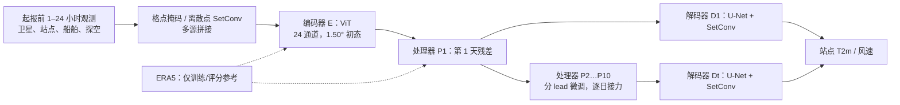

# Aardvark Weather：观测直接驱动的全球格点与站点预报

> Anna Allen、Stratis Markou、Will Tebbutt、James Requeima、Wessel P. Bruinsma 等，*End-to-end data-driven weather prediction*，*Nature* 641, 1172–1179；[正式论文及图 1–5](https://www.nature.com/articles/s41586-025-08897-0)，2025-03-20 在线发表。正式论文曾于 2025-06-17 更新补充资料及引用；本笔记以更新后的网页版本为准。阅读日期：2026-09-24。早期 arXiv 稿题为 *Aardvark weather: end-to-end data-driven weather forecasting*，但这里不把早期稿作者或数字覆盖正式版。

## 1. 研究问题、结论边界

主流 AI 天气模型通常从 ERA5/业务分析场启动，只替换积分预报器；站点预报又依赖独立后处理。Aardvark 要检验的是：只给在起报时刻之前可用的观测，能否用一个可训练链条生成全球格点初值、逐日预报和任意位置站点预报？作者报告的答案是“若干变量和地区可以”，不是“全面胜过高分辨率业务系统”。全球格点分辨率仅 **1.50°**，站点温度/风速可评估至 **10 天**，尚未做 15 天、概率集合或高分辨率极端天气验证。[正式论文摘要、Discussion](https://www.nature.com/articles/s41586-025-08897-0)

这里的“无需 NWP”专指**部署推理时无需传统 NWP 产品作为输入**。编码器和预报器训练仍借助 ERA5 再分析；与完全脱离数值模式知识的说法不同。作者还估计输入观测仅约为业务系统可用观测的 **8%**，所以性能与资源结论都应放在观测覆盖和测试年代的背景下读。[正式论文第 Aardvark Weather 节](https://www.nature.com/articles/s41586-025-08897-0)

## 2. 模型结构：从稀疏观测到站点

编码器 E 将陆地/海洋站、探空以及散射计、微波/红外探测器、静止卫星等多源观测组织为格点表征。格点观测用缺测掩码，离散站点/探空用 SetConv 和密度通道；拼接后交给 ViT，估计 24 通道的 1.50° 全球初态。与循环同化系统不同，编码器**不使用前一次预报背景场**，因而更容易作为独立观测入口，但也没有用递归过程积累过去观测。[正式论文图 1、Methods: Encoder module](https://www.nature.com/articles/s41586-025-08897-0)

处理器 P 不是一个单一共享权重的 10 次循环：论文使用**十个分别微调的逐日 ViT**，以 24 小时残差预测逐段接力至第 10 天。这是容易被“自回归 ViT”一句话掩盖的设计。解码器 D_t 则对每个 lead 用轻量 U-Net、SetConv 和地形信息，将格点场映射到任意经纬度的 T2m 与 10 米风速；最终以第 1 天站点目标联合微调 E、P₁、D₁。[正式论文 Methods: Processor/Decoder/End-to-end fine-tuning](https://www.nature.com/articles/s41586-025-08897-0)

### 模型结构图（依据原文图 1b 与 Methods 自行重绘，非原图转载）

论文图 1 还把观测的空间缺口可视化；本图重绘的是机制，不再现其卫星影像或地图。编码器 ViT 是 8 blocks、潜维 512；处理器各 ViT 是 16 blocks、潜维 512；每个站点解码器约 2M 参数。Methods 报告编码器约 31M、处理器模块约 54M、每个解码器约 2M 参数，但没有把十个逐日处理器的总存储口径逐一拆开；比较模型尺寸时应以发布权重再次确认。[正式论文 Methods: Model architecture/model size](https://www.nature.com/articles/s41586-025-08897-0)

## 3. 数据、训练与公平对照

所有模块用 2018 年之前的数据训练；**2018 测试，2019 验证**。处理器的长历史预训练采用 ERA5（1979 年起），再以编码器的估计初态微调，降低“完美初值训练、带误差初值部署”的分布偏移。站点目标来自 HadISD；论文图 5 的测试是**时间留出，而非空间留出**：同一站点位置在训练期已出现，故“可在任意站点位置推断”不等于已证明对新站点或新气候区外推等效。[正式论文图 5 图注、Methods: Pretraining](https://www.nature.com/articles/s41586-025-08897-0)

全球评测用 ERA5 作真值、纬度加权 RMSE，对照 persistence、气候态、IFS HRES 与 GFS；HRES/GFS 通过守恒重网格化降至 1.50°。站点评测用 MAE，对照逐站订正 HRES、持久性/气候态，以及美国 NDFD（后者集成多模式且有人类预报员参与）。因此全球“接近 HRES”不等于原生 0.1° 空间细节或灾害过程同等可用。观测仅用起报之前 1–24 小时资料；这种不使用未来观测的设定也与部分历史循环实验不同。[正式论文图 2/5、Methods: Baselines](https://www.nature.com/articles/s41586-025-08897-0)

## 4. 图表性能：有利与不利结果并列

下表按[正式论文图 2、图 4、图 5 及正文](https://www.nature.com/articles/s41586-025-08897-0)摘取**明确写出的**数值/方向；图形曲线未给出的格点 RMSE 小数不从图片目测补写。图 2 的带状区间是均值估计的 **98% 置信区间**，不是逐案例误差分布。

| 试验/图 | 披露的结果 | 正确读法 |
|---|---|---|
| 全球 1.50°，图 2 | 多数 lead/变量与 GFS 持平或更好；**Z500 是例外**；多数变量接近但未普遍超越 HRES | 初期和高空误差更高；原文不支持“所有变量优于业务模式” |
| 初态观测消融，图 4 | 去掉全部卫星资料，初态 LW-RMSE 各变量显著恶化；LEO 探测资料较散射计/静止卫星更重要 | 图表主要是定性/相对变化；不能把单一资料解释为唯一信息源 |
| 站点 T2m，图 5 | 全球至 **10 天**有技巧；西非与太平洋区所有所示 lead 优于逐站订正 HRES；美国本土与欧洲约为相当 | 强项具有区域性；针对 2018、固定站点集合 |
| 站点 10m 风速，图 5 | 美国本土误差**高于**逐站订正 HRES；欧洲前 4 天相近、此后更好；太平洋区略差 | 不可把温度优势推给风速 |
| 端到端联合微调，第 1 天，图 5l–m | T2m 的 MAE：欧洲、西非、太平洋与全球约改善 **6%**，美国本土约 **3%**；风速多数地区 **1–2%**，太平洋除外 | 只证明第 1 天这两个站点目标；不能宣称 10 天整体改善 6% |
| 计算，Discussion/Methods | 4×A100 完整推理约 **1 秒**；训练约 **100 GPU 小时**；业务 HRES 同化+预报约 **1000 node-hours** | 不同硬件/定义的估算，不能直接当统一能耗基准 |

图 3 的 Berguitta 热带气旋是 2018-01-11 起报至第 4 天的 **U10 个例**，体现大尺度位置模拟，但高频谱模糊也可见；单个个例不能给出全球气旋命中率。论文承认后期模糊、原生分辨率低、无集合、观测仪器漂移/新传感器接入等不足。[正式论文图 3、Discussion](https://www.nature.com/articles/s41586-025-08897-0)

## 5. 我的判断与复现检查

与 FuXi Weather 的“卫星 + 预报背景循环同化”相比，Aardvark 的概念更纯粹：不靠业务初值或前次预报背景，以 SetConv/ViT 直接估计初态；但两者的数据、网格、年份和业务基线不同，不应排列成统一榜单。Aardvark 最有研究价值的是其**观测编码—格点动力—站点决策**可微链条，以及逐任务微调能真实改善终端指标的证据。中期意义集中在 7–10 天的站点可用性，尚不是 10–15 天上限突破。[正式论文图 1/5](https://www.nature.com/articles/s41586-025-08897-0)

复现/扩展宜先检查四件事：① 获取并锁定作者代码、权重、观测产品和其真实发布时间，避免历史资料延迟带来的“伪实时”；② 按 2018/2019 留出与 1.50° 守恒重网格化复现图 2/5，并显式区分格点 LW-RMSE 与站点 MAE；③ 增加新站点、新年代以及极端温度/大风分位数评测，检验空间与时间外推；④ 将十个逐日处理器的参数、推理成本与共权重模型公平对比，再探索 10 天之后与概率集合。论文代码可用性声明指向[作者仓库](https://github.com/annavaughan/aardvark-weather-public)，但复现前仍需核对该仓库当前开放内容和版本。

[返回仓库首页](../README.md) · [返回总追踪表](../气象大模型_中期预报论文追踪.md)
