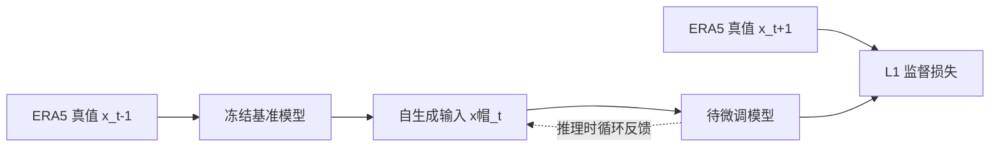

# SOFT：用模型自己的预测修正自回归天气预报的输入分布

> Yun-Ye Cai, Hsuan-Tien Lin. *Nipping the Butterfly Effect in the Bud: Self-Output Fine-Tuning for Autoregressive Weather Prediction*. arXiv:2607.21080v1，2026-07-23。  
> [论文摘要](https://arxiv.org/abs/2607.21080) · [HTML 全文](https://arxiv.org/html/2607.21080v1) · [作者代码](https://github.com/yunye0121/SOFT)  
> 阅读日期：2026-09-24。来源性质：预印本；HTML 顶部的 ACM 会议信息仍是未填写的模板文字，不能据此认定已经在会议发表。

## 先读结论

论文研究天气模型逐步滚动时的一个基本失配：训练时输入是真实大气状态，推理第二步起输入是模型自己的预测。作者认为，第一步预测即使视觉上逼真，也会携带可被模型识别的分布偏移；之后每一步既放大旧误差，又在偏移的输入上制造新误差。SOFT 的办法很直接：用冻结的基准模型先产生一步预测，再把这份“带有模型自身误差”的场作为训练输入，监督正在微调的模型预测再下一步真实场。[原文第 3–4 节](https://arxiv.org/html/2607.21080v1)

论文在三个区域的 ERA5 数据上，将 Aurora 区域模型滚动到 168 小时。SOFT 通常降低逐变量 MAE，并在作者选择的特征空间里减小预测分布与真实分布的距离。这个证据支持“自输出微调有助于区域 7 天自回归预报”；它没有验证全球 10–15 天技巧，也没有概率集合预报结果。[原文第 5 节](https://arxiv.org/html/2607.21080v1)

## 1. 研究问题和因果链

设单步天气模型为 (f_\theta)，真实大气演化为 (g)。常规监督训练让模型在真实 (x_t) 上最小化 (f_\theta(x_t)) 与 (x_{t+1}) 的误差；多步推理却从第二步起计算 (f_\theta(\hat x_t))。令单步固有误差为 (\epsilon_t=f_\theta(x_{t-1})-x_t)，总误差为 (e_t=\hat x_t-x_t)。论文在线性化近似下写出 (e_t\approx(J_g+J_\epsilon)e_{t-1}+\epsilon_t)：误差增长既有新误差，也有动力系统和模型误差的局部放大。这是机制分析，而不是对真实大气误差增长率的普适定理。[原文 §3.2](https://arxiv.org/html/2607.21080v1)

作者进一步用 AuroraTW 的表示空间比较 ERA5 与单步预测：图 3 中两者肉眼相近，t-SNE 和一个二分类探针却可以将其区分。论文称探针准确率接近 100%。这一证据说明模型特征对一步预测的伪迹很敏感；它本身尚不能证明这种偏移是长期误差的唯一或主要因果来源。作者通过“直接预测远期目标”和自回归比较来补强传播误差的论点，但这两种训练/推理任务仍可能有其他差异。[原文 §3.2–3.4](https://arxiv.org/html/2607.21080v1)

## 2. SOFT 实际怎样训练

1. **基准单步模型**：用 ERA5 真值训练或区域微调 (f_{\theta_{base}}(x_t)\rightarrow x_{t+\delta})，损失为格点 L1。
2. **冻结生成器**：对更早的真实状态 (x_{t-\delta})，运行冻结副本得到 (\hat x_t=f_{\theta_{base}}(x_{t-\delta}))，并停止梯度回传。这一步有意制造推理时会遇到的模型偏移。
3. **微调预测器**：用 (\hat x_t) 预测真实 (x_{t+\delta})，最小化 (\|f_\theta(\hat x_t)-x_{t+\delta}\|_1)。真实标签仍来自 ERA5，不是让模型模仿自己的错误。
4. **推理**：使用标准自回归循环，不增加额外生成器或专用去噪器。

以下是依据论文方法节重绘的训练/推理结构图，并非复制原文插图：[原文 §4](https://arxiv.org/html/2607.21080v1)。

这种训练只对一步自生成输入求梯度；它避开了对长序列完整反传的显存开销。论文的理论上界是在简化的线性设置下推导，包含由模型权重与多步动力不匹配产生的余项，因此不能解读为“SOFT 必然优于任意 rollout 训练”。[原文 §4、附录 B](https://arxiv.org/html/2607.21080v1)

## 3. 数据、模型和比较是否公平

| 项目 | 论文设定 |
| --- | --- |
| 数据 | ERA5，0.25°、逐小时；台湾周边、欧洲、北美三个 140×180 区域 |
| 时间切分 | 训练 2013–2018；验证 2022；测试 2023 |
| 变量 | 高空 (u,v,t,q,z)，7 个气压层；地面 (u10,v10,t2m,msl) |
| 主骨干 | Microsoft Aurora 预训练模型，先做区域单步微调 |
| 迁移检查 | 从头训练的 Pangu-Weather 架构复现版本 |
| 评测 | 6、24、96、132、168 小时；格点 MAE、Aurora 编码器特征上的 FID |
| 比较 | 单步训练、2 步 rollout、replay buffer、高斯噪声增强、特征匹配 |

论文附录称 Aurora 区域单步阶段训练 400 epoch，各长期策略再训练 50 epoch；峰值学习率 (3\times10^{-5})，8 张 H200 GPU。rollout 基线用较小 batch 并梯度累积来匹配训练设置。作者报告单步训练约 24 小时、各后续策略约 4–6 小时，但未给出足以建立精确计算成本优势的完整吞吐、显存及重复运行统计。[原文附录 C](https://arxiv.org/html/2607.21080v1)

数据表中的“北美区域经度 115°E–159.75°E”与地理位置不符，疑似方向标记笔误；复现前必须核对下载脚本和网格坐标。训练期 2013–2018 与测试期 2023 之间隔开年份，但论文未把跨气候态外推作为独立实验。三个区域格点相同，然而全球边界、极区及海气耦合问题仍未覆盖。

## 4. 数值结果怎样读

论文表 2 在 **168 小时**给出 2 米气温、10 米风、850 hPa 温度、500 hPa 位势高度的区域 MAE。以下选取台湾区域的四个变量，数值越小越好：[原文表 2](https://arxiv.org/html/2607.21080v1)。

| 策略 | t2m | u10 | T850 | Z500 |
| --- | ---: | ---: | ---: | ---: |
| 单步训练 | 3.029 | 3.718 | 3.255 | 504.107 |
| 2 步 rollout | 2.898 | 3.447 | 3.050 | 474.561 |
| replay buffer | 2.728 | 3.333 | 2.923 | 446.555 |
| **SOFT** | **2.609** | **3.266** | **2.789** | **442.777** |

相对单步训练，SOFT 对上述四项的作者报告降幅约为 13.9%、12.2%、14.3%、12.2%。这个表不能概括为“三个区域所有变量都最优”：例如欧洲区域 168 小时的 t2m 和 T850，replay buffer 的 MAE（4.566、4.996）低于 SOFT（4.762、5.187）；北美 Z500 也如此（1213.615 对 1217.320）。作者另以表 3 统计每个 lead 下 SOFT 在更多变量上取得最小误差，这比说它“全面胜出”更准确。[原文表 2–3](https://arxiv.org/html/2607.21080v1)

FID 结果同样要限定口径：168 小时台湾、欧洲、北美分别为 0.737、1.233、1.556。SOFT 在台湾和北美优于文中列出的其他策略，但欧洲 replay buffer 的 1.159 低于 SOFT 的 1.233。FID 使用 Aurora 编码器提取特征，因此它衡量该特征空间内的分布接近程度，不能单独证明动力守恒、降水结构或极端事件真实性。[原文表 4、附录 C.4.3](https://arxiv.org/html/2607.21080v1)

组合实验也并非一律改善。表 5 中，replay buffer + SOFT 在台湾 Z500 上由 446.555 变为 459.404，约恶化 2.9%；而其他变量多数改善。PanguTW 的 168 小时四个变量均报告改善，但 Pangu 是作者复现并从头训练的区域版本，不能把这个实验等同于官方 Pangu-Weather 全球预训练模型的迁移结果。[原文表 5–6](https://arxiv.org/html/2607.21080v1)

## 5. 我认为最有价值、最需谨慎的地方

方法的实用性是它针对训练—推理失配提出成本较低的修正，且可附加在已有单步模型上。它比单纯加高斯噪声更贴近模型真正会产生的误差形态；这解释了为何论文在多个变量和 lead 上观察到稳定收益。

但论文的“第一步即出分布”论据部分依赖于同一个 Aurora 特征编码器；跨骨干、跨再分析资料的探针实验会让机制判断更强。FID 和 MAE 也没有直接测试谱能量、质量/水汽守恒、集合校准和罕见极端事件。最关键的是，**最长实测只有 7 天**；将其用于 10–15 天或 S2S 仍是假说，不能作为已证实的中期技巧结论。

## 6. 复现实验与后续研究清单

- 先用作者公开的代码核对 ERA5 切片、北美经度、归一化和 6/24/96/132/168 小时评测脚本。
- 做同等 GPU 小时和多随机种子的 SOFT、rollout、replay buffer 比较，报告均值及置信区间。
- 把评测延长到 10、15 天；分别测试全球模型与局地区域模型，观察长期失稳阈值。
- 增加位势高度 ACC、风场谱、降水/极端事件指标，并用独立编码器和物理指标检查所谓“分布对齐”。
- 对比“只微调第二步”“混合真实/预测输入”和多步 SOFT，判断一步偏移是否足以代表远期偏移。

## 关联

[返回仓库首页](../README.md) · [返回总追踪表](../气象大模型_中期预报论文追踪.md)
