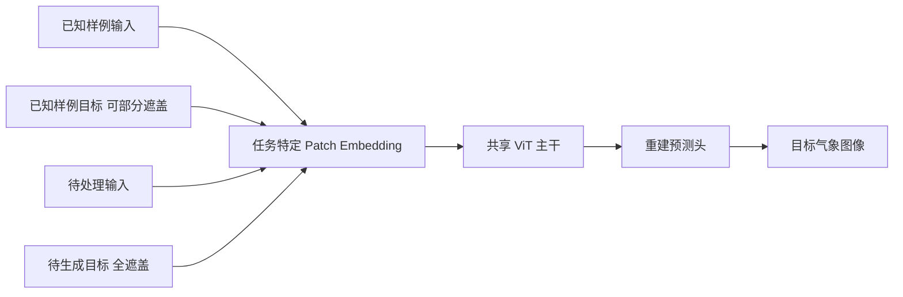

# WeatherGFM：用视觉上下文提示统一十类气象任务

> Xiangyu Zhao、Zhiwang Zhou、Wenlong Zhang 等，*WeatherGFM: Learning A Weather Generalist Foundation Model via In-context Learning*。arXiv:2411.05420，初版 2024-11-08；本笔记依据 [v2，2024-12-09](https://arxiv.org/html/2411.05420v2)；阅读日期 2026-09-24。来源性质：预印本。作者名单、日期和版本以 [arXiv 记录](https://arxiv.org/abs/2411.05420)为准。

## 一句话结论与适用范围

论文的核心不是提出一个已验证的全球 10–15 天预报系统，而是把雷达、卫星与污染物观测的十种图像到图像任务放进同一个视觉提示模型。它在 SEVIR 的分钟至小时尺度任务上展示多任务学习和样例条件化能力；附录另以 ERA5 的 2 米温度做到最长 **168 小时（7 天）**，因此只能作为中期预报方法候选，不能直接称为 10–15 天或 S2S 已验证模型。[任务定义与附录结果](https://arxiv.org/html/2411.05420v2)

## 1. 研究问题：统一模型究竟统一了什么？

传统做法为雷达外推、卫星超分辨率、跨传感器转换和预报后处理分别训练模型。WeatherGFM 把任务抽象为从输入空间 $X_S$ 到目标空间 $X_T$ 的映射，并用一个已知的输入—输出样例告诉模型当前应执行哪一种映射。给定提示对 $(P_{in},P_{target})$ 和待处理输入 $X_{in}$，预测目标为 $F(P_{in},P_{target},X_{in};\theta)$。这与文本大模型的 few-shot 提示类似，但“提示”是具有物理含义的气象图像，不是自然语言指令。[方法第 3 节](https://arxiv.org/html/2411.05420v2)

这里需要区分三个层次：统一输入—输出接口、统一主干权重，以及对从未见过的任务真正零样本泛化。论文比较充分地展示前两点；第三点主要依赖少数定性样例，强度较弱。模型还为不同输入通道配置**任务特定 patch embedding 层**，所以“完全无需任务适配即可处理任意新变量”并非其实际机制。[方法与附录 C](https://arxiv.org/html/2411.05420v2)

## 2. 模型与训练机制

论文设计三类视觉提示：单模态（如低分辨率雷达 VIL → 高分辨率 VIL）、跨模态（如 GOES 红外通道 → 雷达 VIL）和时序模态（过去的雷达/卫星图像 → 未来图像）。训练样本由“提示输入、提示目标、查询输入、查询目标”四块组成。模型保留提示输入与查询输入，随机遮盖提示目标及查询目标的 patch；推理时仅把查询目标全部遮盖，让模型在可见样例条件下重建它。[图 2–3 与式 2–4](https://arxiv.org/html/2411.05420v2)

主干为 ViT，先用通道特定的 patch embedding 将不同物理量投到共同维度，再经 Transformer 编码和预测头还原目标图像。默认 patch 大小 16，目标遮盖率 75%；论文附录列 base 为 12 层、768 维编码器，large 为 24 层、1024 维。这个方案的关键归纳偏置是“跨任务的低层图像结构与变换可共享”，而不是显式求解动力方程或守恒约束。[架构与附录 B](https://arxiv.org/html/2411.05420v2)

以下根据论文图 2–3 重绘统一接口与模型结构；不同任务使用不同通道的嵌入层，图中已保留该限制：[原文图 2–3](https://arxiv.org/html/2411.05420v2)。

有一个复现前必须澄清的原文不一致：方法式 (4) 写的是 MSE/L2 损失，实验第 4.2 节和附录 B.1 却写 L1 损失；第 4.2 节学习率排版成 `1e4`，附录给出 `1e-4`。笔记采用附录给出的训练超参数（AdamW、cosine、batch 20、梯度累积 4、16 张 A100、50 epochs、fp16），但**不能据此断言实际代码损失是哪一个**，复现需查代码或向作者核实。[方法、实验及附录](https://arxiv.org/html/2411.05420v2)

## 3. 数据、任务与评测口径

主体实验来自 SEVIR。作者筛得 11,508 个多传感器天气事件，训练/验证/测试分别为 11,308/100/100 个事件，图像统一缩放至 $256\times256$。SEVIR 含 GOES 卫星通道、NEXRAD 派生的 VIL 雷达拼图及闪电观测；作者的实际任务主要使用所选卫星通道和 VIL。事件按风暴数据库抽样，并对中到强降水超采样，因此样本分布不等于一般时空均匀天气分布。[实验第 4.1 节](https://arxiv.org/html/2411.05420v2)

十种任务分为：雷达/卫星空间或时间超分辨率、GOES 到雷达或其他卫星通道的图像转换、NO₂ 跨卫星转换、雷达/卫星外推、雷达预报去模糊。其中 NO₂ 任务另用 2021-01 至 2022-04 的 GEMS、GEOS-CF 和 TROPOMI 数据，切成 $256\times256$ patch，训练/验证/测试为 18,000/1,000/1,000。雷达与卫星外推的输入是标作 0、30、60、90 分钟的四帧，目标是 120、180 分钟图像；无论这种编号起点如何理解，它都属于**小时级临近预报**，不是日尺度预报。[附录 A 表 4](https://arxiv.org/html/2411.05420v2)

主体报告 RMSE 和 CSI。CSI 是命中/(命中+漏报+空报)，需要按变量设阈值；雷达 VIL 阈值含 16、74、133、160、181、219。不同任务、变量和阈值的 CSI 不宜横向直接比较。对照模型是作者统一设置下重新训练的单任务 UNet 与 ViT，而非每一类任务当前最强的业务模型。[表 2 与第 4.2–4.3 节](https://arxiv.org/html/2411.05420v2)

## 4. 关键结果：成功与反例都要看

| 任务与指标 | 单任务 ViT | WeatherGFM | 阅读判断 |
| --- | ---: | ---: | --- |
| 雷达外推 RMSE，越低越好 | 0.490 | 0.467 | 多任务模型改善 |
| 雷达外推 CSI/160，越高越好 | 0.079 | 0.128 | 在该强度阈值改善；其他阈值仍须分别看 |
| 卫星外推 RMSE | 0.408 | 0.347 | 改善，时效仍为小时级 |
| 雷达空间超分辨 RMSE | 0.120 | 0.121 | 基本持平、略差 |
| 雷达去模糊 RMSE | 0.163 | 0.264 | 明显变差，不能概括为十任务均胜 |
| GOES-IR→GOES-IR RMSE | 0.257 | 0.310 | 变差，需权衡共享表示的负迁移 |

以上均为作者 [表 2](https://arxiv.org/html/2411.05420v2) 的数值，不是独立复现。雷达去模糊任务中部分 CSI 阈值有升有降，不能仅用一个指标给出整体胜负。论文强调统一能力而非每任务 SOTA，这一点与表中混合结果一致。

提示敏感性也不可忽略。随机换 20 个提示样例后，GOES→Radar 的 RMSE 标准差为 0.0087、平均 CSI 标准差为 0.0187；雷达外推对应 0.0012 和 0.0201。相比之下，雷达空间超分辨 RMSE 标准差仅 0.0001。说明预报和跨模态任务更依赖所选案例，部署时需定义提示检索与稳定性策略，而不能只报一次幸运提示。[表 3](https://arxiv.org/html/2411.05420v2)

作者对若干训练未见任务做图像展示，称前三个相近任务可输出合理结果，但更复杂的多模态卫星空间超分辨率失败。这里没有同等充分的定量基准，因而可解释为“存在有限外推迹象”，而不是通用零样本能力已被证实。模型规模探索比较约 30M 单任务 ViT、110M base 与 330M large，但训练样本量也从 0.5M 增至 4M；模型和数据效应没有完全分离。[第 4.4 节](https://arxiv.org/html/2411.05420v2)

## 5. 与中期预报的关系：附录 ERA5 实验单独看

附录 C 在 ERA5 上新增变量 embedding，以 48 个 ECMWF 变量为输入，对 **T2m 单一目标变量**评估 6、24、72、120、168 小时，最长 7 天。作者声称一个模型处理所有这些 lead；ClimaX 则按 lead 分别微调。168 小时时，WeatherGFM / ClimaX / IFS 的 T2m RMSE 分别为 **1.76 / 2.17 / 2.23**，ACC 为 **0.94 / 0.91 / 0.93**；120 小时 RMSE 为 **1.68 / 1.83 / 1.71**。[附录 C 表 8](https://arxiv.org/html/2411.05420v2)

这些数值值得关注，但不能代替完整业务比较：只展示 T2m，未见 10–15 天、位势高度/风/降水、极端事件或多年份独立评估；主干多模态实验与 ERA5 附录实验的数据和任务也不同。表 8 同时可见 24 小时 WeatherGFM RMSE 1.23 高于 ClimaX 1.19、IFS 1.02，72 小时为 1.56 高于 1.47/1.30，说明优势不是全时效一致。作者对训练成本的比较还涉及不同 epoch 和硬件（WeatherGFM 20 epochs/8 A100 对 ClimaX 100 epochs/80 V100），不可只按 GPU 张数推断计算效率。[附录 C](https://arxiv.org/html/2411.05420v2)

## 6. 我的评价与复现清单

最有价值的是把任务、模态和提示样例放在统一接口中，使用户能问“同一组权重可以学到哪些共性？”这对构建气象基础模型的通用表示有启发。最需要警惕的是把“十任务同模型”误解为“每任务最佳”，或把 SEVIR 临近预报和附录 7 天 T2m 结果误写成 15 天全球预报。

复现时先核对实际损失函数与学习率；按事件而非图像随机分割 SEVIR，检查时间/地理泄漏；重算各雷达阈值 CSI 及每任务 RMSE；固定与随机选择提示样例分别报告均值和方差。要检验真正的中期价值，需在同初值、同 ERA5 版本、同格点权重、同变量集下与业务/AI 基线比较 8–15 天逐日曲线，并测试热浪、暴雨、集合可靠性及物理一致性。只有完成这组额外实验，才能把“方法启发”升级为“中期预报证据”。

[返回仓库首页](../README.md) · [返回总追踪表](../气象大模型_中期预报论文追踪.md)
