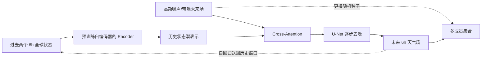

# CoDiCast：全球低分辨率条件扩散预报及其不确定性证据

> Jimeng Shi、Bowen Jin、Jiawei Han、Sundararaman Gopalakrishnan、Giri Narasimhan，*CoDiCast: Conditional Diffusion Model for Global Weather Prediction with Uncertainty Quantification*。arXiv:2409.05975，初版 2024-09-09；本笔记据 [v4，2025-05-02](https://arxiv.org/html/2409.05975v4)，阅读于 2026-09-24。该版本仍为预印本，不能仅凭 arXiv 页面认定正式发表。

## 核心判断

CoDiCast 以过去两个天气状态为条件，从噪声生成下一步全球状态，重复采样形成集合、反复滚动到最长 **144 小时（6 天）**。它说明条件扩散可在少变量、5.625° 数据上同时提供单值评分与采样多样性；但论文没有 8–15 天实测，5 成员集合和置信带不足以证明概率校准，更未全面超越 IFS。[方法与实验](https://arxiv.org/html/2409.05975v4)

## 1. 模型结构：预训练编码器和条件去噪器分工

作者先以自编码器训练对历史场的表示，再固定或使用其编码器 $\mathcal F$ 将 $X^{t-1},X^t$ 压成条件嵌入。扩散主模型把真实下一步 $X^{t+1}$ 按噪声日程加噪；反向过程从高斯噪声开始，每步以历史嵌入为条件预测噪声，优化噪声 MSE。条件进入去噪器的方式不是单纯拼接：带噪目标作 query，历史嵌入作 key/value，经 cross-attention 交互后由 U-Net 做空间去噪。作者专设去编码器和去 cross-attention 消融，发现完整结构更好，但图 7 主要给曲线，不能凭图捏造每点精确增益。[第 3 节、图 2–4、图 7](https://arxiv.org/html/2409.05975v4)

以下按照原文图 2–4 重绘模型数据流，不是原图转载：[原文图 2–4](https://arxiv.org/html/2409.05975v4)。

一个易混淆点：这不是“潜空间扩散模型”。历史场先编码为潜条件，但被逐步扩散与还原的是目标气象场；“预训练编码器”用于条件提取，而非把目标场先压缩后仅在潜空间生成。[第 3.2–3.4 节](https://arxiv.org/html/2409.05975v4)

## 2. 数据、训练、对照与评分

采用 WeatherBench 预处理的 ERA5，$32\times64$、5.625°、每 6 小时一帧；只用五个变量：Z500、T850、T2m、U10、V10。训练 2006–2015，验证 2016，测试 2017–2018。输入是过去两个时刻，评估 6、12、24、72、144 小时；后续时效通过自回归滚动。编码器先行训练；扩散模型 1000 步 U-Net，Adam，batch 64，800 epochs，数据缩放至 [0,1]。论文和 ClimODE、重新训练的 ClimaX、FourCastNet/ForeCastNet、Neural ODE、IFS 比较；部分基线数值转引自 ClimODE 论文，训练配置和输入变量并非完全相同。[第 4.1–4.2 节、表 1](https://arxiv.org/html/2409.05975v4)

评分为纬度加权 RMSE 和 ACC。这两项是集合均值或单值预报的主要准确性指标，**不是**独立的概率预报评分。作者对同一条件随机生成 5 个成员，在案例图中呈现均值和标准差范围；如果要声称“可靠的不确定性量化”，还需 CRPS、rank histogram、spread–skill、覆盖率和极端事件可靠性测试。[第 3.7、4.2–4.3 节](https://arxiv.org/html/2409.05975v4)

## 3. 性能表：6 天优势有边界

下表直接摘录并重新排版原文表 1 的 **144 小时 RMSE/ACC**，只选关键比较；RMSE 越低、ACC 越高越好。[原文表 1](https://arxiv.org/html/2409.05975v4)

| 变量 | ClimaX RMSE | ClimODE RMSE | CoDiCast RMSE | IFS RMSE | CoDiCast ACC | IFS ACC |
| --- | ---: | ---: | ---: | ---: | ---: | ---: |
| Z500 | 801.9 | 783.6±37.3 | 757.5±42.8 | 398.7 | 0.78 | 0.86 |
| T850 | 3.97 | 3.62±0.21 | 3.61±0.19 | 2.23 | 0.85 | 0.81 |
| T2m | 3.38 | 3.30±0.23 | 3.45±0.22 | 1.78 | 0.91 | 0.82 |
| U10 | 4.24 | 4.02±0.12 | 4.25±0.15 | 3.04 | 0.42 | 0.72 |
| V10 | 4.42 | 4.24±0.10 | 4.21±0.18 | 3.26 | 0.37 | 0.71 |

读表可见：Z500、T850、V10 的 RMSE 在所列 ML 对照中有优势；T2m、U10 则不是最优。IFS 的 RMSE 在全部这五项都更低，因此正文“优于其他 ML 方法”的概括不能写成“整体超越业务 NWP”。ACC 有时与 RMSE 排名相反，如 144h T850/T2m 的 CoDiCast ACC 高于表中 IFS，但 RMSE 明显更高，说明空间异常型态和绝对误差是不同问题。表中 ± 的定义也应回原文确认具体跨成员/运行的统计口径，不能自动当作置信区间。[原文表 1](https://arxiv.org/html/2409.05975v4)

计算成本消融显示，扩散步从 250 增到 1000 时，24h Z500 RMSE 从 696.1 降到 186.5，推理时间约从 1.1 增到 3.6 分钟；继续增到 2000 步，Z500 RMSE 为 191.9、时间约 8.3 分钟，不再划算。并非每个变量都在 1000 步最好：U10、V10 的 750 步 RMSE（1.81、1.89）低于 1000 步（1.87、1.94）。这里仅是单次全球预报推理，若要 5 成员、多个 6 小时滚动步，实际总延迟应重新计时。[原文表 2](https://arxiv.org/html/2409.05975v4)

## 4. 对“概率”和“中期”的审慎解读

图 5 的案例展示不确定性范围随 lead 增大，但“五个样本覆盖多数真值点”不是校准证明；更不能用一张图替代跨季节/区域极端事件可靠性。图 6 的 6h 图上 U10/V10 局部相对误差超过 50%，高纬海洋较明显，提醒低分辨率均值指标可能掩盖局地失效。表 1 的对比至少证实两件事：条件扩散能形成合理的全球大尺度滚动样本；在此设置下 **144h 仍显著弱于 IFS RMSE**。[图 5–6、表 1](https://arxiv.org/html/2409.05975v4)

对用户关注的 10–15 天，这篇只能提供方法参照：输入变量有限、没有降水/湿度与多层风、空间分辨率粗、最长 6 天。下一个实验应在同 ERA5 初值、相同训练期资料和变量条件下跑 10/15 天，报告集合 CRPS/ES、异常相关、极端阈值 Brier score、spread–skill 以及每成员总成本；并与 GenCast、业务 ENS 这样的**概率**基线比较，才能检验其真正的中期价值。

[返回仓库首页](../README.md) · [返回总追踪表](../气象大模型_中期预报论文追踪.md)
