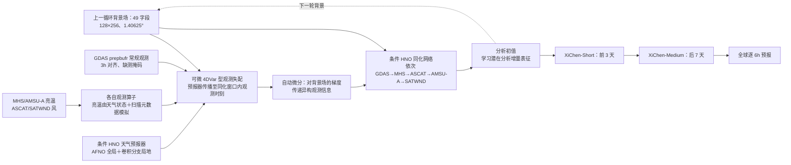

# XiChen：以 4DVar 梯度连接异构观测、同化与中期预报

> Wuxin Wang、Weicheng Ni、Ben Fei、Tao Han、Lilan Huang 等，*XiChen: A global weather observation-to-forecast machine learning system via four-dimensional variational gradient-guided flexible assimilation*，arXiv:2507.09202，[v3，2026-02-08](https://arxiv.org/html/2507.09202v3)、[v3 正式 PDF](https://arxiv.org/pdf/2507.09202v3)、[作者代码声明所指仓库](https://github.com/wuxinwang1997/XiChen_1.40625deg)。初稿 v1 为 2025-07-12；本笔记 2026-09-25 对照 v3 正文、方法和图 1–6 补强。它仍是预印本；v3 提及 `Supplementary_Information.pdf`，但本次取得的 v3 arXiv 源码包没有该文件，作者仓库当前也未放出可运行训练配置，因此不把未取得的附录参数写成确定事实。

## 核心判断与版本纠偏

XiChen 解决的不是再造一个从 ERA5 状态出发的预报网络，而是让**观测→初始分析场→预报**成为可循环的机器学习系统。核心接口是 4DVar 代价函数对背景场的梯度：来自常规资料、微波亮温、散射计风等不同观测的误差信息，经各自观测算子投影到同一个气象状态空间，再交给同化网络。v3 的 2023 年试验报告：若用 ERA5 初值，Z500 ACC>0.6 可超过 **10.25 天**；若用 XiChen 自己同化出的初值，则是超过 **8.75 天**。两者不是同一个端到端成绩。旧追踪表所记“同化到预报约 15 秒”在当前 v3 正文中没有找到相同表述，故不作为本笔记结论。[结果 2.2、讨论](https://arxiv.org/html/2507.09202v3)

## 1. 模型方法：为何梯度能统一异构观测

4DVar 同时惩罚分析初值偏离背景和由预报/观测算子算出的观测不匹配。传统数值系统需要切线性与伴随；XiChen 用可微预报模型和观测算子通过自动微分得到代价函数对背景场的梯度。此梯度已在网格状态空间中编码各观测对初值的敏感度，DA 网络以“背景 + 梯度”生成分析场，因此不用为每种传感器把原始观测直接拼成同一固定通道。**不是完全不需要传感器特定模块**：新增卫星仍要微调相应观测算子和 DA 组件，但不必重训整个级联。[图 1、方法 4.3–4.6](https://arxiv.org/html/2507.09202v3)

作者依序同化 GDAS prepbufr 常规观测、MHS 亮温、ASCAT 风、AMSU-A 亮温及 SATWND 卫星风；某类资料缺失时可移除该级联单元。这种模块化不同于原始影像直接到格点的黑箱编码。预报主干先以多种 lead（1、3、6、12、24 小时）条件化预训练，再训练短/中滚动版本；对自生分析场，前 3 天使用 XiChen-Short，后 7 天使用 XiChen-Medium。论文的“基础模型”角色主要是共享预报、观测算子和同化的初始化，而非证明完全不依赖传统资料。[图 1、方法 4.4](https://arxiv.org/html/2507.09202v3)

### 图：依据图 1 重绘的观测—分析—预报链

以下为本仓库的**事实性流程重绘**，不是原图转载。[原文图 1](https://arxiv.org/html/2507.09202v3)

## 2. 训练、数据与科学一致性检查

预报主干以约 **12 年 ERA5、1.40625°** 数据训练，采用纬度/变量加权 L1；对比 Pangu、GraphCast、FengWu 等 0.25° 模型时应记住训练网格和初始场条件并不相同。作者报告预训练用 8 张 A100-40GB 约 45 小时、预报微调约 94 小时；每个卫星观测算子微调约 13.3 小时。以上是训练阶段成本，不是端到端推理延迟。[方法 4.4–4.5](https://arxiv.org/html/2507.09202v3)

物理一致性证据之一是 2023-07-24 台风杜苏芮附近对单个 AMSU-A/MHS 通道施加 +5 K 扰动：温度敏感通道产生相应温度增量，湿度敏感通道改变水汽，响应沿水平和垂直及背景流传播。它检验的是局部观测敏感性和一定的流依赖特征；一个案例与若干通道不能单独证明所有卫星资料、所有天气型的动力平衡。作者在讨论中也承认仍有场平滑。[结果 2.1、图 2](https://arxiv.org/html/2507.09202v3)

### 2.1 数据进入网络前具体做了什么

v3 方法 4.2 的数据源是 DABench 的 **2010–2023 ERA5＋GDAS prepbufr**，另接 MHS、ASCAT、AMSU-A、SATWND。空间格网统一为 **1.40625°／128×256**；高空 Z/T/Q/U/V 各 **9 个气压层**（45 场）加 T2M/U10/V10/MSLP（4 场），总计 **49 场**，不是直接把原始 0.25° ERA5 的 69/70 场送入 XiChen。常规资料和卫星风按 00、03、06、09、12、15、18、21 UTC 的 **3 h** 时间格对齐：目标时刻前后各 **1.5 h** 的观测视作同一时次；未观测格点在数学描述中保留 NaN/稀疏性，不能当真零值。[v3 方法 4.1–4.2](https://arxiv.org/html/2507.09202v3)

AMSU-A/MHS 亮温及扫描辅助信息以最近邻映到同一 **1.40625°、3 h** 网格，纬度绝对值 **>60°** 的观测在本试验中剔除；**<150 K 或 >350 K** 的亮温剔除，MHS 还做基础云污染筛选。ASCAT 10 m 风与 SATWND 高空风按 GDAS 常规资料的方法处理。被同化的亮温通道只取 **AMSU-A 5–10** 和 **MHS 3–5**；模型虽面向“异构观测可扩展”，并未在本文同时接入所有微波/红外通道或极区卫星资料。年份切分是**截至 2021 训练、2022 验证、2023 测试**；需要把四种观测的可用时段和缺测分布与该总切分再逐源核验，不能仅凭 ERA5 的 14 年覆盖宣称各卫星都覆盖 14 年。[v3 方法 4.2、4.5](https://arxiv.org/html/2507.09202v3)

### 2.2 同一条件主干在三种任务中怎样训练/微调

XiChen 的 Conditional Hybrid Neural Operator（CHNO）在 Hybrid Neural Operator（HNO）中加入条件交叉注意力；HNO 又结合 **AFNO 式频域全局分支**与**卷积分支的局地特征**。共享的是架构/初始化思路，而非一个从观测到预报全程完全冻结的权重。原文把更细层数/宽度指向未随此次 arXiv 源码包取得的补图 S2，所以不臆写 Transformer 层数、参数量或 patch 规格。[v3 方法 4.3](https://arxiv.org/html/2507.09202v3)

| 阶段 | 输入、监督与微调起点 | 正文可核验的流程/参数 | 正文未披露或待补充材料验证 |
| --- | --- | --- | --- |
| 天气预报预训练 | 在 ERA5 状态上条件化时距 `Δt∈{1,3,6,12,24} h`，预测未来状态；变量/气压权重与纬度余弦权重乘入 L1。 | **8×A100-40GB、约 45 h**；不同步长靠类似 Pangu 的时距组合得到目标 lead。 | 学习率、batch、优化器、更新步数、每个时距采样概率。 |
| Short→Medium 长滚动微调 | 从预训练预报权重出发，先对 **T=2–4 步**滚动损失微调出 XiChen-Short；再以 Short 权重初始化、对 **T=5–10 步**微调出 XiChen-Medium。 | 每次滚动的所有 T 步使用同一个抽样 `Δt`，取逐步加权 L1 平均；两段合计 **8×A100-40GB、约 94 h**。端到端产品前 **3 d** 用 Short、后 **7 d** 用 Medium。 | 每个 T 的持续更新数、优化器/LR、是否冻结部分层、回放与梯度截断方式。 |
| 卫星观测算子 | 从预训练模型继续微调，以状态场＋姿态/扫描位置为输入模拟各卫星通道亮温，逐通道 L1 对真实亮温。 | **AMSU-A 5–10、MHS 3–5**；每个观测算子 **8×A100-40GB、约 13.3 h**。它提供状态→观测空间映射，不是直接输出分析。 | 单算子的 batch、更新数、LR、冻结范围，以及 v3 所引补表 S7/S8 的逐通道误差。 |
| 同化模型 | 预训练权重作 DA 初始化；先用 GDAS prepbufr 训练，再将该 DA 权重按 **MHS→ASCAT→AMSU-A→SATWND** 顺序继续微调为级联。输入背景和 4DVar 代价梯度，输出潜在分析增量表征再解码分析场，以 ERA5 的变量/纬度加权 L1 监督。 | prepbufr DA 阶段 **8×A100-40GB、约 45 h**；只有相应观测算子与 DA 组件需要随新观测类型微调，是作者的模块化设计。 | 后四级各自时长、batch、LR、更新数、实际冻结参数列表。 |

这一表格仅按[v3 方法 4.4–4.6](https://arxiv.org/html/2507.09202v3)填写正文可查值。它区分**天气模型的多步微调、观测算子的亮温监督、DA 模型的分析监督**，不能把“每个观测算子 13.3 h”误写成整个系统总训练时间，更不能把缺失的优化参数从相邻 FengWu/FuXi 工作抄来。作者代码声明指向的[公开仓库](https://github.com/wuxinwang1997/XiChen_1.40625deg)在本次核验时仅有 README/Licence，尚不足以重建完整训练命令；这是公开可复现性缺口，不是证明作者没有内部实现。

### 2.3 变分梯度与实时性的可核验边界

代价函数把背景偏离与同化窗内“可微预报传播→观测算子”的误差联系起来，然后取对背景的梯度作为状态空间接口；CHNO 同化器按背景条件把这个梯度映为**潜在**分析增量，再解码输出。常规与卫星观测分别使用误差协方差写权重，正文又说只需要对背景的初值梯度而不显式估计完整背景协方差 `B`；这意味着复现必须知道实际采用的误差尺度与梯度处理，而不能仅照抄标准 4DVar 的 `B⁻¹/R⁻¹` 公式。作者还在计算观测失配时排除与背景距离超过**该变量标准差五倍**的观测，故系统并非完全“原始观测无质控”。[v3 方法 4.3、4.6](https://arxiv.org/html/2507.09202v3)

实验每 **12 h** 做一次循环同化；正文另外称有避免完整 12 h 窗口资料到齐等待的**双同化方案**，但窗口分配和实时支路的具体训练/检验表位于未取得的补充材料。故“2023 一年历史循环”和“真实实时端到端延迟”不能混同，也不能把旧 v1 摘要中的 **15 秒**直接转用为 v3 的完成时延。[v3 方法 4.6–4.7](https://arxiv.org/html/2507.09202v3)

## 3. 性能表：务必区分“好初值”与“自生初值”

下表重排原文图 3、图 4、图 6 及正文给出的**明确数字/方向**，没有从曲线反推不可核验的小数。**同化循环**覆盖 2023 年 00/12 UTC，但**十天预报评分**只抽取 **50 个初值**、起报间隔 **336 h（14 d）**；正文写第一组从 2023-01-01 00 UTC、另一组从 2023-01-08 12 UTC 开始。因而不能把十天主图说成每天两次、全年约 730 次独立起报的验证。预报按 6 小时间隔输出，选取的 8 个变量对 ERA5 评分；ACC 气候态由 **2010–2021 ERA5 逐日/逐小时资料**计算，台风路径另以 IBTrACS 比较。[v3 方法 4.7、结果 2.2–2.4](https://arxiv.org/html/2507.09202v3)

| 试验与原文位置 | 结果 | 正确解读 |
| --- | --- | --- |
| ERA5 初值，Z500 ACC>0.6（图 3 正文） | **>10.25 天** | 这是预报模型吃外部高质量初值，**不是**纯观测端到端成果 |
| XiChen 自生成分析初值，Z500 ACC>0.6（图 3） | **>8.75 天**；GFS **8.25 天** | 是端到端链更相关的时效；与 IFS 在全部变量上胜出不能等同 |
| Q500 RMSE（图 3 正文） | 第 **2 天后**优于 GFS，第 **4 天后**优于 IFS HRES | 长 lead 误差低可能部分受场平滑影响 |
| Z500 RMSE（图 3 正文） | 前 6 天差于两基线；第 **7 天后**优于 GFS、第 **8 天后**优于 IFS HRES | 早期劣势不可隐藏；指标只是一种大尺度场评分 |
| 观测移除消融（图 4） | 移除每种资料均增误，GDAS prepbufr 影响最大 | 说明资料有边际作用，但受资料数量/质量影响 |
| 在 GDAS 基线上再加全部卫星（图 5） | 主图的高空 Z/T/Q 多数格点为蓝色，即卫星资料降低平均 RMSE；部分近地层/早时效格接近零或呈局部红色 | 与图 4 的“从全资料删除一种”不是同一基线；色块无法替代逐格原始数组，也不支持“每一格都改善” |
| 2023 年台风分析检出（图 6） | IBTrACS 81 个；ERA5 识别 **64.2%**、轨迹偏差 **0.66°**；XiChen 分析识别 **61.73%**、偏差 **0.79°** | 自生分析仍落后 ERA5，不能只写个别新增检出的台风 |

图 6 还显示卫星资料相对只用 GDAS 改善台风路径，但最大风速与最低海平面气压的改进小；ERA5 初值整体预报技巧仍最高。作者把这与预报网络主要在 ERA5 上训练、强度场平滑相关联，提示“同化更多观测”不必然解决极端强度偏弱。[结果 2.4、图 6](https://arxiv.org/html/2507.09202v3)

## 4. 我的判断、局限和复现顺序

XiChen 的真正增量是把可解释的变分梯度作为**可增减观测类型的状态空间接口**，而不是 10 天分数本身。其边界也清楚：预报网络仍依赖 ERA5 学习目标；资料集合远小于 GFS/IFS 业务系统；比较有网格和输入差异；v3 的自生初值 Z500 技巧是 8.75 天级，尚非稳定跨过 10–15 天；长期循环与极端强度平滑需要继续测试。[讨论](https://arxiv.org/html/2507.09202v3)

复现时先严格重现四组初值（ERA5、仅 GDAS、GDAS+各卫星、全观测）与 2023 年相同起报时刻，再分别报告分析误差、前 48 小时的“初始化代价”、逐 lead RMSE/ACC、台风检出率与强度、推理时延。下一步应做跨年份实时资料流与新传感器“只微调局部组件”的实际时间/性能测试，才能验证可扩展性主张。

[返回仓库首页](../../README.md) · [返回总追踪表](../../气象大模型_中期预报论文追踪.md)
