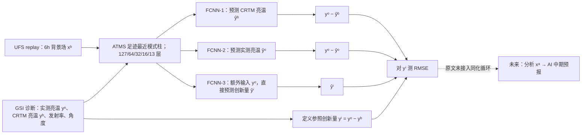

# ATMS 深度学习观测算子精读：预报场、卫星亮温与同化创新量之间究竟学了什么？

> Kelsey Lieberman、Laura Slivinski、Matt Bender、Chris Miller、Josh DaRosa、Nick Krall、Mohammad Ridhwaan Alam、Nick Silverman、Sergey Frolov，*Deep-Learned Observation Operators for Artificial Intelligence Weather Forecasting Models*，[arXiv:2604.00082v1，2026-03-31](https://arxiv.org/abs/2604.00082)；本笔记据[25 页 v1 PDF、表 1–5、附表 A1–A5 与图 1–5/A1](https://arxiv.org/pdf/2604.00082v1)核对，补查[作者公开代码](https://github.com/mitre/deep-obs)。核查日 2026-09-25。**归档为同化组件研究：原文没有训练完整同化—预报链，更没有 10–15 天预报技巧评分。**

## 先读结论：三个目标不是同一个“观测算子”

给定数值模式背景大气状态 $x^b$、卫星观测亮温 $y^o$ 与传统 CRTM 模拟亮温 $y^b=H_{\rm CRTM}(x^b)$，数据同化所需的创新量是 $y^i=y^o-y^b$。作者分别训练三个**独立**的全连接网络：预测 CRTM 的 $y^b$、预测真实卫星的 $y^o$、或输入卫星亮温后直接预测 $y^i$。第三条路线在 2022 年独立留出的观测样本上，对 22 个 ATMS 通道平均的创新量 RMSE 为 **0.952 K**（全场景），优于第一条 **1.214 K**、第二条 **2.276 K**。但这只表示**对由 CRTM 定义的创新量标签更接近**，不是同化后分析场 RMSE 降低、更不是十天预报增益。[方法 §3a、Table 3](https://arxiv.org/pdf/2604.00082v1)

这个区别有物理含义：直接拟合真实亮温会把背景场与复杂地表辐射性质的系统差一起吸收入映射，生成的 $y^o-\hat y^o$ 接近零，反而不再保留同化系统需要纠正的偏差。直接拟合创新量虽在本文的 CRTM 参照指标最优，却用观测亮温作为输入，而且目标仍由**已有 GSI/CRTM** 计算；它不是“不靠传统同化系统的纯卫星到预报模型”。论文尚未把这些替代算子放入运行中的分析循环，也未实测下游分析/预报技巧。[§§3a、4a、5](https://arxiv.org/pdf/2604.00082v1)

## 1. 科学问题和任务边界

传统辐射传输算子要把三维模式状态投影到卫星微波亮温，计算/垂直细节与新一代 AI 预报模式之间存在接口落差：UFS replay 有 **127 垂直模式层**，典型 AI 预报场可能仅十余气压层。作者检验两点：能否以小网络近似 CRTM 相关输出；减少输入层数至 64/32/16 或 GraphCast 式 13 层是否严重损害创新量精度。所用传感器是 ATMS 的 **22 个微波通道**；论文没有研究所有卫星仪器，也没有训练 GraphCast/AIFS/FuXi 主预报模型。[§§1、3b](https://arxiv.org/pdf/2604.00082v1)

**术语要准确**：论文里的“观测算子”通常是 $x^b\to y^b$；第三种直接创新量网络实际学习 $(x^b,y^o)\to y^o-H_{\rm CRTM}(x^b)$，并非只依赖模式状态的标准前向算子。第一种可理解为 CRTM 代理，第二种是背景到真实观测的有偏经验映射，第三种是观测与背景联合的创新量代理。它们使用同一总体数据源，但优化目标、可用输入及同化解释不同。[§3a、Table 1](https://arxiv.org/pdf/2604.00082v1)

### 原创重绘：数据、三种训练目标与未执行的下游路径

按论文 Fig. 1、§3、Table 1 自绘。虚线框是**潜在用途而非已完成实验**；三种网络分别训练，不是三头联合损失或“先 1 再微调 3”。同一真实亮温 $y^o$ 只在第三种作为**网络输入**；第一、二种推理后为计算创新量也需获取 $y^o$。[§3a](https://arxiv.org/pdf/2604.00082v1)

## 2. 数据来源、样本构造、清理和数据划分

NOAA **UFS replay** 是 0.25° UFS 耦合模式向 ERA5 大气/ORAS5 海洋再分析 nudging 得到的历史轨迹，仓库资料覆盖 1994–2025；本论文的**训练/主测试实际只抽取 2022**。每隔三天选日期，取其 00/06/12/18 UTC 四个时次；模式输入来自 6 小时背景预报，观测和 CRTM 模拟来自 GSI 对 ATMS 的诊断文件。ATMS 的 NPP、NOAA-20、NOAA-21 卫星场景被一起处理；只有 GSI 文件中出现的观测样本可用，并不等于传感器全部可取得扫描。每个样本是一个足迹、22 通道亮温、所在点最近邻模式柱及其地表/角度信息；作者称双线性抽样未显著改变模型性能，故选最近邻。[§§3c–d、Table 2](https://arxiv.org/pdf/2604.00082v1)

| 场景过滤 | 2022 训练 | 2022 验证 | 2022 测试 | 2023-01-04 演示日 | 过滤含义 |
| --- | ---: | ---: | ---: | ---: | --- |
| 全部足迹 | 2,989,092 | 747,272 | 934,091 | 41,407 | 陆/海/冰、晴/云均可。 |
| 海洋全空况 | 1,717,738 | 429,434 | 536,794 | 23,299 | 邻近模式格点**均为海洋**，剔除海冰；并非只检查足迹中心。 |
| 晴空 | 2,106,979 | 526,744 | 658,431 | 29,403 | 按观测云水混合比 **≤0.05** 定义。 |
| 晴空海洋 | 835,849 | 208,962 | 261,203 | 11,299 | 同时满足前两条件。 |

以上逐数取 [Table 2](https://arxiv.org/pdf/2604.00082v1)。任一亮温通道缺失的观测被去除，约占 **1.6%**；2022 样本先按 80/20 分训练+验证/测试，再在前者按 80/20 分训练/验证，故三个实得比例约 **64/16/20**，不是 80/20/20。“2023-01-04”是图 1/3 的**一天示例**，不能当成跨 2023 全年的独立泛化测试。论文未展示按日期/卫星/天气系统隔离的封存；同一天高度相关的足迹可能分落不同子集，因此随机样本测试与未来年份/传感器外推之间有明显证据距离。[§3d、Figs. 1/3](https://arxiv.org/pdf/2604.00082v1)

### Table 1 的输入维度到底如何得出

对 127 层版本，温度剖面 127 + 水汽剖面 127；另有地面 T/气压/U/V **4**，五种云/降水水凝物整柱量 **5**，卫星天顶/扫描/方位角 **3**，GSI 算的各通道地表发射率 **22**，合计 **288** 输入。第三种另加入 22 通道实测亮温，故 **310** 输入；GraphCast 式 13 层版本则为 **82**。四种配置均输出 22 通道。将五种水凝物沿**气压而非模式层索引**做梯形积分压成五个整柱标量，是论文的重要数据处理选择；清云/雨/雪/霰及云冰不能直接称作 5 个原始垂直剖面输入。[Table 1、§3f](https://arxiv.org/pdf/2604.00082v1)

64/32/16 层是每 2/4/8 个 UFS 层抽样，保持 UFS 约 1 hPa 模式顶；13 层借 GraphCast 的气压层，最高到 **50 hPa**，且包含近地层位置。它不是与 16 层在相同高度均匀删去 3 层的受控对照；13 层有时比 16/32 层更好，不能归因于“层更少更好”。[§3b、附录 A](https://arxiv.org/pdf/2604.00082v1)

**标准化**：除水汽和水凝物混合比外，按**训练集**每个标量特征的均值/标准差做 z-score；训练目标（CRTM BT、实际 BT 或创新量）也逐通道标准化，推理后反变换回 Kelvin。水汽高层常近零，作者避免除小标准差放大数值噪声。新增的水凝物**浓度**消融另经整柱积分和归一化，不能把这一步错误套入基线五种 mixing ratio。缺少公开的固定统计文件版本、质量控制细则会影响独立重现；代码仓库提供预处理/配置生成入口，但须实际复现才可宣称完全同分布。[§3f、附录 A3；作者仓库](https://arxiv.org/pdf/2604.00082v1)

## 3. 网络架构、训练参数和是否微调

每种目标/场景分别训练小型 FCNN：隐藏层宽 **384→512→64**，ReLU，三处 batch normalization，22 通道输出；输入通道随上表 288/310/82 改变，权重约 **26.3–35.3 万**。单 GPU **H100**、PyTorch、batch **1024**、Adam、学习率 **1×10⁻⁴**、MSE 目标加 L2 正则 **1×10⁻⁵**，验证损失连续 **20 epoch** 不改善就停，回取验证损失最低的 checkpoint。各条件训练 **31–129 epoch、2–10 小时**；原文未给固定训练总 step/seed、Adam β、LR 日程或每场景独立的 epoch 表，故不能虚构统一的固定迭代数。[§3e](https://arxiv.org/pdf/2604.00082v1)

**没有论文报告的微调阶段**。三种形式、四种场景、五种垂直层设置，以及水凝物/发射率/网络大小消融是分别训练或重训的实验配置；不是共享预训练权重→GraphCast 微调，也没有将网络端到端回传到 UFS、GSI 或 AI 天气主干。若将来联合同化微调，训练目标、冻结范围与更长时间序列都需要另证。[§§3–4、代码 README](https://arxiv.org/pdf/2604.00082v1)

**重要的论文内部参数表不一致**：正文 §4c 说基线 FCNN “350,806” 权重，Table 5 却给**含 BN 基线 352,726**，无 BN 版本才 **350,806**；更宽/更深模型正文 **750,144/877,574**、表 5 **753,344/881,446**。应按所引用表标记其数值，不把文字与表中的参数强行说成同一计数。它不影响 Table 3 误差数，但限制逐参数复现。[§4c、Table 5](https://arxiv.org/pdf/2604.00082v1)

作者[公开代码](https://github.com/mitre/deep-obs)列出 `download_from_ufs_replay.py → preprocess_data.py → generate_configs.py → train.py → test.py`，并有 `configs/innovations_127.yaml` 示例。公开有入口**不等于**数据集已本地下载或 checkpoint 已核验；论文只声明数据来自 UFS replay 与 GSI 诊断，尚未见完整闭环同化系统的训练入口。[论文 Data Availability；代码 README](https://arxiv.org/pdf/2604.00082v1)

## 4. 主结果：先看“预测什么”，再看误差

**Table 3：2022 留出足迹、22 通道平均的创新量 RMSE，单位 K，越小越好。**每个场景有相应训练网络；不是把同一全场景模型直接迁移到晴空海洋。[原表](https://arxiv.org/pdf/2604.00082v1)

| 目标形式 | 全部 | 海洋全空况 | 晴空 | 晴空海洋 | 说明 |
| --- | ---: | ---: | ---: | ---: | --- |
| 1. 拟合 CRTM BT，之后算 $y^o-\hat y^b$ | 1.214 | 1.369 | 0.913 | 0.915 | 可视为传统前向算子代理的误差。 |
| 2. 拟合实测 BT，之后算 $y^o-\hat y^o$ | 2.276 | 1.974 | 2.168 | 1.240 | “拟合观测更像”不代表保住供同化修正的创新量。 |
| 3. 输入 $y^o$、直接拟合 $y^i$ | **0.952** | **1.110** | **0.611** | **0.688** | 对原 CRTM 创新量标签最好；不等于已测同化/预报改善。 |

Fig. 1 先显示 2023-01-04 的 GSI 原始通道 1：真亮温、CRTM 亮温及两者差，**不含模型预测**。Fig. 3 用同日通道 1 展示三模型的创新量及残差空间图；这是出训练年的**一日定性外推**，和 Table 3 的 2022 多样本统计不是同一评分分母。值得追问的是：第三形式利用了 $y^o$，第一形式没用，比较“更准”本身是带有不同输入信息量的方案选择，不能归结为网络架构更强。[Figs. 1/3、Table 3](https://arxiv.org/pdf/2604.00082v1)

### 纵向稀疏化：附表 A1 比“仅增加 5.3%”更有信息

| 创新量模型输入层数，2022 测试 | 全部 K | 海洋全空况 K | 晴空 K | 晴空海洋 K |
| --- | ---: | ---: | ---: | ---: |
| UFS 127 层 | **0.952** | **1.110** | 0.611 | 0.688 |
| UFS 64 层 | 0.953 | 1.118 | **0.602** | **0.676** |
| UFS 32 层 | 1.002 | 1.147 | 0.620 | 0.700 |
| UFS 16 层 | 0.998 | 1.182 | 0.656 | 0.722 |
| GraphCast 式 13 层 | 1.000 | 1.185 | 0.655 | 0.720 |

逐数取[附表 A1、Fig. 4](https://arxiv.org/pdf/2604.00082v1)，并核对 PDF 原页的场景列。正文的“最大退化 **5.3%**”不是对表内**所有四场景×所有层数**都成立：例如海洋全空况从 1.110 到 1.185，比例约 **6.8%**，晴空从 0.611 到 0.656，约 **7.4%**。5.3% 与“全部足迹”的 0.952→约 1.002 相符，应用时应限定该口径。附表 A1 图注称“预测亮温 RMSE”，但同一图注明确其网络训练目标是**创新量**；不能据此另算一个与 Table 3 无关的第 4 种模型。更少层偶尔 RMSE 下降不证明删层有益：附录 A 的**标准化空间 RMSE**随稀疏度总体单调恶化，而 Kelvin 反变换受各通道标准差不同影响，甚至可逆转平均排行；GraphCast 式 13 层又非其余的嵌套子集。[附表 A1–A4](https://arxiv.org/pdf/2604.00082v1)

## 5. 消融：发射率、水凝物和模型容量谁更关键？

| 127 层创新量模型，2022 测试；Table 4/5 | 全部 K | 海洋全空况 K | 晴空 K | 晴空海洋 K | 解释 |
| --- | ---: | ---: | ---: | ---: | --- |
| 基线：GSI 发射率＋整柱水凝物 | **0.952** | **1.110** | **0.611** | **0.688** | 比较原点。 |
| 水凝物保留完整垂直剖面 | 0.976 | 1.119 | 0.628 | 0.701 | 压缩为压力积分整柱量在本数据上略好。 |
| 去掉所有水凝物 | 1.078 | 1.371 | 0.663 | 0.732 | 全部足迹约 **+13.2%** 相对误差；云雨敏感通道损失明显。 |
| 去掉发射率，仍有整柱水凝物 | 1.253 | 1.263 | 1.102 | 0.765 | 全部足迹约 **+31.6%**，晴空几乎倍增；发射率不可随意删除。 |
| 用地表前驱量代替发射率 | 1.140 | NA | 0.911 | NA | 全部足迹介于有/无 GSI 发射率之间；两海洋场景常量输入致训练出错，不能填数字。 |
| 更宽 FCNN（Table 5） | 0.935 | 1.102 | 0.615 | 0.668 | 容量变大但并非每场景更好。 |
| 6 层/256 ResNet（Table 5） | 0.982 | 1.146 | 0.600 | 0.660 | 晴空较好、全场景较差，不能宣称残差网络全面胜出。 |

数值取[Table 4–5](https://arxiv.org/pdf/2604.00082v1)并目视核对原表。正文说发射率约 24%、水凝物约 12% 的影响，与“去掉后以基线 0.952 作分母”的 **31.6%/13.2% 增误差**不是同一分母；报告相对量必须声明所用分母。额外水凝物**浓度**的全场景 RMSE **0.958**，略差于基线，而非“更多输入必然更好”；在晴空海洋场景它却是 **0.672**，低于基线 **0.688**，原 Table 4 仍把基线 0.688 加粗，和逐格最小值不一致。Fig. 5 分通道说明去水凝物对云雨敏感通道冲击更大，温度探测 10–15 通道相对较弱；它是分通道**百分比曲线**，此处不从像素反读伪精确点值。[§4c、Fig. 5](https://arxiv.org/pdf/2604.00082v1)

**发射率依赖是集成瓶颈。**基线的 22 个 GSI 发射率通道本身由原业务同化系统诊断，包含地表粗糙度、风速、海冰、积雪、植被/土壤等先验；若未来声称“完全与物理算子/GSI 解耦”，就必须在新 AI 系统中提供等价发射率或验证前驱量替代。现有替代 RMSE 1.140（全场景）明显不及直接输入发射率 0.952；因此论文只展示接口可能性，而非已经解决全链依赖。[§4c/5、Table 4](https://arxiv.org/pdf/2604.00082v1)

## 6. 负面结果、解释张力与下一步最小验证

第一、三种以 CRTM/GSI 标签训练，因而会继承 CRTM 对撒哈拉沙漠及夏季极地海冰的辐射系统偏差；第二种对真观测拟合更近，却可把背景场的系统偏差“吞掉”，使创新量对同化失去纠错作用。作者也明确提出使用目的决定偏差该保留还是消除，而不是固定第三式在所有业务目标都最优。真实同化闭环必须比较分析增量、独立观测 O−A、短中期预报 RMSE/ACC/CRPS、极端天气和气候漂移，而不是只最小化同一 CRTM 生成的标签误差。[结论 §5](https://arxiv.org/pdf/2604.00082v1)

本论文无所谓“微调到中期预报”的结论：**没有 6h、5d、10d 或 15d 的下游预报场评测**；图 2 仅是垂直层分布，不是模型预报性能；图 A1 比较归一化目标的逐通道误差，也不是不同预报 lead。对四类目录而言，它应和 AIFS-DOP/GraphDOP 等实际给出分析或预报结果的论文在`assimilation/`相邻阅读，但不并入 `medium-range/` 的“已证十天能力”集合。下一步若用该方法接 AIFS/FuXi/GraphCast，需要补真观测时间封存、独立质量控制/发射率来源、同一初值的 CRTM 与 learned-H 交换实验、闭环多轮同化及第 1/5/10 天评分；这些是**建议实验，不是已报告成果**。[论文全文与作者代码](https://arxiv.org/pdf/2604.00082v1)

[返回首页](../../README.md) · [返回追踪表](../../气象大模型_中期预报论文追踪.md)
