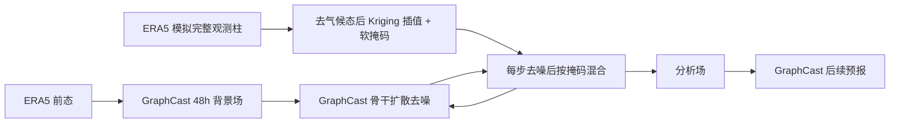

# DiffDA：用扩散模型把稀疏观测同化进全球 0.25° 天气状态

> Langwen Huang、Lukas Gianinazzi、Yuejiang Yu、Peter D. Dueben、Torsten Hoefler，*DiffDA: A Diffusion Model for Weather-scale Data Assimilation*。arXiv:2401.05932，初版 2024-01-11；本笔记依据 [v3，2024-06-10](https://arxiv.org/html/2401.05932v3)；阅读日期 2026-09-24，附录与代码复核 2026-09-25。[作者代码固定提交](https://github.com/spcl/DiffDA/tree/3802e57ca04ad16fab37b935334714bd1c08a71f)。

## 先说结论

DiffDA 是**数据同化模型，不是 10–15 天天气预报模型**。它尝试从 GraphCast 的 48 小时预报背景场和模拟稀疏观测恢复 0.25° 全球三维大气场，再把该场送回 GraphCast 做短期预报。论文展示了可行性，也清楚暴露了长期循环同化中的误差积累；其对中期预报的意义在于“气象 AI 如何获得独立于 ERA5 的初值”这个上游问题，而不是已经改善了中期评分。[摘要与引言](https://arxiv.org/html/2401.05932v3)

## 1. 为什么需要这个工作？

许多全球 AI 预报模型在 ERA5 分析场上训练、初始化和验证；ERA5 本身依赖传统 NWP 与数据同化。若业务应用只有站点、探空、飞机、卫星等不规则观测，就必须先构造完整格点大气状态。否则“预报模型推理很快”不等于“独立端到端预报链路很快”。DiffDA 将同化视作条件采样：给定预报背景 $\hat x_i$ 和观测 $y_i$，求分析场 $x_i\sim p(x_i\mid\hat x_i,y_i)$。论文先限制观测算子为从格点状态中抽取稀疏点的线性算子，这一简化决定了实验与真实业务同化仍有距离。[第 1 节、第 2.1 节](https://arxiv.org/html/2401.05932v3)

## 2. 核心机制：预报背景和观测分两条路径进入扩散过程

训练阶段，作者从预训练 GraphCast 权重初始化图神经网络噪声预测器。原 GraphCast 接收两个时刻的大气场；适配后接收带噪目标状态 $x_i^j$、背景预报 $\hat x_i$ 和扩散步 $j$，在通道维拼接两类大气场，用平方误差学习人工加入的高斯噪声 $\epsilon$。写成目标即 $\mathbb E_{j,x^0,\epsilon}\lVert\epsilon-\epsilon_\theta(x^j,\hat x,j)\rVert_2^2$，其中 $x^j=\sqrt{\bar\alpha_j}x^0+\sqrt{1-\bar\alpha_j}\epsilon$；这是噪声回归，**不是**训练时给网络输入观测或直接最小化分析场 RMSE。背景来自以 ERA5 为初值跑出的 48 小时 GraphCast 八个 6h 步，按目标物理时刻与 ERA5 场配对。最终把反归一化的生成修正量加回背景场，形成分析场。[原文 §2.2–2.3、§3.2](https://arxiv.org/html/2401.05932v3)

最有辨识度的设计是**训练时不输入稀疏观测，推理时才加入**。直接让网络接受任意数量、任意位置的观测需要处理集合置换不变性与庞大条件空间；作者借鉴 RePaint，在每一步反向去噪中分别采样“观测约束部分”和“模型生成部分”，再按软掩码混合。仅把单个观测格点硬替换时，编码/解码的空间降采样会稀释局地信息，因此 `softbleed` 以高斯核做 $(\max,\times)$ 卷积，使观测点掩码仍精确为 1，邻域平滑衰减；并在**每个变量、每个气压层的二维水平片**上用 `pyinterp` universal kriging 先插值观测异常。论文设 $\sigma_G=2.5$ 格点、核直径 $4\sigma_G+1$，按纬度余弦缩放核宽。作者也描述 RePaint 的重采样：同一个去噪层把当前混合场重新加噪、再去噪多次以缓和边界不连续；正文未给主实验的重采样次数 $U$。[原文 §2.4、算法 1、§3.3](https://arxiv.org/html/2401.05932v3)

从统计角度看，这并不是传统显式最小化背景项加观测项的 3DVar/4DVar，也没有在训练中学习真实观测误差协方差。其条件采样质量依赖预训练生成先验、背景场、插值与掩码半径；在观测差或观测有偏时，硬性保持观测点“真值”会把坏数据带进分析场。[作者局限性](https://arxiv.org/html/2401.05932v3)

以下为按原文图 2 与算法 1 自绘的数据流图，展示两类条件进入扩散模型的不同路径，而非论文原图转载：[原文图 2、算法 1](https://arxiv.org/html/2401.05932v3)。

## 3. 数据、计算与实验设计

状态为 6 个气压层变量（温度、位势、$u/v$ 风、垂直速度、比湿）×13 层，外加 T2m、10 米 $u/v$ 风和海平面气压，合计 **82 个通道**；网格为 $721\times1440$、0.25°。原文 13 层列为 50、100、150、200、250、300、400、500、600、700、850、925、1000 hPa（原 HTML 的 `925hPahPa` 是排版重复，非另一个气压层）。训练使用 ERA5/WeatherBench2 的 1979–2015 年 **6h** 场，2016 验证，2022 测试；原文没有说明 **2017–2021** 如何使用。48h 背景由 GraphCast 八次 6h rollout 生成，按相同物理时刻配对。模型按 GraphCast 已有的**逐气压层均值/标准差**归一化输入和反归一化输出；插值前先减 WeatherBench2 气候态，再做 universal kriging。这里的“全球高分辨率”是真实格点规模，但“业务观测”是**从 ERA5 抽取完整 82 值垂直柱的模拟观测**，没有观测误差或仪器算子。[原文 §3.1–3.3](https://arxiv.org/html/2401.05932v3)

### 3.1 训练、微调及代码默认值必须分开

| 环节 | 原文明确给出的设置 | 复现时不能擅自补写的部分 |
| --- | --- | --- |
| 48h DiffDA | 从预训练 GraphCast 骨干初始化，训练条件噪声预测；**AdamW**、warmup＋cosine：LR 从 **1×10⁻⁵** 开始，前 **1/6 总步数**升至 **1×10⁻⁴**，结束降到 **3×10⁻⁶**；48×A100 数据并行、global batch **48**、**20 epoch**、梯度检查点；作者报告约 **2 天** | 论文未给权重衰减系数、精确扩散步数/β 曲线、每个 epoch 的有效样本数和重复训练误差条 |
| 循环同化专用 6h DiffDA | 另训练一个接受 **6h GraphCast 背景**的扩散模型，不是同一 48h 权重直接无缝套用；同化→GraphCast 6h 预报→下次同化交替 | 原文未单列 6h 模型的训练 epoch、LR 差异、是否从 48h DiffDA 权重继续微调；**不能写成已验证的两阶段微调** |
| 推理 | 单 A100 生成一份分析约 **15 分钟**；论文结尾另用 15–30 分钟概括不同情形 | 无完整业务观测处理/质控及与传统 NWP 同硬件同任务计时 |

[作者公开训练脚本固定提交](https://github.com/spcl/DiffDA/blob/3802e57ca04ad16fab37b935334714bd1c08a71f/DiffDA/train_conditional_graphcast.py)可以补充**实现线索**：优化器链有 `optax.clip(0.5)`＋AdamW、默认线性 β/1000 个训练扩散步；但脚本默认 `--resolution=1deg`、`batch_size=1`、`epochs=1`、`GraphCast_small ... resolution 1.0`，显然不是正文 0.25°、global batch 48、20 epoch 的实际命令。README 要求下载另一份 **0.25° operational GraphCast** 权重并以命令行参数运行；没有随论文保存最终作业命令/检查点时，**不能把脚本默认值冒充论文实验参数**。脚本示例的背景生成命令覆盖 1977–2016，也不能改写正文的 1979–2015 训练切分。[作者 README](https://github.com/spcl/DiffDA/tree/3802e57ca04ad16fab37b935334714bd1c08a71f)

论文有三类实验：(1) 对一个 48 小时背景场做一次同化，比较分析场与 ERA5 的 RMSE；(2) 以 6 小时预报和同化交替，测试循环稳定性，需要额外训练 6 小时背景专用 DiffDA；(3) 将一次同化场作为 GraphCast 初值，做 48 小时预报，比较其误差相当于 ERA5 初值预报的多少小时。前两类单次/后续预报实验对不同时间与随机种子做 16 次平均；循环实验因计算成本仅运行一次。因此不能把所有图的差异都当作统计稳健的优势。[第 3.4 节](https://arxiv.org/html/2401.05932v3)

## 4. 主要结果与正确读法

单次同化中，4,000 根模拟观测柱（约占 0.25° 网格列的 0.39%）便使 Z500、T850、T2m 的分析 RMSE 低于输入的 48 小时背景误差；随着观测柱增加，误差通常继续下降。作者的“少于 0.96%”对应 10,000 根柱/约 104 万个水平格点，但每根柱都携带 82 个变量与垂直层值，**不等于只观测 0.96% 的物理变量且每个观测位置仅有地面站资料**。40,000 根柱约为 3.9% 水平列，不能与 0.96% 的情形混写。[第 3.3–3.4 节](https://arxiv.org/html/2401.05932v3)

预报用途实验：从一次同化的初值出发跑 48 小时 GraphCast，10,000 根观测柱时，Z500/T850/T2m 的误差均低于以 ERA5 初值跑 **72 小时**预报的误差；作者据此说相对于 ERA5 初值，预测技巧损失小于 24 小时。40,000 根柱则低于 ERA5 初值 60 小时预报误差。这个说法是**误差等价时效比较**，不是“DiffDA 比 ERA5 初值更好”，也不是“10–15 天预报增益 24 小时”。ERA5 既是模拟观测来源又是验证目标，所以用 ERA5 初值预报本就占优。[图 9 与正文](https://arxiv.org/html/2401.05932v3)

| 模拟观测柱数 | 48 小时同化初值预报与 ERA5 初值预报比较 | 可得结论 |
| ---: | --- | --- |
| 10,000 | Z500/T850/T2m 误差低于 ERA5 初值 72 小时预报 | 该设置下损失少于约 24 小时技巧 |
| 40,000 | 误差低于 ERA5 初值 60 小时预报 | 观测更多时等价时效差缩小 |

此表按原文图 9 的文字说明整理，**不是**从颜色格子反推未公布的精确 RMSE，也不代表 10–15 天实验。[原文图 9](https://arxiv.org/html/2401.05932v3)

循环同化结果更复杂：固定观测站位置时，T850 和 T2m 误差逐步累积，T2m 很快差于仅对观测做插值的基线；每轮更换观测位置可以减缓误差累积，Z500/T850 多数时段仍优于插值，但 T2m 若干轮后仍超过插值误差。作者认为缺乏跨时刻的四维同化约束是可能原因；这是合理解释，不是被消融实验证明的唯一原因。[图 7–8](https://arxiv.org/html/2401.05932v3)

软掩码消融也不是“半径越大越好”。例如 10,000 根柱、48 小时后续预报的 Z500 RMSE 随 $\sigma_G=0.5,1.0,1.5,2.0,2.5,3.0$ 分别为 180、164、148、147、146、142；而 20,000 根柱对应 166、143、132、120、119、130，半径进一步增大反而恶化。T2m 的最优半径也与 Z500 不同。这说明插值误差会随掩码扩展传播，业务系统可能需要按变量、观测密度调节。[表 1](https://arxiv.org/html/2401.05932v3)

同一个核宽有**分析场**和**从分析场再预报 48h**两套消融，不能混表。附录表 2 的 10,000 柱单次分析中，$\sigma_G$ 从 0.5→3.0 时 Z500 RMSE 为 **68.5/50.6/41.7/38.3/37.2/36.9**，T850 为 **1.01/0.88/0.79/0.73/0.70/0.69**，T2m 为 **1.40/1.26/1.11/0.98/0.93/0.89**；这里更宽掩码普遍改善。但正文表 1 的**48h 后续预报**在 20,000 柱 Z500 上却以 $\sigma_G=2.5$ 的 **119** 好于 3.0 的 **130**。可见分析时误差最低的掩码，不必然给下游预报最低误差。[正文表 1、附录表 2](https://arxiv.org/html/2401.05932v3)

### 4.1 图 1–23 的证据范围

- **图 1–4 是概念/结构/协议**：图 1 将同化、预报、后处理置于完整天气链路；图 2 是背景场与带噪真值拼接进入 GraphCast 去噪器，图 3 是硬掩码到 `softbleed` 软掩码，图 4 是单次分析、循环同化、分析后 48h 预报三种不同实验路径；不能将图 4 的 48h 预报成绩理解成同化场 RMSE。
- **图 5–6 是单次分析**：图 5 汇总 Z500/T850/T2m 对模拟柱数的 RMSE 与 6–48h 背景误差对照；图 6 的 8,000 柱 T850 个例比较 48h 背景、单独插值、掩码线性混合和 DiffDA，所称更细纹理是该个例的可视化，不是全球所有波数的统计证据。
- **图 7–8 是一次循环轨迹**：固定位置与每轮重抽位置两套观测布局，显示 T2m 尤易超出插值基线；因为每配置只做**一次**循环，不能把线间差视作稳定显著性。
- **图 9 是初值用途，不是中期技巧**：把单次同化结果接 GraphCast 再跑 48h，与以 ERA5 为初值的 **48–96h** 预报误差比“等价时间损失”；并未画 10–15 天曲线。
- **附录图 10–16 和 17–23**分别将图 5 的单次分析、图 9 的分析后预报扩展到地面场及各高空变量/层；它们采用不同的 ERA5 初值时效参照，不能把同颜色/同数值尺度跨图直接比较。附录表 2 是单次分析的核宽消融，正文表 1 才是下游预报消融。[原文图 1–23、表 1–2](https://arxiv.org/html/2401.05932v3)

## 5. 评价、局限与下一步复现

创新点在于把已有天气预报骨干复用为分析场生成先验，并通过推理期空间 inpainting 接受不同稀疏观测布局；因此能在较高全球分辨率上评估“观测—同化—再预报”链路。其边界也很明确：输入是真值 ERA5 的完整垂直柱，没有真实观测质量控制、仪器误差、覆盖偏差、卫星辐射传输算子或异步多时刻资料；作者自己也说当前只支持单时刻点测量，尚未解决真正 4D 同化与循环稳定性。[局限性第 6 节](https://arxiv.org/html/2401.05932v3)

复现顺序应为：锁定 GraphCast 权重、ERA5/WeatherBench2 版本和 2022 测试初值；核对 48 小时背景生成及 82 通道归一化；重算观测柱抽样、纬度修正的软掩码和 kriging；对 16 次单步实验给均值/方差，对循环同化做多年份、多种子重复；再加入带噪声、缺层和不规则时刻的真实观测，比较传统同化或可微 4DVar。只有证明分析场改善可稳定传导到 8–15 天的同初值预报评分，这项工作才有直接的中期预报结论。

[返回仓库首页](../../README.md) · [返回总追踪表](../../气象大模型_中期预报论文追踪.md)
