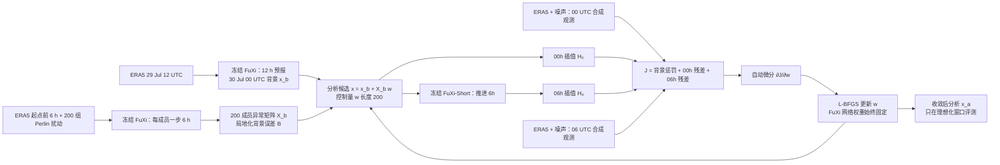

# FuXi-En4DVar：冻结伏羲预报器，用集合四维变分求解六小时分析场

> Yonghui Li、Wei Han、Hao Li、Wansuo Duan、Lei Chen、Xiaohui Zhong、Jincheng Wang、Yongzhu Liu、Xiuyu Sun，*FuXi-En4DVar: An Assimilation System Based on Machine Learning Weather Forecasting Model Ensuring Physical Constraints*，*Geophysical Research Letters* 51(22), e2024GL111136；2024-11-14 首次发表，[DOI:10.1029/2024GL111136（开放全文）](https://agupubs.onlinelibrary.wiley.com/doi/10.1029/2024GL111136)，[作者机构托管的论文 PDF](https://labesm-staff.iap.ac.cn/duanws/ueditor/php/upload/file/20241115/1731640501192095.pdf)。本笔记 2026-09-24 核对期刊 HTML 正文、论文 PDF 的表 1 和图 1–4；出版方 Supporting Information S1 下载受限，涉及 Text S1、Table S1、Fig. S1/S2 的细节只按正文转述，不伪称逐页读过附件。

## 一、准确的问题定位：同化，不是一次新的 15 天模型训练

原始 FuXi 能以 0.25°、6 小时步长作 15 天全球预报，但仍依赖外部数值天气系统给初始分析场。本文问的是：能否让**同一个冻结的 FuXi-Short 预报算子**参与四维变分同化，把 00 和 06 UTC 的观测一起约束 00 UTC 的初始状态，同时用集合背景误差协方差保留随流场变化的变量相关？与纯监督学习观测→ERA5 分析场的 FuXi-DA、[真实卫星观测循环预报的 FuXi Weather](../medium-range/08-fuxi-weather.md)相比，本文研究的是一个显式求解代价函数的混合方法。[引言、§2](https://agupubs.onlinelibrary.wiley.com/doi/10.1029/2024GL111136)

时效边界必须先说清：**论文只做了 2023-07-30 的一个 00–06 UTC、6 小时同化窗口及四组理想化观测试验**。FuXi 底座具备 15 天预报能力，是方法选型的背景事实；本论文没有用这些新分析场做多起报 10–15 天预报评分，也没有全年循环同化或真实卫星资料试验。因此按主要贡献归入 `assimilation/`，不能把原 FuXi 的 15 天成绩移植为 En4DVar 的验证结果。[§2.1、§2.3、结论](https://agupubs.onlinelibrary.wiley.com/doi/10.1029/2024GL111136)

## 二、资料、观测生成与预处理链

| 角色 | 论文明确披露的数据与处理 | 解释和复现缺口 |
| --- | --- | --- |
| 预训练预报算子 | 采用已在 **39 年 ERA5** 上开发的原 FuXi，70 个天气字段、两帧相邻 6 小时输入，张量 `2×70×721×1440`；0.25° 全球网格，6 小时输出。本文同化窗口只调用 **FuXi-Short 的一步 6 小时算子**。 | 39 年是**原 FuXi**训练背景，本文没有再次训练、解冻或微调这些网络权重；原始预训练的逐年划分和网络超参应查[基础 FuXi 原论文](https://www.nature.com/articles/s41612-023-00512-1)，不应凭空补到本同化试验。 |
| 背景场 `x_b` | 以 **2023-07-29 12 UTC ERA5** 为初始条件运行 FuXi **12 小时**，得到 2023-07-30 00 UTC 的同化背景；所有实验窗口均为该日 **00–06 UTC**。 | 背景不是直接复制 00 UTC ERA5；这使其相对 00 UTC 的“真值”有可修正预报误差。实验只取一个天气情景，不能推出季节稳健性。 |
| 背景集合与协方差 | 在窗口起点前 **6 小时**的 ERA5 初值上叠加 **200 组 Perlin 噪声**，逐个用 FuXi 推进一步至 00 UTC，形成 `K=200` 背景成员。成员减集合均值，再除以 `√(K−1)` 得异常矩阵 `X_b`；`B≈X_b X_bᵀ`。对低秩造成的远距伪相关进行局地化。 | 主文没有给 Perlin 噪声频谱/振幅、是否按变量调整、随机种子、局地化半径或垂直锥度的复现参数；`B` 的细节指向未取得的 Text S1。不能把“用了局地化”扩写成特定公里数。 |
| 合成观测 `y` | 从 ERA5 状态取值并加均值 0 的高斯噪声；观测时间是 00 和/或 06 UTC。观测算子 `H` 为基础插值；`R` **对角**且观测误差标准差固定：位势 **25 m² s⁻²**、相对湿度 **2%**、温度 **0.1 K**、U/V 风 **0.5 m s⁻¹**。 | 作者正文把“加入噪声的**方差**等于观测误差**标准差**的 0.001 倍”并列，量纲不一致；本笔记保留这一原文歧义，不擅自改作方差的 0.001 倍。这里无真实卫星亮温、探空或站点同化，EXP4 的“类似 dropsonde”仅指变量/层次布设。 |
| 独立评测参照 | 将分析/背景相对 ERA5 的区域网格 RMSE 与合成观测的 OMB/OMA 比较；图 4 在观测区域内 **0.25°** 网格上计算。 | ERA5 同时是合成观测来源及场 RMSE 参照，检验的是封闭理想化任务，而非独立实测真值下的业务表现。 |

这些处理来自[§2.1、§2.2、§2.4](https://agupubs.onlinelibrary.wiley.com/doi/10.1029/2024GL111136)。原文 FuXi 的 70 字段包括高空位势、温度、湿度、风和地表降水、海平面气压等；它没有在本论文逐项重印全部变量/层次清单，因此这里不把单篇中未重印的清单冒充作者本次实验选择。

## 三、四组观测实验：同一窗口，不是四个训练任务

| 原文表 1 | 同化变量与位置 | 时间与要回答的问题 |
| --- | --- | --- |
| EXP1 | **Z500**，21°N、129°E 的单点 | 00 UTC；看正位势增量是否伴随合理的 500 hPa 风响应，以及水平/垂直局地化。 |
| EXP2 | **R500/RH500**，52°N、86°E 与 17°N、135°E | 对两个地点分别把单点放在 00 或 06 UTC，构成四个对比个例；看槽脊和台风背景流下，晚时次观测如何在 00 UTC 分析场中逆向传播。不是四点一次性联合同化。 |
| EXP3 | **T500、U500、V500、R500**；20–60°N、80–140°E，**1°** 间隔理想观测网格 | 同时使用 00 和 06 UTC；检查同层多变量协方差、OMB/OMA 分布与区域分析 RMSE。 |
| EXP4 | **T、U、V、RH** 在 **250/300/500/850/1000 hPa**；同一矩形与 1° 网格 | 同时使用 00 和 06 UTC；检查多层观测向其他变量/层次传递是否合理。并非现实探空资料网络。 |

Z500 是 500 hPa **位势**，单位 m² s⁻²；原文图 4 的 5,880 m 等高线则是相应的**位势高度**背景等值线，两种物理量/单位不能混用。[表 1、图 2/4 图注](https://agupubs.onlinelibrary.wiley.com/doi/10.1029/2024GL111136)

## 四、模型机制和求解流程：训练参数与同化控制量不能混淆

这是根据[原文图 1、式 (2)–(9)](https://agupubs.onlinelibrary.wiley.com/doi/10.1029/2024GL111136)重新绘制的**原创概念图**，非复制原图。严格地说，`X_b` 是 `N×200`，状态维 `N` 远大于 200；`B≈X_bX_bᵀ` 因而低秩，易产生样本远距伪相关，所以作者对背景协方差采用局地化。分析搜索只在背景集合张成的 200 维增量空间内进行：`x_0(w)=x_b+X_bw`。这既大幅减少优化自由度，也意味着集合没有表达的误差结构不会被本次同化自动补齐。[式 (2)–(4)](https://agupubs.onlinelibrary.wiley.com/doi/10.1029/2024GL111136)

在此单步窗口，代价是 `J(w)=½wᵀw + ½[y₀−H₀(x₀(w))]ᵀR₀⁻¹[y₀−H₀(x₀(w))] + ½[y₆−H₆(M₆(x₀(w)))]ᵀR₆⁻¹[y₆−H₆(M₆(x₀(w)))]`，其中 `M₆` 是 FuXi-Short 一步。第一项不让增量无代价地远离背景，后两项使分析轨迹兼顾开始与结束时刻的观测，而不是各时刻独立插值。原文式 (5) 写了一般切线性形式，实际使用的是式 (7) 的两时次**非线性 FuXi 前向 + 自动微分**，这点复现时不宜混写。[式 (5)–(9)](https://agupubs.onlinelibrary.wiley.com/doi/10.1029/2024GL111136)

作者把“神经网络训练”和“变分同化”并置：训练是固定输入、更新网络参数；本实验是**固定网络参数、对输入控制变量 `w` 求梯度**。自动微分沿 `w→x₀→FuXi→H₆→J` 反传，链式法则给出与显式伴随推导相同的形式，因而无需另写传统模式伴随程序。采用 **L-BFGS** 优化 `w`；这属于每次同化窗口的迭代最小化，绝不是给 FuXi 新增一轮 L-BFGS 权重微调。[§2.2、图 1](https://agupubs.onlinelibrary.wiley.com/doi/10.1029/2024GL111136)

### 可复现参数清单，以及确实没有公开的参数

| 环节 | 已核实设置 | 未报告/不能推断 |
| --- | --- | --- |
| FuXi 底座 | 70 字段、双时次输入、0.25°、6h；本窗口用 FuXi-Short。 | 本文没有新网络训练配置、batch、学习率、优化器、epoch 或底座参数量；以前 FuXi 论文的训练参数不能冒充 En4DVar 本文的新训练。 |
| 集合制作 | `K=200`、Perlin 扰动、起点前 6h 加扰、一步传播；异常按 `√199` 缩放。 | 噪声强度/相关尺度/垂直结构、局地化半径及实现细节在主文缺失或引到未取得的 S1。 |
| 同化迭代 | 00/06 UTC 两时次、`R` 对角、基础插值、200 维 `w`、自动微分、**L-BFGS**。 | L-BFGS 线搜索、历史长度、最大迭代数、停止阈值、硬件、每窗口耗时和显存未给出；不能把图 S2 的“下降”填成确定迭代次数。 |
| 监督微调 | **没有**：不更新 FuXi 权重，也没有在真实探空/卫星资料上训练独立 DA 神经网络。 | 不存在可报告的微调数据划分、冻结解冻层、LoRA、学习率、checkpoint 选择；若未来做真实循环同化则需另行试验。 |

## 五、表图逐项阅读：何处量化、何处只可定性

### 图 1：优化对象的转换

论文图 1a 是常规训练，图 1b/c 是同化代价与反向求导模块。关键不是“4DVar 自动变成一个神经网络”，而是固定 FuXi 权重、把背景/集合/两个时刻的观测放进可微计算图，更新 `w`。上面的流程图把图 1 中最容易混淆的**输入更新 vs 网络权重更新**明确分开。[图 1 图注、§2.2](https://agupubs.onlinelibrary.wiley.com/doi/10.1029/2024GL111136)

### 图 2：单点位势与湿度增量

EXP1 的 Z500 观测与背景差 `OMB>0`，同化后 `|OMA|<|OMB|`，Z500 分析增量为正；500 hPa 风增量呈与正位势异常相配的反气旋式响应，垂直剖面也有相应风场结构。图 2 还表明增量局限在观测附近，而非远距离大范围传播。**这是该个例的动力平衡表征**；它没有证明网络严格守恒质量、能量或位涡，也没有给所有天气型的平衡误差统计。原文引用的单点 OMB/OMA 精确数值在未取得的 Table S1，故不自造数字。[§3.1、图 2a/b](https://agupubs.onlinelibrary.wiley.com/doi/10.1029/2024GL111136)

EXP2 把 R500 单点分别放在窗口开头或结束：00 UTC 观测产生近观测点增量；06 UTC 观测约束的 00 UTC 分析增量偏向背景流的上游/西南侧。槽脊位置与台风东南象限的响应形状不同，给出**流依赖**而非固定各向同性的证据。但这是两位置、两个观测时次的理想化对比，不足以证明真实水汽卫星资料的长期业务同化收益。正文提到的垂直演变 Fig. S1 尚未逐页验证。[§3.2、图 2c–f](https://agupubs.onlinelibrary.wiley.com/doi/10.1029/2024GL111136)

### 图 3：T500 观测空间的误差分布，有原图可读数值

`OMB=y−H(x_b)`；`OMA=y−H(x_a)`。在窗口结束，必须比较 `y₆−H(M₆(x_b))` 与 `y₆−H(M₆(x_a))`，不是拿 06 UTC 观测直接减 00 UTC 分析。论文图 3 的密度曲线印有下列均值和标准差；这是**原图标注值**，不是从颜色或柱高估读。T500 对应温度；图例只写统计值，故表中保留原图数值，不额外推断坐标单位。[图 3、图注](https://agupubs.onlinelibrary.wiley.com/doi/10.1029/2024GL111136)

| 时刻、原图面板 | OMB 均值 | OMA 均值 | OMB 标准差 | OMA 标准差 | 可直接得到的变化 |
| --- | ---: | ---: | ---: | ---: | --- |
| 00 UTC，图 3c | 0.076 | 0.001 | 0.424 | 0.305 | 平均创新更接近 0，离散度下降约 28.1%。 |
| 06 UTC，图 3f | 0.078 | 0.001 | 0.415 | 0.298 | 平均创新更接近 0，离散度下降约 28.2%。 |

`(0.424−0.305)/0.424≈28.1%`、`(0.415−0.298)/0.415≈28.2%` 是根据原图标注数值计算的**阅读者派生量**，不冒充论文报告的新统计。图 3a/b、d/e 的地图显示大多数地点的 T500 残差收缩，尤其原来负偏差明显的西南角；不能由“多数”改写成所有格点单调改善，也不能把训练同化的 OMA 降低当作独立预报检验。[§3.3、图 3](https://agupubs.onlinelibrary.wiley.com/doi/10.1029/2024GL111136)

### 图 4：区域场误差的符号尤其容易读反

图 4a–d 显示 EXP3 的 T500/U500/V500/R500 分析增量主要在观测矩形内，与 OMB 的空间分布近似；图 4e/f 对 EXP3/4 比较分析与背景相对 ERA5 的区域 RMSE。图注把纵轴称为“百分比改善”，**却明确定义** `I=(RMSE_analysis−RMSE_background)/RMSE_background`；依此公式 `I<0` 才是误差降低、`I>0` 是误差升高。图中多数柱为负，但存在正柱，不能写“全变量、全层都改善”。正文说多层 EXP4 是“几乎所有”变量改善，语义上也排除了“全部”。[图 4 图注、§3.3](https://agupubs.onlinelibrary.wiley.com/doi/10.1029/2024GL111136)

评分仅覆盖观测矩形内 0.25° 格点；作者排除 **200 hPa 以上、地表变量和位势**的该 RMSE 汇总，理由包括 Perlin 集合未必能表现高层与中低层协方差，以及 ERA5 地表变量不确定性。图 4 的区域改善因此不是全球平均，也不是 10 天预报 RMSE。原图柱形未配精确数值表，本笔记只报告符号与范围，不从像素刻度“算出”各层改善百分比。[图 4、§3.3](https://agupubs.onlinelibrary.wiley.com/doi/10.1029/2024GL111136)

## 六、与伏羲系列的关系、证据局限与复验路线

1. **FuXi-En4DVar ≠ FuXi-DA / FuXi Weather**。它用 FuXi 作为可微时间推进器、用集合变分求分析；不训练一个直接映射观测到分析场的新网络。也没有直接输入真实卫星辐亮度。真实观测、循环同化和中期预报应另查对应论文，不能串换性能。
2. **“确保物理约束”是针对个例平衡结构的作者主张**。单点 Z500→反气旋风、湿度随流传播提供物理合理性的例证，但缺少守恒量误差预算、广泛天气型和真实业务观测统计。题名中的 ensuring 不应翻成数学意义的严格保证。
3. **样本与真值弱点**。只有一个 6 小时窗口；合成观测由 ERA5 生成，而分析 RMSE 也对 ERA5 算。它验证优化器在理想环境能回近参考场，不等于有偏真实观测与模型误差下循环稳定。
4. **集合与优化的复现缺口**。Perlin 噪声、局地化、L-BFGS 停止条件和完整计算成本在已取得的主文中不足以端到端复现；S1 尚不可访问。优先索取补充材料/代码，固定随机种子并做集合规模、扰动谱、局地化半径和观测噪声敏感性测试。
5. **中期预报连接尚属下一步**。需以同化所得 00 UTC 分析初始化 FuXi，做跨季节多起报的第 1–15 天 ACC/RMSE、极端天气及与业务分析初值的对照；若要称为观测直达，还须真实探空/卫星质量控制与长期循环试验。本文没有这些结果。

我的阅读判断：方法上的核心价值是把**随流场变化的 200 成员背景协方差**和**预训练 FuXi 的自动微分**接入传统 En4DVar，让 00/06 UTC 观测可共同更新初始场；定量证据目前最强的是图 3 的合成观测残差收缩，而“长期独立同化、15 天更好、真卫星可用”仍是待证假设。这一证据层级应与[原始 FuXi 的 15 天预报](https://www.nature.com/articles/s41612-023-00512-1)和[FuXi Weather 的真实观测预报](../medium-range/08-fuxi-weather.md)分别看待。

[返回首页](../../README.md) · [返回总表](../../气象大模型_中期预报论文追踪.md)
