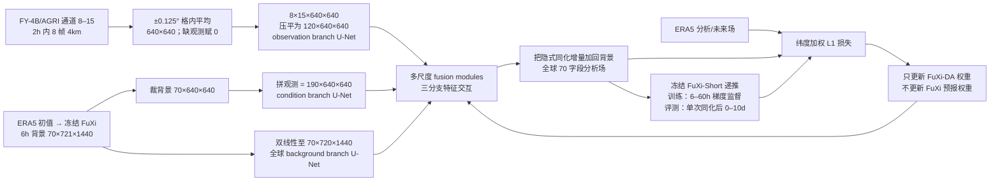

# FuXi-DA：FY-4B/AGRI 卫星亮温进入深度学习同化，再以冻结伏羲监督预报

> Xiaoze Xu、Xiuyu Sun、Wei Han、Xiaohui Zhong、Lei Chen、Zhiqiu Gao、Hao Li，*FuXi-DA: a generalized deep learning data assimilation framework for assimilating satellite observations*，*npj Climate and Atmospheric Science* 8, 156，**2025-04-26** 正式发表，[开放全文与 DOI:10.1038/s41612-025-01039-3](https://www.nature.com/articles/s41612-025-01039-3)，[正式 PDF](https://www.nature.com/articles/s41612-025-01039-3.pdf)，[作者公开代码](https://github.com/xuxiaoze/FuXi-DA)。2024-04-12 首发的 [arXiv:2404.08522](https://arxiv.org/abs/2404.08522) 是早期预印本，本笔记以**2025 期刊正式版**为准。2026-09-24 核对正式 PDF 的方法、表 1–2、图 1–10；文中指向的独立补图 S1–S9 未直接取得，相关描述只依据正式正文。

## 一、研究问题、独立贡献与时效

原始 FuXi 需要 ERA5/业务分析场起报，而卫星测到的是亮温，不直接等于预报状态中的温度、湿度或位势。传统数据同化需要显式观测算子和误差统计；FuXi-DA 尝试让网络分别编码 FuXi 的**6 小时背景预报**与 FY-4B/AGRI 的实际亮温，在统一特征空间学增量，输出更适合下一步 FuXi 的全球分析场。它不是把单次卫星影像直接变成第 10 天场，而是“卫星观测→同化分析→FuXi 递推预报”的两段链路。[引言、图 1、方法](https://www.nature.com/articles/s41612-025-01039-3)

它与[FuXi-En4DVar](68-fuxi-en4dvar.md)的区别是根本性的：En4DVar 冻结 FuXi、通过 L-BFGS 对每个窗口优化集合控制量，论文只做合成观测的 6 小时个例；FuXi-DA 则**训练一个新的同化网络**，接入**真实 FY-4B/AGRI 亮温**，做 2023 年 8–12 月多起报单次同化分析和后续 10 天预报比较。它又是后续[FuXi Weather 真实观测循环系统](../medium-range/08-fuxi-weather.md)的同化技术前身，不能把后者的循环试验与此文混为一个评测。[结果、讨论](https://www.nature.com/articles/s41612-025-01039-3)

本论文图 5 把单次同化后预报延伸到 **10 天**，但正式正文宣称“相对仅订正无卫星”的统计显著增益主要在**前 7 天**；Z500 误差额外下降的示例是第 1 天 **0.67%** 至第 7 天 **0.34%**。到第 10 天的曲线存在，不等于每项相对基线都显著或具备 10–15 天业务技巧，更不能外推 S2S。[图 5、预报验证段](https://www.nature.com/articles/s41612-025-01039-3)

## 二、数据的来源、划分和一步一步的预处理

| 资料/阶段 | 正式论文明确内容 | 重要的解释和未披露项 |
| --- | --- | --- |
| ERA5 标签与背景来源 | 5 个高空量 Z/T/U/V/RH × **13 层**（50、100、150、200、250、300、400、500、600、700、850、925、1000 hPa）+ T2M/U10/V10/MSL/TP 五地表量，共 **70 字段**；0.25°、每 6h。ERA5 提供同化监督标签及产生 FuXi 背景所需输入。 | 这是真实观测驱动的同化实验，但**ERA5 仍是训练标签和评测参考**；不等于对独立探空/站点真值全面验证。论文没有逐字段归一化常数或 TP 偏态变换的完整复现表。 |
| 背景 `x_b` | 用已训练 FuXi 对 ERA5 输入推 **6 小时**得到 `70×721×1440` 背景场；同化分析每天在 **00、06、12、18 UTC** 产生。 | 背景误差包含 FuXi 对未见年代 ERA5 的系统偏差；控制组直接拿背景起报，订正组专门隔离这种无卫星订正收益。 |
| FY-4B/AGRI 观测 | 只同化 **8–15 通道**亮温，均为 **4 km** 足迹；其中 9–11 是三条水汽通道、12–14 包含窗口通道。原始足迹约 `2748×2748` 散点。以分析时刻前后各 **1 小时**为窗口，**15 分钟**一幅，共 **8 帧**。 | AGRI 有 15 个总通道，但本文只用 8 个红外亮温通道，不能写成“同化全部 FY-4B 通道”。2h 窗口是经验选取；作者试过 6h，未见显著收益，但未给严密窗口搜索实验。 |
| 空间匹配/super-observation | 先按卫星覆盖区从 FuXi 全球网格裁约 `640×640` 区域，再在每个目标 0.25° 格点 **±0.125°** 范围对多个 AGRI 像元求平均；无匹配观测的位置赋 **0**，得到 `8 帧×15 通道×640×640`。无进一步抽稀。 | 这是把 4 km 信息平均到模型尺度，而不是把全球预报变成 4 km；未匹配位点赋零是否与亮温归一化零混淆、云边界/坏值质量控制的完整实现需查代码，论文正文不够详。 |
| 七个附加观测编码 | 在八个亮温通道之外，加入经纬度、卫星天顶角和四个时间编码：经度余弦、纬度正弦、天顶角余弦、年内日的 sin/cos、日内时分的 sin/cos，合计 **15 通道/帧**。年内日按 **366** 归一化。 | 经纬度并非简单附上原始度数；时间是周期编码。正文未逐项给所有角度/亮温归一化的数值范围。 |
| 年月与样本划分 | 方法“Data”明确：**2022-06–2023-05 训练 1460 样本；2023-06–07 验证 244；2023-08–12 测试 612**。 | 结果开头又写“2022-06 至 **2024-06** 用于训练”，与方法的逐段划分及“2022-06 至 2023-12 可用”矛盾；本笔记采用方法的明确样本表，并保留此论文内部不一致，不能把测试期误写为训练期。 |

以上按[正式论文 Methods/Data、表 2](https://www.nature.com/articles/s41612-025-01039-3)核对。表 2 的具体中心波长（μm）为 8:3.75、9:6.25、10:6.95、11:7.42、12:8.55、13:10.80、14:12.00、15:13.3；各通道均标 4 km，300 K 时灵敏度/SNR 标注约 0.2–0.5 K。此表描述传感器与所选通道，**不是模型预报误差表**。[正式 PDF 第 11 页表 2](https://www.nature.com/articles/s41612-025-01039-3.pdf)

## 三、网络结构：三分支、多尺度融合，输出的是分析增量

此图依据[原文图 10 与 Methods/FuXi-DA model](https://www.nature.com/articles/s41612-025-01039-3)原创重绘，不转载原图。三路的职责并不相同：observation branch 学卫星观测特征；background branch 学全球预报状态；condition branch 把裁出的背景与观测在卫星视区拼接，以便辨认差异和互补。融合模块本身也是两级下采样/上采样小 U-Net，给出（1）加到背景分支的隐式分析增量、（2）加到观测分支的观测偏差信息、（3）传往下一尺度的订正条件。[图 10b、方法](https://www.nature.com/articles/s41612-025-01039-3)

背景原始纬向 **721** 格被双线性重采样成 **720**，以适配多次二倍下采样；卫星输入的时间维与通道维合并为 **120** 个二维卷积通道，故**当前版本没有显式时序建模器**，尽管 8 帧观测信息同时存在。初始条件是裁切的 70 背景通道 + 120 观测通道 = **190**。下采样块为 2×2 stride2 卷积→层归一化→SiLU→3×3 stride1 卷积；上采样块含 3×3 卷积、层归一化、SiLU、另一个 3×3 卷积、pixel shuffle ×2，图 10c 还示意后接层归一化和 SiLU。原文没有在正式方法页给出每层特征宽度、总参数量、具体融合层通道表，故不能凭图的彩色块数臆造。[图 10、Methods](https://www.nature.com/articles/s41612-025-01039-3)

FuXi-DA 用经典 3DVar 的 `x_a=x_b+K(y-Hx_b)` 启发“背景 + 增量”，但**没有显式构造 K、B、R 或可微辐射传输观测算子**来计算分析。编码/融合网络从训练样本隐式学习跨模态映射；因此题名中的 generalized 是**框架可接入其他资料的设计愿景**，本文实际只验证 FY-4B/AGRI 的八条亮温通道。[式 (1)、方法与讨论](https://www.nature.com/articles/s41612-025-01039-3)

## 四、训练流程、公开参数及“联合训练”究竟更新谁

| 步骤 | 真实优化对象与参数 | 不能混写成的内容 |
| --- | --- | --- |
| FuXi-Short 底座 | 论文调用用 **1979–2015 ERA5** 训练过的 FuXi，提供 6h 背景和可微多步预报；在本同化训练中**权重冻结**，但允许梯度穿过它回到分析场。 | “与 FuXi 联合训练”**不是**给 FuXi 网络权重做新一轮微调；不能把基础 FuXi 原论文的 39 年/15 天级联训练设置当作本研究的新权重更新。 |
| FuXi-DA 网络拟合 | 训练分析场对 ERA5 的**纬度加权 L1**，另把分析送入冻结 FuXi，每 6h 对未来 ERA5 加同类 L1：`L = L₀ + (1/10)Σₜ₌₁¹⁰ Lₜ`，即分析 + **10 个 6h 预报场，最长 60h**。 | 训练目标的预报监督只到 **60h**，不是到图 5 的 10 天；“长期监督”是相对 6h 窗口而言。未报告对卫星亮温的重建损失或单独观测算子训练。 |
| 优化与资源 | PyTorch、**4×NVIDIA A100、每卡 batch1（总 batch4）、6000 iterations、约 8h**；AdamW `β₁=0.9, β₂=0.999, weight decay=10⁻⁵`。前 **500 步**线性 warmup，学习率 **10⁻⁸→2×10⁻³**；随后余弦退火，以 `2×10⁻³` 和总 **6000 步**设定日程。 | epoch 数、有效去重后样本重采样策略、余弦终点 LR、随机种子、梯度累积、混合精度、模型参数量未明确，不可填造。论文称 8h 训练时间，但未把数据预处理/背景预报成本并入。 |
| 无卫星订正对照 EXP_CORR | 保留 FuXi-DA 基本架构的**background branch**，移除融合模块，不输入 AGRI；训练流程“与 FuXi-DA 相同”，用背景→ERA5 学系统订正。 | EXP_ASSI 相对直接背景 CTRL 的收益 = 系统订正 + 卫星增益；只有 **ASSI−CORR** 才更接近隔离卫星观测贡献。不能把全部 CTRL 差异归给 AGRI。 |
| 后续微调 | 期刊正式版没有报告解冻 FuXi、LoRA、循环训练后微调或针对单个天气事件另训头。 | **无可填写的微调学习率/层数/epoch**；对 FuXi-DA 的主训练应称“从数据拟合同化网络”，而不是“微调 FuXi”。 |

训练细节来自[正式论文 Methods/Model training 和 Experimental configurations](https://www.nature.com/articles/s41612-025-01039-3)。这里还存在一个值得复验的“短训练窗—长评估窗”不对称：只用 6–60h 的监督去提高 10 天曲线。图 6 的消融支持增加预报损失在较长 lead 有益，但并未证明训练时显式优化第 10 天损失。[图 6](https://www.nature.com/articles/s41612-025-01039-3)

## 五、实验对照、评分与原图逐项读取

三组均从 FuXi 6h 背景出发：`EXP_CTRL` 不处理背景；`EXP_CORR` 只学无卫星系统订正；`EXP_ASSI` 输入真实 AGRI 并训练完整网络。所有分析/预报 RMSE 对 ERA5 计算，先按纬度余弦加权；归一化差 `D(A,B)=(RMSE_A−RMSE_B)/RMSE_B`。**负数才表示 A 比 B 误差小**。图中的显著性由配对归一化 RMSE 差的 t 检验给出，作者认为 612 个测试样本自相关小而不做 inflation；相邻 6h 起报仍可能相关，置信区间不宜当作完全独立样本的严格业务保障。[Evaluation method、图 2/5](https://www.nature.com/articles/s41612-025-01039-3)

| 图表与比较 | 原文可核对的定量或方向 | 读者不该推出的结论 |
| --- | --- | --- |
| **图 2**：卫星覆盖区域、65 个高空字段，ASSI−CORR 分析 RMSE | R300 **−4.47%**、R500 **−2.77%**、Z300 **−3.01%**、Z500 **−2.02%**；水汽 9–11 通道与 R 改善有关，窗口通道 12–14 与低层 T 改善有关。 | 这是覆盖区内相对**无卫星订正组**的 ERA5 误差变化，不是全球全部字段都改善 4% 或与业务 IFS 的比较。图 2 里还可见个别正值/未显著格点。 |
| **图 3**：2023-08–12 分时次分析 | ASSI 与 CORR 相对 CTRL 总体更好；00/12 与 06/18 UTC 背景误差不同，作者解释与探空主要在 00/12 UTC 影响 ERA5 初值质量相关。地图按 5°×5° 分块，显著处打标。 | “背景自适应信任”是作者对时次差异的解释，不等于网络显式估计 `B` 或 `R`。正式图 3 图注后半时次标签存在重复，读图应看正文和坐标，不机械复制。 |
| **图 4**：2023-10-15 12 UTC 个例 | R300/Z500 的 ASSI−CORR 增量集中在 AGRI 覆盖区，方向可抵消 CORR−ERA5 的部分异常；灰区显示卫星有限视域。 | 个例图不能代替五个月统计，也不能说明覆盖区外“没有任何影响”或所有像素有益。 |
| **图 5**：单次同化后 10 天全球预报 | ASSI 相对 CORR 前 **7 天**总体有显著额外收益；文中 Z500 举例第 1 天 **0.67%** 降误差，第 7 天 **0.34%**。R300/R500/R850、T300/T500/T850、Z300/Z500/Z850 九张曲线；贡献随时效衰减。 | 不是周期同化；所有试验只用 **FuXi-Short** 递推到 10 天，因而第 5 天后 CTRL 比使用 Short→Medium 级联的原 FuXi 更差，不能跨配置直接排名。热带位势在较长 lead 的 ASSI 相对 CORR 可能变差，虽仍好于 CTRL。 |
| **图 6**：有无未来场损失 | 只用分析损失与加入 6–60h 未来场损失的 6h 预报近似，但较长 lead 后者更好，证明梯度穿过冻结 FuXi 的监督有用。 | 不是“把 FuXi 权重联合解冻”，也不是 10 天损失的消融。 |
| **图 7**：湿度增益空间传播 | 第 1 天以卫星视区为主，随后沿中纬西风东传，第 7 天全球多区域可见；按 5°×5° 块统计。 | 图有局部负影响且多数不显著；“从覆盖区传播”是地理模式描述，不是严格因果追踪到每个亮温像元。 |
| **表 1、图 8–9**：观测扰动 | 2023-10-26 晴/云两点，对通道 9/11 做 +1 K、−1 K、+5 K 测试；通道 9 的 +1 K 在晴空使 RH 分析负增量，方向与 RTTOV 13.2 的晴空水汽 Jacobian 一致，改变观测时间会改变空间响应。 | 网络**不能输入孤立的一条观测**，作者是对完整观测张量做两次推理并取差；云区响应不等于已验证全天空同化。RTTOV Jacobian 是解释性参考，不是 FuXi-DA 推理时的显式观测算子。 |

表中百分比均为作者**按指定基线归一化的 RMSE 变化**，不能混成绝对 RMSE 单位。文中图 5 后另讨论热带位势可能在较长 lead 相对 CORR 不利，说明“全球多数指标改善”与“所有地区均改善”不同。[结果、讨论](https://www.nature.com/articles/s41612-025-01039-3)

## 六、证据边界、与中期预报的实际关系和建议复验

1. **真实卫星但非业务循环**：本文确实输入 FY-4B/AGRI 的亮温，较合成观测试验迈出关键一步；然而测试时每个起报使用 ERA5 初始化得到 6h FuXi 背景，作者明确说因观测覆盖与信息量限制**未做循环同化**。不能称它已经摆脱外部 ERA5 初值。后续 FuXi Weather 的循环链是另一篇研究。
2. **“自动区分云晴”需要降温表述**：图 8–9 的扰动反应在云与晴样本有差异，但作者讨论中明说 **all-sky assimilation 尚未证明**，水成物/云粒子需进一步纳入。不能把不需云检测预处理直接等同于全部有云红外观测均可靠。
3. **标签与独立性**：ERA5 来自产生背景的体系，同时当监督和评测参照；2022–23 与 FuXi 的 1979–2015 训练年代不同，CORR 证明部分收益是跨年系统偏差订正。复验应比较独立探空、GPS RO、其他卫星，按天气型/云量/台风分层，而不是只看 ERA5。
4. **区域与时效不均匀**：AGRI 地静轨道只覆盖固定视域；图 2 的分析改进集中在覆盖区与高空水汽/位势，图 5 的额外预报增益随 lead 衰减。若声称观测到“15 天中期”或 S2S 贡献，必须新增该时效的独立实验。
5. **复现先后顺序**：先按方法段重建 1460/244/612 且绝不把 2023-08–12 混回训练；按 ±0.125°、8 帧、零填补和七元编码核查张量；然后复核 6000 步/冻结 FuXi/60h 损失，再以同一 FuXi-Short 路径比较 CTRL、CORR、ASSI。最后做按时次与云量的独立观测验证、循环稳定性和 IFS/其他 AI 模型的同条件基准。

我的阅读判断：这篇最有分量的量化结论不是“卫星一接入就全面提高 10 天”，而是**在无卫星系统订正之外**，AGRI 对覆盖区中上层 RH/Z 分析仍贡献 2–4% 量级额外降误差，并在单次同化后前 7 天留下逐渐减弱的全球预报增益。三分支网络、4 km→0.25° super-observation、冻结预报器的 60h 梯度监督构成可复验的方法链；而循环业务、全天空能力和独立真值仍待后续论文/实验回答。

[返回首页](../../README.md) · [返回总表](../../气象大模型_中期预报论文追踪.md)
