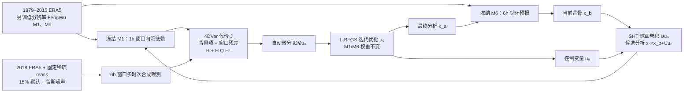

# FengWu-4DVar：用低分辨率风乌与自动微分构造可长期循环的 AI 四维变分同化

> Yi Xiao、Lei Bai、Wei Xue、Hao Chen、Kun Chen、Kang Chen、Tao Han、Wanli Ouyang，*Towards a Self-contained Data-driven Global Weather Forecasting Framework*，ICML 2024，PMLR 235:54255–54275；[正式论文与书目](https://proceedings.mlr.press/v235/xiao24a.html)、[正式 21 页 PDF（含附录）](https://raw.githubusercontent.com/mlresearch/v235/main/assets/xiao24a/xiao24a.pdf)、[作者代码](https://github.com/OpenEarthLab/FengWu-4DVar)。早期[2023-12-16 arXiv:2312.12455](https://arxiv.org/abs/2312.12455) 使用 *FengWu-4DVar: Coupling the Data-driven Weather Forecasting Model with 4D Variational Assimilation* 题名；本笔记以 **2024 ICML 正式版**为独立收录依据。2026-09-24 对照正式 PDF 正文图 1–7、算法 1 与附录图 10–16；无逐图原始数值表的曲线只记可核对的范围与方向。

## 一、问题和最需要防止的三种误读

传统 4DVar 需要预报模型描述窗口内流依赖，并反复运行其伴随；把物理预报器换成已有的可微 AI 预报器，理论上可减少同化成本，并让生成的分析场更适合后续 AI 预报。FengWu-4DVar 将重新训练的**低分辨率 FengWu**嵌入 4DVar，用球面谱卷积表示背景误差的水平相关，用自动微分求代价函数对分析控制量的梯度；然后把“分析→6 小时预测→下一轮分析”循环运行一年。[正式论文摘要、§3、算法 1](https://proceedings.mlr.press/v235/xiao24a.html)

三点边界先钉牢。第一，**所有观测是 ERA5 经固定稀疏掩码与高斯噪声合成**，不是原始卫星或业务站网。第二，本文实验分辨率是 **128×256、约 1.4°**，使用单独训练的 **1 小时**和 **6 小时** FengWu 模型，不能把原始高分辨率 FengWu 的 0.25°/10 天表现直接归给本系统。第三，主要结果是**逐 6 小时循环的分析场稳定性**；附录仅对这些分析场补做**最多 7 天**的预报技巧比较，没有报告第 10–15 天中期技巧，更不是 S2S。[§4.1、§5、附录 F](https://raw.githubusercontent.com/mlresearch/v235/main/assets/xiao24a/xiao24a.pdf)

## 二、ERA5、69 字段、合成观测与循环起点

| 数据角色 | 正式版具体操作 | 不能自行补足的内容 |
| --- | --- | --- |
| 预报器训练资料 | **1979–2015 ERA5**；5 个高空量——位势 `z`、比湿 `q`、纬向风 `u`、经向风 `v`、温度 `t`，各 **13 个气压层**，加 2m 温度、10m U/V、海平面气压四地表量，共 **69 个输出量**。分别训练一步 **1h 模型 M1** 和 **6h 模型 M6**，空间网格 `128×256`。 | 本论文只明确这段年份、变量数、时步和网格，没有给两个 FengWu 的完整网络层数、参数量、batch、优化器/LR、epoch、归一化常数、确切 13 层列表；不能从另一个 0.25° FengWu 版本“补”这些训练参数。正文对 z500 有时写“位势高度”，图轴单位却是 **m² s⁻²**，本笔记按图示单位保留为位势场。 |
| 观测真值和测点 | 从 **ERA5 2018** 状态取值，随机设空间**固定掩码**模拟站点，跨时次同一格有/无观测一致；在观测点加高斯测量噪声。默认可观测比例 **15%**，敏感性测试含 **2%、5%、10%、15%**；默认噪声 SD 为该变量分布 SD 的 **0.001 倍**，另试 0.003/0.005/0.010。 | 这不是实际地面站 15% 覆盖率或真实天气卫星数据；掩码抽样分布/种子、噪声对各变量的具体标准差及时间相关性没有完整公布。所有分析 RMSE 又以 ERA5 为参照，属于理想化闭环。 |
| 第一次背景场 | 从 **2017-12-30 00 UTC ERA5** 出发，以 M6 连续推 **8 步=48h**，得到 **2018-01-01 00 UTC** 初始背景。随后开始周期 6h 分析/预报，论文称运行到 2018-12-31 23 UTC。 | 最后一个报时写 23 UTC，而 6 小时循环对应 00/06/12/18；这是正文时间表达的不整齐处，不自行补一条 23 UTC 分析。初始较差背景下的误差大幅收敛不能被当作每一轮都大幅降误差。 |
| 验证 | 分析与背景对 ERA5 算**纬度加权 RMSE 和 Bias**；将曲线与 IFS 6h 预报误差作参考。附录 F 再从分析场出发用 FengWu 作**最多 7 天**预报，与 IFS 曲线对照。 | IFS 使用真实观测和不同系统/硬件，不是同一个观测输入与分辨率的控制实验；作者在附录 F 明言**不能据此证明优于传统 4DVar**。 |

以上根据[§4.1、算法 1、附录 D/F](https://raw.githubusercontent.com/mlresearch/v235/main/assets/xiao24a/xiao24a.pdf)。与[FuXi-En4DVar](68-fuxi-en4dvar.md)相比，两者都用预训练预报器的自动微分求同化控制量，但前者用 200 成员 Perlin 协方差、只检验单窗口，本文用球面谱近似背景协方差、做一年理想化循环。它们的数据、分辨率和测试任务不可直接排名。

## 三、公式和算法：为什么需要 `Q`，为什么 SHT 不能略掉

传统 4DVar 的 `J(x₀)` 包括背景项 `½(x₀−x_b)ᵀB⁻¹(x₀−x_b)` 与窗口内观测残差。本文把动力传播算子换成可微 `M_ml`，并假设 `τ` 步预报模型误差协方差为 `Q_τ`。于是观测残差不再只按观测误差 `R_τ` 加权，而是按 **`R_τ + H Q_τ Hᵀ`**：越远时次的模型轨迹可能更不可靠，不该对当前分析施加同等强度的未来观测约束。这不是对 FengWu 网络权重施加“模型误差损失”，而是改**同化代价函数**的时次信任。[§3.1、式 (3)、附录 C](https://raw.githubusercontent.com/mlresearch/v235/main/assets/xiao24a/xiao24a.pdf)

背景协方差 `B` 不可在全球 69 场的大维度上显式求逆。作者假设 `B=UUᵀ`，用控制变量 `u₀=U⁻¹(x₀−x_b)` 将背景项化成 `½u₀ᵀu₀`，分析恢复为 `x₀=x_b+Uu₀`。`Uu₀` 近似用按 NMC 方法设定的高斯核做**球面卷积**，在球谐谱域将卷积转为乘积，以 `torch-harmonics` 实现可微 SHT。这样考虑了等经纬网格向两极经向间距缩小；普通平面卷积会把球面经纬格硬当图像处理。论文明确**忽略垂直协方差**，不能说该 `B` 完整捕获多层、多变量相关。[§3.2、式 (4)–(5)](https://raw.githubusercontent.com/mlresearch/v235/main/assets/xiao24a/xiao24a.pdf)

这根据[图 1、§3 与算法 1](https://raw.githubusercontent.com/mlresearch/v235/main/assets/xiao24a/xiao24a.pdf)原创重绘，非转载原图。M1 与 M6 的分工是复现关键：M1 为 6h 同化窗口内时次传播提供梯度，M6 从分析场走到下一次 6h 背景。通过对 `u₀` 自动微分再以 **L-BFGS** 优化，省去手写伴随；每个窗口只优化该窗口一个状态，不是 mini-batch 网络训练。[§3.3–3.4、算法 1](https://raw.githubusercontent.com/mlresearch/v235/main/assets/xiao24a/xiao24a.pdf)

## 四、训练与参数：已公开的必须给，没公开的不能想象

| 阶段 | 本文公开的流程/数值 | 缺口与微调判断 |
| --- | --- | --- |
| M1/M6 预训练 | 用 1979–2015 ERA5 为低分辨率 **128×256** 重新训练 **1h 和 6h** 两个 FengWu；69 场，前者进代价函数、后者做 6h 递推。 | 正式论文**未给**具体网络参数量、Adam/AdamW、学习率、batch、epoch、损失权重、训练时长/GPU、归一化表；这不是完全可复现的预训练 recipe。不能引用原版 0.25° FengWu 的训练超参冒充这里的 M1/M6。 |
| 同化前的误差设定 | 默认 mask 15%、噪声倍率 0.001；球面 SHT 背景水平协方差和模型误差 `Q_τ` 加权；窗口 6h。 | 文中未给可按数字重建的逐变量 `Q_τ`、`R_τ`、SHT 核宽度和垂直结构表；NMC/高斯核的描述不足以从零精准再现。 |
| 每窗口 4DVar 求解 | 固定 M1/M6 权重，把 `u₀` 作为被优化变量，PyTorch 自动微分 + **L-BFGS**；单 A100，平均 **29.3 秒/6h 窗口**、处理超过 **30 万个合成观测**。 | L-BFGS 历史长度、线搜索、最大迭代数与停止阈值未在正文报出；不能把 29.3 秒换算为未披露的固定迭代次数。**此步不是微调 FengWu**。 |
| 与传统 4DVar 速度 | 作者所举比较为：1° 流依赖传统 4DVar 在 **256 个 PI-SUGON 处理器**约 **50 分钟**，本方法 **1×A100 约 29.3 秒**；数量级约 100 倍。 | CPU/GPU、分辨率、观测与系统实现不同，并非同机同数据的逐项速度基准；“100 倍”应连同硬件/设定披露，不能称为严格同条件加速。 |
| 微调 | 正文明确先训练 M1/M6，随后同化阶段**不再训练额外神经网络**；没有解冻 M1/M6 的微调记录。 | 无 LoRA、逐层微调、学习率或新 checkpoint 可填写；同化优化的是每次分析控制量而非权重。 |

这张表参照[§4.1、§4.6、§5](https://raw.githubusercontent.com/mlresearch/v235/main/assets/xiao24a/xiao24a.pdf)。虽然题目强调 self-contained，系统仍需起点 ERA5 状态，之后靠**合成 ERA5 观测**周期更新；“不需物理模型提供后续背景”不等于“完全不依赖再分析与真实观测入口”。

## 五、原图、消融与定量结果按证据口径拆读

| 原文证据 | 确实显示/报告的结果 | 边界或反例 |
| --- | --- | --- |
| **图 1 / 算法 1** | 过去链路由物理预报器产背景、AI 仅接分析预报；本文 M6 产下一轮背景，M1 进入同化目标，一次分析到下一背景的循环闭合。 | 这是流程图，不能从图 1 推断实时业务站网、误差数字或 10 天技巧。 |
| **图 2**：2018 全年逐 6h 循环 | Z500 初始背景 RMSE **>60 m² s⁻²**，一次同化后作者报告误差降至 **<40 m² s⁻²**；随后分析和背景误差保持有界，Z500/T500/U500/V500 及四地表量的 Bias 多比背景小。分析 RMSE 在多变量上低于图中的 IFS 6h 平均参考线。 | 图的横轴是**循环运行的天数 0–365**，不是一次预报的 365 天 lead；不能写“一年预报技巧”。IFS 比较观测来源不同，不是公平算法胜负。 |
| **图 3**：2018-01-01 00 UTC Z500 个例 | 固定掩码下，分析增量在空间上抵消部分背景偏差，分析相对 ERA5 的误差小于背景；这是初始 48h 背景误差最大的个例。 | 地图好看不等于独立真实观测证据；只是一场个例，图上未附逐格精确数表。 |
| **图 4**：初值/比例/噪声敏感性 | 初值分别来自 6h、2/4/6 天提前起报，循环约 **20 天**后 Z500 分析误差向相近水平收敛；5% 观测时也稳定，但 Z500 RMSE 约 **40 m² s⁻²**，高于 15% 情形。噪声倍率 0.001→0.010 时，RMSE 从约 **20** 升到 **>70 m² s⁻²**。 | 图 4 的比例面板含 2%，正文重点讨论 5%；不能说 2% 与 15% 等价。增加噪声仍“不崩溃”不等于仍高技巧；RMSE 明显退化。 |
| **图 5**：15% 稀疏、四档噪声，4DVar vs 3DVar | 4DVar 的 Z500 分析 RMSE 曲线低于只同化当前时次、不用流依赖的 3DVar；噪声越高，利用未来时次观测的相对优势越大。 | 两种算法共用理想化 ERA5 观测；该对照不是与真实业务 4DVar 比较。曲线无数据表，不从像素伪造每档精确差值。 |
| **图 6**：球面相关消融 | 改普通二维卷积后增量更零碎，极区尤其明显；若完全删水平相关，则增量集中在观测点附近而不合理传播。 | 此消融主要展示增量地图，不能把视觉碎片直接当作一个精确全球 RMSE 百分比。 |
| **图 7**：删除模型误差项 | 无 `Q` 项的蓝色曲线在**约一周**循环内 Z500 RMSE 超 **200 m² s⁻²**，而加 `Q` 的橙线在**一个月**试验内保持约百量级、无同样快速崩溃。 | 两条曲线展示长度不同；加项后也不是零误差，更不能把一个月消融的曲线当全年业务证据。 |
| **附录图 10–15、16** | 图 10–15 给更多变量在比例/噪声敏感性下的全年循环曲线；图 16 从生成分析场出发，展示最多 **7 天** FengWu 预报与 IFS 的 RMSE 曲线。 | 附录 F **明确说明**：IFS 用真观测，本系统用合成观测，图 16 **不能确立本文优于传统 4DVar**。没有第 8–15 天测试。 |

图 4 中“约 20/40/70”是作者正文明确的**约数**，不是从曲线单点读取的高精度值。[§4.2–4.5、附录 E/F](https://raw.githubusercontent.com/mlresearch/v235/main/assets/xiao24a/xiao24a.pdf)

## 六、复验与跨论文比较应先处理什么

1. **先还原任务，而非套高分辨率指标**：使用 128×256 的两套 M1/M6、2018 测试、固定空间站位和对应噪声；特别核对 1h 模型窗口传播及 6h 模型外循环，不能直接换原版 0.25° FengWu 后声称复现。
2. **补齐没有公开的训练与误差参数**：从作者代码或作者处求 M1/M6 检查点、预训练 LR/batch/epoch/归一化、NMC 核、`Q/R` 构造与 L-BFGS 停止准则。本文 PDF 没有完整这些数值；没有实际获得就留空并标注，而不是根据其他 FengWu 论文代填。
3. **观测与真值独立**：理想化 ERA5“观测”与 ERA5 评分在同一再分析体系下，且测点掩码固定。下一阶段需接真实常规/卫星观测、质控、缺测/偏差模型，比较同条件业务 4DVar/En4DVar，并检验全年循环是否仍不发散。
4. **速度不能离开硬件条件**：29.3 秒在 1×A100 与 50 分钟在 256×PI-SUGON、分辨率也不一致。严谨复现应报相同硬件、分辨率、观测量、收敛阈值及能耗；本文展示可行性和速度潜力，不是标准化加速评测。
5. **中期技巧单独测试**：如果要回答用户关心的第 10–15 天，要从多个季节的循环分析起报，与 ERA5/独立观测及同条件 IFS/AIFS/FengWu 对比 ACC/RMSE、极端事件与可靠性。正式版主要关注 6h 分析循环，附录只到 7 天，未完成这一步。

我的阅读判断：本文真正的突破是**让 AI 模型提供 4DVar 的窗口传播、用球面协方差扩散稀疏观测影响，并用模型误差 `Q` 防止长期循环过度相信未来观测**。图 7 的去掉 `Q` 后快速发散与图 6 的去掉球面相关后增量碎片化，为机制提供比“100 倍快”更可解释的证据；但所有性能结论仍建立在低分辨率、固定掩码的 ERA5 合成观测上。[正式论文与附录](https://proceedings.mlr.press/v235/xiao24a.html)

[返回首页](../../README.md) · [返回总表](../../气象大模型_中期预报论文追踪.md)
