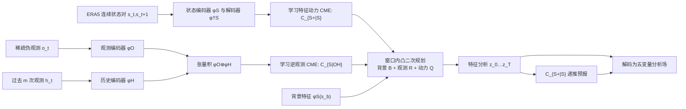

# Tensor-Var：在学习到的特征空间做凸四维变分同化

> Yiming Yang、Xiaoyuan Cheng、Daniel Giles、Sibo Cheng、Yi He、Xiao Xue、Boli Chen、Yukun Hu，*Tensor-Var: Efficient Four-Dimensional Variational Data Assimilation*，ICML 2025，PMLR 267:70649–70679。[正式书目](https://proceedings.mlr.press/v267/yang25h.html)；[2025-01-23 首发、2025-06-13 更新的 arXiv v3 全文（含附录）](https://arxiv.org/html/2501.13312v3)。本笔记于 2026-09-24 对照官方书目及 v3 的方法、表 1–3、图 1–5、附录 D/E 和图 9–12；**没有取得正式 PMLR PDF 的逐页核对**，如正式排版与 v3 后续存在差异，须以正式版复核。

## 一、研究问题、贡献以及最重要的证据边界

传统 4DVar 在一个时间窗内调整分析场，使背景、各时次观测和动力演化尽量一致。把复杂非线性预报器放进目标函数，会产生昂贵且非凸的状态优化；观测只覆盖状态一小部分时，直接反演也可能不确定。Tensor-Var 的核心想法是先学习一个状态特征空间，让“一步动力”和“当前观测加过去观测到状态”的映射在此空间可由线性算子近似，然后求解关于整段特征状态的**二次规划**，再解码回气象场。[§2–3](https://arxiv.org/html/2501.13312v3)

它的主要贡献是**同化方法**，而不是一个以 10–15 天技巧为主结果的预报基础模型。全文确实包含从同化终态出发的预报图，但附录图 10 有一个不能略去的冲突：图注称覆盖 **15 天**，实际已核查的 Z500 面板横轴写“每 6 小时”且止于 **30 步**，按坐标只能读成 **7.5 天**。本笔记因此不把该图无条件当成第 15 天技巧证明；其卫星轨道实验明示评分到 **7 天**。[附录 E.3 图 10、§4.3、附录 E.4](https://arxiv.org/html/2501.13312v3)

更重要的是，所谓“卫星观测”实验只用了**真实卫星轨道位置**；在这些位置上的气象数值由 **ERA5 网格抽样并加噪**产生，不是原始辐射亮温，也没有仪器前向算子与偏差订正。论文摘要的“real-time observations”不能解释成已经验证真实业务卫星观测输入。[§4.3、附录 E.4.1](https://arxiv.org/html/2501.13312v3)

## 二、数据、预处理和三种不同的实验协议

| 实验 | 状态/观测怎样生成 | 训练、测试及评分边界 |
| --- | --- | --- |
| Lorenz-96 和 Kuramoto–Sivashinsky（KS） | L96 状态维度 40/80、观测维度 8/16；对状态先稀疏抽样，再用 `5 arctan(sπ/10)` 非线性映射与白噪声。KS 有 128/256 维，附录记每 8 个位置采一处并施加同类非线性映射；KS 由 ETDRK 数值积分产生，积分步长 0.001、取样间隔 0.01，100 条各 5000 步轨迹。 | 用于表 2 的同化 NRMSE、逐窗口耗时和历史长度/特征维数消融；**不能将这些 NRMSE 当全球天气评分**。正文称 L96 覆盖 20%，KS 正文称 25%，而附录“每 8 个位置”是 12.5%，故 KS 观测比例描述存在差异，复现前需查代码。 |
| 全球随机格点观测 | WeatherBench2 提供的 ERA5，五个单层量：`z500、t850、q700、u850、v850`，空间 **64×32**。随机抽 **15%** 网格点作为伪观测，每变量添加相当于其状态标准差 **0.01 倍**的噪声；ERA5 同时是训练状态和验证参考。 | 训练期写 **1979-01-01 至 2016-01-01**，约 **51,100** 个连续状态；测试期 **2018-01-01 至 2020-01-01**，约 **2,920** 个状态。2016–2017 如何分配给验证/调参没有完整表格。图 2 报逐变量分析 NRMSE 分布与 RTX 4090 时间，附录图 9 是 2018-01-01 的单例，图 10 展示非循环预报。 |
| 卫星轨道位置上的伪观测 | 从 **CelesTrak 轨道数据**取卫星经纬位置，投到 **240×121 ERA5** 最近网格；每次分析前 **2 小时**内最多每 **30 分钟**取样，平均覆盖约 **6%**（图 5 单例 **6.37%**）；将取到的 ERA5 数值加每变量标准差 **1%** 的白噪声。 | 变量和年份沿用随机格点实验。图 3 用 **10 组随机抽取的测试序列**比较逐 6h、到第 **7 天**的 NRMSE；附录图 11 评 ACC，图 12 作 2018 全年逐 6h 循环与 7 天 lead 试验。这仅有真实**轨道坐标**，没有真实卫星量测值。 |

数据处理最容易被漏写的是**观测生成与参考场同源**：尽管轨道位置相当真实，模型实际看到的仍是 ERA5 变量切片与人为噪声，不需要处理亮温偏差、云污染、通道权重、扫描几何或独立站网误差。全文给了网格、变量、噪声倍率和起止时间，但没有逐变量 ERA5 归一化均值/标准差、异常值处理、轨道插值和轨道列表的完整可复现实例；不可擅自补成“标准化到 N(0,1)”或“同化卫星辐射”。[§4.1–4.3、附录 E.2–E.4](https://arxiv.org/html/2501.13312v3)

## 三、结构和同化目标：线性的是特征空间近似，不是大气本身

设状态 `s_t`、当前观测 `o_t`，历史观测 `h_t`，神经编码器分别生成 `φ_S(s_t)`、`φ_O(o_t)` 和 `φ_H(h_t)`。两个关键条件均值嵌入（CME）算子是：

- **动力算子** `C_{S+|S}`：从连续状态对 `(s_t,s_{t+1})` 回归 `φ_S(s_t) → φ_S(s_{t+1})`。线性的是特征表示中的一步映射，误差仍由回归残差 `Q` 处理。
- **逆观测算子** `C_{S|OH}`：将当前与历史观测编码作张量/克罗内克积 `φ_O(o_t) ⊗ φ_H(h_t)`，回归到 `φ_S(s_t)`。历史信息用于缓解单时刻稀疏观测无法决定完整状态的问题。
- **回投影** `φ†_S`：把优化得到的特征状态解码为原始五变量场。使用普通核特征时附录也给线性 pre-image 投影；全球实验使用学习到的深度特征。

令待优化变量是整个窗口的 `z_0…z_T`，代价函数含背景残差 `||z_0−φ_S(s_b)||²_{B⁻¹}`、每时次逆观测残差 `||z_t−C_{S|OH}(φ_O(o_t)⊗φ_H(h_t))||²_{R⁻¹}`，以及动力残差 `||z_{t+1}−C_{S+|S}z_t||²_{Q⁻¹}`。三项都是关于 `z_t` 的二次式，故在特征空间做凸二次规划；这一步优化**分析变量**，不是更新神经网络权重。附录 D 用训练集的逆观测残差估计 `R`、一步动力残差估计 `Q`，`B` 则用特征状态方差近似；作者自己指出长循环中更合理的 `B` 应随时间更新。[§3.1–3.2、附录 D.1 与算法 3](https://arxiv.org/html/2501.13312v3)

上图根据[原文图 1、§3 与附录算法 1/3](https://arxiv.org/html/2501.13312v3)原创重绘，非复制论文原图。理论上的解一致性还有前提：状态空间紧致、原目标有唯一解、动力与特征映射可微等；**并非任意有限维编码器、有限训练数据、任意长滚动都获得无条件保证**。作者在理论比较后也承认特征映射带来额外误差。[§3.3 与附录 C](https://arxiv.org/html/2501.13312v3)

## 四、网络层次、训练、公开参数与微调

全球气象编码器不是一个没有说明的“通用 Transformer”。附录表 6 的状态分支为 `Conv2d C→4C`，然后在 `H/2` 处 **2** 个、`H/4` 处 **3** 个、`H/8` 处 **3** 个 Transformer block，展平并投到 `d_s`；解码器为对应的 **3→3→2** 个 block 和输出卷积。观测分支使用 `Conv2d C→2C`、**2+3** 个 block 后投到 `d_o`；历史分支从 `mC` 输入，经相同 **2+3** 分支投到 `d_h`。表中使用 ReLU，并说明 block 设计沿用所引视觉 Transformer/DA 实现；表 6 最后的历史分支标签重复写作 `φ_O`，这里按输入 `mC` 与输出 `d_h` 才将它解释为 `φ_H`，**属对原表的结构判断**。[附录 E.6 表 6](https://arxiv.org/html/2501.13312v3)

| 阶段 | 实际训练/计算顺序 | 披露的参数与缺口 |
| --- | --- | --- |
| 1. 状态特征预训练 | 构造连续状态对 `D_dyn`，联合学习 `φ_S` 和解码器 `φ†_S`；损失是特征空间一步线性动力误差 + 权重 `w` 的状态重建误差；在 batch 上估计动力算子，训练完再存完整数据上的算子。 | 附录统一写 **Adam、200 epochs、batch 256–1024**；有重建系数 `w∈(0,1]`，但未提供全球实验具体 `w`、LR、权重衰减、随机种子、实际使用的 `d_s` 与参数量。 |
| 2. 观测/历史特征训练 | **冻结第一阶段状态特征**，由 `D_obs=(s_t,o_t,h_t)` 训练 `φ_O` 和 `φ_H`，使张量积经 `C_{S|OH}` 接近已冻结的状态特征；训练后确定逆观测算子。 | 同样给 **Adam、200 epochs、batch 256–1024**；没有逐气象配置的历史长度 `m`、`d_o/d_h`、各自学习率、窗口批次具体采样规则或训练时长。L96 的 `m` 消融不应移作全球最优 `m`。 |
| 3. 误差协方差与测试时同化 | 用训练残差估计 `B/R/Q`；测试时固定所有编码器和两个 CME 算子，用 **CVXPY 内点法**求解特征空间 QP，再解码、递推。基线用 **JAX L-BFGS**，Hessian 近似保留 **10** 个历史向量。 | 作者报告训练硬件 **48 核 AMD 7980X + RTX 4090**。未给全部 solver 容差、训练/测试内存、全球问题每窗口 wall time 的完整可重建数表；不能把 QP 优化误说成网络微调。 |

**微调是否存在？** 有“第二阶段在固定状态编码器后训练观测与历史分支”，这是分阶段训练、可视作在既有状态表示上适配观测输入；但没有将整个大模型在 HRES/真实卫星上再微调，也没有 LoRA、冻结/解冻 schedule 或一个业务 checkpoint。更精确的说法是：**状态特征预训练 → 冻结状态分支 → 观测分支适配训练 → 测试时只优化分析变量**。附录算法 1 以联合形式示意更新，但文字版“Training details”明确规定两阶段及冻结状态特征；本笔记以该实施说明为准。[§3.2、附录 E「Training details」、算法 1](https://arxiv.org/html/2501.13312v3)

## 五、图表与性能：数字、图形趋势、对照条件分开读

### 5.1 可以直接抄核的数表：玩具动力系统，不是全球天气

原文表 2 单位是 **NRMSE %** 与 **每窗口耗时 ×10⁻² 秒**，这里选两个有代表性的任务；所有值均是原表均值±标准差。其标题明确：**基线采用强约束 4DVar 目标，Tensor-Var 采用弱约束目标**，这使速度和误差差异并非单一模块的完全等条件消融。[表 2](https://arxiv.org/html/2501.13312v3)

| 任务 | 方法 | NRMSE % | 耗时（×10⁻² 秒） |
| --- | --- | ---: | ---: |
| L96，40 维，8 观测维 | 3DVar | 14.17±0.93 | 12.59±0.39 |
| 同上 | 4DVar，无伴随 | 12.27±1.41 | 210.52±3.87 |
| 同上 | 4DVar，有伴随 | 12.18±1.46 | 33.78±2.11 |
| 同上 | Frerix et al. 2021 | 9.89±1.63 | 167.43±1.33 |
| 同上 | Tensor-Var | **8.32±0.87** | **12.51±1.97** |
| KS，256 维，64 观测维 | 4DVar，无伴随 | 10.67±0.62 | 99.68±2.35 |
| 同上 | Frerix et al. 2021 | 8.87±0.55 | 71.39±1.23 |
| 同上 | Tensor-Var | **4.31±0.19** | **21.37±1.36** |

以 L96 40 维为例，Tensor-Var 对**无伴随** 4DVar 的耗时比约 `210.52/12.51≈16.8`，符合摘要的 10–20 倍量级；但对**有伴随**版本约 `33.78/12.51≈2.7`，对 3DVar 几乎没有速度优势。不能写成“所有同化基线均快 10–20 倍”。

表 3 的历史消融也只在 L96 上做。`C=0/1/2/4/8` 时，40 维 NRMSE 依次 **11.7/9.3/7.7/7.7/7.5%**，80 维是 **10.8/8.2/7.4/7.1/7.0%**（均值）；到 `C≈4` 后边际收益很小。特征维数消融中，40 维任务 `d_s=20/40/60/120` 分别为 **16.7/14.1/8.3/9.7%**，高斯核 **8.4%**；说明增加表示维数不是单调增益，且该表没有给全球 ERA5 的逐维消融。[表 3 与附录 E.5](https://arxiv.org/html/2501.13312v3)

### 5.2 全球天气图与真实含义

| 原文图 | 可核对的内容 | 不能推出什么 |
| --- | --- | --- |
| 图 1 | 原状态空间非线性同化 → 特征空间中线性动力与逆观测；对应上文原创结构图。 | 演示图不提供业务真实性、独立观测验证或数值成绩。 |
| 图 2、附图 9：64×32 随机观测 | 图 2 为五变量分析 NRMSE 分布，Tensor-Var 的均值/分布优于 Latent 3DVar/4DVar，右侧给 RTX 4090 的时间条形；附图 9 给 2018-01-01 场图，展示背景、伪观测、ERA5 参考和分析误差。 | 图上没有随文原始数值表，不能反推每变量的精确 RMSE 百分比或每窗口毫秒数。分析成绩不等同一条 15 天预报曲线。 |
| 图 3–5、附图 11：240×121 卫星轨道 | 图 3 十条随机测试序列、逐 6h 到第 7 天 NRMSE；图 4 是真实轨道点分布；图 5 在 2018-01-01 Z500 例中覆盖 6.37%；附图 11 用 5 步同化窗给五变量到第 7 天 ACC，与 FengWu-4DVar 比较。 | 气象值是 ERA5 抽样伪观测，不是 FY/GOES 实际亮温。附图 11 没有可抄核的逐时次数字表，不能编造优势百分点。 |
| 附图 10：同化后非循环预报 | 正文指向这张五变量平均纬度加权 RMSE 图；图注称“15-day in total”，已核查的 Z500 面板横轴从 0 到 30 且标为“per 6 hours”。 | **图注 15 天与图轴 30×6h=7.5 天冲突**；在正式版/作者澄清前，不能把该图写成已证明第 10–15 天技巧。即使图注正确，也未提供同尺度 IFS/AIFS 等第 15 天公平对比数表。 |
| 附图 12：2018 一年滚动 | 五变量、240×121、6h 更新、5 步同化窗、7 天 lead；作者称前期多数时段 Tensor-Var 的分析/预报误差低于 FengWu-4DVar，但**约 800 次同化后出现不稳定**，后者维持稳定。 | 这是一年**反复同化**的运行，不是一条长达一年的开放预报；“较快/较准”不能遮盖后段失稳，作者认为线性动力在长时积分的表达力不足。 |

附图 10 的横轴判断基于[官方 HTML 中的 Z500 原始面板](https://arxiv.org/html/2501.13312v3/Figures/geopotential.png)；这里只链接原图，仓库不复制图像。其他图没有可精确摘取的数据表时仅记可观察的方向、时效与测试条件。[§4、附录 E.3–E.4](https://arxiv.org/html/2501.13312v3)

## 六、局限、与同类工作的关系和复验清单

1. **分清“真实位置”和“真实观测”**：CelesTrak 的轨道经纬是真实，ERA5 网格伪观测不是真正的传感器辐射。若要和[FuXi-DA](69-fuxi-da.md)的 FY-4B/AGRI 八亮温通道比较，必须在同样的真实卫星资料、质控、空间网格、误差模型与样本期下重新实验；现有论文不能直接排名。
2. **分清迭代同化与中期技巧**：附图 12 的“一年”是周期性吸收观测，且约 800 次后失稳；图 10 的“15 天”有图注/横轴冲突。要回答第 10–15 天问题，需作者澄清步长、提供第 40/60 个 6h lead 的预测、多个季节起报的 ACC/RMSE 和同分辨率同初值基线。
3. **公平比较强/弱约束目标**：表 2 的基线与 Tensor-Var 不同目标，也有是否显式伴随的速度差。应补一个同样 `Q` 与历史信息的基线，以区分“特征线性化”“弱约束”“历史逆观测”各自的增益。
4. **复现缺口**：需要准确的五变量单位/归一化、全球 `d_s/d_o/d_h/m`、LR、batch 具体取值、重建权重 `w`、CME 岭参数 `λ`、QP 容差、轨道清单和 2016–2017 使用方式。本文只给范围或算法符号时，不应虚构唯一值；附录 D 的固定 `B` 对长循环可能不合适。
5. **理论与实现分层**：凸性是**给定训练好的特征及线性算子时**关于 `z` 的二次目标；训练编码器本身仍非凸，有限维特征可能无法完全对应原状态，理论一致性需要其明示假设。若实用部署要从原始观测直接学习动力/观测模型，作者在局限段也承认还未做到。[§3.3、§5 与附录 C/D](https://arxiv.org/html/2501.13312v3)

我的阅读判断：这篇工作值得收录，因为它提供一条**把学得的气象场表示、观测历史和同化优化分离**的路径，时间复杂度优势在部分基线上也有数表支撑；但最强的验证仍是 ERA5 合成观测，同化后的第 10–15 天技巧证据存在坐标冲突，长循环有明确失稳反例。因此它应归入**同化目录**，与 [FengWu-4DVar](70-fengwu-4dvar.md) 和 [FuXi-DA](69-fuxi-da.md) 对照阅读，而不能冒称已解决真实卫星到两周预报的业务问题。

[返回首页](../../README.md) · [返回总表](../../气象大模型_中期预报论文追踪.md)
