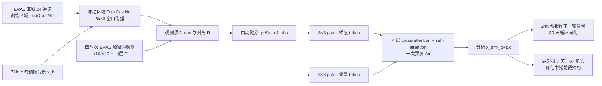

# 4DVarFormer：用四维变分观测梯度驱动区域分析场，再启动七天预报

> Wuxin Wang、Jinrong Zhang、Qingguo Su、Xingyu Chai、Jingze Lu、Weicheng Ni、Boheng Duan、Kaijun Ren，*Accurate initial field estimation for weather forecasting with a variational constrained neural network*，*npj Climate and Atmospheric Science* **7**, 223，2024-09-30。[正式开放论文](https://www.nature.com/articles/s41612-024-00776-1)；[正式 15 页补充材料](https://media.springernature.com/original/springer-static/esm/art%3A10.1038%2Fs41612-024-00776-1/MediaObjects/41612_2024_776_MOESM1_ESM.pdf)；[作者代码](https://github.com/wuxinwang1997/4DVarFormer)。本笔记于 2026-09-24 核对正式正文图 1–14、补充材料表 S1–S4 和图 S1–S9；原图只链接，不转载。论文属于**同化**主问题，公开的预报测试只到 **7 天**。

## 一、问题、创新和三个实验对象的区别

作者希望不用业务 4DVar 的显式伴随和巨大背景误差协方差求逆，也能从有误差的背景场与少数观测恢复 24 变量区域初始场。其 4DVarFormer 先用冻结的 FourCastNet 在同化窗口内计算**观测项相对背景场的梯度**，再把梯度与背景场送进四层 cross-/self-attention 网络，直接给出分析增量。核心并非从零同时训练观测、同化、预报全部模块，而是**先训练区域预报器，再监督训练一个单步同化器**。[正式论文图 14、方法](https://www.nature.com/articles/s41612-024-00776-1)

全文至少有三种不同长度，不可混写：**24 小时**是默认同化窗口（00/06/12/18 等四个观测时次）；**30 天**是每天反复吸收伪观测的循环试验长度；**7 天**是单次分析场作为初值后的 FourCastNet 开放预报。2021–2022 测试按五天间隔挑了 **139 组**，既考核 30 天循环也考核 7 天预测。任何“30 天预报优于基线”均误读了循环横轴；也没有第 10–15 天技巧验证。[正文「Results」、补图 S4](https://www.nature.com/articles/s41612-024-00776-1)

第二个边界是**观测系统模拟实验（OSSE）**：观测变量从 ERA5 抽取并加人为噪声，不是实时台站或原始卫星。第三个边界是**区域性**：100°E–140°E、10°N–50°N 的东亚 `160×160/0.25°` 数据，不是全球 0.25° 的 FourCastNet 或全球业务同化系统。[正式论文「Datasets」](https://www.nature.com/articles/s41612-024-00776-1)

## 二、ERA5 数据、观测生成、训练/测试切分

| 角色 | 原文可核实的具体做法 | 解释与缺口 |
| --- | --- | --- |
| 区域真值/标签 | ERA5 六小时间隔的东亚 **160×160** 子区，2010–2019 **14,600** 样本训练、2020 **1,460** 验证、2021–2022 **2,920** 测试。五类高空气象量 `Z、T、U、V、R` 各取 **50/500/850/1000 hPa** 共 20 场，另有 `T2M、U10、V10、MSLP` 四地表场，总 **24 通道**。 | 文中按 `365×4×年份` 计算，未详述闰日怎样处理；不自行把 2020 的实际 366 天推成 1,464 样本。ERA5 同时作监督目标与误差参考，非独立仪器真值。 |
| 训练期背景场 | 区域 FourCastNet 从 ERA5 状态起报，模型训练和默认同化器输入使用**提前 72h 的预报背景**；每组 30 天循环的首个背景也由 ERA5 提前 72h 起报。 | 后续循环背景来自上次分析场的 **24h** FourCastNet 预报，不能误写成每天都重取 ERA5。训练背景为 3 天 lead，4/5 天背景的测试是分布外敏感性实验。 |
| 同化伪观测 | 使用 `U10、V10` 与 `T50/T500/T850/T1000` 六变量。10m 风先由 ERA5 的 U/V 转为风速、风向；风速 <20m/s 加标准差 **2m/s** 高斯噪声，≥20m/s 加标准差为风速 **10%** 的噪声，再反变换为 U/V。四层温度对应误差标准差 **2/0.5/1.4/2.2 K**。默认同化窗 24h，6h 间隔四个观测时次。 | 这里是格点全覆盖式理想化伪观测，正文 `R` 的每变量块为 **25,600** 点；不是散乱站点、卫星通道或云区缺测。正文在温度扰动句误写“simulate relative humidity observations”，但后文矩阵 `R` 与输入列表均明确为 **T50/T500/T850/T1000**；本笔记按后者并保留矛盾。 |
| 评估 | 分析场与 7 天、6h 一步的区域预报都用 ERA5 参照，报纬度加权 RMSE、ACC；台风个例用 IBTrACS 路径。 | 139 组不等于 139 个独立年份，也不等于全球样本；两个台风路线图不能替代全样本路径误差统计。 |

上述切分与数据处理据[正式正文「Datasets」「Model training strategy」](https://www.nature.com/articles/s41612-024-00776-1)和[补图 S4](https://media.springernature.com/original/springer-static/esm/art%3A10.1038%2Fs41612-024-00776-1/MediaObjects/41612_2024_776_MOESM1_ESM.pdf)。正文没有发布可直接使用的逐变量归一化均值/标准差、噪声随机种子和所有质量控制细节；代码仓库可辅助再核，但本笔记不把未核实的代码默认值填成论文设置。

## 三、结构：用预报器求观测梯度，网络近似一次 4DVar 更新

经典 4DVar 代价有背景项和窗口内各时次观测残差项。论文推导了观测代价对当前背景场的梯度 `g=∇_{x_b}J_obs(x_b)`；先从 `x_b(t₀)` 用区域 FourCastNet 推出接下来三个 6h 状态，以预报状态和对应四组伪观测构造 `J_obs`，然后用 PyTorch 自动微分得到 `g`。观测误差矩阵 `R` 是六个变量的**对角块**，每块大小对应 160×160 网格；并未显式统计或求逆完整背景协方差 `B`。从传统解式中应施加在梯度上的 `B`、切线模型及观测算子所组合的复杂更新，交给网络**学习近似**。[正式正文式 (1)–(3)、图 14](https://www.nature.com/articles/s41612-024-00776-1)

网络分别把 **24 通道背景**和**24 通道梯度**切成 `8×8` patch，投到 512 维表示。四层 block 每层为多头交叉注意力、前馈、多头自注意力、前馈；交叉注意力将背景 token 与梯度 token 融合，末尾线性投影成 24 通道增量 `Δx`，输出 `x_a=x_b+Δx`。其“非迭代”指测试时网络一次前向生成分析，不是训练没有梯度，也不是完全无数值预报调用：计算 `g` 仍需多步冻结 FourCastNet 以及自动微分。[方法段、补表 S2](https://www.nature.com/articles/s41612-024-00776-1)

这是依据[正文图 14、补图 S4](https://www.nature.com/articles/s41612-024-00776-1)原创重绘。需要注意作者称“4DVar 约束”是通过**观测项梯度作为网络输入**和监督目标发挥作用，而非每次推理完整求解原 4DVar 最优点。模型仍依赖由 ERA5 训练的区域预报器和由 ERA5 生成的监督标签。

## 四、完整训练与微调：区域 FourCastNet 与同化网络分开

| 阶段 | 论文及正式补表给出的参数 | 未公开/不能混淆之处 |
| --- | --- | --- |
| **区域 FourCastNet 预训练** | 官方 FourCastNet 代码作底，改为东亚 `160×160`、24 输入/输出通道；**patch 8×8、embedding 768、深度 6、MLP ratio 4、number of block 8、谱稀疏阈 0.01、hard threshold fraction 1.0**。AdamW `β=(0.9,0.95)`、LR `5e−4`、cosine `T_max=120, eta_min=1e−8`、L1 loss、batch **64**、单 V100；最初 **80 epochs 单步 6h 预报**。 | 这里不是直接使用原全球 12 层检查点；作者为省内存把深度从 **12 改为 6** 后在区域资料上重新训练。补表同时有 `depth=6` 与 `number of block=8` 两行，二者结构含义没完全解释，不能自行合并为“8 层”。 |
| **区域 FourCastNet 两步微调** | 继承前 80 epochs 权重，再 **40 epochs 两步预报训练**，合计 **120 epochs**；其他公开设置沿补表 S1。完成后用于 4DVar 梯度计算，也用同一预报器做评估期 7 天 rollout。 | 本文实际有明确的**多步微调**，不能写“从头到尾只单步训练”；但未列四十轮的单独 LR 或参数冻结方案，不应捏造。 |
| **4DVarFormer 监督训练** | 背景和梯度各 24 通道，patch **8×8**、embedding **512**、**4** 层、**8** attention heads、MLP ratio **4**、dropout 和 embedding dropout 各 **0.1**。AdamW `β=(0.9,0.95)`、初始 LR `5e−4`、cosine `T_max=100`、**100 epochs**、batch **64**、**1×V100**。用分析场对 ERA5 的全通道格点 **L1**，逐 epoch 验证，保存最小验证损失权重。 | 它不是对已训全球模型做少量 LoRA 微调，而是独立训练的区域同化网络。论文未在表 S2 提供最终参数量、WD 和逐变量归一化常数。测试时同化网络与预报器权重不更新。 |
| **基线公平性** | 4DVarNet 用 ConvLSTM 式 **10 次**迭代，Adam `1e−3`、batch 64、100 epochs、**2×V100**；ViT 用 **16×16** patch、embedding 768、深度 12、12 heads、AdamW `5e−4`、batch 64、100 epochs、**1×V100**。 | 4DVarNet 与 4DVarFormer 都用窗口四时次观测，ViT **只看起始时刻观测**；三者信息量不同。模型结构/硬件亦不同，性能差不应全归因于“4DVar 梯度”单一机制。 |

参数据[正式补充材料表 S1–S4、图 S2–S3](https://media.springernature.com/original/springer-static/esm/art%3A10.1038%2Fs41612-024-00776-1/MediaObjects/41612_2024_776_MOESM1_ESM.pdf)及[正文训练段](https://www.nature.com/articles/s41612-024-00776-1)。**微调区分**：FourCastNet 有实证的 80→40 epochs 两步预报微调；4DVarFormer 自身从监督数据训练，没有之后针对真实观测或全球应用的微调报告；同化测试只更新每次的分析场。

## 五、图表结果和性能表：只复述原文可核实的数值

原文在正文报告如下**整体相对改善**；这些是作者跨所测试变量/时次的汇总口径，不是某单一日、某个 Z500 网格或第 7 天的逐点百分比。[图 1、图 3 对应正文](https://www.nature.com/articles/s41612-024-00776-1)

| 任务（东亚区域、2021–2022） | 相对 4DVarNet | 相对 ViT | 不可外推之处 |
| --- | ---: | ---: | --- |
| **30 天循环同化**，分析场 RMSE | 低 **34.6%** | 低 **43.2%** | “30 天”是多次同化的运行长度，不是预报 lead。 |
| 同上，分析场 ACC | 高 **10.9%** | 高 **20.2%** | ViT 只获得起始时刻观测，不是四时次同输入比较。 |
| **单次同化起报 7 天**，预报 RMSE | 低 **10.7%** | 低 **13.6%** | FourCastNet/ERA5 区域 OSSE，不是全球或真实观测业务结果。 |
| 同上，预报 ACC | 高 **8.5%** | 高 **11.8%** | 正文图 3 只有 6–168h，不能写 10–15 天。 |

| 图或补图 | 证据怎样读 | 反面/版本边界 |
| --- | --- | --- |
| **正文图 1–3、补图 S4–S6** | 图 1 显示 139 组 30 天分析场的 RMSE/ACC；图 2 的 2021-07-19 台风个例对比背景、三方法、ERA5；图 3 显示 139 组从各方法分析场起报的 7 天曲线。S4 明确循环与一次起报流程，S5 给四种高空量误差剖面，S6 的功率谱显示 ViT 增量有高频异常。 | 分析地图可见网格/平滑痕迹；正文并未给图 3 每个 lead 每个变量的精确数值表。S6 的谱诊断不是独立台站检验。 |
| **正文图 4–7**：分变量观测敏感性 | 只同化 10m 风时，4DVarFormer 的 Z500/Z850 分析增量比 ViT/4DVarNet 更对应背景误差；只同化四层温度时，R500/R850 的空间结构修正更明显。 | 相比全部六观测量的对照组，单类观测输入的技巧**下降**；这些是观测变量消融加个例图，不能说仅风或仅温度已达到完整观测的效果。 |
| **正文图 8、补图 S9**：背景 lead | 训练只用 3 天背景；测试也放入 4/5 天背景，平均 7 天预报成绩仍接近 ERA5 初值线。 | 5 天背景的分析偏差**最大**，作者承认对训练背景分布依赖，不能说所有背景质量不敏感。 |
| **正文图 9–10**：同化窗 | 6/12/18/24h 的 DAW 逐级加入更多时次，较长窗口的分析和随后的 7 天预报通常更好。6h 窗只看起始时次，是剥去时间约束的对照。 | 图 10 图注有“6-day DAW”等与正文 6h 冲突的文字，并把红色列两次；以正文明确的 **6/12/18/24h** 设定为准，图注颜色不自行修正。 |
| **正文图 11–14**：台风、注意力与结构 | Surigae/Chanthu 两个 2021 个例共展示 **5 天**轨迹；图 12/13 为最后一层 400×400 cross/self-attention 权重，图 14 为计算图。 | 两个台风的路径示意不构成大样本台风优势；FourCastNet 在 ERA5 初值下也不能很好预测所有路径，作者有明说。注意力“近满秩”只是表示多样性线索，不证明气象因果。 |

正文声称分析约 **0.37 秒**，与所引传统 4DVar 约 **25 分钟**相比写成“约 4000 倍”。两者不是同一硬件、网格、观测输入、算法误差阈值的规范 benchmark；而且 0.37 秒是否包含用于求 `g` 的全部预报器与自动微分成本，正文未逐项分解。应把此数字视为作者特定实验的推理成本报告，不是业务全球 4DVar 加速实测。[正文图 2 附近讨论、方法](https://www.nature.com/articles/s41612-024-00776-1)

## 六、与同化/中期路线的关系、局限和下一步

4DVarFormer 与 [FengWu-4DVar](70-fengwu-4dvar.md) 都利用可微 AI 预报器引入窗口内动力，但前者**监督学一次分析增量**，后者**每次用 L-BFGS 直接优化控制量**；前者是东亚 24 场和 7 天测试，后者是较低分辨率全球 69 场与固定掩码一年循环，不能把两者百分比横向排榜。与 [FuXi-DA](69-fuxi-da.md) 的真实 FY-4B 亮温入口相比，4DVarFormer 仍是 ERA5 同源伪观测；与 [Tensor-Var](71-tensor-var.md) 相比，它没有把优化变成特征空间凸 QP，而是将原代价观测梯度作为网络特征。

复验/升级必须先确认五件事：一是 2020 闰日怎样变成表述的 1460 条验证样本，以及逐变量预处理和误差尺度；二是实际使用的 FourCastNet 6 层/“number of block 8”结构和训练检查点；三是检验 `0.37s` 是否计入 4DVar 梯度的三步前向/反向；四是给 ViT 也提供同样四时次观测，做梯度有无、attention 有无的匹配消融；五是换真实、稀疏且有缺测的站/卫星资料与全球区域后，再独立验证第 10–15 天。作者自己提出跨 patch 不连续、网格伪影、预报器自动微分耗 GPU 内存、对训练背景分布依赖；这些都直接影响业务扩展。[正文「Discussion」与补图 S6–S9](https://www.nature.com/articles/s41612-024-00776-1)

我的阅读判断：这篇论文有价值的证据是**观测项梯度和注意力共同传递跨变量信息**，并通过七天预报说明分析场并非只在零时效漂亮；补表又把预报器的真实两阶段训练和同化网络超参交代得比许多方法论文完整。但它是东亚区域、ERA5 伪观测、七天前段验证，速度比对和不同观测数量的 ViT 对照需谨慎，不能据此宣称已经实现“真实卫星到全球两周预报”。

[返回首页](../../README.md) · [返回总表](../../气象大模型_中期预报论文追踪.md)
