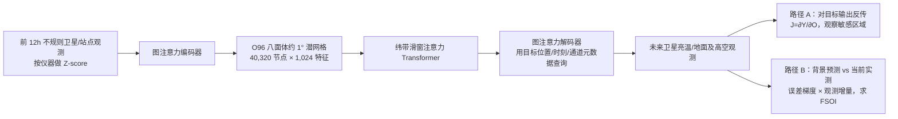

# GraphDOP 的同化诊断：观测敏感度、FSOI 与“有害”卫星通道

> Patrick Laloyaux、Mihai Alexe、Eulalie Boucher、Peter Lean、Ewan Pinnington、Simon Lang、Tobias Necker、Anthony McNally，*Using data assimilation tools to dissect GraphDOP*；ECMWF；[arXiv:2510.27388v1](https://arxiv.org/abs/2510.27388)，**2025-10-31** 提交；[正文、公式、附录表 1 与图 1–7](https://arxiv.org/html/2510.27388v1)。这是 **GraphDOP 的观测影响/可解释性研究**：使用同化领域的 FSO/FSOI 工具，但**没有提出或运行一套新的循环同化系统**，更没有把 FSOI 改进等同于第 10–15 天预报技巧。归入“同化”目录是按核心诊断方法，而非声称完成同化。[原文 §1–2、§5](https://arxiv.org/html/2510.27388v1)

## 一、作者要回答的两个不同问题

第一，**可解释性（interpretability）**：一个观测值通过编码图、O96 潜网格和滑窗注意力，怎样影响别处、别时刻的输出？作者以克格伦岛的 ATMS 温度通道和登陆爱尔兰的风暴为例，反传得到输出对输入亮温的局部导数，检查敏感区是否随训练与 lead 呈合理的空间移动。第二，**解释性/观测价值（explainability）**：哪类观测使定义好的预报误差下降或上升？作者把经典预报敏感度观测影响 **FSOI** 改写到 GraphDOP 的观测空间，用 2023 年两个月的数据比较微波、红外和探空/地面资料。[§3–4](https://arxiv.org/html/2510.27388v1)

这两者不是同一种证据。输入梯度说明**某个输出对局部输入扰动敏感**，不等于该观测在实际样本上减少误差；FSOI 把“前一 12h 窗预测”与“当前真观测”之间的增量及误差梯度相乘，估算对指定预报误差的影响，但又不等于真正删掉仪器后重新训练或运行的 OSE。特别不能把图 3 的百分数当成“ATMS 让十天 RMSE 改善了 X%”。[§3、公式 2–3、§5](https://arxiv.org/html/2510.27388v1)

## 二、数据来源、处理与与其他 GraphDOP 变体的切分

| 角色 | 本稿明确列出的资料 | 时间、字段和不能混淆的地方 |
| --- | --- | --- |
| 微波输入/输出 | NPP ATMS：表面通道 1–4、16、17；温度探测 5–15；水汽 18–22。NOAA-20 ATMS 同通道分组。 | NPP 的附表供数期 **2013–2022**，NOAA-20 为 **2018–2022**。通道 6 在图 1 用于对 2m 温度的敏感度；通道 20 在图 2 用于水汽—气压敏感区；通道 22 在图 3–4 的全球 FSOI 较有利，但通道 4、17 为不利。 |
| 红外输入/输出 | MetOp-B IASI 温度探测选用通道 1–10、地表敏感 11–13、水汽 14–18。 | 表列 **2013–2022**；图 6 的 **wavenumber 756** 是作者指定的一个 IASI 光谱点/通道，不要把它误写成“表中的第 756 个训练字段”。图 5 为可读性没有绘制所有红外列。 |
| 常规地面、海上与浮标 | 自动/人工/BUFR 陆地 SYNOP、SHIP、METAR，`ps/t2m/rh2m/u10/v10`；DRIBU/漂流浮标 `ps/SST`。 | 各种产品附表供数期约 **2013–2023**，BUFR 陆地/船舶从 2014、BUFR 漂流浮标从 2016。供数期包括 2023 **不表示这些年份都进训练**。 |
| 高空站、船与投落送 | TEMP/BUFR TEMP 与 dropsondes 在标准气压层的 `z/t/u/v`。 | 表列约 **2013–2022**；图 5 的误差目标分 `100/150/200/250/300/400/500/700/850/925 hPa`，图 6 聚焦南极沿岸站 **850 hPa 温度**。 |

这是一版**有意缩小资料类型**的 GraphDOP：作者明确说训练观测期为 **2013-01-01 至 2022-01-01**，以便在一节点 **4×NVIDIA A100** 训练、单 GPU 运行梯度诊断；2022 年风暴案例和 **2023-01-01 至 2023-03-01** 的 FSOI 统计用于展示。文章没有给逐仪器有效样本数、训练/验证的更细切分、卫星质控阈值、缺测填补、时间匹配容差、通道级权重或标准化均值/方差表。唯一明确预处理是把数据做**标准 Z-score（零均值、单位标准差）**，雅可比/敏感度在这一**归一化空间**计算；不同通道原单位的导数或贡献不能拿归一化值直接相除比较。[§2–4、附录 A 表 1](https://arxiv.org/html/2510.27388v1)

必须与另三篇区分：[2024 GraphDOP 主模型](../medium-range/47-graphdop.md)用更广泛资料和不同训练期；[Lean 等表征研究](../nowcasting/76-graphdop-representations.md)另有单 SEVIRI 实验；[Boucher 等跨圈层研究](../medium-range/77-graphdop-coupled-earth-system.md)用 2000–2020 的多圈层观测。**本篇约 58M 参数/4 A100 是这套缩小诊断配置**，不能倒填到上述变体。[本稿 §2、§5](https://arxiv.org/html/2510.27388v1)

## 三、模型、训练与两条诊断路径

此图按[§2–4](https://arxiv.org/html/2510.27388v1)原创重绘。处理器约 **5000 万**可训练参数，编码器加解码器约 **800 万**；作者只说明加权 MSE 训练目标、图注意力前后端和滑窗注意力处理器，没有公布该配置的优化器、学习率/batch、随机丢观测比例、训练总步数、训练耗时、模型起始权重和冻结策略。图 1 展示 **1,500/9,000/50,000 次迭代时**的同一敏感度，不等于全文证明“训练恰好 50,000 步结束”。本文也没有报告新的预训练→微调阶段；诊断时只是**冻结模型参数、求输入梯度**，不是将 FSOI 用作训练损失。[§2–3](https://arxiv.org/html/2510.27388v1)

在传统 4D-Var 里，切线性/伴随模式给出预报输出对初值的雅可比；这里使用 PyTorch 自动微分的 **VJP**（向量–雅可比积）得到同类梯度。令 `e(x) = (M(x)-x_ref)^T C (M(x)-x_ref)` 为选定 lead `h` 的二次误差，`C` 选择变量或地区；标准 FSOI 的前后背景/分析两点伴随乘上增量。GraphDOP **本来就在观测空间**，因此作者把 `x_b` 定义成从前一个输入窗做出的 **12h 预测观测**，`x_a` 是当前窗的**实际观测**，不再经传统 Kalman 增益/显式观测算子转换。每条观测的增量与两点误差梯度的对应分量相乘，形成观测影响；**负值=降低定义好的预报误差，正值=增加误差**。这是局部线性化/选定误差函数下的归因，不是无条件因果贡献。[公式 2–3 与 §4](https://arxiv.org/html/2510.27388v1)

全局图 3 的 `C=I`，没有按各类观测的**目标数量**重加权，因此误差函数本身更受观测密集类支配；作者为比较各输入类，另对**每条观测**求平均 FSOI。图 5/6 改用只挑特定探空变量、气压层或南极地区的 `C`，得到的贡献顺序可能完全不同。即使标准化过，“每条输入观测平均贡献”“对全球混合目标的误差”“某一变量/地区的误差”也不是同一个量。[§4、图 3–6](https://arxiv.org/html/2510.27388v1)

## 四、逐图结果与数值边界

| 证据与实验协议 | 作者报告/图中可直接确认 | 限制与反例 |
| --- | --- | --- |
| **图 1，克格伦岛**：2023-01-01 的 +12h 站点 T2m 输出对 NOAA-20 ATMS ch6 输入亮温的导数，在 1,500/9,000/50,000 迭代检查。 | 注意力可传播纬带从约 **32–74°S** 扩到 **18–90°S**；训练后岛西侧上游输入的正负敏感度更明显，符合西风带的天气传播方向。 | 图中极多零敏感点是滑窗/有限网络感受野的结构约束，**不是**“零气象信息”；这里只检查一个时刻/地点/输出，也不能证明普适地学到 Navier–Stokes 方程。 |
| **图 2，Hurricane Martin**：2022-11-05/06/07 分别起报，统一对 11-08 爱尔兰气压输出；看 ATMS ch20 水汽通道对 +72/+48/+24h 的输入梯度。 | 越早起报，敏感区越向大西洋西侧低压/水汽结构扩展；+24h 更多靠近爱尔兰西侧当时风暴。 | 三个不同起报时刻、同一验证时刻，不是同一初值的 24/48/72h 信息衰减实验。作者自己将其与真实动力核类比称为仍需验证的推测。[§3](https://arxiv.org/html/2510.27388v1) |
| **图 3–4，全局 FSOI**：2023-01-01–03-01、+12h；按每观测平均，图 4 只显示每格 **>300 次**测量。 | 多类观测负贡献；ATMS 表面敏感 ch1/水汽 ch22 较有利，海洋等稀疏区地面气压有较大边际贡献；ch22 较强贡献位置靠输入窗末端。 | **ATMS ch4 与 ch17 为正 FSOI**，按本文误差函数反而有害；不能说“所有卫星通道都有益”。靠近输入窗末端更重要是作者推测，未做只保留早/晚资料的干预。 |
| **图 5，垂直/跨变量贡献矩阵**：100–925 hPa 的 `t/u/v/z` 探空误差目标，+12 与 +36h；同一两个月平均。 | 同变量同层探空输入的对角线明显；温度输入对风目标有非对角贡献；ATMS 温度通道 6–10 也有贡献，+36h 微波相对重要性更高。 | 暗色强度是**相对 FSOI**，不是逐层 RMSE 或显著性检验；图 5 **省略红外列**以保证可读，不能据此说 IASI 不重要。 |
| **图 6，南极沿岸 850 hPa 温度**：以少数绿点探空误差为目标，比较 +1 与 +4 天、同一两个月平均。 | +1 天原文例：相应探空约 **−3%**、IASI wavenumber 756 约 **−2%**、ATMS ch1 约 **−1%**；+4 天探空约 **+0.5%**，IASI 约 **−3%**、ATMS ch1 约 **−2%**。 | 正的 +0.5% 按定义是**增加**该目标误差，不应写成“探空仍改善 0.5%”。IASI 贡献近沿岸站，冰盖上信号弱；站点目标/样本覆盖影响结论，不能拓展成全球十天卫星优于探空。 |
| **图 7，创新量–FSOI 散点**：+12h 全球 u10 与加拿大北部 T2m 的归一化创新量。 | u10 近对称蝴蝶形，但极大创新量两尾的 FSOI 幅度反而降低；加拿大 T2m 图有方向不对称。 | 加拿大模型有约**零点几 K 冷偏差**：更冷观测可能加剧偏差/呈正 FSOI，较暖观测可能纠偏/呈负 FSOI。故正 FSOI 可能来自模型系统偏差，不能据单次符号将仪器判为“坏数据”。 |

以上数值只摘录[原文 §3–4、图 1–7 的明确文本](https://arxiv.org/html/2510.27388v1)，不把图中色条像素反推成伪精确分数。本篇最远的数值诊断为**四天**南极个例，主统计是 **12/36h**；没有可核实的 10–15 天技能曲线，也没有证明用 FSOI 自动删除 ch4/17 后模型会变好。

## 五、为什么这些发现重要、怎样复验

有用之处在于它把“多观测共用潜态”变成可检验的**输出—输入敏感图**和**逐类观测影响**：例如水汽敏感区会向上游风暴位置移动，而稀疏区的卫星信息到第 4 天仍能减少选定探空温度误差。这比仅看一张好看的预报云图更细。但 FSOI 的解释严格依赖参考真值、`C` 的变量/地域/观测数量口径、Z-score 统计、当前模型偏差以及线性化增量；它不能替代随机遮挡/重训某仪器、跨季节稳定性检验和独立站点/卫星验证。[§4–5](https://arxiv.org/html/2510.27388v1)

下一步可在**同一封存测试期**分别重跑全观测、遮挡 ATMS ch4/17、只留/去除末窗观测等 OSE，比较 12h–第 4 天多个变量/地区的独立误差；再把 FSOI 与有限差分、不同 `C` 和模型偏差订正后的结果对照，并检查正 FSOI 在不同季节是否稳定。这些属于**本文尚未执行的复现与改进建议**。作者明确把 FSOI 用作在线 QC 或删通道后的技巧验证列为未来工作，不能写成已实现的系统。[§5](https://arxiv.org/html/2510.27388v1)

[返回首页](../../README.md) · [返回总表](../../气象大模型_中期预报论文追踪.md)
