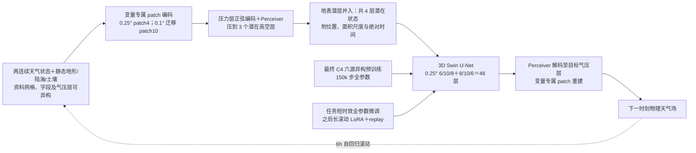

# Aurora：异构地球系统预训练如何迁移到中期天气

> Cristian Bodnar、Wessel P. Bruinsma、Ana Lucic 等，*A foundation model for the Earth system*，*Nature* 641, 1180–1187，2025-05-21，DOI [10.1038/s41586-025-09005-y](https://doi.org/10.1038/s41586-025-09005-y)。[正式 62 页补充材料](https://media.springernature.com/original/springer-static/esm/art%3A10.1038%2Fs41586-025-09005-y/MediaObjects/41586_2025_9005_MOESM1_ESM.pdf)、[官方代码与权重](https://github.com/microsoft/aurora)。本笔记以正式发表版本为准，2026-09-25 对照补充材料 B–E、H 与正文再次核验；以下结构图独立重绘，图表数字仅取作者明确印出的内容。

## 一句话结论

Aurora 不是一个“直接看原始观测、无须传统系统”的模型，而是**大规模异构预训练 + 每个任务微调**的地球系统神经模拟器。它在 0.25° 与 0.1° 天气任务中展示预训练迁移收益，也在空气质量、海浪和台风路径上给出跨任务证据；**正式论文主要天气结果到 10 天，不应沿用追踪表先前写的“约 14 天”**。92% 是被选定变量 × 层次 × 时效的比较目标占比，不是 92% 的预报事件都正确。[摘要、方法、图 5](https://www.nature.com/articles/s41586-025-09005-y)

## 1. 研究问题与为什么需要这种设计

传统地球系统任务常各自训练和维护模式，数据的变量、气压层、网格和时间分辨率也不同。Aurora 的研究假设是：先在超过一百万小时的再分析、分析、预报和气候模拟等异构资料上学习通用表示，再以较小代价改造成不同下游系统，可以同时获得迁移与计算效率。这里的“基础模型”不是由一个统一预训练评分证明，而是由预训练后的多任务适配与从头训练对照共同支撑。[引言、“Aurora”节](https://www.nature.com/articles/s41586-025-09005-y)

它把状态分为地表变量和多层大气变量，输入连续两个状态预测下一状态；长时效通过自回归地把预测喂回模型。这意味着预训练的一步误差只是起点，10 天技巧仍取决于滚动稳定性、微调数据以及初值质量。作者没有在本文建立全球概率集合的校准结论。[方法：Problem statement](https://www.nature.com/articles/s41586-025-09005-y)

## 2. 模型结构：异构输入先归一到潜在三维层结

编码器把不同变量视为图像并切 patch，用变量专属线性映射、层次标识和 Perceiver 聚合到**固定 3 个潜在气压层**；地形、陆海掩码、土壤类别作为静态输入。主干是 48 层、三级多尺度 3D Swin Transformer U-Net，以局部窗口注意力与窗口平移传播信息。解码器再把固定潜层转回任务所需的变量、真实气压层和空间网格。位置、patch 面积和绝对时间编码帮助在不同分辨率之间使用同一结构；“任意分辨率”仍须看训练与微调覆盖，不能推成零样本所有分辨率都准确。[方法：The Aurora model](https://www.nature.com/articles/s41586-025-09005-y)

以下是依据[原文图 1 与方法节](https://www.nature.com/articles/s41586-025-09005-y)的**原创重绘**，并非下载或转载原图。

## 3. 训练：预训练、短步微调与长滚动微调

预训练目标是 6 小时下一状态的加权 MAE，作者报告 150,000 步、32 张 A100，约 2.5 周；损失按地表/高空变量及数据集调整权重，而不是所有通道同权。下游先微调整个网络的一两个 rollout 步，再做长滚动微调。后阶段以 LoRA 适配主干注意力线性层，用 pushforward 技巧只对最后一步反传，并使用 replay buffer 暴露模型自己产生的状态，针对自回归时的分布偏移和显存限制。[方法：Training methods](https://www.nature.com/articles/s41586-025-09005-y)

这组设计值得与 FengWu 的 replay buffer 和 SOFT 的模型自输出微调对读：三者均处理训练时真实状态与部署时预测状态的差别，但架构、样本机制和损失不同。不能单凭 Aurora 表现把增益全归因于某一项，因为它同时改变了规模、预训练、微调数据与策略。论文称在 0.1° 任务上预训练相比从头训练平均改善 **25%**，这是更接近“预训练确有用”的消融证据。[高分辨率天气节](https://www.nature.com/articles/s41586-025-09005-y)

### 3.1 数据：候选清单、实际预训练组合与天气验证集必须分开

补充材料表 C3 罗列了用于**不同预训练消融配置**的十类来源，并不意味着最终权重把十类全部混合。作者在补注 C.2 明确写最终采用配置 **C4**：**ERA5、一天时效的 HRES-0.25 预报、一天时效的 GFS 预报、GFS T0、CMCC-CM2-VHR4 与 ECMWF-IFS-HR** 六源。前四种分别包含再分析、业务预报与业务零时次分析，后两种为 CMIP6 气候模拟；这正是“异构预训练”的具体含义。十源候选还包括 IFS-ENS、IFS-ENS 均值、GEFS 回报和 MERRA-2，但不能因表 C3 出现它们就说最终 C4 权重必定都见过。表 C3 所列源数据总体可达 **10.97 百万个时间步、约 1268 TB**，同样不是最终 C4 单次训练实际逐个读入量。[正式补注 C.1–C.3/表 C3](https://media.springernature.com/original/springer-static/esm/art%3A10.1038%2Fs41586-025-09005-y/MediaObjects/41586_2025_9005_MOESM1_ESM.pdf)

| 数据路线 | 论文披露的字段、网格与年份 | 训练/评测角色 |
| --- | --- | --- |
| ERA5 | 0.25°；表 C3 覆盖 **1979–2020**；地表 2T/U10/V10/MSL＋高空 U/V/T/Q/Z 的 **13 层**。 | 最终 C4 预训练源之一；也是各字段中心/尺度统计量的基础，**并非实时业务初值**。 |
| HRES-0.25 预报、GFS 预报/GFS T0 | 表 C3 分别为 **2016–2020、2015-02–2020、2015-02–2020**，主要天气变量与 ERA5 相同。 | 最终 C4 预训练引入业务模式偏差与零时次状态；两套**一天时效**预报子集，不能把所有可用预报时效都算入。 |
| CMCC-CM2-VHR4、ECMWF-IFS-HR | 两者均覆盖 **1950–2014**、7 个气压层；前者 0.25°、后者约 0.45°。 | 最终 C4 的气候模拟来源，增加年代/气候状态多样性，但不能单独证明业务时效技巧。 |
| 0.25° 天气微调/评测 | HRES T0 **2016–2021** 用于微调；**2022** 作测试，00/12 UTC 起报。 | 对同源 HRES T0 真值和业务/AI 对照，不能与 ERA5 回报直接合并。 |
| 0.1° 高分辨率天气 | HRES analysis **2016–2022** 用于微调；表 C5 的 **2023** 为正式测试年。 | 0.1° 业务分析初始化与验证；另对 13,000 多个 WeatherReal-ISD 站点检验地表温度/风。 |

每个地表变量及每个高空变量×气压层都按**全 ERA5 训练资料**的空间常数均值和标准差标准化，其他资料沿用这些天气变量统计量，输出再反标准化。编码器另接静态地表位势、陆海掩码、土壤类型；跨来源资料做变量名映射、NaN 检查、按来源组批，不能把不同数据集的样本无条件在同一张张量里混合。作者把大型数据切为 Zarr 等可按样本访问的块，压缩大数据并尽量把同一时刻的所有变量共存一块，云端加载器经多源采样→打乱→GPU 分片→解压/检查/组批，0.1° 单样本接近 **2 GB**。这属于公开的工程预处理；逐源重网格和缺测规则未在正文提供一份可直接复现实验的端到端命令。[正式补注 B.5、C、E](https://media.springernature.com/original/springer-static/esm/art%3A10.1038%2Fs41586-025-09005-y/MediaObjects/41586_2025_9005_MOESM1_ESM.pdf)

### 3.2 结构参数与 0.1° 分辨率适配不是零成本切换

主实验约 **13 亿参数**，编码器/主干第一阶段嵌入维度 **512**、后续下采样阶段维度翻倍；主干编码三级 **6/10/8** 层，解码三级 **8/10/6** 层，合计 **48** 层。每头维度 64，Perceiver 聚合有 **16** 个交叉注意力头；三层潜在高空 query 之外还有一层地表潜在表示。输入 patch 在 0.25° 时边长 **4**。Swin 采用局地 3D 窗口，补注 B.2 写实际实验使用 **2×12×6**，隔层平移；它对经度接缝做球面周期通信。位置、面积尺度和绝对时间编码分别处理地理位置、不同分辨率同样 token 的物理面积和日/年周期。[正式补注 B.1–B.4、B.9/表 B1](https://media.springernature.com/original/springer-static/esm/art%3A10.1038%2Fs41586-025-09005-y/MediaObjects/41586_2025_9005_MOESM1_ESM.pdf)

0.1° 迁移并非原样套用网络：patch 边长由 **4→10**，用双线性插值调整已学 patch 权重并按新旧 patch 比例缩放；编码器/解码器中层各删两层，层数变为 **6/8/8＋8/8/6（44 层）**。由于 0.1° 网格点数约为 0.25° 的 **6.25 倍**，增大 patch 使主干 token 网格大致维持不变，但细尺度信息处理方式已发生变化。论文的“跨分辨率”结论应理解为**可以适配并微调**，不是同一 48 层权重对未见 0.1° 数据直接达到主表成绩。[正式补注 B.6](https://media.springernature.com/original/springer-static/esm/art%3A10.1038%2Fs41586-025-09005-y/MediaObjects/41586_2025_9005_MOESM1_ESM.pdf)

### 3.3 分阶段优化、参数冻结与回放细节

| 阶段 | 0.25° 天气分支 | 0.1° 天气分支 |
| --- | --- | --- |
| 异构预训练 | 共用 C4 权重；**150,000 steps**，**32×A100**、每卡 batch **1**，约 **2.5 周**；AdamW，学习率 1,000 步线性 warm-up 后从 **5×10⁻⁴** 半余弦降至约 **5×10⁻⁵**，weight decay **5×10⁻⁶**，drop path **0.2**，bf16＋activation checkpointing＋梯度分片。 | 从同一共用预训练权重出发，但需要上节 patch 插值/删层；不能将其计成从零训练。 |
| 短时效全参数微调 | HRES 0.25° T0，**8,000 steps、8 GPUs、每卡 batch 1**；每次两步 rollout、两步 MAE 均反传，学习率 warm-up 1,000 步后恒定 **5×10⁻⁵**，沿用预训练 weight decay，关 drop path。 | HRES 0.1° analysis，**12,500 steps、8 GPUs、每卡 batch 1**；显存限制下只反传**一步**，warm-up 1,000 步后恒定 **2×10⁻⁴**，weight decay **0**，关 drop path；权重与梯度均分片。 |
| 长滚动 LoRA 微调 | 补注 D.4 写 HRES 0.25° analysis，**20 GPUs×每卡缓存 200**＝4,000 个回放状态，**13,000 steps**，学习率恒定 **5×10⁻⁵**；每 10 步补一个真实样本，前 5,000 步缓存只允许 **≤4 天**，之后开放 **4–10 天**。 | HRES 0.1° analysis，**32 GPUs×每卡缓存 20**，**6,250 steps**、恒定 **5×10⁻⁵**；每 10 步引入真实样本，缓存总量约 640。仅学习主干自注意力线性层 LoRA，推送前段不反传梯度。 |

上述超参来自[正式补注 D.2–D.4](https://media.springernature.com/original/springer-static/esm/art%3A10.1038%2Fs41586-025-09005-y/MediaObjects/41586_2025_9005_MOESM1_ESM.pdf)。短时效微调是**全网络更新**，LoRA 长滚动阶段则只给主干自注意力线性映射增加低秩 `BA` 修正，采用 pushforward 只对最后一步反传。回放库保存模型刚生成的下一状态及其对应真值，再周期性塞入来自原资料的初值；它不是简单把样本复制五遍。补注 D.3 称 0.25° 短步用 **HRES T0**，D.4 另称滚动阶段 **HRES analysis**，两个名称在正式材料并未统一；复现必须锁定实际数据清单与权重，不能默默视作同一套分析场。预训练 MAE 还含地表/高空任务及数据集权重：整体地表权重 **1/4**、高空 **1**；ERA5 数据集权重 **2.0**、GFS T0 **1.5**、其他 **1.0**，不是全样本/字段同权。[正式补注 D.1–D.4](https://media.springernature.com/original/springer-static/esm/art%3A10.1038%2Fs41586-025-09005-y/MediaObjects/41586_2025_9005_MOESM1_ESM.pdf)

跨任务适配也并非“统一超参”：空气质量分支先用 **CAMS EAC4 再分析**、后用 CAMS analysis 全参数微调，共 **49,500 steps**，新污染物 patch 参数使用区别于其余网络的学习率，并因浓度偏态改用接近时序半最大值的尺度、线性＋对数组合变换；随后 CAMS 分支 LoRA 回放 **6,500 steps**。波浪分支将海冰/陆地等缺值表示为独立 density 通道，角度变量转 `sin/cos`，先对 HRES-WAM 与天气场对齐全参数微调 **14,000＋10,000 steps**，再做 **6,000 steps** LoRA 回放。这些任务用的是各自新字段、新头和缺测规则，不能把气象分支的 batch/LR 直接套上去。[正式补注 B.7–B.8、C.5、D.3–D.4](https://media.springernature.com/original/springer-static/esm/art%3A10.1038%2Fs41586-025-09005-y/MediaObjects/41586_2025_9005_MOESM1_ESM.pdf)

## 4. 图表结果：按任务拆开看

下表只重排正式论文正文的**作者报告**，每行分母、目标和基线不同；它不是跨任务统一排行榜。[正文各任务节、图 1–5](https://www.nature.com/articles/s41586-025-09005-y)

| 任务 | 论文实测时效/分辨率 | 正文报告的比较结果 | 如何读 |
| --- | --- | --- | --- |
| 全球中期天气，标准网格 | 0.25°；逐 lead 比较 | 对 IFS 与 GraphCast，超过 **91%** 的选定目标更优 | 目标为变量×层×时效组合，非单日正确率 |
| 高分辨率天气 | 至 **10 天**；0.1° | 对 IFS HRES，约 **92%** 的选定目标 RMSE 更低；部分 lead 改善最多 **24%** | 短 lead 不全优；评价用 HRES 分析/零时预报口径 |
| 空气质量 | 5 天；0.4° | 对 CAMS，约 **74%** 目标持平或更优 | 污染物和高度差异大，不能扩展为天气分数 |
| 海浪 | 10 天；0.25° | 对动力模式，约 **86%** 目标更优 | 波浪是单独下游微调任务 |
| 热带气旋路径 | 至 5 天 | 与选定业务中心预报相比，各报告目标更优 | 风暴样本、海盆和官方预报口径需单独核对 |

0.1° 实验微调使用 2016–2022 的 IFS HRES 分析、**2023** 测试；评估从 HRES 分析初始化，**Aurora 对 HRES analysis 校验，IFS HRES 预报则对自身 HRES T0 校验**，并非二者共用一套逐点真值。另有全球 13,000 多个 WeatherReal-ISD 站点检验 10 米风速、2 米气温。作者报告站点指标至第 10 天优于 IFS HRES，这比只对网格分析场验证多了一层独立观测证据；但站点代表性、变量范围与高空场对比不同。图 5 的 Ciarán 风暴是有价值的极端案例，而非完整的极端事件集合统计。[高分辨率天气节、图 5](https://www.nature.com/articles/s41586-025-09005-y)

### 4.1 天气图表的可比性、反例与消融

补图 **H6** 对 2022 年、0.25°、00/12 UTC 的 HRES T0 初值/真值，报告 Aurora 在 **94%** 的选定目标上不差于 GraphCast；正文“**超过 91%**”涉及同时对业务 IFS 与 GraphCast 的作者总括，两者**分母不同**，不应写成一个统一成功率。补注 H.2 还明确说低层/近地面比湿在 **第 1–3 天**有 GraphCast 更准的区域；优势主要来自更长时效与较高层部分变量，其上层个别目标 RMSE 相对降幅可达 **40%**，不能外推为所有层或全部天气变量的统一降幅。补图 H7–H11 分别给主变量、低层、高层的 RMSE/ACC 曲线；它们显示的是逐 lead 误差，不是只看第 10 天一项。[正式补注 H.1–H.2/图 H6–H11](https://media.springernature.com/original/springer-static/esm/art%3A10.1038%2Fs41586-025-09005-y/MediaObjects/41586_2025_9005_MOESM1_ESM.pdf)

0.1° 主结果的 **92%** 仍是按变量×层×lead 汇总、与 IFS HRES 比较的 RMSE 目标；作者另用 WeatherReal-ISD 站点的 T2m/10m 风提供独立地表检验，但这不等于每个地点或每次极端风暴都好。论文图 5 的风暴 Ciarán 个例特别注明运行 Aurora 时**不用 LoRA**以更好处理极端风速，故不能把该个例严格算成上表 LoRA 长滚动配置的性能证据。预训练与从头训练对比的平均 **25%** 高分辨率收益，支持预训练有效，但不是一项控制所有其它因素的“异构数据单独增益”；作者数据扩展消融说明加入其他资料改善，但同一主结果还受模型规模、分析分布和微调协议共同影响。[正式正文“High-resolution weather forecasting”/图 5](https://www.nature.com/articles/s41586-025-09005-y)、[正式补注 G/H/I](https://media.springernature.com/original/springer-static/esm/art%3A10.1038%2Fs41586-025-09005-y/MediaObjects/41586_2025_9005_MOESM1_ESM.pdf)

## 5. 证据边界与中期研究意义

第一，**时效纠偏**：本论文天气主实验是 10 天；10 天海浪也不能被计入“14 天全球天气技巧”。第二，Aurora 的输入初值仍来自传统数据同化；它改写的是动力演化与下游任务适配，不是完整取代观测处理。第三，作者自己指出集合尚待扩展，因此确定性 RMSE 不能回答置信区间、极端风险和 S2S 概率技巧。第四，不同任务的百分比均依其各自对照和目标集合，且 0.1° 评分受测试年份可用资料限制。[讨论、图 5 说明](https://www.nature.com/articles/s41586-025-09005-y)

我认为最有价值的后续问题是：同样的 0.25°/0.1° 数据、初值、训练预算与统一 WeatherBench2 评分下，异构预训练到底优于只用 ERA5 的预训练多少；把长滚动 LoRA/replay buffer 移植到其他模型是否保留增益；到 12–15 天时 ACC、RMSE 和集合 CRPS 如何变化。没有这些实验，Aurora 是“中期 10 天与跨任务迁移”的强证据，不是已验证 15 天/S2S 的答案。

[返回仓库首页](../../README.md) · [返回总追踪表](../../气象大模型_中期预报论文追踪.md)
