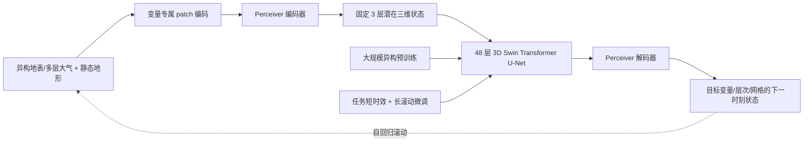

# Aurora：异构地球系统预训练如何迁移到中期天气

> Cristian Bodnar、Wessel P. Bruinsma、Ana Lucic 等，*A foundation model for the Earth system*，*Nature* 641, 1180–1187，2025-05-21，DOI [10.1038/s41586-025-09005-y](https://doi.org/10.1038/s41586-025-09005-y)。[官方代码与权重](https://github.com/microsoft/aurora)。本笔记以正式发表版本为准，阅读于 2026-09-24。

## 一句话结论

Aurora 不是一个“直接看原始观测、无须传统系统”的模型，而是**大规模异构预训练 + 每个任务微调**的地球系统神经模拟器。它在 0.25° 与 0.1° 天气任务中展示预训练迁移收益，也在空气质量、海浪和台风路径上给出跨任务证据；**正式论文主要天气结果到 10 天，不应沿用追踪表先前写的“约 14 天”**。92% 是被选定变量 × 层次 × 时效的比较目标占比，不是 92% 的预报事件都正确。[摘要、方法、图 5](https://www.nature.com/articles/s41586-025-09005-y)

## 1. 研究问题与为什么需要这种设计

传统地球系统任务常各自训练和维护模式，数据的变量、气压层、网格和时间分辨率也不同。Aurora 的研究假设是：先在超过一百万小时的再分析、分析、预报和气候模拟等异构资料上学习通用表示，再以较小代价改造成不同下游系统，可以同时获得迁移与计算效率。这里的“基础模型”不是由一个统一预训练评分证明，而是由预训练后的多任务适配与从头训练对照共同支撑。[引言、“Aurora”节](https://www.nature.com/articles/s41586-025-09005-y)

它把状态分为地表变量和多层大气变量，输入连续两个状态预测下一状态；长时效通过自回归地把预测喂回模型。这意味着预训练的一步误差只是起点，10 天技巧仍取决于滚动稳定性、微调数据以及初值质量。作者没有在本文建立全球概率集合的校准结论。[方法：Problem statement](https://www.nature.com/articles/s41586-025-09005-y)

## 2. 模型结构：异构输入先归一到潜在三维层结

编码器把不同变量视为图像并切 patch，用变量专属线性映射、层次标识和 Perceiver 聚合到**固定 3 个潜在气压层**；地形、陆海掩码、土壤类别作为静态输入。主干是 48 层、三级多尺度 3D Swin Transformer U-Net，以局部窗口注意力与窗口平移传播信息。解码器再把固定潜层转回任务所需的变量、真实气压层和空间网格。位置、patch 面积和绝对时间编码帮助在不同分辨率之间使用同一结构；“任意分辨率”仍须看训练与微调覆盖，不能推成零样本所有分辨率都准确。[方法：The Aurora model](https://www.nature.com/articles/s41586-025-09005-y)

以下是依据[原文图 1 与方法节](https://www.nature.com/articles/s41586-025-09005-y)的**原创重绘**，并非下载或转载原图。

## 3. 训练：预训练、短步微调与长滚动微调

预训练目标是 6 小时下一状态的加权 MAE，作者报告 150,000 步、32 张 A100，约 2.5 周；损失按地表/高空变量及数据集调整权重，而不是所有通道同权。下游先微调整个网络的一两个 rollout 步，再做长滚动微调。后阶段以 LoRA 适配主干注意力线性层，用 pushforward 技巧只对最后一步反传，并使用 replay buffer 暴露模型自己产生的状态，针对自回归时的分布偏移和显存限制。[方法：Training methods](https://www.nature.com/articles/s41586-025-09005-y)

这组设计值得与 FengWu 的 replay buffer 和 SOFT 的模型自输出微调对读：三者均处理训练时真实状态与部署时预测状态的差别，但架构、样本机制和损失不同。不能单凭 Aurora 表现把增益全归因于某一项，因为它同时改变了规模、预训练、微调数据与策略。论文称在 0.1° 任务上预训练相比从头训练平均改善 **25%**，这是更接近“预训练确有用”的消融证据。[高分辨率天气节](https://www.nature.com/articles/s41586-025-09005-y)

## 4. 图表结果：按任务拆开看

下表只重排正式论文正文的**作者报告**，每行分母、目标和基线不同；它不是跨任务统一排行榜。[正文各任务节、图 1–5](https://www.nature.com/articles/s41586-025-09005-y)

| 任务 | 论文实测时效/分辨率 | 正文报告的比较结果 | 如何读 |
| --- | --- | --- | --- |
| 全球中期天气，标准网格 | 0.25°；逐 lead 比较 | 对 IFS 与 GraphCast，超过 **91%** 的选定目标更优 | 目标为变量×层×时效组合，非单日正确率 |
| 高分辨率天气 | 至 **10 天**；0.1° | 对 IFS HRES，约 **92%** 的选定目标 RMSE 更低；部分 lead 改善最多 **24%** | 短 lead 不全优；评价用 HRES 分析/零时预报口径 |
| 空气质量 | 5 天；0.4° | 对 CAMS，约 **74%** 目标持平或更优 | 污染物和高度差异大，不能扩展为天气分数 |
| 海浪 | 10 天；0.25° | 对动力模式，约 **86%** 目标更优 | 波浪是单独下游微调任务 |
| 热带气旋路径 | 至 5 天 | 与选定业务中心预报相比，各报告目标更优 | 风暴样本、海盆和官方预报口径需单独核对 |

0.1° 实验微调使用 2016–2022 的 IFS HRES 分析；评估从 HRES 分析初始化，主要对 HRES T0 验证，并额外用全球 13,000 多个 WeatherReal-ISD 站点检验 10 米风速、2 米气温。作者报告站点指标至第 10 天优于 IFS HRES，这比只对再分析自身验证多了一层独立观测证据；但站点代表性、变量范围与高空场对比不同。图 5 的 Ciarán 风暴是有价值的极端案例，而非完整的极端事件集合统计。[高分辨率天气节、图 5](https://www.nature.com/articles/s41586-025-09005-y)

## 5. 证据边界与中期研究意义

第一，**时效纠偏**：本论文天气主实验是 10 天；10 天海浪也不能被计入“14 天全球天气技巧”。第二，Aurora 的输入初值仍来自传统数据同化；它改写的是动力演化与下游任务适配，不是完整取代观测处理。第三，作者自己指出集合尚待扩展，因此确定性 RMSE 不能回答置信区间、极端风险和 S2S 概率技巧。第四，不同任务的百分比均依其各自对照和目标集合，且 0.1° 评分受测试年份可用资料限制。[讨论、图 5 说明](https://www.nature.com/articles/s41586-025-09005-y)

我认为最有价值的后续问题是：同样的 0.25°/0.1° 数据、初值、训练预算与统一 WeatherBench2 评分下，异构预训练到底优于只用 ERA5 的预训练多少；把长滚动 LoRA/replay buffer 移植到其他模型是否保留增益；到 12–15 天时 ACC、RMSE 和集合 CRPS 如何变化。没有这些实验，Aurora 是“中期 10 天与跨任务迁移”的强证据，不是已验证 15 天/S2S 的答案。

[返回仓库首页](../../README.md) · [返回总追踪表](../../气象大模型_中期预报论文追踪.md)
