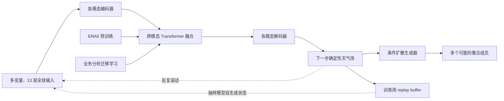

# FengWu：多模态预报、长滚动重放与条件扩散集合

> Kang Chen、Tao Han、Fenghua Ling 等，*The operational medium-range deterministic weather forecasting can be extended beyond a 10-day lead time*，*Communications Earth & Environment* 6, 518，2025-07-03，[正式论文](https://doi.org/10.1038/s43247-025-02502-y)；[作者代码](https://github.com/yuchendoudou/FengWu)。本笔记据正式论文正文与图注，阅读于 2026-09-24。

## 核心判断

FengWu 的“超过 10 天”有一个明确而有限的定义：作者以纬度加权 **Z500 的 ACC > 0.6** 等为技巧阈值，并展示 0.25°、13 个气压层的全球预报。其技术链分成确定性基础预报、针对长滚动的 replay buffer 训练、ERA5 到业务分析的迁移，以及在确定性预报上条件化的扩散集合。不能把“ACC 超过 0.6”翻译成第 11–15 天所有变量、所有区域或极端天气都优于业务系统。[引言、结果](https://www.nature.com/articles/s43247-025-02502-y)

## 1. 问题、网络和训练机制

FengWu 把多类气象变量视作不同模态：各有编码器抽取特征，跨模态 Transformer 在中间交换信息，各模态再通过定制解码器回到物理场。不同变量、区域及层次的预测难度差异很大，作者使用带不确定性参数的多任务损失调整训练权重；此处“uncertainty loss”是**确定性网络训练时的任务权重机制**，不可与后续“预报概率集合已校准”混为一谈。更长时效靠一次次预测下一状态，因而会受到训练阶段用真值输入、部署阶段用模型输出的分布差异影响。[图 1、Results](https://www.nature.com/articles/s43247-025-02502-y)

Replay buffer 在训练中保留模型前几步自己预测出的状态，采样时把真实输入和 buffer 中的模型输出混合，再与相应真值配对优化。这样模型看见了自己未来可能造成的偏差，相比只训练一步更直接面向长滚动。它和 Aurora/SOFT 的同类思想有共同目标，但不宜把后者的性能直接归因到同一超参数或方法实现。[图 1b、Methods](https://www.nature.com/articles/s43247-025-02502-y)

集合支路 FengWu-ENS 以确定性 FengWu 的预测为条件，训练扩散生成器给出多个可能天气场。这不是“对初值扰动后再运行同一个确定性网络”的简单集合，而是附加生成模型。必须把确定性 ACC/RMSE、集合平均技巧、集合离散度和概率评分分开读；生成细节好看不自动证明概率可靠。[摘要、引言、集合结果](https://www.nature.com/articles/s43247-025-02502-y)

### 图：根据原文图 1 与扩散支路重绘

下图为本仓库的**事实性数据流示意**，不是原文图片改图或转载。出处：[原文图 1、正文](https://www.nature.com/articles/s43247-025-02502-y)。

## 2. 实验设计及评价口径

作者用 ERA5 1979–2017 训练，2018 年做 ERA5 回报测试，比较 Pangu-Weather 与 GraphCast；图 2 正文明确写有 12 个变量、ACC/RMSE 两指标与 40 个 6 小时 lead，合计 960 个比较目标。图 2 图注却说横轴延至 15 天——这与“40 个 6 小时 lead = 10 天”的正文口径并不完全一致。精确计算哪个变量在第 11–15 天胜出时，应直接读取原始评分数据/补充材料，不能把 960 个 10 天目标和 15 天曲线混成同一分母。[图 2 与其前后正文](https://www.nature.com/articles/s43247-025-02502-y)

为避免“只会吃 ERA5 初值”的问题，作者又以 2017–2021 ECMWF 业务分析迁移学习，并在 2022 业务分析上初始化与验证，比较 IFS-HRES、迁移前 FengWu 及 AI 基线。这比纯 ERA5 回报更接近部署，但仍是历史业务分析的伪业务评估，不能直接等同于实时系统持续运行、独立气象站或多年度极端事件的完整检验。[图 3、Results](https://www.nature.com/articles/s43247-025-02502-y)

| 原文图表/结果 | 可核验的观察 | 解释与限制 |
| --- | --- | --- |
| 图 2，2018 ERA5 回报 | 12 变量 × 2 指标 × 40 lead = **960** 个正文比较目标；作者称长时效优势突出 | 正文 40 lead 为 10 天，图注横轴写 15 天，读曲线须校口径 |
| 图 2 的技巧阈值 | 作者报告 Z500 与 T2m 的 ACC 在 10 天后仍 **>0.6** | ACC 阈值是大尺度异常型态技巧，不是所有区域的准确率 |
| 图 3，2022 业务分析测试 | 迁移学习改善各变量、长时效尤明显；作者称在业务分析初值下仍超过 10 天技巧 | 分母是选定年份和变量，需独立多年份/观测检验 |
| 热带气旋路径 | 作者报告 2022 年 **5 天路径误差 201 km** | 路径提取、样本风暴和业务中心比较口径影响解释 |
| FengWu-ENS | 正文称多个变量和指标优于 IFS-ENS | 摘要级总体结论不可代替逐 lead CRPS/可靠性曲线 |

该表只整理原文明确给出的数字或定性比较，没有从图片像素反推小数。尤其“几乎所有目标更优”“多指标优于 IFS-ENS”属于作者汇总表述，不能擅自写成某变量第 15 天的精确差值。[图 2–3、摘要](https://www.nature.com/articles/s43247-025-02502-y)

## 3. 方法价值与证据边界

这篇重要之处是把三件经常分开的事连起来：长滚动训练、与部署初值分布接轨、在确定性主干上生成概率集合。对 10–15 天模型，这比单独压低一步 RMSE 更贴近真实瓶颈。也有明显边界：推理依赖传统分析初值；13 层/0.25° 与当前高分辨率业务系统仍有分辨率差异；ACC>0.6 更偏大尺度场，不直接代表降水极端或局地风暴；集合若没有按 lead/地域/阈值报告 CRPS、spread–skill 和可靠性，仍不能只凭视觉质量或平均技巧宣称完全校准。[讨论、方法](https://www.nature.com/articles/s43247-025-02502-y)

如果复现，应先锁定 2018 ERA5 与 2022 业务分析两套**不同**试验，按 6 小时逐 lead 输出 Z500/T2m/风/湿度 RMSE 与 ACC；另以固定成员数和相同初值比较 FengWu-ENS 与 IFS-ENS 的 CRPS、极端阈值 Brier/可靠性、分散度以及生成成本。最后做“无 replay buffer”“无业务分析迁移”“无集合扩散”的逐项消融，才能回答每个模块对第 10–15 天的贡献。

[返回仓库首页](../../README.md) · [返回总追踪表](../../气象大模型_中期预报论文追踪.md)
