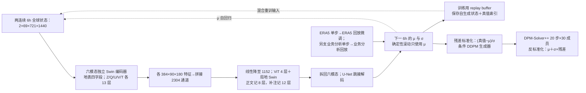

# FengWu：多模态预报、长滚动重放与条件扩散集合

> Kang Chen、Tao Han、Fenghua Ling 等，*The operational medium-range deterministic weather forecasting can be extended beyond a 10-day lead time*，*Communications Earth & Environment* 6, 518，2025-07-03，[正式开放全文](https://doi.org/10.1038/s43247-025-02502-y)、[正式 10 页 PDF](https://www.nature.com/articles/s43247-025-02502-y.pdf)、[54 页正式补充材料](https://media.springernature.com/original/springer-static/esm/art%3A10.1038%2Fs43247-025-02502-y/MediaObjects/43247_2025_2502_MOESM2_ESM.pdf)；[作者训练代码](https://github.com/yuchendoudou/FengWu)、[作者推理代码](https://github.com/OpenEarthLab/FengWu)。本笔记 2026-09-25 重新逐页核验正文、补注 1–13、补表 1、图 1–5 及主要补图，并对照训练库提交 [d627075](https://github.com/yuchendoudou/FengWu/tree/d627075ab953d9e4fdfe1b2b0225bc449cd1ce56)；结构图为独立重绘，图中未印出的数值不冒充原始评分数组。

## 核心判断

FengWu 的“超过 10 天”有一个明确而有限的定义：作者以纬度加权 **Z500 的 ACC > 0.6** 等为技巧阈值，并展示 0.25°、13 个气压层的全球预报。其技术链分成确定性基础预报、针对长滚动的 replay buffer 训练、ERA5 到业务分析的迁移，以及在确定性预报上条件化的扩散集合。不能把“ACC 超过 0.6”翻译成第 11–15 天所有变量、所有区域或极端天气都优于业务系统。[引言、结果](https://www.nature.com/articles/s43247-025-02502-y)

## 1. 问题、网络和训练机制

FengWu 把多类气象变量视作不同模态：各有编码器抽取特征，跨模态 Transformer 在中间交换信息，各模态再通过定制解码器回到物理场。不同变量、区域及层次的预测难度差异很大，作者使用带不确定性参数的多任务损失调整训练权重；此处“uncertainty loss”是**确定性网络训练时的任务权重机制**，不可与后续“预报概率集合已校准”混为一谈。更长时效靠一次次预测下一状态，因而会受到训练阶段用真值输入、部署阶段用模型输出的分布差异影响。[图 1、Results](https://www.nature.com/articles/s43247-025-02502-y)

Replay buffer 在训练中保留模型前几步自己预测出的状态，采样时把真实输入和 buffer 中的模型输出混合，再与相应真值配对优化。这样模型看见了自己未来可能造成的偏差，相比只训练一步更直接面向长滚动。它和 Aurora/SOFT 的同类思想有共同目标，但不宜把后者的性能直接归因到同一超参数或方法实现。[图 1b、Methods](https://www.nature.com/articles/s43247-025-02502-y)

集合支路 FengWu-ENS 以确定性 FengWu 的预测为条件，训练扩散生成器给出多个可能天气场。这不是“对初值扰动后再运行同一个确定性网络”的简单集合，而是附加生成模型。必须把确定性 ACC/RMSE、集合平均技巧、集合离散度和概率评分分开读；生成细节好看不自动证明概率可靠。[摘要、引言、集合结果](https://www.nature.com/articles/s43247-025-02502-y)

### 图：根据原文图 1 与扩散支路重绘

下图为本仓库的**事实性数据流示意**，不是原文图片改图或转载。出处：[原文图 1、正文](https://www.nature.com/articles/s43247-025-02502-y)。

## 2. 实验设计及评价口径

正文笼统写“使用 1979–2017 ERA5”，但**正式补注 2/9 的具体切分**是 **1979–2015 训练、2016–2017 验证、2018 测试**；同一来源又说训练输入利用 ERA5 **逐小时存档**，模型的相邻状态和输出仍隔 **6 小时**，两者并不矛盾。图 2 正文明确写有 12 个变量、ACC/RMSE 两指标与 40 个 6 小时 lead，合计 **960** 个**至第 10 天**的比较目标；图 2 图注的横轴却延至 15 天。应把 960 项统计与 11–15 天曲线分开，且现行开源 YAML 的年份与正式补注不一致，详见下文。[正文图 2](https://www.nature.com/articles/s43247-025-02502-y)、[正式补注 2/9](https://media.springernature.com/original/springer-static/esm/art%3A10.1038%2Fs43247-025-02502-y/MediaObjects/43247_2025_2502_MOESM2_ESM.pdf)

为避免“只会吃 ERA5 初值”的问题，作者又以 2017–2021 ECMWF 业务分析迁移学习，并在 2022 业务分析上初始化与验证，比较 IFS-HRES、迁移前 FengWu 及 AI 基线。这比纯 ERA5 回报更接近部署，但仍是历史业务分析的伪业务评估，不能直接等同于实时系统持续运行、独立气象站或多年度极端事件的完整检验。[图 3、Results](https://www.nature.com/articles/s43247-025-02502-y)

| 原文图表/结果 | 可核验的观察 | 解释与限制 |
| --- | --- | --- |
| 图 2，2018 ERA5 回报 | 12 变量 × 2 指标 × 40 lead = **960** 个正文比较目标；作者称长时效优势突出 | 正文 40 lead 为 10 天，图注横轴写 15 天，读曲线须校口径 |
| 图 2 的技巧阈值 | 作者报告 Z500 与 T2m 的 ACC 在 10 天后仍 **>0.6** | ACC 阈值是大尺度异常型态技巧，不是所有区域的准确率 |
| 图 3，2022 业务分析测试 | 迁移学习改善各变量、长时效尤明显；作者称在业务分析初值下仍超过 10 天技巧 | 分母是选定年份和变量，需独立多年份/观测检验 |
| 热带气旋路径 | 作者报告 2022 年 **5 天路径误差 201 km** | 路径提取、样本风暴和业务中心比较口径影响解释 |
| FengWu-ENS | 正文称多个变量和指标优于 IFS-ENS | 摘要级总体结论不可代替逐 lead CRPS/可靠性曲线 |

该表只整理原文明确给出的数字或定性比较，没有从图片像素反推小数。尤其“几乎所有目标更优”“多指标优于 IFS-ENS”属于作者汇总表述，不能擅自写成某变量第 15 天的精确差值。[图 2–3、摘要](https://www.nature.com/articles/s43247-025-02502-y)

### 2.1 输入数据、预处理与真值协议

正式补注 1–3 将输入具体化为 **69 个物理字段**：位势高度 Z、比湿 Q、纬向风 U、经向风 V、温度 T 各取 13 个气压层（50、100、150、200、250、300、400、500、600、700、850、925、1000 hPa），另加 2 m 温度、10 m 两个风分量及海平面气压。原始全球网格为 0.25° 的 **721×1440**；网络每次看相隔 6 小时的两个状态，预测下一 6 小时状态，14 天需要滚动 **56 步**。业务分析原始约 9 km，经 ECMWF climetlab 重采样到 0.25°；它是历史分析场，不是独立站点观测。公开训练实现对各字段/层使用保存的均值、标准差做逐通道标准化并在加载时调整层序，反标准化后再按物理单位评价；该处理来自[作者训练代码的数据集实现](https://github.com/yuchendoudou/FengWu/tree/d627075ab953d9e4fdfe1b2b0225bc449cd1ce56/datasets)，而非论文给出了全部预处理脚本。[正式补注 1–3](https://media.springernature.com/original/springer-static/esm/art%3A10.1038%2Fs43247-025-02502-y/MediaObjects/43247_2025_2502_MOESM2_ESM.pdf)

正式补注给出的时间划分是 ERA5 **1979–2015/2016–2017/2018** 分别训练/验证/测试；业务分析以 **2017–2021** 微调、**2022** 测试，论文没有单列业务分析的独立验证集。补注中“约 30 万小时样本”是原始 ERA5 可取起报时刻的规模，不能把它误读为 30 万个互不重叠的 6 小时天气过程。现行作者 YAML 将 ERA5 训练年写成 1979–2017、验证/测试写为 2018，而数据集模块默认年份又不同：这与补注正式实验切分有冲突，**不能把当前仓库配置直接当作发表结果的精确复现**。[补注 2、9](https://media.springernature.com/original/springer-static/esm/art%3A10.1038%2Fs43247-025-02502-y/MediaObjects/43247_2025_2502_MOESM2_ESM.pdf)、[当前主配置](https://github.com/yuchendoudou/FengWu/blob/d627075ab953d9e4fdfe1b2b0225bc449cd1ce56/config/fengwu.yaml)

ACC 以 **1993–2016 ERA5 每日气候态**计算异常，RMSE/ACC 均做纬度余弦加权；主要回报以 **00/12 UTC** 起报。比较要先核对各模型的初值、真值与时间窗：图 2 的 2018 ERA5 回报、图 3 的 2022 业务分析回报、补图 S20 的 WeatherBench **2020** 评分、图 4 的 **2018** 集合检验，并不是一张可直接混排的排行榜。[补注 3、图 2–4/S20](https://media.springernature.com/original/springer-static/esm/art%3A10.1038%2Fs43247-025-02502-y/MediaObjects/43247_2025_2502_MOESM2_ESM.pdf)

### 2.2 模型结构：尺寸、融合位置和损失

六模态分别为五组高空变量与一组地表变量。两个起始时次使每组高空输入为 **2×13=26** 通道，地表为 **2×4=8** 通道。各分支的首层卷积核 **3×2**、步幅 **2×2**，得到 96×360×720 特征，再经 Swin 下采样至各 **384×90×180**；六组拼接为 **2304×90×180**，线性压到 1152 通道，在融合器里进行全局和局地注意力交换，然后升回 2304 并拆成六组送给带跳接的解码器。正式补注 5 描述四组各四层融合块：第一组四层全局 ViT，随后三组共十二层窗口 **6×12**、六头注意力；**正文 Methods 却概括为四层 ViT＋八层 Swin**。层数口径不一致，复现时应记录实际代码/权重配置，不抹平为一个肯定数字。[正文 Methods](https://www.nature.com/articles/s43247-025-02502-y)、[补注 5 与补表 1](https://media.springernature.com/original/springer-static/esm/art%3A10.1038%2Fs43247-025-02502-y/MediaObjects/43247_2025_2502_MOESM2_ESM.pdf)

每个输出变量位置同时预测局地 **μ、σ**，训练目标是高斯负对数似然，变量权重随预测不确定性调整；其核心项可写为 `(真值−μ)²/(2σ²)+log(2σ²)`，忽略与参数无关的常数。滚动的确定性预报只把 **μ** 送回下一步，σ 不能被解释为一个已经独立校准的未来集合。补表 1 给出 FengWu **7.51 亿参数、约 8000 G FLOPs**；这是模型规模/计算量，不等于单次业务运行的端到端时延。[正文 Methods、补注 5/补表 1](https://media.springernature.com/original/springer-static/esm/art%3A10.1038%2Fs43247-025-02502-y/MediaObjects/43247_2025_2502_MOESM2_ESM.pdf)

### 2.3 从单步监督到 replay 的完整训练链

| 阶段 | 初始化、样本与目标 | 正式披露的优化设置及其作用 |
| --- | --- | --- |
| ERA5 单步预训练 | 从头学习两个相邻状态→后续一个 6 h 状态，正式训练年为 1979–2015。 | **25 epoch**，AdamW，batch **32**，weight decay **0.01**，余弦学习率 **5×10⁻⁴→0**。这是基础确定性主干，不是长时效专门微调。 |
| ERA5 replay 微调 | 从 ERA5 单步权重继续，在自回归生成状态与真实状态混合输入上预测对应真值。 | **4 epoch**，AdamW，batch **32**、weight decay **0.01**、余弦学习率 **5×10⁻⁶→0**；真实输入:缓存输入约 **1:5**。参数确实继续更新，不是推理后处理。 |
| FengWu-Oper 单步迁移 | **另从 ERA5 单步预训练权重出发**，改用 2017–2021 业务分析样本；不能默认其先继承 ERA5 replay 微调权重。 | **25 epoch，每 epoch 912 steps**，AdamW，batch **8**、weight decay **0.01**、余弦学习率 **1×10⁻⁵→0**。这一步调整分析初值/真值分布。 |
| FengWu-Oper replay | 再对业务分析分支做生成状态回放训练。 | **25 epoch**，AdamW，batch **32**、weight decay **0.01**、余弦学习率 **5×10⁻⁶→0**；补注 6 算法使用回放采样率 5，阶段说明未另写新比例。 |
| FengWu-ENS | 固定/条件化确定性 FengWu 的 μ、σ，以 ERA5 1979–2015 的 6 h 序列学习标准化残差分布。 | **5 epoch、每 epoch 10,000 steps**，AdamW、batch **8**、weight decay **0.01**、余弦学习率 **5×10⁻⁶→0**；原始:缓存约 **1:7**。论文未说明还对 ENS 用业务分析再次微调。 |

以上 epoch、batch、学习率以[正式补注 9](https://media.springernature.com/original/springer-static/esm/art%3A10.1038%2Fs43247-025-02502-y/MediaObjects/43247_2025_2502_MOESM2_ESM.pdf)为准。回放不是“把所有历史预测放到一个无限库”：补注 6 的队列容量是 **200**；开始约 **50** 个训练步后，对每份真实输入约取五份缓存输入，缓存保留模型生成状态、对应预报结果和目标索引，再到数据集中找正确真值。这样训练仍受真实物理场监督，但能适应自身滚动误差。[补注 6](https://media.springernature.com/original/springer-static/esm/art%3A10.1038%2Fs43247-025-02502-y/MediaObjects/43247_2025_2502_MOESM2_ESM.pdf)

作者当前 `fengwu_finetune.yaml` 的 `max_size` 是 **100**，与正式补注的 200 不同；预训练 YAML 的年份也不同。这种差异可以是提交时点、实际实验脚本或论文文字版本所致，现有证据无法裁定，因此复现报告应同时保存代码 SHA、配置、数据年份及所用 checkpoint，并把偏差标明。[回放配置](https://github.com/yuchendoudou/FengWu/blob/d627075ab953d9e4fdfe1b2b0225bc449cd1ce56/config/fengwu_finetune.yaml)

### 2.4 扩散集合是怎样生成的

确定性模型给定时效和初值后输出 μ、σ，扩散支路建模 `(真值−μ)/σ` 的条件残差，而不是直接在物理量绝对值上加噪。采样得到标准化残差后，使用 `μ＋σ×残差` 还原每个成员；共享一个随时效条件化的生成器覆盖多个 lead。论文采用 DDPM 训练思想，并在推理用二阶 **DPM-Solver++，20 步**采样，主要集合实验为 **30 成员**。没有足够证据将当前代码的某个未锁定噪声步数写成正式论文的训练噪声步数。集合成员的生成质量必须以 CRPS、集合均值 RMSE、spread–skill 和秩直方图分别核查。[正文 Methods/图 4](https://www.nature.com/articles/s43247-025-02502-y)、[正式补注 9–10](https://media.springernature.com/original/springer-static/esm/art%3A10.1038%2Fs43247-025-02502-y/MediaObjects/43247_2025_2502_MOESM2_ESM.pdf)

### 2.5 图表中的优势和反例：分协议读数

| 图表与数据窗 | 报告的结果或可直接读出的数值 | 不应越过的边界 |
| --- | --- | --- |
| 正文图 2，2018 ERA5 | 作者以 12 变量、ACC/RMSE 及 40 个 6 h lead 汇总 **960** 个到第 10 天的目标；图还展示延至约第 15 天的曲线。 | 960 项“胜率”不是 15 天全部评分点的统计；Z500/T2m 的 ACC>0.6 不替代极端降水/局地预报验证。 |
| 正文图 3，2022 业务分析 | FengWu-Oper 相对未迁移 FengWu 改善，作者与 GraphCast-Oper、Pangu、IFS-HRES 比较。 | 迁移效果包含训练数据分布变化；不能把 2022 业务分析测试和 2018 ERA5 图 2 混成同口径。 |
| 正文图 4，2018 集合 | 30 成员 FengWu-ENS 与 IFS-ENS 对 U10、T2m、Z500、T850 给出第 1–10 天 CRPS、均值 RMSE、spread 与 spread–skill ratio。 | 文中的“多个变量有优势”并非每个变量、每个 lead 都更优；均值技巧不等于成员可靠。 |
| 补图 S10，回放消融 | 不用 replay 的第 10 天 Z500、T850、T2m、MSLP RMSE 曲线整体更差。 | 图没有公开逐点原始数组，这里不从像素编造精确改进百分比。 |
| 补图 S14，极端温度概率 | 低温 **2/5/10 百分位**的 Brier 曲线整体有利于 FengWu-ENS；高温 **90/95/98 百分位**在较长 lead，蓝色 FengWu-ENS 曲线可**高于**橙色 IFS-ENS。 | Brier 越低越好，所以不能写成“所有极端阈值全面领先”。 |
| 补图 S15，2022 秩直方图 | 30 成员对应 31 个秩箱，12 h、3/5/10 d 下，Z500/T850 等变量的两端箱偏高。 | 这是业务分析年份的补充诊断，不是 2018 图 4 的同一测试样本；两端偏高提示欠离散/尾部失配，尚不能宣称完全校准。 |
| 正文图 5，2022 热带气旋 | 按筛选口径共 **80** 个命名风暴，五天路径误差 **201 km**；作者报告相对 Pangu/ECMWF/NCEP 改善 **3.9%/23.2%/26.4%**。 | GraphCast-Oper 整体相当甚至更好，FengWu 在第四天略好；2023 HAIKUI/ILSA 个例不是 2022 统计验证。 |

补图 S20 另给 **2020 WeatherBench** 的逐日计分卡，可以较清楚看出“某一系统同一指标、同一天数”的量级：第 10 天 **Z500 RMSE** FengWu **624**、FuXi **631**、GraphCast **731**（表列的单位为 m²/s²）；第 10 天 **T850 RMSE** 分别为 **2.84、2.91、3.36 K**。这个补图同时列出 IFS-HRES/IFS-ENS/NeuralGCM 等，但图注明说业务模式按业务分析校验，其他模式按 ERA5 校验；**不能拿 624 与 IFS-ENS 均值的 621 或 NeuralGCM 集合均值的 606 直接判定公平胜负**。即使同用 ERA5 的 AI 行，也要核对起报、预处理与训练年份。上述整数/两位小数是图中印出的数，不是从曲线估值。[补图 S20](https://media.springernature.com/original/springer-static/esm/art%3A10.1038%2Fs43247-025-02502-y/MediaObjects/43247_2025_2502_MOESM2_ESM.pdf)

### 2.6 计算代价与复现清单

补注 12 报告，确定性主干连同业务分析迁移在 **32×A100** 上约 **14 天**；10 天推理在一块 A100 上约 **300 秒**，其中包含磁盘 I/O。集合生成阶段报告在 **8×A100** 上约 **14 天**，每个成员每次时间步约 **14 秒**。这些是作者硬件与实现的报告值；30 成员、40–56 个步长的总体成本不能只用“单步 14 秒”描述，也不能跨硬件直接对比 IFS。[正式补注 12](https://media.springernature.com/original/springer-static/esm/art%3A10.1038%2Fs43247-025-02502-y/MediaObjects/43247_2025_2502_MOESM2_ESM.pdf)

复现时至少应固定三套权重（ERA5 单步、ERA5 replay、业务分析迁移/replay）、逐字段统计量、2018/2022/2020 三种测试窗、分析场下载时延、集合成员数和采样随机种子。先验证 6 h 一步误差，再验证 10/14/15 天滚动曲线，最后分阈值/区域检验集合可靠性；绝不能只以一张 ACC 图代替概率或灾害指标。论文提供[源数据 DOI](https://doi.org/10.6084/m9.figshare.29290043.v2)，但本次未取得其逐点评分数组，因此这里只转写原表/图中明确印出的数，曲线形状维持定性描述。

## 3. 方法价值与证据边界

这篇重要之处是把三件经常分开的事连起来：长滚动训练、与部署初值分布接轨、在确定性主干上生成概率集合。对 10–15 天模型，这比单独压低一步 RMSE 更贴近真实瓶颈。也有明显边界：推理依赖传统分析初值；13 层/0.25° 与当前高分辨率业务系统仍有分辨率差异；ACC>0.6 更偏大尺度场，不直接代表降水极端或局地风暴；集合若没有按 lead/地域/阈值报告 CRPS、spread–skill 和可靠性，仍不能只凭视觉质量或平均技巧宣称完全校准。[讨论、方法](https://www.nature.com/articles/s43247-025-02502-y)

如果复现，应先锁定 2018 ERA5 与 2022 业务分析两套**不同**试验，按 6 小时逐 lead 输出 Z500/T2m/风/湿度 RMSE 与 ACC；另以固定成员数和相同初值比较 FengWu-ENS 与 IFS-ENS 的 CRPS、极端阈值 Brier/可靠性、分散度以及生成成本。最后做“无 replay buffer”“无业务分析迁移”“无集合扩散”的逐项消融，才能回答每个模块对第 10–15 天的贡献。

[返回仓库首页](../../README.md) · [返回总追踪表](../../气象大模型_中期预报论文追踪.md)
