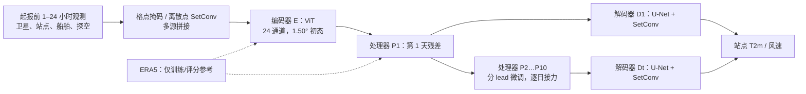

# Aardvark Weather：观测直接驱动的全球格点与站点预报

> Anna Allen、Stratis Markou、Will Tebbutt、James Requeima、Wessel P. Bruinsma 等，*End-to-end data-driven weather prediction*，*Nature* 641, 1172–1179；[正式论文及图 1–5](https://www.nature.com/articles/s41586-025-08897-0)、[15 页正式 PDF](https://www.nature.com/articles/s41586-025-08897-0.pdf)、[38 页正式补充材料](https://media.springernature.com/original/springer-static/esm/art%3A10.1038%2Fs41586-025-08897-0/MediaObjects/41586_2025_8897_MOESM1_ESM.pdf)，2025-03-20 在线发表。正式论文曾于 2025-06-17 更新补充资料及引用；本笔记以更新后的正式版和[作者代码固定提交 8fb35a0](https://github.com/anna-allen/aardvark-weather-public/tree/8fb35a0f5f7602eaf5127b9642c54eb052d68f56)为准，2026-09-25 再核。早期 arXiv 稿题为 *Aardvark weather: end-to-end data-driven weather forecasting*，这里不把早期稿数字覆盖正式版。

## 1. 研究问题、结论边界

主流 AI 天气模型通常从 ERA5/业务分析场启动，只替换积分预报器；站点预报又依赖独立后处理。Aardvark 要检验的是：只给在起报时刻之前可用的观测，能否用一个可训练链条生成全球格点初值、逐日预报和任意位置站点预报？作者报告的答案是“若干变量和地区可以”，不是“全面胜过高分辨率业务系统”。全球格点分辨率仅 **1.50°**，站点温度/风速可评估至 **10 天**，尚未做 15 天、概率集合或高分辨率极端天气验证。[正式论文摘要、Discussion](https://www.nature.com/articles/s41586-025-08897-0)

这里的“无需 NWP”专指**部署推理时无需传统 NWP 产品作为输入**。编码器和预报器训练仍借助 ERA5 再分析；与完全脱离数值模式知识的说法不同。作者还估计输入观测仅约为业务系统可用观测的 **8%**，所以性能与资源结论都应放在观测覆盖和测试年代的背景下读。[正式论文第 Aardvark Weather 节](https://www.nature.com/articles/s41586-025-08897-0)

## 2. 模型结构：从稀疏观测到站点

编码器 E 将陆地/海洋站、探空以及散射计、微波/红外探测器、静止卫星等多源观测组织为格点表征。格点观测用缺测掩码，离散站点/探空用**可学习长度尺度**的 SetConv 和密度通道；拼接后交给 patch 3、8 block、隐维 512 的 ViT，估计 24 通道的 1.50° 全球初态。24 场是五个高空量（U、V、Q、Z、T）在 200/500/700/850 hPa 四层的 **20** 场，加 U10/V10/T2m/MSLP **4** 场，不包含站点风速模这个下游目标。与循环同化系统不同，编码器**不使用前一次预报背景场**，因而更容易作为独立观测入口，但也没有用递归过程积累过去观测。[正式论文图 1、Methods: Encoder module、Extended Data Table 1](https://www.nature.com/articles/s41586-025-08897-0)

处理器 P 不是一个单一共享权重的 10 次循环：论文使用**十个分别微调的逐日 ViT**，以 24 小时残差预测逐段接力至第 10 天。每个处理器为 patch 5、16 block、隐维 512，并在网络前加入变量间 cross-attention；第 $k$ 个模型用第 $k-1$ 个模型权重初始化，再针对其实际会遇到的已估计状态继续训练，以减少滚动输入分布偏移。这是容易被“自回归 ViT”一句话掩盖的设计。解码器 D_t 则对每个 lead 用 4 级 U-Net、SetConv 和地形信息，将格点场映射到任意经纬度的 T2m 与 10 米风速；最终以第 1 天站点目标联合微调 E、P₁、D₁。[正式论文 Methods: Processor/Decoder/End-to-end fine-tuning](https://www.nature.com/articles/s41586-025-08897-0)

### 模型结构图（依据原文图 1b 与 Methods 自行重绘，非原图转载）

论文图 1 还把观测的空间缺口可视化；本图重绘的是机制，不再现其卫星影像或地图。Methods 报告编码器约 **31M**、处理器模块约 **54M**、每个解码器约 **2M** 参数；同节另写 **11 个解码器**，对应初态及第 1–10 天的站点场，而处理器明确是十个。54M 是模块口径，不能无依据当作十个处理器全部参数之和；比较模型尺寸应核对[公开权重目录](https://huggingface.co/datasets/av555/aardvark-weather/tree/main/trained_model)。[正式论文 Methods: Model size](https://www.nature.com/articles/s41586-025-08897-0)

## 3. 数据、训练与公平对照

### 3.1 数据、观测预处理与时间切分

处理器的长历史预训练采用 **1979 年起 ERA5**；编码器需与多源实际观测配对，其资料大多始于 **2007 年**，IASI 则从 **2007-10** 开始。所有模块训练数据均早于 2018 年；**2018 测试、2019 验证**，这两个年份的用途与通常“先验证年、后测试年”次序相反但原文明确如此。HadISD 陆地站提供 T2m、气压、风、露点，Methods 列 T2m **8,719** 站、气压 **8,016** 站、风 **8,721** 站、露点 **8,617** 站；ICOADS 船舶/浮标供海面温度、MSLP、气温与 U/V10，IGRA **1,375** 个探空站在地面及四个气压层供湿度、风、位势、温度。下游站点 T2m/风速标签亦取 HadISD。[正式论文 Methods: State estimation inputs、Extended Data Table 2](https://www.nature.com/articles/s41586-025-08897-0)

| 输入源 | 作者采用的时间窗、特征与预处理 |
| --- | --- |
| ASCAT（Metop A/B/C） | 起报前 **24h** 内格点最近一笔；输入三束原始雷达后向散射 $\sigma^0$ 和仪器元数据，**不先反演海面风** |
| AMSU-A、AMSU-B/MHS、HIRS | 起报前 **24h**，选 NOAA/Aqua/Metop 等平台的微波/红外辐射与元数据，**不先反演垂直廓线** |
| IASI（Metop A） | 起报前 **24h**；8,461 个谱道取**前 15 个主成分**压缩，再与观测时空元数据输入；起始时间较其他数据晚 |
| GridSat 静止卫星 | 起报时刻 **t=0** 的红外/水汽窗口合成图像；跨 GOES/MSG/风云/向日葵平台 |
| HadISD 陆地站 | 起报时刻站点观测；原数据为 6 小时间隔，具体是否选到同刻由观测时间元数据约束 |
| ICOADS 海洋站 | Methods 写取 **t−1h 到 t=0** 的报告；但 Extended Data Table 2 写 **6h**，公开论文内部不一致，不能擅自固定复现窗口 |
| IGRA 探空 | 起报前 **6h** 内廓线，含地面和 200/500/700/850 hPa |

遥感 L1 granule 先按**最近邻**投到 **1°** 中间格网；同格若有多笔留最新一笔，再由编码器处理缺测和与 1.50° 目标网格的映射。论文未充分披露 1° 中间网格到 1.50° 编码器的全部插值细节。输入加年内日/日内时刻 sin-cos 周期特征、绝对年份，以及 ERA5 地形位势、次网格地形角度/各向异性/坡度/标准差等静态场。**目标变量**按字段/气压层在全网格求均值标准差归一化；输入观测未做额外偏差订正，模型从 ERA5 监督中学习偏差。模型对“前 1–24h 观测可用”的假设仍需检查各产品**实际发布延迟**；作者现行 README 明确说这些原型所用历史数据**无法实时获取**，不应冒充已经可运行的实时业务链。[正式论文 Methods: State estimation inputs/Training objectives](https://www.nature.com/articles/s41586-025-08897-0)、[作者 README](https://github.com/anna-allen/aardvark-weather-public/tree/8fb35a0f5f7602eaf5127b9642c54eb052d68f56)

### 3.2 分阶段训练、微调与公开参数

预训练和微调并非一句“端到端”即可概括：先训练 **E：观测→ERA5 初态**；再用**ERA5 真初态→24h ERA5 残差**训练第一个处理器；随后把估计初态和上一步的**模型输出**送入下一 lead 处理器，按 $P_1\to\cdots\to P_{10}$ 逐段微调并从前一 lead 权重初始化；最后以处理器所输出的格点场训练每个站点解码器。这样在编码器/预报器接口逐步缩小训练与部署的状态分布偏差。[正式论文 Methods: Model architecture、Processor module](https://www.nature.com/articles/s41586-025-08897-0)

| 阶段 | 论文披露的目标、参数和训练量 |
| --- | --- |
| E 编码器 | 观测→ERA5 **24 场**；目标先按字段/层归一化，初训各变量等权的纬度加权 RMSE，再以各变量初训 LW-RMSE 的倒数构造 $\beta_v$（原文另写乘 3 的缩放）做变量加权 LW-RMSE；AdamW、余弦 LR **5e−4→0**、最多 **150 epoch**、early stopping；**31M 参数/约 13h** |
| P₁ 预训练 | 真 ERA5 $s_0$→$s_1-s_0$ 的 **24h 残差**；各变量归一化后的等权 LW-RMSE，AdamW、余弦 LR **5e−4→0**、**100 epoch**；处理器模块约 **54M 参数/约 8h** |
| P₁…P₁₀ 微调 | 编码器估计初态起滚动，$P_1$ 对其误差初态微调；将已预测状态作为 $P_2$ 输入并用 $P_1$ 权重初始化，依次至第 10 天；Methods 给处理器微调约 **3h**，但未逐 lead 给 LR、batch/epoch/步数，不能把示例脚本当论文最终配置 |
| D₀…D₁₀ 站点解码 | 各 lead 格点预测＋目标坐标＋地形→HadISD 站点 T2m/风速；4 编码/4 解码级 U-Net＋SetConv＋MLP，卷积通道 **16/32/64/128/64/32/16/1**；AdamW、文中 LR **1e−3**、**10 epoch**、每模块约 **2M 参数/30min**；Methods 文字写“RMSE loss (equation 3)”，但式 (3) 实际是 **MAE**，目标函数表述存在内在冲突 |
| 第 1 天端到端微调 | 加载已训练 E、P₁、D₁，**三者全部参数可更新、无冻结**；以站点 T2m 或风速分别训练，只用第 **1 天**标签；正文称站点 RMSE 目标、AdamW、恒定 LR **5e−5**、最多 **25,000 梯度步**，每 **1,000 步**留检查点并按**2019 验证年**逐区域选最佳权重；约 **2h**。因此图 5l–m 的提升不是 10 天全链共同微调 |

作者报告训练用同一台 **4×A100** 虚拟机，总成本约 **100 GPU 小时**。论文未明示的 batch、权重衰减、归一化缺测值和各阶段可执行数据管线不能用猜测填空。作者现行[训练脚本](https://github.com/anna-allen/aardvark-weather-public/tree/8fb35a0f5f7602eaf5127b9642c54eb052d68f56/training)仅是“过程透明性”示例，README 明说缺本地数据加载/计算环境、**不能直接运行**：脚本给 E batch 6/**100 epoch**、P 预训练 batch 24/**200 epoch**、D batch 64/**20 epoch**、P 微调默认 batch 12/示例 1 epoch，而正式 Methods 分别写 E 150、P 100、D 10 epoch。现行脚本多处默认 `weight_decay=1e−6`，且 `train_e2e.sh` 依当前入口默认 batch 3/LR 5e−5/10 epoch；这些可帮助理解实现接口，**不能覆盖正式论文的 25,000 步协议**。脚本与论文不一致应记录为版本/复现缺口，不将两套设置拼成不存在的一次实验。[正式论文 Methods: Model size/End-to-end fine-tuning](https://www.nature.com/articles/s41586-025-08897-0)、[作者训练 README](https://github.com/anna-allen/aardvark-weather-public/tree/8fb35a0f5f7602eaf5127b9642c54eb052d68f56)

### 3.3 评测可比性与两个站点外推协议

主文图 5 用的站点**时间留出**：同一站点位置在训练期可出现，2018 年为测试。更严格的[正式补充材料 D 节/图 5](https://media.springernature.com/original/springer-static/esm/art%3A10.1038%2Fs41586-025-08897-0/MediaObjects/41586_2025_8897_MOESM1_ESM.pdf)还做了**空间留出**：全球划 1°×1° 箱，每箱最多随机抽两站，在训练和部署时都不交给编码器；另用小/大两个 U-Net 解码器对照，较小者各级通道为原版的 **1/8**。图 5 的新站点 T2m 大致接近原生 HRES、风速小解码器多 lead 优于 HRES，但此处 HRES **无法做逐站偏差订正**，所以不能与主文图 5 的“逐站订正 HRES”混为同一基线。补文 D 节还有“two variants of encoder”的笔误，随后明写两个变体是 **decoder/U-Net 通道**，以图注和模块说明为准。该试验证明一定程度的未见站点泛化，却仍不是未见气候区或新的传感器分布外推保证。

全球评测用 ERA5 作真值、纬度加权 RMSE，对照 persistence、气候态、IFS HRES 与 GFS；HRES/GFS 通过一阶**守恒重网格化**降至 1.50°。WeatherBench2 气候态为 **1990–2017** 的同年内日/小时均值与 **61 天**滑窗，勿与输入的绝对年份/时间 Fourier 特征混淆。站点评测用 MAE，对照逐站订正 HRES、持久性/气候态，以及美国 NDFD（后者集成多模式且有人类预报员参与）。因此全球“接近 HRES”不等于原生 0.1° 空间细节或灾害过程同等可用。[正式论文图 2/5、Methods: Baselines/Evaluation metrics](https://www.nature.com/articles/s41586-025-08897-0)

## 4. 图表性能：有利与不利结果并列

下表按[正式论文图 2、图 4、图 5 及正文](https://www.nature.com/articles/s41586-025-08897-0)摘取**明确写出的**数值/方向；图形曲线未给出的格点 RMSE 小数不从图片目测补写。图 2 的带状区间是均值估计的 **98% 置信区间**，不是逐案例误差分布。

| 试验/图 | 披露的结果 | 正确读法 |
|---|---|---|
| 全球 1.50°，图 2 | 多数 lead/变量与 GFS 持平或更好；**Z500 是例外**；多数变量接近但未普遍超越 HRES | 初期和高空误差更高；原文不支持“所有变量优于业务模式” |
| 初态观测消融，图 4 | 去掉全部卫星资料，初态 LW-RMSE 各变量显著恶化；LEO 探测资料较散射计/静止卫星更重要 | 图表主要是定性/相对变化；不能把单一资料解释为唯一信息源 |
| 站点 T2m，图 5 | 全球至 **10 天**有技巧；西非与太平洋区所有所示 lead 优于逐站订正 HRES；美国本土与欧洲约为相当 | 强项具有区域性；针对 2018、固定站点集合 |
| 站点 10m 风速，图 5 | 美国本土误差**高于**逐站订正 HRES；欧洲前 4 天相近、此后更好；太平洋区略差 | 不可把温度优势推给风速 |
| [补充图 5：未见站点](https://media.springernature.com/original/springer-static/esm/art%3A10.1038%2Fs41586-025-08897-0/MediaObjects/41586_2025_8897_MOESM1_ESM.pdf) | T2m 至第 10 天总体与**未订正 HRES**相近；风速的小 U-Net 解码器在多数 lead 表现更好，且优于大解码器 | 空间留出支持新站点泛化，但对照**不是**主文逐站偏差订正 HRES；曲线值未逐点取图 |
| 端到端联合微调，第 1 天，图 5l–m | T2m 的 MAE：欧洲、西非、太平洋与全球约改善 **6%**，美国本土约 **3%**；风速多数地区 **1–2%**，太平洋除外 | 只证明第 1 天这两个站点目标；不能宣称 10 天整体改善 6% |
| 计算，Discussion/Methods | 4×A100 完整推理约 **1 秒**；训练约 **100 GPU 小时**；业务 HRES 同化+预报约 **1000 node-hours** | 不同硬件/定义的估算，不能直接当统一能耗基准 |

图 3 的 Berguitta 热带气旋是 2018-01-11 起报至第 4 天的 **U10 个例**，体现大尺度位置模拟，但高频谱模糊也可见；单个个例不能给出全球气旋命中率。论文承认后期模糊、原生分辨率低、无集合、观测仪器漂移/新传感器接入等不足。[正式论文图 3、Discussion](https://www.nature.com/articles/s41586-025-08897-0)

## 5. 我的判断与复现检查

与 FuXi Weather 的“卫星 + 预报背景循环同化”相比，Aardvark 的概念更纯粹：不靠业务初值或前次预报背景，以 SetConv/ViT 直接估计初态；但两者的数据、网格、年份和业务基线不同，不应排列成统一榜单。Aardvark 最有研究价值的是其**观测编码—格点动力—站点决策**可微链条，以及逐任务微调能真实改善终端指标的证据。中期意义集中在 7–10 天的站点可用性，尚不是 10–15 天上限突破。[正式论文图 1/5](https://www.nature.com/articles/s41586-025-08897-0)

复现/扩展宜先检查四件事：① 锁定作者代码、权重、观测产品和其真实发布时间，避免历史资料延迟带来的“伪实时”；② 按 2018/2019 留出与 1.50° 守恒重网格化复现图 2/5，并显式区分格点 LW-RMSE 与站点 MAE；③ 在已有补充图 5 空间留出基础上扩大**新站点、新年代、未见气候区**及极端温度/大风分位数评测；④ 将十个逐日处理器的参数、推理成本与共权重模型公平对比，再探索 10 天之后与概率集合。作者[代码和权重仓库](https://github.com/anna-allen/aardvark-weather-public/tree/8fb35a0f5f7602eaf5127b9642c54eb052d68f56)可供检查结构与示例推理，但现行 README 对训练命令的不可直接执行和历史观测无法实时获取已有明确限制。

[返回仓库首页](../../README.md) · [返回总追踪表](../../气象大模型_中期预报论文追踪.md)
