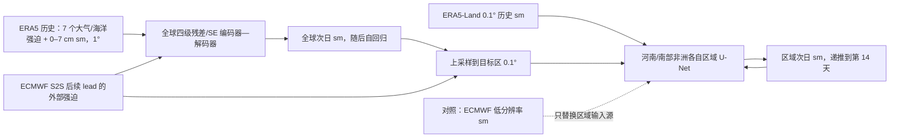

# ASM：全球—区域嵌套的 14 天表层土壤水预报

> Quan Zhang、Yuze Sun、Wenbin Liu、Yichuan Zhang、Jiaolong Ying、Yanyan Huang、Yanfei Xiang、Dongxiao Xu、Shuo Wang、Le Yu、Xiaomeng Huang，*Global-regional nested forecasting of soil moisture*，*npj Climate and Atmospheric Science*，**2026-08-25** 在线发表，DOI [10.1038/s41612-026-01522-5](https://doi.org/10.1038/s41612-026-01522-5)。本笔记核对[期刊 Article in Press 页面](https://www.nature.com/articles/s41612-026-01522-5)、[11 页正式早期 PDF](https://www.nature.com/articles/s41612-026-01522-5_reference.pdf)、[18 页补充图 S1–S14](https://media.springernature.com/original/springer-static/esm/art%3A10.1038%2Fs41612-026-01522-5/MediaObjects/41612_2026_1522_MOESM1_ESM.pdf)与[作者 Zenodo 代码存档](https://doi.org/10.5281/zenodo.18398861)，阅读于 2026-09-25。Article in Press 是可引用的正式早期版本，后续排版版本可能替换它。

## 一、问题、任务边界与主结论

ASM（Artificial Soil Moisture Forecasting Model）预测的是**表层 0–7 cm 土壤水**，不是前一篇 RISE-UNet 的 0–100 cm 根区水分。它把全球 **1°** 自回归网络生成的低分辨率土壤水/大气信息，送入两个地区独立的 **0.1°** 区域 U-Net，并用区域高分辨率历史土壤水恢复细节。主要评测从第 1 天到**第 14 天**；因此按实际最长业务比较时效归入中期目录，文章使用的“early-subseasonal”是上边界的描述，并不意味着已验证第 3–6 周。[正文 Introduction、Fig. 1、Methods](https://www.nature.com/articles/s41612-026-01522-5_reference.pdf)

2024 年独立测试中，全球 ASM 第 14 天格点异常相关（ACC）平均 **0.612**，对照 ECMWF **0.533**；作者报告 RMSE 相对 ECMWF 降低 **46.5%**。区域试验中，河南、南部非洲的 0.1° ASM 驱动版本优于**相同区域网络、仅把低分辨率土壤水输入改为 ECMWF 预报**的对照。这里不能说“直接超过 ECMWF 原生 0.1°产品”，因为 ECMWF 没有该直接可比产品；也不能把“土壤水预测”扩大为全球大气预报能力。[正文 Fig. 3–4、Results](https://www.nature.com/articles/s41612-026-01522-5_reference.pdf)

## 二、资料、处理、分割及潜在不一致

| 资料/环节 | 正文实际说明 | 复现和公平性的要点 |
| --- | --- | --- |
| 输入字段 | **8 个**：10 m U/V 风（u10/v10）、2 m 露点（d2m）、2 m 气温（t2m）、海温（sst）、地表净热辐射（str）、总降水（tp）、**0–7 cm** 体积土壤水（sm）。 | sm 是唯一被递推预测的目标；其余 7 项是后续 lead 的外部强迫，不能把未来 ERA5 大气真值当作可实时获得的预报输入。 |
| 全球 ERA5 | 正文称 ERA5 **1960–2024** 为全球近似真值；缺值先做**二阶邻域插值**，再双线性重网格到 **1°×1°**；全球评分排除格陵兰和南极。 | 这是对再分析的评分，不是独立土壤剖面/站点检验。正文未给出逐变量标准化、异常气候态的精确基期，不能从“ACC”二字补造。 |
| ECMWF 资料 | 正文称 ECMWF S2S **1981–2024**，Copernicus 预测档案、origin/system 标识为 **51**，用于未来大气强迫和动力对照；同起报、同 lead/有效日期匹配“wherever available”。 | 不同年代可能跨业务系统版本，正文未列各年的起报频次/成员数、可用同起报样本数；“wherever available”不是每个日历日完全配对的保证。 |
| 区域 ERA5-Land | 原生 **0.1°** 区域表层水作为历史高分辨率初值和训练/验证目标；全球低分辨率大气/土壤输入上采样后与其拼接，分别训练河南与南部非洲网络。 | 区域模型输出是 ERA5-Land 产品一致性；两地区不是任意地理区域的零样本泛化测试。 |
| 时间分割 | 各资料统一按时间：**2024** 独立测试，**2022–2023** 验证/选模，此前可用年份训练。全球 ERA5 的可用起点与 ECMWF 的起点不同。 | 这是独立**一年**测试，2024 河南/南部非洲干旱为其中选取的案例；不能把这些案例作多年无偏事件技能统计。 |
| 网格/单位核查 | 正文写全球 1°，Fig. 1 示意标为 **181×380**；Fig. 3–4 的色标印 **kg m⁻²**，Methods 却称输入是 *volumetric soil water content*。 | 1°全球经度通常为 360 点；380 可能包含边界扩展，但正文未解释。体积含水量与 kg m⁻²也不是同一种单位，复现需核代码/资料转换，本文不自行认定图中单位正确。 |

以上“相同年份分割”属于论文声明；实际若要严格封存 2024，必须确保预处理、异常基线、输入插值参数和模型选择均不从 2024 估计。尤其 2024 个例图不能替代全年的格点时间序列评分。[Methods / Datasets，Fig. 1、3–4](https://www.nature.com/articles/s41612-026-01522-5_reference.pdf)

## 三、模型信息流与完整训练路线

全球网采用对称编码—解码器：**四级**下采样，每级是预激活的 BatchNorm→ReLU→卷积残差块、最大池化，通道数逐级翻倍；最深 bottleneck **1024 通道**。解码器用转置卷积上采样，通过同尺度编码特征的 skip 拼接恢复空间结构。残差块若通道数不等，用 1×1 shortcut 对齐；块内还有 squeeze-and-excitation（全局平均池化、两层门控、Sigmoid）重加权通道。论文 Methods 不列全每层细节，但作者 [Zenodo `Model/Global_model.ipynb`](https://doi.org/10.5281/zenodo.18398861) 的可见结构是输入 **8** 通道→编码 **64/128/256/512**→瓶颈 **1024**→对称解码→输出 **1** 通道；每块两次 **3×3** 卷积、SE reduction **16**，示例张量为 `2×8×181×380`。代码的 181×380 与通常 1°全球 181×360 的差异仍未解释，不能推定为真实业务重网格范围。[Methods / ASM，式 (1)–(4)、Fig. 1a](https://www.nature.com/articles/s41612-026-01522-5_reference.pdf)

全球初始大气/海陆状态来自 ERA5；随后由 ECMWF 提供非土壤水强迫，网络每天预测下一日 sm，并将自己的 sm 预测回填下一步。区域 U-Net 将全球 ASM（或在对照试验中 ECMWF）的低分辨率土壤水、其他上采样低分辨率变量和 ERA5-Land 历史高分辨率 sm 拼接，一天一步在目标区内递推。区域比较的两个网络保持**相同结构与训练设置**，只更换低分辨率水分来源；它不能完全隔离所有大气资料和区域目标产品的共同影响。[Fig. 1b、Results / Regional forecast](https://www.nature.com/articles/s41612-026-01522-5_reference.pdf)

作者 [`Model/Regional_model.ipynb` 示例](https://doi.org/10.5281/zenodo.18398861)给出普通 U-Net 基宽 **32**、编码 **32/64/128/256**、瓶颈 **512**、每级双 **3×3** 卷积；另有 `UNet_MultiRes`：默认粗网格 **7** 通道先用双 3×3 卷积投影为 **32** 通道，双线性插至细网，再与 **1** 个高分辨率 sm 通道拼成 **33** 通道进入 U-Net。但同 notebook 同时提供独立 `UNet(in_channels=9)` 的演示调用，未附训练/实验配置把 Fig. 4 明确绑定到哪一次实例化；因此 `coarse_ch=7` 是**公开示例默认值**，不能当作论文实际区域输入的完整变量清单。代码亦未提供学习出的权重或加载全球权重的步骤。

这张图依据正文 Fig. 1/Methods **独立重绘**。需注意全球 Fig. 2 的架构比较、Fig. 3 的 ECMWF 驱动业务比较及 Fig. 5 的“仅土壤水”消融有**不同输入/训练协议**；不应将它们画成一条完全相同的推理链。[正文 Fig. 1–5](https://www.nature.com/articles/s41612-026-01522-5_reference.pdf)

### 预训练、微调、优化器与公开程度

| 阶段 | 论文明确披露 | 不能擅自填入 |
| --- | --- | --- |
| 全球预训练 | 只优化 **1 日 lead** 的 sm 预报，学习基本日变化；以 ERA5 作监督。 | 正文未给训练 epoch/iteration、batch、LR 数值、损失形式、归一化统计、checkpoint 选择细节。 |
| 全球微调 | 从上述已训练模型权重继续训练，以改善较长 lead 的递推；ECMWF 后续外部强迫与 ERA5 初始状态进入业务式预报。 | 正文未逐段列 rollout 长度、哪层冻结、微调数据起报频次、优化器权重衰减或 LR 调度，不可套用天气基础模型的阶段方案。 |
| 区域预训练与微调 | 河南和南部非洲各有区域 U-Net，同样采用**单日预训练→较长 lead 微调**；高分辨率 ERA5-Land sm 为目标。 | 未报告区域相对全球权重的初始化映射、是否冻结任何全局层；“全球—区域嵌套”不等于直接复制全球网络权重。 |
| 环境 | 文中报告 **NVIDIA A100 40 GB、Intel Xeon Silver 4316、128 GB RAM**；Python **3.11.0**、PyTorch **2.6.0**，单卡可训练/部署；称使用 **Adam**。 | 硬件和框架版本不等于可复现的完整训练超参；“单卡”也不能证明全链路 ECMWF 资料生产成本低。 |

论文补充 PDF 只有图 S1–S14，没有训练超参数表。已逐项检查作者 Zenodo ZIP：`Model/` 只有全球/区域两个**架构示例 notebook**，`Figure/` 是图 2–4 的数据与绘图 notebook，`Data/` 为少量地图/示例文件；**没有完整数据预处理、训练、微调、checkpoint 生成脚本**。因此代码能核实网络层/默认通道，却无法补齐实际 epoch、batch、学习率、rollout 课程、权重版本或完整测试协议；笔记不把 notebook 测试张量当成实际实验超参。[Methods / ASM、Data/Code availability](https://www.nature.com/articles/s41612-026-01522-5_reference.pdf)、[Zenodo](https://doi.org/10.5281/zenodo.18398861)

## 四、指标和图表逐项解读

格点 ACC 是测试期**时间序列季节异常**的相关，RMSE 是误差幅度；对每个 lead、每个陆地格点先算指标，再做空间平均。MSESS 相对“只用历史 sm 的自回归模型”，公式为 `1 − RMSE_ASM²/RMSE_baseline²`。干旱事件以观测分布的第 10/20 百分位为阈值，评价 precision、recall、F1；这里没有概率集合或 CRPS 的评估。[Methods / ASM，式 (5)，补图 S8/S11/S12](https://www.nature.com/articles/s41612-026-01522-5_reference.pdf)

| 图表/协议 | 论文报告的数字与方向 | 必须保留的负面/解释边界 |
| --- | --- | --- |
| Fig. 2、补图 S1–S5：**ERA5-only 架构比较** | ASM 对 Transformer、ConvLSTM、U-Net、ResNet 各 lead 更好；第 14 天对最强对手 RMSE 低 **17%**，ACC>0.8 的格点 **91%**（对照 44–86%）。去掉 skip 时第 14 天 ACC 下降 **0.12**；同时去掉 skip/residual/SE 最差。 | Fig. 2 延伸到 30 天，但正文明确说它是**无 ECMWF S2S 强迫的 ERA5 预训练自回归架构实验**，不属于 Fig. 3 的正式 ECMWF 对照，也不证明 30 天业务 S2S 技巧。 |
| Fig. 3a–b、补图 S6–S8：全球 **1–14 日**对 ECMWF | 第 3 天 ACC>0.6 格点：ASM **85.6%**、ECMWF **88.0%**；第 7 天 **78.6% vs 76.7%**。第 14 天空间平均 ACC **0.612 vs 0.533**（相对提高约 14.8%），ASM RMSE 相对低 **46.5%**；第 7/14 天分别 >76%/>82% 陆地格点 ASM 的 RMSE 更低。 | ECMWF **第 3 天稍好**，作者的“所有 lead 一致优于”只适用于某些指标。Fig. 3 用的是 2024 单年 ERA5 产品真值，比较真实站点/多年系统稳定性仍未完成。 |
| Fig. 3c：**单一** 2024-01-01 起报、第 14 天空间图 | 该案例目标日空间 RMSE ASM **0.0328**，ECMWF **0.0850**；ASM 展示更多局地纹理。 | 案例空间 RMSE 与全年格点时间 RMSE 的**46.5%**不是同一个统计量，不能混算或当作所有起报的面积均值。 |
| Fig. 4、补图 S9–S10：两个 0.1° 区域 | 河南/南部非洲 ASM 驱动区域模型 1–14 天**平均 ACC>0.6**；河南第 7/9 天 ACC **0.70/0.73**。第 14 天 ACC>0.6 的区域格点：河南 **61% vs 11%**，南部非洲 **70% vs 47%**（对照为 ECMWF 驱动的**同架构区域网络**）。 | 图 4c/d 分别只展示 2024-04-01、05-01 起报的 14 天旱例，不能推出所有干旱过程均有同等性能；河南时间曲线波动较大。 |
| Fig. 5、补图 S13–S14：记忆/归因 | 在**与 Fig. 3 不同的模型/输入消融口径**，第 14 天全输入曲线 ACC 约 **0.90**，sm-only 约 **0.47**，MSESS 从第 1 天 **0.615** 到第 14 天 **0.843**；集成梯度平均绝对贡献 sm **61.2%**，其他变量约 **9.5–13.7%**。 | **0.90 绝不能拿来替换 Fig. 3 的 0.612**。归因是对模型预测的相关输入贡献，不证明双向陆气因果耦合；S14 的逐变量气候态替换也依赖所选基线。 |
| 补图 S8/S11/S12：干旱阈值 | 全球/区域 ASM 通常 precision 和 F1 更高，表明少报“假旱”的倾向。 | 第 10 百分位事件的全球 recall 在多数 lead 不如 ECMWF；南部非洲深旱子样本 ACC 到两周附近接近零，即便总体区域 ACC>0.6。河南深旱后段 recall 也可低于对照，不能宣称所有干旱漏报都下降。 |

文章把第 14 天 ACC 0.612 叫“有技巧”，但若缺气候态/持久性基线的严格配对，这个绝对阈值本身不自动证明所有地区第 14 天都优于简单基线；Fig. 5 的 soil-only 消融虽说明外部强迫的重要性，却属于另一套高 ACC 协议。没有独立卫星或原位观测，也没有概率预报可靠性与极端事件置信区间。[正文 Results/Discussion、补图 S1–S14](https://www.nature.com/articles/s41612-026-01522-5_reference.pdf)

## 五、可操作的复现与后续验证

最低限度需复现三套彼此分离的协议：① Fig. 2 的 ERA5-only 架构/30 日稳定性实验；② Fig. 3 的同起报、同 lead、ECMWF 强迫与对照；③ Fig. 4 的两个**同架构区域**网络，只换低分辨率 sm 来源。应分别封存 2024 与 2022–2023，公开每条曲线的起报数、ECMWF 版本/成员、输入天气真值与预报来源、标准化统计，以及 0–7 cm 土壤水实际单位/网格填充规则。对于河南/非洲旱情，除 ACC/RMSE 外还要按第 10/20 百分位报告 precision、recall、F1、事件基率与跨年份置信区间，防止“高 precision、低 recall”被单一 F1 掩盖。[Methods、Fig. 2–5、补图 S8–S12](https://www.nature.com/articles/s41612-026-01522-5_reference.pdf)

最后，ASM 是**离线、单向**土壤水模块：它读取大气动力系统产物，但不会将蒸散、感热等状态反馈给大气模式；区域网络也未显式读土壤质地、植被或地形。作者说可作为未来耦合系统的陆面组件，是合理研究方向，**不是本文已经实现的双向耦合**。其所谓计算优势只指神经网络训练/推理，不包含 ERA5/ECMWF 全链路生产成本。[Discussion](https://www.nature.com/articles/s41612-026-01522-5_reference.pdf)

[返回首页](../../README.md)
