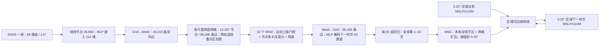

# OneForecast：全球—区域嵌套图网络与十天预报

> Yuan Gao、Hao Wu、Ruiqi Shu、Huanshuo Dong、Fan Xu、Rui Ray Chen、Yibo Yan、Qingsong Wen、Xuming Hu、Kun Wang、Jiahao Wu、Li Qing、Hui Xiong、Xiaomeng Huang，*OneForecast: A Universal Framework for Global and Regional Weather Forecasting*。2025-02-01 首发 [arXiv:2502.00338](https://arxiv.org/abs/2502.00338)；2025 年 7 月发表于 [ICML 2025 / PMLR 267:18658–18697](https://proceedings.mlr.press/v267/gao25r.html)。本笔记于 2026-09-25 核对正式书目、[正式 PDF](https://raw.githubusercontent.com/mlresearch/v267/main/assets/gao25r/gao25r.pdf)可取得的前 5 页、[2025-10-09 arXiv v4 全文和附录](https://arxiv.org/html/2502.00338v4)、[作者代码及配置](https://github.com/YuanGao-YG/OneForecast)。**主要数表与附录据 v4；正式 PDF 后续页本次未完整取得，不能称已逐页核对正式排版。**作者仓库在 2025 年底又加入海气耦合扩展；它不是这篇 ICML 天气论文已经验证的任务。

## 一、研究问题与实际贡献

OneForecast 面向 6 小时一步的全球天气预报，并用预训练全球模型的**未来预报**驱动区域高分辨率网络。它的三个核心组件是多尺度/重点区加密球面图、带动态门控和节点注意力的消息传播，以及神经嵌套网格（NNG）。全球结果最长以 **10 天**的归一化 RMSE/ACC 作系统比较，故列入中期目录；文中 100 天场图仅是长滚动外观/稳定性演示，不是对 100 天真值技巧的证明。[方法 §2、实验 §3](https://arxiv.org/html/2502.00338v4)

论文比较不同训练口径：①把 Pangu、GraphCast、FuXi 和 OneForecast 都按相同一时次监督框架重训；②引用 WeatherBench2 发布的高分辨率、多种训练策略的模型预报，同时将 OneForecast 作少量微调。前者的主表优势**不能直接移植**到后者，也不能被解读为全面超过业务 ECMWF。区域模型演示仅覆盖 **MSLP 和 U10M 两个变量**，不是 0.25°的完整 69 通道业务全球系统。[§3.1–3.3、附录 G.4](https://arxiv.org/html/2502.00338v4)

## 二、资料链、预处理和泄漏边界

| 环节 | 论文及代码明确给出的细节 | 复现时必须核查 |
| --- | --- | --- |
| 全球输入/目标 | WeatherBench2 的 ERA5 **1.5°**、6 小时资料；高空 **Z/Q/T/U/V × 13 层**（50、100、150、200、250、300、400、500、600、700、850、925、1000 hPa）共 65 通道；地面 **U10M/V10M/T2M/MSLP** 共 4 通道。输入只含一个历史状态，输出下一时次 69 通道。 | 这是再分析→再分析学习；没有在本文训练原始卫星辐亮度→预报链。没有直接预测降水通道。 |
| 网格和时间 | WeatherBench2 原生 **121×240**；作者为了计算选 **120×240**，即 28,800 个经纬网格节点。训练 **1959–2017**、验证 **2018–2019**、测试 **2020**；2020 主表约 **1300 起报**。 | 正文没有解释裁去哪一条纬线及其对极区/面积权重的影响；代码 README 中验证文件示例却列 `2017.h5`、`2018.h5`，与论文 2018–2019 口径冲突，不能直接照目录复现。 |
| 标准化 | 各变量用 **1959–2017 训练集**均值与标准差作 z-score；作者发布的 HDF5 `fields` 约为 `[T,69,121,240]`，逐年 T=1460/1464，并有 `mean.npy`、`std.npy`。 | 平均/标准差应只从训练年估计；HDF5 原始 121 纬线和模型实际 120 纬线之间的裁剪位置需查具体 loader。异常相关 ACC 的气候态另取训练 59 年，不是 z-score 均值的简单别名。 |
| 区域资料 | 原始 ERA5 **0.25°** 全球 721×1440，实例从中选 **120×240** 子区；演示只学 MSLP 和 U10M，6 小时一步。 | 论文没有给所有区域的通用零样本测试。作者代码 README 对区域 HDF5 写 `C=69`，但 `Model_nng.yaml` 明确区域输入/输出通道 `[65,68]`，即 U10M/MSLP；文件储存的 69 通道不等于区域网络输出 69 通道。 |
| 对照资料 | 同框架重训的 Pangu/GraphCast/FuXi 与官方 WeatherBench2 发布结果是两套比较。 | Pangu/GraphCast 代码来自 NVIDIA Modulus，FuXi 代码由作者通信取得；公开权重、训练轮次、分辨率不同的第二套图 4/图 9 不是主表的同训练公平榜。 |

资料与切分按[§3.1、附录 C](https://arxiv.org/html/2502.00338v4)，公开文件格式及通道顺序按[作者 README](https://github.com/YuanGao-YG/OneForecast)。论文说两处加密区域是 **0–30°N、105–160°E** 和 **10–30°N、95–35°W**；这是预先选定的两块，而不是推理时自动识别任意极端事件区域。

## 三、架构：从网格到图，再返回网格

图按[原文 Fig. 2、§2、附录 E](https://arxiv.org/html/2502.00338v4)独立重绘。图的 86,400 条 Mesh→Grid 边恰是 28,800 网格点各接其三角面 3 顶点；Grid→Mesh 用与最细网格边长的 **0.6 倍**距离阈值连接。球面网格起自二十面体，递归细分 5 级，只保留最细级节点但跨尺度边同时存在。节点位置特征是纬度余弦及经度正/余弦，边特征是长度及两端三维位置差。不是简单地在经纬网格上做规则卷积。[附录 E.1](https://arxiv.org/html/2502.00338v4)

编码器分别将经纬节点、球面节点、Mesh 边、Grid→Mesh 边和 Mesh→Grid 边投影到 **512 维**，基本 MLP 是线性→SiLU→LayerNorm；ESMLP 将边、源节点、目标节点先各自线性映射再求和并非把三者直接展平成一个变量。每个 MSM 先基于边及两端节点计算**边/源/目的三路门控**（门向量维 64），再对更新后的入边做多头注意力、聚合到节点，与原节点特征经 MLP/残差融合；共 **16 个**传播块。注意力头数与门控隐藏维在已核的论文文字中未给完整可复现实例，不能把“64 维”误写成 64 个注意力头。[§2.2、附录 E.2–E.4](https://arxiv.org/html/2502.00338v4)

区域 NNG 并非简单固定边界强迫：先由已训练全球网络算 **t+1**，裁同区域及周围**两格扩边**，插值到 0.25°并拼接区域 **t** 时刻资料，再由区域网络学 **t+1**。这种输入携带未来的大尺度预报信息，而不是未来 ERA5 真值。对于逐步滚动，全球误差会传到区域；文中没有完整跨区域、跨年份的误差归因。[§2.4、§3.3](https://arxiv.org/html/2502.00338v4)

附录表 5：OneForecast **24.76M 参数、509.27G MACs**；Pangu 23.83M/142.39G，GraphCast 28.95M/1639.26G，输入统一列为 `(1,69,120,240)`。因此它比 GraphCast 计算量低，但**不是**比所有神经天气模型轻；MAC 也不等于同硬件端到端延时、显存和数据准备成本。[附录表 5、G.1](https://arxiv.org/html/2502.00338v4)

## 四、训练、微调和公开配置的对应关系

| 阶段 | 论文说明 | 作者当前公开代码能补充、但不能直接当原论文实验日志的内容 |
| --- | --- | --- |
| 全球初训 | 一时次 **6h**监督，所有主表基线同一框架；**200 epoch**，初始学习率 **1e−3**、余弦退火、选择验证集最佳 checkpoint；实验总体用了 **128 张 NVIDIA A100**。 | [`Model.yaml`](https://raw.githubusercontent.com/YuanGao-YG/OneForecast/main/config/Model.yaml) 当前配置写 `FusedAdam`、`loss='l2'`、`loss_channel_wise=True`、`max_epochs=200`、`dt=1`、`n_history=0`、z-score、配置 batch32；[`train.sh`](https://github.com/YuanGao-YG/OneForecast/blob/main/train.sh) 实际调用覆盖为**每进程 batch16、2 节点×8 GPU**。这些是当前可复现示例，不能反推论文所有 128 卡实验都用相同有效 batch 或该仓库版本。 |
| 全球多步微调 | 附录 G.4 的第二套 WeatherBench2 对照报告 **1 epoch** 和 **2 epoch** 微调模型；论文没有给相应完整 rollout 课程、LR、冻结层和起报配置。 | 作者 README 给 `train_finetune.sh` 从一时次 checkpoint 续训的**示例**：`multi_steps_finetune=2`、10 epoch、LR1e−6；还示例 2→3 步续训。它说明**如何做**多步监督微调，但不是论文 1/2-epoch 曲线的已核实原始参数。 |
| 区域网络训练 | 用全球未来预报为可训练 NNG 区域网络提供强迫；论文主文未分别列区域 optimizer/batch/冻结范围。 | 当前 [`Model_nng.yaml`](https://raw.githubusercontent.com/YuanGao-YG/OneForecast/main/config/Model_nng.yaml) 将区域通道设 `[65,68]`，配置 `FusedAdam`、LR1e−3、200 epoch、z-score；README 示例先准备全球 checkpoint，再运行 `train_nng.sh`、`multi_steps_finetune=1`。不能据此断言全球模型在区域训练时被端到端解冻。 |
| 集合产生 | 用 **Perlin 噪声扰动初值**形成 **50 成员**，各成员独立 6h 滚动，最终取均值。 | 论文未给足 Perlin 振幅、波长、随机种子及针对观测误差的校准程序；不要把它称为可校准的业务集合或扩散生成模型。 |

正文称训练损失为“relative L2”，§2 的式 (训练目标)是整场张量范数之比，而式 (18) 写成**每格每通道平方误差除以对应真值平方再平均**，且式中没有显示防零分母的 ε。两式一般不等价；配置又仅写 `loss='l2'`、`loss_channel_wise=True`。要严格重现，须锁定论文当年的代码 commit、检查 `train.py` 实际损失及归一化后零/近零处理；本笔记不假定三者相同。[§2 式 (18)、附录 F.2](https://arxiv.org/html/2502.00338v4)、[公开配置](https://raw.githubusercontent.com/YuanGao-YG/OneForecast/main/config/Model.yaml)

## 五、模型性能：按表、样本和量纲分开看

### 主表：同框架重训，2020 年约 1300 起报，69 字段归一化平均

| 模型 | 第 7 天 RMSE ↓ | 第 7 天 ACC ↑ | 第 10 天 RMSE ↓ | 第 10 天 ACC ↑ |
| --- | ---: | ---: | ---: | ---: |
| Pangu-Weather | 0.5092 | 0.5738 | 0.6215 | 0.3542 |
| GraphCast | 0.4597 | 0.6692 | 0.6009 | 0.4275 |
| FuXi | 0.5972 | 0.4446 | 0.6981 | 0.2391 |
| **OneForecast** | **0.4468** | **0.6888** | **0.5918** | **0.4457** |

这是[表 1](https://arxiv.org/html/2502.00338v4)的**归一化 69 字段平均**，不是 Z500 的 m²s⁻²、MSLP 的 hPa 等原生单位 RMSE。第 10 天相对同表 GraphCast，RMSE 仅低约 **1.51%**，ACC 相对高约 **4.25%**；表中另有 6h/1d/4d，不能单从第十天读出每个变量和每个区域都更好。图 3 是第十天物理场可视化，图 4 对若干单变量给原生单位的纬度加权 RMSE/ACC；这些图与 69 字段均值是不同尺度。独立的 WB2 发布版别、作者微调 1/2 epoch 结果见图 9，不能混在上表作一个同协议排行。[§3.1–3.2、附录 G.4](https://arxiv.org/html/2502.00338v4)

### 集合：仅 10 个连续起报的均值 RMSE

| OneForecast 版本 | 第 7 天 | 第 8 天 | 第 9 天 | 第 10 天 |
| --- | ---: | ---: | ---: | ---: |
| 确定性 | **0.4268** | 0.4834 | 0.5313 | 0.5809 |
| 50 成员均值 | 0.4393 | **0.4699** | **0.4951** | **0.5167** |

[表 2](https://arxiv.org/html/2502.00338v4)的起报只有 **2020-01-01 00 UTC 起每 12h 一次的 10 例**；同表 OneForecast 集合**第 7 天反而差于确定性**，第 8–10 天改善，第十天均值 RMSE 约低 11.1%。只评集合均值 RMSE，**没有 CRPS、可靠度、spread–skill 或极端事件概率**；不能据此证明集合已校准或 50 成员最优。表 2 的单模型基值也与表 1 不同，因为样本不同。

### 消融、区域、频谱和极端事件

| 实验 | 4 天 RMSE / ACC | 正确解读 |
| --- | --- | --- |
| 固定重点区图：不加密 → 加密 | 0.3793 / 0.6075 → **0.2609 / 0.8099** | 只在**重点区子集**评测。 |
| 区域：无 NNG → 仅边界强迫 → NNG | 0.5828 / 0.2450 → 0.4428 / 0.4711 → **0.2180 / 0.8856** | 只在**特定区域**评测，目标是 MSLP/U10M。 |
| 全球：普通 MLP 传播 → MSM | 0.3921 / 0.9305 → **0.2954 / 0.9577** | 是**全球**评测；与前两组基数不共样本。 |

[表 3](https://arxiv.org/html/2502.00338v4)各组都用 **100 起报、4 天**，但重点区/区域/全球空间集合不同，不能把 0.2180 当作同条件下比全球 0.2954 更低的证据。图 6 的区域图示仅 MSLP/U10M；图 7 的标准化频谱误差/图 8 的表层动能与 Q700 频谱评估（后者约 700 起报）是结构和高频保存证据，但不是所有变量 10 天极值的无偏证明。[§3.3–3.6、附录 G.2](https://arxiv.org/html/2502.00338v4)

附录[表 6](https://arxiv.org/html/2502.00338v4)在所选极端阈值下，OneForecast 的 U10M **CSI 0.14 / SEDI 0.31**、T2M **0.21 / 0.40**，GraphCast 分别 **0.13 / 0.29**、**0.20 / 0.38**；增益很小，原文未在该表周围明确阈值/lead/样本数。更需要谨慎的是附录 F.1 把所谓 false alarm rate 写作 `FP/(FP+TP)`，这实际上是**伪阳性在所有预测阳性中的比例**，不是标准假警率 `FP/(FP+TN)`；因此不宜直接将文中 SEDI 数字与别家标准 SEDI 比较，须按原始计数复算。台风附录[表 7](https://arxiv.org/html/2502.00338v4)报告路径位置误差 OneForecast **157 km**、GraphCast 1.5° **212 km**、WeatherBench2 GraphCast **197 km**、FS-HRES **332 km**；它只基于 Yagi 2018、Molave 2020 两个起报个例，**Yagi 2018 属验证年份而非封存测试年**。追踪采用 MSLP 局地极小并参考 850hPa 涡度等条件，缺少大样本置信区间，不能推出全球台风业务统治力。[附录 F.3、G.3](https://arxiv.org/html/2502.00338v4)

Fig. 5 的第 **100 天** Z500 图强调场形不崩坏；没有同样严谨的 100 天 RMSE、ACC、气候态/持久性基线，也可能已丧失与该日天气真值的对应。理论上的“严格高通”亦依赖门控权重满足谱函数比例条件；实际门控由局地边/节点特征 MLP 学得，论文未给训练中强制该条件的机制。故应把图 7/8 经验频谱改善与 Theorem 2.1 的假设性推导区分，不把定理直接当端到端模型经证明高通。[§2.2、附录 A、G.2](https://arxiv.org/html/2502.00338v4)

## 六、复现清单与研究定位

要重现主结论，先固定**论文时代**的代码/权重版本、ERA5 69 通道顺序、121→120 纬线裁剪、训练年 z-score/59 年气候态，然后逐一重建 1300 起报同框架主表、700 起报 WB2 图、100 起报消融、10 起报集合，不能互相复用数字。训练中应分别记录一步 200 epoch 的实际 batch/优化器/损失、1/2-epoch WB2 对照微调的 rollout 与 LR、区域网络是否冻结全球权重和 0.25°子区经纬界；Perlin 噪声参数与极端阈值/SEDI 原始计数尤其需要补充。若测 10–15 天能力，本文**只给十天量化主证据**，第 11–15 天及跨季节稳定性需新增独立测试；若测全球—区域可泛化性，则需更多气候区、更多变量和边界敏感性试验。[正式书目](https://proceedings.mlr.press/v267/gao25r.html)｜[开放全文](https://arxiv.org/html/2502.00338v4)｜[作者代码](https://github.com/YuanGao-YG/OneForecast)

[返回首页](../../README.md)
