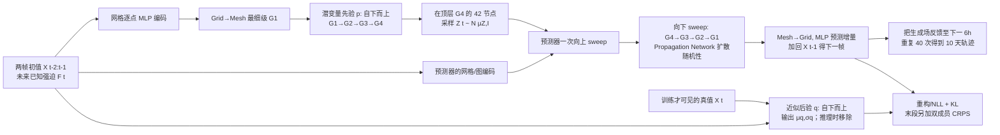

# Graph-EFM：分层球面图上的潜变量中期集合预报

> **书目**：Joel Oskarsson、Tomas Landelius、Marc Peter Deisenroth、Fredrik Lindsten，*Probabilistic Weather Forecasting with Hierarchical Graph Neural Networks*，[NeurIPS 2024 主会正式书目](https://proceedings.neurips.cc/paper_files/paper/2024/hash/492592890311679d7f71559148358973-Abstract-Conference.html)，DOI [10.52202/079017-1316](https://doi.org/10.52202/079017-1316)。[arXiv:2406.04759v2 正文与完整附录](https://arxiv.org/html/2406.04759)（v1：2024-06-07；v2：2024-10-26），[作者全球实验代码](https://github.com/mllam/neural-lam/tree/prob_model_global)、[作者区域实验代码](https://github.com/mllam/neural-lam/tree/prob_model_lam)。本文按开放 v2 的 72 页/附录 H–L 核对；NeurIPS 官方 PDF 约 42.5 MB，浏览器检索因体积上限未完整读取，不声称已逐页复核出版版图像。

## 一、研究问题、贡献与实际时效

已有高水平 AI 全球天气预报以确定性场为主，单条轨迹不能表达多种可能的天气演变；简单扰动初值或模型权重也未必得到合理分散度。Graph-EFM 直接学习 **给定两帧初值与未来已知强迫的条件分布**：在分层图最粗级别采样潜变量，用图传播把随机性逐级传到全球格点。这不是仅把 GraphCast 增加随机噪声。作者同时提出确定性 Graph-FM、非分层 Graph-EFM (ms) 和同资料重训的 GraphCast* 作为对照。[正文 §3–5](https://arxiv.org/html/2406.04759)

文章含两套**不可混排的任务**：全球 WeatherBench 2 / ERA5 **6h 步长至 10 天**，属于中期集合；北欧 MEPS 区域 10 km **3h 步长至 57h**，属于短期 LAM 方法验证。将整篇归入 `medium-range` 是因为全球十天集合是本库关注的主线；区域实验在本篇独立章节说明，**不能拿区域的 57h 结果代表第十天能力**。此外，文中条件分布不包含初始分析场本身的不确定性：所有生成成员共享同一 ERA5 或 MEPS 初值，随机性来自每步潜变量。[§3.1、§5.1–5.2](https://arxiv.org/html/2406.04759)

## 二、原文 Fig. 1 / Fig. 6 的结构重绘

图中的全球网格有 **29,040 点**（121×240，约 1.5°）。Graph-EFM 的四个球面图层为 G1 **2,562**、G2 **642**、G3 **162**、G4 **42** 节点，合计 **3,408** 个跨层计数节点；层间向上/向下均有边，Grid→Mesh 46,158 边、Mesh→Grid 87,120 边。作者以四次二十面体细分构造常规多尺度图，却将初始二十面体的极粗图排除在 Graph-EFM 的分层图之外。对比模型 Graph-EFM (ms) 把各尺度边合并到 G1 的 **2,562 节点**，其潜变量作用于较细的网格图节点；图层区分与顶层随机性是本模型提升空间一致性的核心设计。[附录 C.3、H.1 表 4/Fig. 12](https://arxiv.org/html/2406.04759)

潜变量先验 $p(Z^t\mid X^{t-2:t-1},F^t)$ 的均值由上行图网络输出、方差设为单位阵；训练时近似后验 $q(Z^t\mid X^{t-2:t-1},X^t,F^t)$ 因能读取真实下一帧而另学均值和方差。预测器只根据潜变量、过去两帧与强迫输出**天气增量**并加回上一帧，主推理不从重构损失里的高斯观测噪声采样。每一步重新抽 $Z^t$，并让每个成员沿自己的历史状态滚动；80 个成员不是每一步把 80 个分支全展开成 $80^{40}$。这一机制与 Stormer 的同权重**时距路径平均**有本质区别：Graph-EFM 的成员是从学习到的随机转移核生成的，但仍缺少初值扰动。[正文 §4.3、附录 C.3 算法 3–6](https://arxiv.org/html/2406.04759)

普通 Interaction Network 用接收节点旧特征加残差，容易让顶层潜变量被忽略。作者的 Propagation Network 在边消息里直接加入发送端节点特征，再对接收端邻居消息取平均并加可学习修正；当 MLP 初始输出很小时，信息也能从细层向粗层传、或从潜层向格点传。潜变量先验的上行和预测器的下行使用这种传播层，预测器上行保留 Interaction Network。每层 MLP 为**一个隐藏层、Swish 激活**，非最终输出一般有 LayerNorm；跨图层/处理步不共享 GNN 参数，部分静态特征和网格输入嵌入 MLP 在模型组件间共享。[正文式 (7)、附录 C.2–C.4](https://arxiv.org/html/2406.04759)

## 三、全球 ERA5：资料、时序切分与处理

| 环节 | 原文设置与解读 |
| --- | --- |
| 网格/数据 | WeatherBench 2 的 ERA5 **1.5°、121×240**，原始全球再分析重网格后每 **6h** 一帧；训练不是原版 GraphCast 的 0.25° 网格。 |
| 目标字段 | **83** 个预测量：Z、Q、T、U、V、W 六类高空场×**13 层**（50、100、150、200、250、300、400、500、600、700、850、925、1000 hPa）=78，再加 T2m、U10、V10、MSLP 和过去 6h 累计降水=5。降水字段包含在目标中，而非仅作为外部 forcing。 |
| 已知输入/静态 | TOA 太阳辐射通量、年内/日内正余弦；地形/表面位势、海陆掩码和位置特征。每步 forcing 将相邻 **t−1、t、t+1** 三个时次窗口化，模型另外读前两帧天气。 |
| 时间切分 | 训练 **1959-01-01 12 UTC–2017-12-31 12 UTC**，验证 **2017-12-31 18–2019-12-31 12 UTC**，测试素材 **2019-12-31 18–2021-01-10 18 UTC**（以便 2020 年末初值可滚动 10 天）。正式评分用 **2020 年每天 00/12 UTC** 初值；训练则也纳入 06/18 UTC 初值。 |
| 数值处理 | 各目标变量以训练资料估算均值/标准差并变为零均值、单位方差；纬度格点损失与评分用面积权。作者[公开载入代码](https://raw.githubusercontent.com/mllam/neural-lam/prob_model_global/neural_lam/era5_dataset.py)读 Zarr 的 `fields.zarr` / `forcing.zarr` 和训练统计文件，按上述年份切分、拼接高空/地表字段，并在取样时做三时次 forcing 窗口。代码说明从 1959-01-01 12 UTC 起，是为避开降水前两帧 NaN。 |

表 5 的 83 个变量容易被误算成 69：Stormer 只取五类高空场和四个地面场；Graph-EFM 多 **W×13 层**与降水，且训练起点更早。两个模型的第十天分数因此不能当成只改网络结构的控制实验。[附录 H.2 表 5](https://arxiv.org/html/2406.04759)

## 四、全球 Graph-EFM 的完整训练、微调与参数

模型不是先加载外部气象基础模型权重；论文报告从头训练，再沿同一 ERA5 切分逐渐加长自回归轨迹，并以 CRPS 做末段概率微调。损失的主体是条件 VAE 的变分目标：由 $q$ 编码真值下一帧，最小化加权的 $D_{KL}(q\|p)$ 和重构负对数似然。若 $\lambda_{KL}=1$ 才是严格意义的负 ELBO；论文为避免潜变量塌缩，实际用 0→0.1。全球似然方差固定，由变量时间差分逆方差、垂直层权重和面积权确定，故重构项等价于相关加权平方误差。区域实验的方差则由模型额外预测、NLL 自动调不同变量权重，**两套损失不能说成完全相同**。[附录 D.1–D.2](https://arxiv.org/html/2406.04759)

| 阶段，全球主模型 | epoch | AdamW 学习率 | 每次反传滚动 T（6h/步） | $\lambda_{KL}$ | $\lambda_{CRPS}$ | 作用 |
| --- | ---: | ---: | ---: | ---: | ---: | --- |
| 纯自编码初始化 | 50 | 10⁻³ | 1 | 0 | 0 | 让后验 $q$ 真正使用顶层潜变量，避免完全确定性塌缩。 |
| 单步变分 | 75 | 10⁻⁴ | 1 | 0.1 | 0 | 让推理可用的先验 $p$ 靠近读真值的后验 $q$。 |
| 多步微调 I | 20 | 10⁻⁴ | 4 | 0.1 | 0 | 学习把自身生成场重新喂入模型。 |
| 多步微调 II | 10 | 10⁻⁴ | 8 | 0.1 | 0 | 改善中期滚动稳定性。 |
| 概率微调 | 2 | 10⁻⁴ | 12 | 0.1 | **10⁴** | 变分损失之外加入双成员 CRPS，纠正欠离散；长 rollout 也压制小区域伪影。 |

末阶段的 $\mathcal L_{CRPS}$ 用**两条独立、从推理先验 $p$ 抽样**的成员，按逐格绝对误差与成员间差构造无偏两样本估计；另有一条 $q$ 采样轨迹用于变分损失，故该阶段每次反传共需 **三条轨迹**。CRPS 只约束**逐格边际分布**，不能单独保证多变量与空间联合分布真实；分层图和变分项承担空间结构约束，权重过高会出现棋盘/局地伪影。对照的 Graph-EFM (ms) 虽沿同一训练**阶段**，但使用 $\lambda_{KL}=1$、$\lambda_{CRPS}=10^3$，不能把两者差异全部归因于图结构。[附录 D.2、H.3 表 8、G](https://arxiv.org/html/2406.04759)

网络潜宽 **256**，总参数 **16.3M**，包含只在训练时用的后验网络；Graph-FM 为 30.9M，Graph-EFM (ms) 为 7.7M。全球 Graph-EFM 报告 **1264 GPU-hours**；作者用 **8×80GB A100、BFloat16、数据并行**，该 GPU-hours 约合理论 158 小时串并换算，不是确认的纯 wall-clock 计时。作者只说 AdamW 与按图/验证集调 $\lambda$，未在论文表 6/8 交代可唯一还原的有效 batch、AdamW betas、weight decay、梯度累积、全部种子和重复实验误差条；**不可自行补默认值**。[§5、附录 H.3 表 6–8](https://arxiv.org/html/2406.04759)

## 五、全球 2020 测试：完整引用主文表 1

下面是**同一论文框架下重训**模型的 5/10 天表，z500 的 RMSE/CRPS 为位势 $\mathrm{m^2,s^{-2}}$，T2m 为 K；RMSE 是单值或**集合均值**误差，CRPS 对确定性模型退化为 MAE，SpSkR 越近 1 越符合这一汇总校准诊断。`GraphCast*` 不是 Google 发布的原版 GraphCast；IFS/原版 GraphCast 的跨框架曲线在补图 18–22，应与此表分开。[主文表 1、附录 E/J](https://arxiv.org/html/2406.04759)

| 变量 | 模型 | 第 5 天 RMSE ↓ | 第 5 天 CRPS ↓ | 第 5 天 SpSkR | 第 10 天 RMSE ↓ | 第 10 天 CRPS ↓ | 第 10 天 SpSkR |
| --- | --- | ---: | ---: | ---: | ---: | ---: | ---: |
| Z500 | GraphCast* | 387 | 236 | — | 808 | 498 | — |
| Z500 | Graph-FM | **363** | 223 | — | 825 | 510 | — |
| Z500 | GraphCast*+SWAG | 437 | 269 | **0.07** | 960 | 590 | **0.12** |
| Z500 | Graph-EFM (ms) | 472 | 211 | 0.77 | 756 | 333 | 0.83 |
| Z500 | **Graph-EFM** | 399 | **169** | **1.18** | **695** | **299** | **1.15** |
| T2m | GraphCast* | 1.65 | 1.00 | — | 2.82 | 1.69 | — |
| T2m | Graph-FM | **1.57** | 0.94 | — | 2.82 | 1.66 | — |
| T2m | GraphCast*+SWAG | 2.03 | 1.20 | **0.06** | 3.58 | 2.04 | **0.13** |
| T2m | Graph-EFM (ms) | 1.76 | 0.77 | 0.75 | 2.55 | 1.09 | 0.82 |
| T2m | **Graph-EFM** | 1.64 | **0.71** | **0.98** | **2.32** | **1.00** | **0.99** |

全球表体现的是一个**时效相关权衡**：Z500 第 5 天 Graph-FM RMSE 363 优于 Graph-EFM 399，第 10 天反过来是 Graph-EFM 695 对 Graph-FM 825；T2m 第 5 天 Graph-FM 1.57 优于 Graph-EFM 1.64，第十天 Graph-EFM 2.32 优于 2.82。Graph-EFM 的 CRPS 更低，且 Z500 的 SpSkR 1.15 表示相对该汇总准则**略过度分散**，T2m 0.99 接近 1；“几乎校准”不能扩大成所有变量、极端门槛和空间联合事件都校准。SWAG 对照只有约 0.06–0.13 的 spread-skill 比，严重欠离散。不过这份 SWAG 对照是在 GraphCast* 后续固定学习率 SGD 期间**直接取存下的权重快照**，并未拟合/重采样完整的 SWAG 高斯参数分布，也未扰动初值；其负结果只约束本文这个基线实现，不能外推为 SWAG 普遍无效。[主文表 1/Fig. 3、附录 C.5/J](https://arxiv.org/html/2406.04759)

主文 Fig. 3 显示 MSLP 随 lead 的 RMSE、CRPS、SpSkR 曲线；Fig. 4 展示第十天 Q700 真值、集合均值/标准差及 80 成员中的三个随机样本。补图 18/20/22 给更多变量的对应曲线，但没有逐 lead 原始数表，不从曲线读取伪精确值。补图 23/28 的第十天空间场与图 4 是个例/可视化，不能代替全年统计。图 28 的均值/标准差为了绘图仅用 **20 成员**，主表全球评分则用 **80 成员**；附录 L.3 的 5–80 成员消融说明平均 RMSE 至约 20–25 成员已接近全体，但极端事件概率仍可能需要更多成员。[§5.1、附录 J/L.3](https://arxiv.org/html/2406.04759)

全球单 GPU 批量生成 **80 成员的十天集合约 200 秒**，不是每成员 200 秒，也不能直接当作不同硬件上与 GenCast 的严格加速比。作者在 Hurricane Laura **2020-08-27 12 UTC** 单案例以 50 成员评估：第 7 天有 **7/50** 成员显示目标区域飓风发展迹象，第 3 天 **42/50** 指向登陆。Fig. 7 特别展示一个**事后挑选的最佳成员**，不能把它当提前发布的确定预报；1.5° 网格不能准确验证局地最大风/登陆误差。该案例说明可提供风险情景，却不足以建立频率校准的台风概率或全球极端事件技能。[附录 F/Fig. 7](https://arxiv.org/html/2406.04759)

## 六、北欧 MEPS 区域实验：资料、真实微调与负面结果

作者把 2021-04 至 2023-03 业务 MEPS 的约 **6069 条**预报用作 surrogate 数据：每天 00/12 UTC 起报、每次最多 5 成员；原生约 2.5 km 下采样到 **10 km、238×268**，原 1h/66h 轨迹改取 **3h 步**并因两帧历史/强迫窗口只评到 **57h**。训练与验证起报落在 2021-04 至 2022-06，**2022-07 至 2023-03** 作测试；验证月为覆盖季节而在前段内部选取，不能把整个 2021-04–2022-06 简化成完整训练集。17 个目标包括地面/海平面气压、两类净辐射、2m 与模式底层湿度/温度、500/850hPa 温度、底层/850hPa 风、整层水汽和 500/1000hPa 位势。辐射是过去 **3h 聚合**的净通量（原文称 aggregated），其他量基本为瞬时值；训练同样按字段标准化。[正文 §5.2、附录 I.2 表 10](https://arxiv.org/html/2406.04759)

区域图用 Lambert 投影上的规则四边形：最细层 **6561** 节点、次级 **729**、顶层 **81**，加层间边；10 网格格宽的**边界 forcing 直接取 MEPS 真值预报**，不是已展示从独立全球预报重网格后的在线联动。由此区域分数是受控替代模式试验，不能被写成独立实时业务预测或十天全球技巧。[§5.2、附录 I.1/I.3](https://arxiv.org/html/2406.04759)

区域 Graph-EFM 宽度 **128**、参数 **3.1M**，训练约 **556 GPU-hours**；区域不使用 BFloat16 混精。其从头训练与逐步微调不同于全球：[附录 I.4 表 11–13](https://arxiv.org/html/2406.04759)

| 区域阶段 | epoch | LR | 滚动步 T（3h/步） | $\lambda_{KL}$ | $\lambda_{CRPS}$ |
| --- | ---: | ---: | ---: | ---: | ---: |
| 自编码 | 300 | 10⁻³ | 1 | 0 | 0 |
| 单步变分 | 100 | 10⁻³ | 1 | 1 | 0 |
| 多步变分 | 200 | 5×10⁻⁴ | 4 | 1 | 0 |
| 多步 CRPS 微调 | 50 | 5×10⁻⁴ | 4 | 1 | 10⁶ |
| 更长 CRPS 微调 | 100 | 5×10⁻⁴ | 6 | 1 | 10⁶ |

区域 Graph-EFM (ms) 用同阶段但 $\lambda_{KL}=100$、$\lambda_{CRPS}=10^4$、微调 LR10⁻⁴；这再次使“只换图结构”的因果解释不充分。区域**不**有全球的 12 步尾阶段，不能套用全球参数。主文表 2 关键结果如下：Z500 单位 $\mathrm{m^2,s^{-2}}$、整层水汽 WVINT 单位 $\mathrm{kg,m^{-2}}$，RMSE 为单模型或集合均值，确定性 CRPS=MAE。[主文表 2](https://arxiv.org/html/2406.04759)

| 变量 | 模型 | 24h RMSE ↓ | 24h CRPS ↓ | 24h SpSkR | 57h RMSE ↓ | 57h CRPS ↓ | 57h SpSkR |
| --- | --- | ---: | ---: | ---: | ---: | ---: | ---: |
| Z500 | GraphCast* | **153** | 108 | — | **201** | 138 | — |
| Z500 | Graph-FM | 230 | 162 | — | 354 | 238 | — |
| Z500 | GraphCast*+SWAG | 219 | 136 | 0.08 | 376 | 206 | 0.10 |
| Z500 | Graph-EFM (ms) | 400 | 261 | 0.22 | 711 | 470 | 0.23 |
| Z500 | **Graph-EFM** | 172 | **91** | **0.84** | 219 | **115** | **0.75** |
| WVINT | GraphCast* | **1.51** | 1.01 | — | **2.06** | 1.32 | — |
| WVINT | Graph-FM | 1.64 | 1.08 | — | 2.48 | 1.58 | — |
| WVINT | GraphCast*+SWAG | 1.78 | 1.17 | 0.05 | 2.34 | 1.50 | 0.05 |
| WVINT | Graph-EFM (ms) | 2.39 | 1.43 | 0.16 | 3.51 | 2.12 | 0.13 |
| WVINT | **Graph-EFM** | 1.61 | **0.79** | 0.57 | 2.08 | **1.00** | 0.53 |

这个反例必须与优点一起读：在 57h 区域，Graph-EFM 的 **Z500 RMSE 219 高于 GraphCast* 201**，WVINT **2.08 高于 2.06**，只是在 CRPS 上有明显改善；且其 SpSkR 0.75/0.53 仍欠离散，并非“准确捕获所有区域不确定性”。Fig. 5 与补图 8/9 显示分层生成较多尺度版本更有连贯结构，但过大 CRPS 权重使多尺度版出现棋盘/圆形伪影；图像证据不能改写表 2 的 RMSE 反例。区域 100 成员/57h 在单 GPU 批量约 **140 秒**，不与全球 80 成员/10 天 200 秒做相同任务的速度排行。[§5.2、附录 G/K](https://arxiv.org/html/2406.04759)

## 七、证据边界、改进方向与复现清单

1. **校准的范围**：SpSkR 约 1 只是方差/均方误差比的汇总诊断；CRPS 也是逐格边际概率评分。论文没有充分给多变量联合可靠性、极端阈值 reliability diagram、区域/季节条件校准或独立观测检验。全球 Z500 第十天 1.15 与区域 WVINT 0.53 已说明不能一概称“完全校准”。
2. **架构消融并非单变量控制**：Graph-EFM 对 Graph-EFM (ms) 同时改变潜变量节点位置/数量、总参数 **16.3M 对 7.7M**、$\lambda$ 和图处理方式。差异支持分层设计组合有效，不能单凭表 1/2 严格归因于“分层”这唯一因素。
3. **数据与边界**：全球只有 1.5°/10 天，不能转述为 0.25°/15 天；区域 57h 使用同一 MEPS 数据集的边界值，现场全球模式误差未计入。和 IFS ENS、原版 GraphCast 的补图对比虽有共同 1.5°评分网格，训练分辨率、字段、起报初值仍不统一。[附录 J.1](https://arxiv.org/html/2406.04759)
4. **计算与统计**：模型采样成本低，但训练需要 1264 GPU-hours，论文未做多次重训的置信区间。最大 80/100 成员的普通 RMSE/CRPS 饱和不意味着罕见事件概率也饱和；50 成员 Laura 案例尤其不能当总体技巧统计。[§5、附录 L.3](https://arxiv.org/html/2406.04759)
5. **复现顺序**：锁定 v2/正式版差异与作者 `prob_model_global`、`prob_model_lam` 两分支 commit；对齐 ERA5 83 字段、1959/2018/2020 划分、变量 z-score/forcing 三帧窗口与 2020 00/12 UTC；分别核对全球表 8 和区域表 13 的每次续训权重、$\lambda$ 与步数；最后固定 80/100 成员，单独报告均值 RMSE、无偏 CRPS、SpSkR 和负例变量。作者没有公开到可唯一重建的所有有效 batch/随机种子/权重选择细节时，应列作复现缺口而不推测。

**与文献库其他条目的关系**：这篇填补了 **2024 年中期集合**的重要空白。它与 FuXi-ENS、AIFS-ENS、GenCast 都在生成或评分不确定性，但训练资料、初值扰动、空间尺度和采样机制各不相同；本笔记的数值仅用于原论文内的同协议比较。
