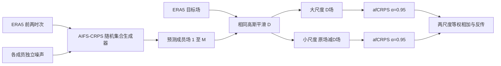

# AIFS 多尺度概率损失：中期集合技巧不变时约束虚假的小尺度纹理

> Simon Lang、Martin Leutbecher、Pedro Maciel，*A multi-scale loss formulation for learning a probabilistic model with proper score optimisation*，[arXiv:2506.10868v1](https://arxiv.org/abs/2506.10868)，2025-06-12 提交。本文为 ECMWF 的方法预印本；本笔记依据[原始 HTML 全文](https://arxiv.org/html/2506.10868v1)和 [AIFS ENS v2 官方实施说明](https://confluence.ecmwf.int/spaces/FCST/pages/620418893/Implementation+of+AIFS+ENS+v2)核对，阅读日期 2026-09-25。**论文的受控实验 ≠ 2026 年业务 AIFS ENS v2 的全套升级。**

## 先读结论

这篇论文追问一个概率预报中容易被平均评分掩盖的问题：逐格点优化 CRPS 可以使集合的每个位置分布看起来合理，却未必保证单个成员的空间纹理和天气尺度正确。作者把场分成平滑的大尺度与剩余的小尺度，分别计算 almost-fair CRPS（afCRPS），再相加训练 AIFS-CRPS。2019 年的八成员 ERA5 实验显示，多尺度版本在论文展示的中期大尺度 fair CRPS 曲线上与普通版本几乎重合，但 12/24 小时的 Z500 场和谱更接近 ERA5，减少普通版本的虚假短波起伏。[论文 §§2–4、图 5–7](https://arxiv.org/html/2506.10868v1)

因此论文实证是“**小尺度表示改善且展示的概率技巧未损失**”，不是“15 天 CRPS 提升了某个百分比”，更不是“仅这个损失就证明业务 v2 优于 v1”。ECMWF 后来确实把多尺度损失列为 v2 改动之一，但同时更换变量上下界、图边和边特征、训练数据/流程，还加入波浪与雪等变量；不能把业务版的全部改变归因于本论文。[ECMWF 版本史](https://confluence.ecmwf.int/spaces/UDOC/pages/599165907/AIFS+Version+History) · [实施说明](https://confluence.ecmwf.int/spaces/FCST/pages/620418893/Implementation+of+AIFS+ENS+v2)

## 1. 为什么逐点 proper score 仍可能留下空间错误

原 AIFS-CRPS 用随机噪声生成多个未来成员，训练时对每个格点的集合样本与真值计算 afCRPS，再按网格权重和变量权重聚合。它是 proper-score 路线：既奖准确性，也通过成员—成员距离约束离散度；相较逐像素 MSE，不会只激励平滑的条件均值。然而，逐点分数只看该格点的**边际**样本分布。如果两个生成系统逐点的样本分布相似，但其中一个成员到处含细碎波纹，逐点损失本身不直接告诉网络“这些波纹的空间尺度不对”。这不是说 CRPS 数值无效，而是说它没有单独检验成员的空间联合分布。[论文引言及式 (1)](https://arxiv.org/html/2506.10868v1)

作者用一个可控的周期域正弦波试验解释这一点：真值和预测各是随机相位、单位振幅的波，预测波数与真值波数可不同。每一波数条件下以 **8 成员、4000 次实现**计算 fair CRPS。普通逐点评分对预测波数近乎不敏感，三尺度版本则能识别真值波数。该图 3 是**一维动机试验**，不能直接当成真实天气的 10–15 天评分；它只证明设计多尺度损失有必要的机制可能性。[论文 §2.1.1、图 1–3](https://arxiv.org/html/2506.10868v1)

## 2. 损失函数：分解什么、怎样计分

对场 $\phi$ 定义逐渐减弱的平滑算子 $D_1,D_2,\ldots$，其中 $D_1$ 最强、保留最大尺度。一般 $n$ 尺度分解为 $D_1\phi$、$D_2\phi-D_1\phi$、……、$\phi-D_{n-1}\phi$；这些分量相加恰好还原原场。每个预报成员和目标真值**使用同一组滤波器**，然后在每个尺度分别计算概率分数并加权求和。这是先分解**物理场**再求 score，而不是把同一个原场 CRPS 简单乘两个权重。[论文式 (1)–(2)](https://arxiv.org/html/2506.10868v1)

本文天气实验只使用两个尺度：$L=D(\phi)$ 是高斯平滑大尺度，$S=\phi-D(\phi)$ 是剩余小尺度；$\mathcal L=\operatorname{afCRPS}_{0.95}(L_{1:M},L_y)+\operatorname{afCRPS}_{0.95}(S_{1:M},S_y)$，两项权重均为 **1**。高斯核标准差为网格间距的 **8 倍**，权重逐行归一，具体稀疏插值矩阵由 ECMWF 的 MIR 工具生成。这里的 8 倍是核宽参数，不等于某个固定的 8 km 或 8° 半径；N320 是非均匀经纬距的 reduced Gaussian grid。[论文 §2.2.1](https://arxiv.org/html/2506.10868v1)

afCRPS 取 $\alpha=0.95$，为 fair CRPS 与普通样本 CRPS 的线性混合。fair 版本有利于只用少数成员训练，但存在“其他成员都贴真值时可留下一个成员不受约束”的退化形式；保留 5% 普通 CRPS 成分以避免这一问题。**不要把 $\alpha=0.95$ 误记成两个空间尺度的权重**：尺度权重均为 1，$\alpha$ 属于每个尺度内部的有限集合评分。[论文 §2.2.1 式 (3)](https://arxiv.org/html/2506.10868v1)

### 原创重绘：同一集合的两尺度监督

图依据原文式 (1)–(3) 自绘，只示意损失支路；**不把业务 v2 的波浪/雪输出头画成论文实验已有的模块**。[论文方法](https://arxiv.org/html/2506.10868v1)

## 3. 数据、加工、结构及三阶段训练

论文比较的两版模型都在约 **0.25° N320 reduced Gaussian grid** 上运行。主实验仅用 ECMWF **ERA5 1979–2017 训练、2018 验证**；**不做**原 AIFS-CRPS 论文中的 IFS 业务分析微调。2019 年 ERA5 分析场作为独立起报/验证，初值扰动来自 ERA5 的 ensemble of data assimilations（EDA），并非网络完全从原始观测自行生成初值。空间滤波通过 MIR 的稀疏矩阵乘法施加于每个预报成员与验证场。[论文 §2.2、§3](https://arxiv.org/html/2506.10868v1)

骨干沿用 AIFS-CRPS 的编码器—sliding-window Transformer 处理器—解码器概率集合路线；多尺度论文本身没有独立发布一套新主干结构或重新列出所有输入变量、归一化均值/标准差、网络宽度和显存。完整原型字段/噪声注入及压力层权重可见[本库 AIFS-CRPS 原论文精读](37-aifs-crps.md)，但**不能把那篇的 IFS 微调数据或 15 天 50 成员结果自动当成本论文的实验**。[本文 §2.2.2](https://arxiv.org/html/2506.10868v1) · [原 AIFS-CRPS](https://arxiv.org/abs/2412.15832)

| 阶段 | 共同设置 | 普通损失对照 | 多尺度试验的权重来源与更新 |
| --- | --- | --- | --- |
| 1：一步 6h | **300,000** 更新；AdamW、batch **16**；峰值 LR **1e−3**，1000 步线性 warm-up 后余弦降至 0 | 逐点 afCRPS | **复用这一步普通损失预训练权重**，不是多尺度版本独立从零训练 |
| 2：两步 12h | **60,000** 更新；峰值 LR **1e−5**，100 步 warm-up 后余弦降至 0 | 继续逐点 afCRPS | 从共同一步权重出发，改用两尺度 afCRPS；主干继续更新 |
| 3：渐进滚动 | 约 **45,000** 更新；恒定 LR **1e−6**；每 epoch 增 6h，最多 **72h/12 步** | 继续逐点 afCRPS | 延续第 2 阶段的多尺度权重，进行相同滚动课程 |

三阶段共同 AdamW $\beta_1=0.9,\beta_2=0.95$、weight decay **0.1**。因此严格的“微调”口径是：**多尺度分支从普通损失的一步预训练检查点分叉，并在后续两阶段改目标继续更新**；本论文没有 IFS 分析资料微调，也没有冻结编码器或单训输出头的描述。作者未在这篇短文中独立列出不同随机种子的重复次数、训练 GPU 型号、所有字段标准化常数或两尺度滤波矩阵文件；复现不能补造。[论文 §2.2.2](https://arxiv.org/html/2506.10868v1)

## 4. 评估协议与图表证据

2019 年**每天 00 UTC 起报**，两模型各产生 **8 个成员**；起点 ERA5，扰动用 ERA5-EDA。图 5 在北半球温带/高纬区对 Z500、T850、850 hPa 风速比较 fair CRPS，验证前重网格到 **1.5°**。作者称曲线几乎重叠，并说其他变量/区域相同但**正文未展示其全表**。所以“无损技巧”是已展示评估内的陈述，不等于所有气象变量、极端阈值及全球 15 天各日都做了可见的等效性检验。[论文 §3、图 5](https://arxiv.org/html/2506.10868v1)

| 原文图/实验 | 可核验参数或读图结论 | 如何使用、不能怎样使用 |
| --- | --- | --- |
| 图 1–3，一维正弦试验 | **8 成员 × 4000 实现**；三尺度 fair CRPS 能分辨真值波数，逐点版本近乎不能 | 机制试验；不代表全球天气的量化提升 |
| 图 4，850 hPa **v 风分量** | 对 ERA5 V850 做大尺度平滑和残差分解 | 仅示范监督目标；不要误标成风速或 u 分量 |
| 图 5，2019 北半球 fair CRPS | Z500、T850、850 hPa 风速的两版曲线近乎重合；验证格距 **1.5°** | 无作者公开表格精确值；不从曲线像素伪造改善百分比 |
| 图 6，2019-01-01 00 UTC 个例 | Z500 **588 dam** 等值线：普通版局地多细纹，多尺度版更接近次日 ERA5 | 单起报、单成员示例；正文叙述称 12h，图注却写 **24h**，以图注的起报/验证时间为准并保留冲突 |
| 图 7，12h 波数谱 | 单成员、**11 个初始日**平均；Z500 小尺度虚假能量受抑，T850 差别较小 | 并非长期集合可靠性检验；各变量响应不等 |

图 6 的正文“12 小时”与图注“2019-01-01 00 至 2019-01-02 00，24 小时”不一致。笔记不自行消除矛盾；如要复刻案例，应以明确的两个时间戳构造 24h，并在作者代码/勘误出现后再核对。图 7 也只汇总 11 个初始日，无法证明所有天气形势或第 15 天的波谱都被改善。[论文 §3、图 6–7](https://arxiv.org/html/2506.10868v1)

## 5. 与业务 AIFS ENS v2 的关系：严格分版本

ECMWF 将这篇方法论文列为 [AIFS ENS v2 模型卡](https://huggingface.co/ecmwf/aifs-ens-2.0)的两项引用之一，另一项是原 AIFS-CRPS。业务 v2 自 **2026-05-12 06 UTC** 运行，N320 约 31 km、四次日内起报、6h 输出到 **15 天**；模型卡称 **51 成员**。新增 10 hPa 层、波浪/雪等变量，另有边界约束与更密解码器图边。它仍依赖 ECMWF 业务初值，官方实施说明明确称没有把原始观测直接用来训练 AIFS ENS v2。[实施说明](https://confluence.ecmwf.int/spaces/FCST/pages/620418893/Implementation+of+AIFS+ENS+v2) · [模型卡](https://huggingface.co/ecmwf/aifs-ens-2.0)

| 不能混合的对象 | 本篇 2025 方法实验 | 2026 业务 v2 |
| --- | --- | --- |
| 资料/阶段 | ERA5 **1979–2017** 训练，2018 验证；**无 IFS 微调** | 官方称 ERA5 **1979–2022/300k 步**预训练，再在 **2018–2024** 业务及 50r1 esuite 分析上 **7900 步**微调 |
| 集合/评估 | **8 成员**、2019 年逐日 00 UTC 起报 | **51 成员**、00/06/12/18 UTC 业务运行；官方另有 2026-01–03 scorecard |
| 模型改变 | 共享一步预训练后，只比较普通 vs 两尺度损失 | 多尺度损失**加**变量边界、图边/特征、数据范围和新增输出 |
| 能归因的结论 | 本论文控制设置下的小尺度谱改善、图 5 大尺度 fair CRPS 近似持平 | 业务整体改动的性能只能由同初值版本 scorecard 或专门消融评估，不能归因于损失单项 |

官方实施页称业务微调 7900 步、batch 16 与余弦学习率，而模型卡的硬件段又称“batch size 1、每模型实例分两张 GH200、集合实例四张 GPU、共 32 张/约一周”。这很可能分别是**全局训练批量**与**每设备局部批量**，但页面没有在同一表中显式解释，复现时须核对 Anemoi 配置，不应强行把它们视作同一个 batch 概念。IFS 50r1 原型 esuite 分析数据官方标注不向用户开放，造成业务 v2 完全复现实质障碍。[实施说明训练段](https://confluence.ecmwf.int/spaces/FCST/pages/620418893/Implementation+of+AIFS+ENS+v2) · [模型卡训练段](https://huggingface.co/ecmwf/aifs-ens-2.0)

## 6. 我的判断与可复验路线

我认为这个工作最重要的是把“逐格点概率评分”和“单个成员的空间结构”拆开评价。两尺度目标保留了 afCRPS 的有限集合训练效率，同时让网络显式承担不同尺度的监督；小波或球谐滤波也可作为未来替代，但本文**只验证高斯平滑加残差这一个天气配置**。它没有报告系统的滤波核宽/尺度权重搜索，也没有评估极端降水邻域技巧、联合能量分数、位相误差或业务 v2 的逐模块消融，所以不能推出普适最优的谱权重。[论文讨论 §4](https://arxiv.org/html/2506.10868v1)

独立复验应固定 2019 起报与 EDA 初值、8 成员、N320 训练/1.5° 评分，以及同一步检查点分叉；依次重做图 5 的概率分数、图 7 的波数谱，并增加逐日 1–15 天的谱/空间邻域/极端阈值评分及多种随机种子。若研究“v2 增益有多少来自多尺度损失”，则还需控制新增数据、变量边界和图边，做真正的业务 v2 单因素消融；直接拿 2019 方法试验对 2026 业务 scorecard 不能回答这个问题。

[返回首页](../../README.md) · [返回总表](../../气象大模型_中期预报论文追踪.md)
