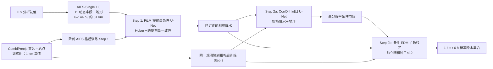

# SwAIther-Precip：提前量条件订正与公里级概率降水降尺度

## 文献信息与适用边界

- **题名**：*SwAIther-Precip: Lead-Time-Aware Bias Correction Enables Kilometer-Scale Downscaling of Global AI Precipitation Forecasts over Switzerland*
- **作者**：Dan Assouline、Erwan Koch、Federico Amato、Filippo Quarenghi、Daniele Nerini、Thibaut Loiseau、Kyle van de Langemheen、Tom Beucler。
- **版本**：[arXiv:2605.16163](https://arxiv.org/abs/2605.16163)，v1 2026-05-15，本文按 [v2（2026-06-08）全文及附录](https://arxiv.org/html/2605.16163v2)阅读；[作者代码、配置及复现说明](https://github.com/danassou/swaither-precip)。截至本次核查为预印本，不能写成已发表期刊论文。
- **任务**：从 ECMWF 确定性 AIFS-Single 1.0 的瑞士区域粗格预报，生成 1 km 网格、6 小时累计降水的概率集合。真正测试的提前量是 **6–144 小时（6 小时步长，最多 6 天）**；这是中期的前段/过渡研究，**没有第 10–15 天的实证技巧**，也不是第 1–3 周的 S2S 研究。

## 为什么需要两步而不是直接“放大”AIFS

AIFS 的粗网格降水已经携带有用的事件时间和大尺度分布信息，但瑞士阿尔卑斯地形下，雨区覆盖、振幅及位移误差会随提前量变化。若直接把偏湿、偏宽的雨区交给扩散超分辨率模型，后者可能把错误的天气形势细化成看似可信的局地雨纹。作者因此让**提前量条件的确定性网络先订正粗格状态**，再让**不知提前量的生成网络只做空间细化**。这也解释了为什么第二步不必把 500/850 hPa 的全套气象场再搬到公里格网上。

原文图 1 的数据流可概括为下述重新绘制的示意图（非原图复制）：

图中的 Step 2 训练输入被论文定义为**由真值粗化得到的降水**，推理才换成 Step 1 输出。因此两模块**独立训练、串行使用**，并没有联合端到端微调，更没有对 AIFS 基础预报器再训练。原文还提出直接多变量端到端生成的 Strategy 2，但真正做的只是其**回归 U-Net 代理消融**，不是等预算的全扩散端到端比较；联合优化 Strategy 3 没有实验。

## 资料：来源、时空对齐、缺测与变换

| 环节 | 原文/作者提供的信息 | 复现时必须注意 |
|---|---|---|
| AIFS 驱动 | 用官方 AIFS-Single 1.0 权重和 IFS 分析初值生成 **2019–2023** 年预报；24 个 6h 提前量，瑞士窗口约 **23×37** 粗格、名义约 **31 km**。 | 不是 AIFS-ENS，也不是用业务实时观测直接学习的区域预报器。作者没有开放当年生成的完整 AIFS 数据集。 |
| Step 1 输入 | 11 个动态通道：总降水、对流降水、总云量、10m u/v、500/850 hPa 比湿、温度、位势；另有地形静态通道。 | 以 [作者 Step 1 YAML](https://github.com/danassou/swaither-precip/blob/main/conf/config_training_aifs_single_lt_aware_FiLM_Time_regression_STEP1.yaml)的字段名为准；图 2 只画部分字段，不能只按图 2 计输入。 |
| 观测真值 | MeteoSwiss **CombiPrecip 雷达＋雨量计融合**，瑞士及周边约 **640×710** 像素、约 **1 km**。高频观测汇成 **mm/6h**；Step 1 的标签再粗化到 AIFS 网格，Step 2 的标签保留公里格。静态地形来自 SwissTopo DHM25。 | 正文称原始数据有 10 分钟产品，作者数据文档又称使用 1 小时版本；二者必须分清“产品分辨率”和“本次取得/累计输入”，不能自行断定全部训练样本从 10 分钟原档直接累加。 |
| 雨量清洗 | AIFS 降水先转统一 6h 累计并把少量负值裁到 0。CombiPrecip 对每个降水场的非零像素拟合 Gamma 分布，以其 **99.5% 分位**裁极端异常；论文说只保留足够湿润的样本，作者文档给出 **>99.5% 零像素**近全干场过滤。 | 尾部裁切会影响真实极端强雨的可恢复性；不能把下文 20 mm/6h 网络输出上限理解为原始观测硬上限。 |
| 归一化 | 降水做 `log(1+x)` 后，再用训练数据统计量缩放。低/高分辨率降水共用物理单位；生成后逆变换、裁非负，按 Step 1 湿区掩膜过滤并以 **0.1 mm/6h** 删除毛毛雨；观测也同阈值评分。 | 论文正文写训练集 min–max，作者[预处理文档](https://github.com/danassou/swaither-precip/blob/main/docs/data_preparation.md)写 **0.5/99.5 分位 robust min/max**；文件名及脚本配置也有版差。两者并非同一变换，精确复现需检查对应 checkpoint 的 JSON 统计量。 |
| 观测到粗格 | 正文以“空间聚合”描述；作者数据文档说**质量守恒块均值**、不可用线性插值代替。论文附录 D 某评分对照又写到双线性粗化。 | 不同实验/代码路径的重网格口径并不完全一致，不能凭单句话推定所有阶段都用同一算子；训练与评分要分别对齐。 |

主试验按周交错划分：每个日历周 **前六天训练、第七天测试**，同一有效时刻的不同提前量必须留在同一侧；日内用于训练/主评分的是 06–12 与 18–00 UTC 两个 6h 累计窗口，00–06 与 12–18 UTC 留作小时窗外推诊断。论文明确说**没有单独验证集用于系统调参**，比较多种结构和超参应被看成方法研究。作者另外训练 **2019–2022→2023** 的按年留出模型，不能把其结果与主周切分成绩当成同样难度的测试。周界训练/测试样本中心相隔 12h；附录的场级自相关约 12h 低于 0.2，但区域均值自相关约 36h 才低于 0.2，故“无泄漏”只针对作者检查过的空间/时间尺度，并不能证明每一场天气型独立。

## 网络、目标函数、训练和微调

### Step 1：提前量条件粗格订正

主干为带低层注意力的卷积 U-Net。离散提前量 `ℓ∈{1,…,24}` 编码成嵌入，MLP 产生逐通道缩放/平移，输入经 `FiLM(x,ℓ)=x·(1+γℓ)+βℓ` 后送入 U-Net。输出为 **经 FiLM 改过的降水通道＋可学习标量×U-Net 残差**；标量初始化 0。这样刚开始不需从零合成降水，但它的零残差基线也**不是原样 AIFS**，而是提前量相关的仿射校准。网络输出限在 **0–20 mm/6h**，是训练稳定与软正则的选择。

损失为粗格 CombiPrecip 对齐标签上的 **Huber（δ=1）** 加 `λ × 跨提前量一致性损失`：对同一有效时刻、不同起报提前量的订正图计算均方差并按可用提前量归一。作者首选 `λ=2`，并在前 **5 epoch** 暖启正则。这个项鼓励共同的降水状态，却不能让本来有不同不确定度的长短预报变成真正等价的样本；它也不负责时间序列成员一致性。

按论文 v2 附录 C.1 **直接解析的超参**：Step 1 `model_channels=64`、通道倍率 `[1,2,2]`、注意力分辨率 `[4]`、`N_grid_channels=4`、提前量嵌入 **64**、FiLM MLP 隐层 **256**、Adam 学习率 **2×10⁻⁴**、总 batch **1024**、seed **42**、`amp-bf16`。主模型 `λ=2`。正文没有披露精确总 epoch/参数量；配置文件中训练时长以 processed samples 表示，不能直接改写成论文 epoch 或墙钟。

作者还检验了在单阶段内逐步解锁长提前量的 **curriculum**。正文举例先 6–48h 四个 epoch、再覆盖更长时效；主 `λ=2` 模型的作者 YAML 则**关闭 curriculum**。结果中 `λ=2 + curriculum` 的粗格湿区 MSE **0.072**，反而差于不加 curriculum 的 **0.066**，不能说课程学习必定有效。

**Multi FT 要注意正文与附录的实质差异。** 正文 §2.3.4 将它概括成三阶段（短 lead `λ=0`→中长 lead `λ=0`→全 lead 小 LR、`λ>0`）；但 v2 **附录 C.1**与[作者复现文档](https://github.com/danassou/swaither-precip/blob/main/docs/reproducing_paper.md)均列 **五阶段**。精确日程如下，阶段间从前一检查点继续更新权重，非五个独立模型投票：

| 阶段 | lead index（0-based） | 大致提前量 | Adam LR | `λ_time` / warm-up |
|---:|---|---|---:|---|
| 1 | 0–7 | 6–48h | 2×10⁻⁴ | 0 |
| 2 | 8–15 | 54–96h | 2×10⁻⁴ | 0 |
| 3 | 0–23 | 全 6–144h | 2×10⁻⁵ | 1.0 / 10 epoch |
| 4 | 12–23 | 78–144h | 1×10⁻⁵ | 0.3 / 3 epoch |
| 5 | 16–23 | 102–144h | 2×10⁻⁵ | 0 / 配置列 3 epoch，但此时 λ=0 |

附录另列 Multi FT 共同设置：Adam、Huber δ1、batch1024、`lr_decay_rate=5e5`、bf16、seed42。论文没有证明这五阶段中的每个单独是必要的；正式评分只能支持整套 Multi FT 这一配置。

### Step 2：观测训练的 CorrDiff 式空间细化

先训练回归 SongUNetPosEmbd，把**粗化的观测降水＋海拔**映射到高分辨率观测的条件均值；之后固定回归器，训练条件 EDM 扩散 U-Net 对**高分辨率残差**去噪。扩散条件含粗格降水及回归输出，训练不是拿 AIFS 的所有大气通道直接喂扩散。Step 2 本身不输入提前量，推理逐提前量独立取随机种子，得到每起报每 lead **12 个成员**。

v2 附录 C.1 两网均为 `model_channels=64`、倍率 `[1,2,2]`、注意力分辨率 `[152]`、`N_grid_channels=4`、正弦网格位置编码、Adam LR **2×10⁻⁴**、`lr_decay_rate=5e5`、总 batch **2**、bf16、seed42；回归用 **L2**，扩散用 **EDM denoising**，仅扩散网启用高分辨率回归均值条件。扩散把 `embedding_type=zero` 用于噪声级嵌入而非通常的 positional：附录消融显示 positional 的湿区 MSE **10.33→10.29**、CSI **0.322→0.325**略好，但 CRPS **0.434→0.447**变差，故作者按概率技巧选择 zero。公开扩散 YAML 还列 **448×448 patch、每输入 10 patch**；这是当前复现配置，论文附录未把这些列入最终超参表，不应不加说明地说它们由论文主实验保证。

**重要复现边界**：正文称 Step 2 用粗化 CombiPrecip 作 perfect-prognosis 输入；当前作者 Step 2 YAML 的 `low_res_file` 却指向名字以 `AIFS_Single_pred` 开头的 NetCDF，注释仍称观测粗化输入。仅凭文件名和 YAML 不能证明训练时到底读入哪一变量，也不能声称这矛盾已解释；需有原始数据与固定检查点核验。作者仓库**不再分发** AIFS 预测/CombiPrecip 数据或论文权重。仓库复现文档估算完整重训约 **5–10 GPU-days**，此为估算而非论文实测成本。

## 评价协议与可抄录的模型性能

粗格 Step 1 与公里格全管线用**不同网格、不同数值尺度**评分，不能把两套 MSE 直接对照。雨/无雨阈值为 **0.1 mm/6h**；CSI 看命中、FSS/avFSS 看空间邻域（`n=1,5,17`，作者分别作像素、约25km、约85km 解释）、SAL/eSAL 拆形状/幅度/位移。CRPS 对 12 成员集合评分，PIT 随机化以处理 0 雨点质量。功率谱采用共同湿区的 `log(P+0.1)`、二维谱径向平均，比较 **100–600、20–100、2–20 km** 三波段；谱比低于 0.5 的波长定义有效分辨率。全管线太贵，只在约 **四分之一测试时刻**生成 12 成员，仍覆盖各季和全部 24 leads。

### 粗格订正：正文图 3–6 与消融

| 模型/设置 | 跨 24 leads 平均 `MSE_wet` | 其他关键证据 |
|---|---:|---|
| 原 AIFS，B0 | **0.088** | `FSS₅=0.607`；雨区过宽、偏强。 |
| 最强传统基线 B4，逐格多变量线性回归 | **0.073** | `FSS₅=0.800`，胜过仅全局仿射订正。 |
| `UNet λ=2` | **0.066** | 主要低 MSE 候选；6h MSE_wet **0.048**。 |
| `UNet Multi FT` | **0.065** | 6d MSE_wet **0.085**；长时效更好，但下游 CRPS 并非最优。 |
| `UNet λ=2 + curriculum` | **0.072** | 比 λ2 无 curriculum 的 0.066 差。 |
| ViT＋FiLM | **0.071** | 不可据此概括 Transformer 在其他网格/参数规模较弱。 |

图 4/5 报告：6 天专用单 lead U-Net 的粗格 `MSE_wet=0.100、CSI=0.408`，Multi FT 为 **0.085、0.429**；但 6h 单 lead 专家 `CSI=0.636、FSS₅=0.904`，略高于多 lead 的 **0.613、0.898**，说明联合训练的优势集中在长 lead。图 6 的 18h/72h 两例表明订正雨区更集中，但 72h 图仍更平滑。直接端到端回归代理在 72h `MSE=0.093、CSI=0.344、FSS₅=0.647`，优于/劣于何者必须限定为**与粗格阶段/代理对照的不同输出协议**；本文仅将它当 Strategy 2 计算预算不对等的提示，不能据此断定所有端到端扩散法失败。

### 公里格完整管线：附录 Table 5 的原始数值

以下均是**相同 Step 2 超分辨率模型**，只换前段订正器；列出的 CRPS 为 6h、3d、6d 与 24 lead 平均。它们是绝对 CRPS（单位 mm/6h），不是相对百分比：

| Step 1 来源 | CRPS 6h | CRPS 3d | CRPS 6d | CRPS 均值 | CSI 均值 | avFSS₅ 均值 | `MSE_wet` 均值 |
|---|---:|---:|---:|---:|---:|---:|---:|
| B0：原 AIFS | 0.770 | 0.841 | 0.953 | **0.835** | 0.258 | 0.372 | 13.637 |
| B4：逐格多变量回归 | 0.482 | 0.487 | 0.506 | **0.488** | 0.270 | 0.407 | 13.469 |
| SwAIther `λ=2` | 0.373 | 0.450 | 0.532 | **0.434** | 0.322 | 0.449 | **10.328** |
| SwAIther Multi FT | 0.384 | 0.497 | 0.569 | **0.469** | **0.324** | **0.450** | 10.560 |

按均值 `(0.835−0.434)/0.835≈48%`，`λ=2` 相对**原 AIFS 经同一生成器**的 CRPS 改善成立；相对 B4 约 **11%**。Multi FT 虽粗格 MSE 最低，下游 CRPS 反而 **0.469 > 0.434**，不能简单按阶段一损失挑最终模型。6 天单 lead 专家 CRPS **0.604**，多 lead λ2 **0.532**，相对降低约 **12%**（正文四舍五入称 13%）；其湿区 MSE **14.506 vs 11.889**。6h 专家 CRPS **0.366**，略胜多 lead **0.373**，并非全 lead 都严格超越。

原文图 7 是短 lead/长 lead 雷达图加全部 lead 的多指标热图：向外代表更好，**不同轴分别归一**，不能从图上直接读绝对损失。图 8 的随机化 PIT 显示集合总体接近校准，但 **≥1 mm/6h** 的强降水分层 KL 约 **1.7–3.0**，并非强事件也完全可靠。图 9/10 的谱比：SwAIther 大尺度 **0.85–0.93**、小尺度 **0.88–0.98**，**20–100km 中尺度只有 0.63–0.79**；原 AIFS 路线小尺度 **1.7–1.9**（偏强），B4 低于 **0.3**（方差塌缩）。有效分辨率约 **4km**，指**谱阈值定义**，不是说 1km 每个像素的降水位置已可准确预报；正文摘要保守表述“至第 5 天”，讨论又写“至第 6 天”，应按具体图/时效区分。

图 11 显示 2 天提前量的订正输入、四个扩散成员及分位图，成员纹理不同而大尺度形势近似；图注却同时写“四个展示/12 个已有成员”和“Q05/中位/Q95 按所有 **20** 成员算”，与方法及 Table 5 的 **12** 成员协议矛盾，**不推定某个数字正确**。图 12/附图 21–27 只展示时序或 2023-11 强雨个例，不能补充为独立的全年极端阈值技巧统计。

## 结论应怎样使用、不能怎样使用

1. **最有价值的可迁移设计**：把随 lead 漂移的预报偏差留在粗格多变量层解决，把与 lead 无关的纹理生成移到仅两通道的高分辨率层；后段可单独用观测训练，样本组织和计算更省。这是可检验的结构假设，不等于“一切观测区域都适用”。
2. **强雨和中尺度仍是短板**：订正把 AIFS 约 **58% 湿像素**压到接近真值的 **28%**，但 Huber 回归容易压低峰值；Multi FT 在完整管线的幅度偏差 `eA≈−0.010` 较好，而中尺度谱缺失仍在。0–20 mm/6h 输出帽虽在作者对比中使完整 CRPS **0.434** 优于放宽到 100 的 **0.437**，对高尾风险存在天然疑问，论文并未给独立极端事件年际检验。
3. **概率集合没有连贯轨迹**：不同 lead 独立扩散随机种子，单个成员的降水序列不是物理一致的 6 天轨迹。不能直接按一个成员累积周降水或驱动逐小时洪水模型而不检查时序一致性。
4. **外推和复现的边界**：资料是瑞士单地区、2019–2023、周交错测试；完整数据/权重未发布。按年测试 2023 时同一周训模型 CRPS **0.533**、按年训模型 **0.507**，较主周切分 **0.434** 更差；2023 夏季湿区 MSE **31.521**，冬季 **2.380**。这更像强季节分布差异而非单个模型的普适跨年保证。原文与公开配置在三/五阶段、粗化算子、标准化、Step 2 输入文件等细节有差异，复现实验需要固定代码提交、数据清单和 checkpoint，不能把当前 `main` 配置直接等同论文已发表权重。

## 本文之外的相邻研究

SwAIther 的 6 天瑞士局地降水任务与 [Lima 等第 1–3 周瑞士极端降水降尺度](../s2s/117-lima-s2s-extreme-precip-downscaling.md)地理区域相同但实验不同：后者用 IFS S2S、两次选定 48h 事件、非配对扩散桥并对比 WRF；两文的 CRPS/CRPSS、成员数、原始输入和提前量不能合并为一张排行榜。
