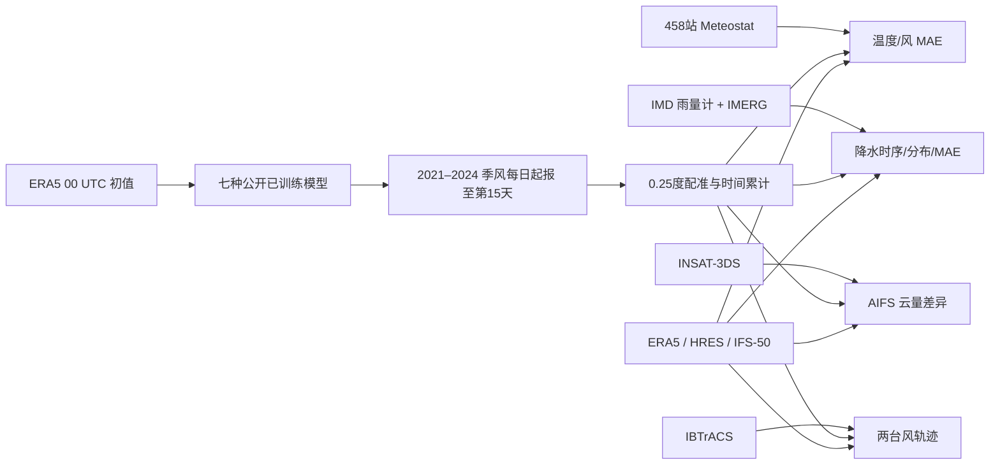

# MAUSAM：以观测为真值重评南亚季风的七种 AI 天气模型

> Aman Gupta、Aditi Sheshadri、Dhruv Suri，*Journal of Advances in Modeling Earth Systems* **18**(8), e2025MS005568，2026-07-30 首发，DOI [10.1029/2025MS005568](https://doi.org/10.1029/2025MS005568)。[arXiv:2509.01879v1（2025-09-02）/v2（2025-09-28）](https://arxiv.org/abs/2509.01879)；[作者 Zenodo 支持代码与图表数据 v1](https://doi.org/10.5281/zenodo.19447921)。本文按**期刊正式版**阅读，核对日期 2026-09-25。

## 先读结论与归档理由

MAUSAM 是 **Measuring AI Uncertainty during South Asian Monsoon**，本质是跨模型、跨真值的**评测研究**，不是新提出的 MAUSAM 预测网络。作者对七种已训练模型做 2021–2024 年季风期每天起报、最长 **15 天**的滚动预报，因而归中期目录；另有 2024 年 **90 天单起点的气候统计压力测试**与 2025 年季风停滞个例，但它们不能替代多年逐日 S2S 技巧评估。[期刊 §2.1、§4.7](https://doi.org/10.1029/2025MS005568)

最关键的发现不是“AI 不会预报季风”，而是验证真值一换，结论会变：对 2022 年印度 458 个站的地面温度和风速，AI 预报的 MAE 明显高于对 ERA5 的 MAE；正式正文图 2 解释第 1–3 天差距为 **60%–100%**，第 10 天 **30%–50%**。七模型中 AIFS 整体较稳健，但它也会错过局地极端雨、午后高温及高频云变化。作者摘要的“15%–45%”与正文图 2 的这些比率属于不同概括口径，本文不把它们拼接成同一统计区间。[摘要、§4.1、§4.6](https://doi.org/10.1029/2025MS005568)

## 1. 问题：为何 ERA5 成绩不等于用户感知的成绩

全球 AI 天气网络通常用 ERA5 等再分析作训练目标与检验真值；若它们学到的是再分析本身的系统偏差，以同分布真值核分数会把“复刻数据产品”与“贴近地面实测”混在一起。印度季风地区既有地形性降水、热带气旋、云和高频对流，又有空间稀疏的地面观测，特别适合检验这种差异。MAUSAM 将真值分为站点、雨量计、卫星云、气旋最佳路径，以及 ERA5/HRES/IFS 作为不同性质的参照，问各模型在**时效、变量、空间尺度**改变时能否保持排名。[引言、§2–4](https://doi.org/10.1029/2025MS005568)

### 自绘：资料链与评分链

这是依据期刊 §2–3 的**流程示意**，不是作者原图。INSAT 云检验只针对 AIFS；GenCast 在主要降水与气旋测试中使用，**不能**把七模型都误说成有降水和云输出。[原表 1、§2.3](https://doi.org/10.1029/2025MS005568)

## 2. 模型结构、权重来源与“训练／微调”的确切边界

作者直接运行现有模型；**MAUSAM 没有重新训练、在南亚微调、学习观测订正头或调整原模型损失**。下表的训练年份、底座结构与微调仅是论文回顾的**原模型权重来源**，不是本研究的优化步骤。论文没有为七个底座重新披露统一的 batch、学习率、优化器、参数量或 checkpoint 哈希；若要复现权重细节须逐个回到原模型论文/发布页，不能给 MAUSAM 虚构一套训练配置。[§2.1、表 1](https://doi.org/10.1029/2025MS005568)

| 被评估模型 | 结构/本文所用输出节奏 | 本文说明的预训练与微调来源 | 本研究实际做什么 |
| --- | --- | --- | --- |
| FourCastNet | AFNO ViT；0.25°/6h；少数气压层 | ERA5 1979–2015；2016–17 验证 | 冻结权重滚动；第 9–10 天后谱不稳定 |
| FourCastNet-SFNO | 球面 Fourier 算子；0.25°/6h/13 层 | ERA5 1979–2015；2016–17 验证 | 冻结权重滚动，关注中尺度能量不足 |
| Pangu-Weather | 3D Earth-Specific Transformer；本文选 6h 版 | ERA5 1979–2017；2019 验证、2018 测试 | 冻结 6h 版，非 1h 版 |
| GraphCast | 图神经网络；0.25°/6h | ERA5 1979–2018 预训练，HRES 2016–2021 微调 | 冻结已微调权重；该微调**发生于底座发布前** |
| Aurora | 多尺度 3D Swin U-Net；本文选 0.25°/6h | 16 类 ERA5/HRES/IFS 等资料，ERA5 部分至 2020；本文指出 HRES 微调 | 冻结 0.25° 版；不能将其 HRES 偏好当观测优势 |
| AIFS deterministic | 图编码/解码＋Swin 处理器；N320/6h | ERA5 1979–2018 预训练，再用业务 HRES 分析微调 | N320 输出重网格后评估；本研究不追加微调 |
| GenCast | 条件扩散集合；0.25°/12h | ERA5 1979–2018；本文未述 HRES 微调 | 主要为已训练生成器推理；气旋用 **32 成员** |

所有模型输出/比较归到约 0.25°；但“所有原生格网完全相同”不对，AIFS 是 N320 reduced Gaussian grid，经重网格才与其他格点结果比较。只有 GraphCast、AIFS、GenCast 三者在本研究范围内可评降水；只有 AIFS 有云量。作者在 80 GB A100/H100 上完成推理，未报告一组可供复制的**MAUSAM 训练超参**，因为根本没有 MAUSAM 权重训练。[表 1、§2.1](https://doi.org/10.1029/2025MS005568)

## 3. 数据、时空配准与缺测处理

| 数据与角色 | 原始/论文使用范围 | 对齐和注意事项 |
| --- | --- | --- |
| ERA5 | 七模型初值，2021–2024 年 5 月 15 日—10 月 15 日每天 **00 UTC**；也是再分析参照 | 确定性模型逐日起报 **15 天**；用同类资料当“真值”会有训练目标亲缘性 |
| Meteostat/印度地面站 | **458 站**、逐小时 T2/U10/V10；地面评分主取 **2022 年** | 站落入 0.25° 格，格内多站取均值；空格设 NaN；连续缺测少于 6 个小时才用 Meteostat/MOSMIX 内插，否则不补。站点值代替格平均会有代表性误差 |
| IMD 雨量计 | 当时约 **6955** 个站构成的 0.25° 日雨量产品；本文用 **2022 与 2024** | 官方先已格点化；山地覆盖较稀，故同看 IMERG，不能把 6955 说成每个年份恒定有效样本 |
| IMERG-Late | 卫星红外＋被动微波降水，原约 **0.1°/30 min** | 保守粗化到 **0.25°、6h 累积**；与 IMD 并列，2025 停滞案例也作参照。期刊正文称“Late run”，小节标题却写“IMERG-Final”，产品名存在不一致 |
| INSAT-3DS | 约 **4 km/30 min** 的卫星观测，经 Level-2 清空比例产品约 **0.5°** 推总云量 | 只验证 AIFS；垂直低/中云可能低估。AIFS 总云量由各层云量合成：`1-(1-L)(1-M)(1-H)`，不是简单相加 |
| IBTrACS | Tauktae/Yaas 2021 两场台风最佳路径 | 用 850 hPa 风计算相对涡度，前一点周围 **10°×10°** 窗跟踪极大值；不能把单台风的可视轨迹当多年路径误差统计 |
| ECMWF 物理参照 | HRES 约 10 天，IFS **50 成员/15 天**；2022 开放 WeatherBench 桶，后年 HRES 从 MARS | HRES/IFS 分辨率、初始化和产物不同，不能视为完全同信息同算力公平的结构消融 |

上述 0.25° 对齐和样本窗分属**评测预处理**，不是给模型造训练标签。作者对地面 MAE 每隔三天抽一组预报样本，以降低连续起报样本相关性；按有效格点/时刻算绝对误差平均。谱分析先做风场波数分解，比较涡动动能 EKE、温度和湿度随空间波数及 12h–15d 时效的变化；降水另按区域时序、误差和雨强分布检验。[§2.3、§3.1–3.3](https://doi.org/10.1029/2025MS005568)

## 4. 完整起报／评分协议

**主中期试验**：六个确定性模型在 2021–2024 四个季风期逐日 00 UTC、ERA5 初始化并各滚动至第 15 天；GenCast 12h 生成式输出无法与 6h 全量字段逐时直接同评。图 2 的地面站 MAE 明确是 **2022** 年 T2、U10、V10；图 3 是 2022 季风全球谱；图 4/5 的降水聚焦 **2024** 并在可用处叠 2022；不能把这些单年图说成四年平均。HRES 的可用预报到 10 天，跨 10 天以上比较须换 IFS ENS 或 ERA5，不可悄悄外推 HRES。[§2.1、图 2–5](https://doi.org/10.1029/2025MS005568)

**集合台风试验**：GenCast-32 对两场 2021 气旋分别在登陆前 7/4/1 天起报，对照 IFS-50 和确定性轨迹。图 6 图注的“T0−7 天（3-day ahead prediction）”存在名称与登陆提前量不一致，较稳妥的读法是**起报距登陆 7 天**、不同图段可能只绘最后若干天的轨迹；不能据括注更改起报时间。集合成员数 32/50 不同，结论应限于所画个例。[§2.1、§4.4、图 6](https://doi.org/10.1029/2025MS005568)

**S2S 压力测试**：五个确定性模型（不含 GraphCast/GenCast）从 **2024-04-15** 一个初值连续滚动 **90 天**，比较 0–10、30–60、60–90 天的**纬向平均与涡动通量统计**；这检验长期积分不炸及气候态结构，不等于 90 天单场日天气“预报准确”。2025 停滞个例作者在方法 §2.1 与图 11 写 **2025-05-11** 初始化，但 §4.7 正文却写 **2025-04-11**；本文保留冲突，并以方法/图注的 5 月 11 日作为复核入口，**不把其 50 天个例当无争议的二月提前量结果**。[§2.1、§4.7、图 10–11](https://doi.org/10.1029/2025MS005568)

## 5. 图表与性能：哪些数字真能拿来比较

下表仅转录期刊正文/图注明确数字，不从颜色或折线图像素估点；多年份、不同真值的数字不横向硬排。原文每张图可在[正式网页](https://doi.org/10.1029/2025MS005568)中定位。

| 原图 | 样本/指标 | 可核验结果 | 正确解释与反例 |
| --- | --- | --- | --- |
| 图 2；站点 vs ERA5/HRES | 2022 年印度 T2/U10/V10，MAE | 站点真值相对 ERA5 真值：**1–3 天 MAE 高 60%–100%，10 天高 30%–50%**；AIFS/Aurora 地面误差相对其他 AI 最多好约 **10%** | 图中两种真值不同；不能称 “AIFS 比 HRES 全变量全天数优 10%”。摘要 15%–45% 另有概括口径 |
| 图 3；全球谱 | 2022 季风，12h–15d，T2/EKE/T500/Q850 | GenCast 谱最贴 ERA5；多数模型在约波数 100 及更小尺度能量偏弱；FourCastNet 在第 **9–10 天后**出现虚假能量爆发 | “谱形像 ERA5”不等同雨量极端校准；FourCastNet 的长期曲线不能当有效技巧 |
| 图 4–5、A12–A14；降水 | IMD/IMERG vs GraphCast、AIFS、GenCast；2024/2022 地区日雨量与 MAE | 2024 年 GraphCast 一天雨量在四区最优或部分胜 HRES；较长 lead AIFS 往往反超。各模型均偏多小雨、偏少 **>50 mm/day** 强雨；**10 天**附图称极端明显低估 | 2022 多 lead 则 GraphCast 常最好，说明 AIFS/GraphCast 排名依年份和时效；不能只报一次胜者 |
| 图 6、A15；两气旋 | Tauktae/Yaas 2021，GenCast-32、IFS-50 和确定性轨迹 | 7 天前起报的模型路径可相差约 **10° 纬度**；4 天前差距收敛，AIFS/GenCast 个例接近最佳路径 | 两台风不足以证明可靠的泛化路径优势；IFS 与 GenCast 离散度机制不同 |
| 图 7–8；卫星云 | INSAT-3DS/AIFS/HRES；2024–25 | AIFS 的云团大体位置吻合，但边界比卫星/HRES 模糊；北印度与低云层误差更大 | 云图主评短 lead，**不**证明 15 天云量技巧；图 7 时间窗表述与 INSAT Level-2 起始日期需复核 |
| 图 9；高频局地 | 德里、Kochi 等点位 | 2022 德里热浪，AIFS **6h** 输出的午后峰温约低 **5 K**；Kochi 小时雨峰被 6h 累积抹平 | 0.25°/6h 分辨率不等于站点/小时级服务能力 |
| 图 10–11；S2S | 2024 单次 90 天的纬向统计；2025 单次季风停滞 | 四个非 FourCastNet 模型 90 天大体稳定；AIFS 2025 案例显示 5 月末—6 月初降水停滞及随后恢复的结构 | 单起点/个例，不可宣称周 3–12 概率技巧；图 11 初始化日有文本冲突 |

图 3 关于约“波数 100”的**具体公里尺度**受谱坐标定义影响，作者正文说约 300–400 km 及以下，本笔记不把图注排版中的 `10^1–10^2 km^-1` 当成可直接套用的地球物理波数。图 7 图注同时出现“2024-09-20 开始平均”与“INSAT Level-2 自 2024-09-30 才有”，并把 2025 时窗重复拼接；它不支持精确复刻该平均窗。这里保留来源内部矛盾，比编造一致日期更可审计。[图 3、图 7 注](https://doi.org/10.1029/2025MS005568)

## 6. 我对结论的判断和可复验方案

最有迁移价值的是**真值敏感性**：即使某模型对 ERA5 的全球平均误差低，地面站、雨量计和卫星云验证仍可能暴露不同的系统误差。AIFS 在这个研究的总体排序领先，可作为挑选南亚季风基础底座的候选，却不是“端到端观测训练模型”，也并非全部地区、年份、变量、日数的胜者。GraphCast、GenCast 的降水和台风证据要求将**确定性与集合、不同成员数、不同采样时距**分开讨论。[§4–5](https://doi.org/10.1029/2025MS005568)

局限包括：仅 2021–2025 几个季风期，地面站在格网内不均、雨量计山区稀疏、IMERG 反演和 INSAT 云层推断有自身误差；七模型输出变量不齐，部分权重可能接触过评测年份的相关资料，HRES/IFS 与 AI 的格距和后处理不同。作者也没有做统一统计偏差订正，故“原始输出”的对比不能直接变成生产系统最终用户评分。90 天测试主要是环流统计，不含多起点显著性、周平均 ACC/RPSS/CRPS 或单场可预报性证明。[§5](https://doi.org/10.1029/2025MS005568)

如需复现：固定公开模型/检查点版本、2021–2024 ERA5 日 00 UTC 初值与 15 天滚动；先用 Zenodo 的脚本/图表数据重建图 2 和图 4，逐格保留站点有效掩码与抽样日；再以 IMD/IMERG 对齐 6h/日累计，核对雨强 PDF 与 10 天极端；最后重做两台风和图 10 单起点长积分。Zenodo **266.7 MB** 归档提供 notebooks、检索脚本与制图变量，**不含原始 AI 预报输出**；本次仅核验发布说明，未下载逐个运行 notebook。因此本笔记是有来源的全文解读，**不是已独立复现实验**。[Zenodo 记录](https://doi.org/10.5281/zenodo.19447921)
