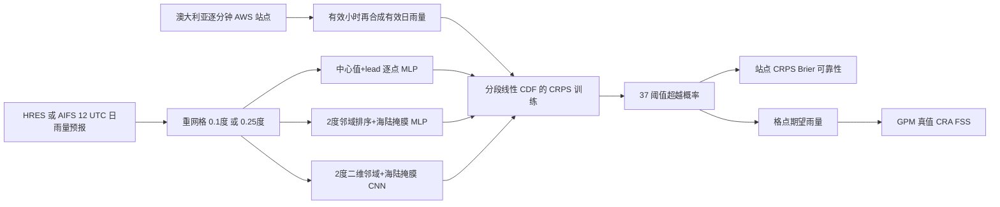

# AIFS 与 HRES 的空间感知降水概率订正：逐点、排序邻域和 CNN 谁真正获益？

> Belinda Trotta、Esteban Abellan，*Spatially Aware Calibration of NWP and AI Precipitation Forecasts*，*Journal of Geophysical Research: Machine Learning and Computation* **3**(4), e2026JH001327，2026-07-11 首发。[期刊开放全文](https://doi.org/10.1029/2026JH001327)；[作者 Zenodo 代码和站点数据 v2](https://doi.org/10.5281/zenodo.20500534)。阅读/代码核对日期：2026-09-25。本文的主测试最多 **10 天/240 h**，归中期前段，不宣称 15 天验证。

## 先读结论

本文训练六个**小型概率后处理网络**：AIFS 与 HRES 各接逐点全连接、排序邻域全连接、二维邻域 CNN 三种订正器，将澳大利亚站点的确定性 24h 雨量预报转为 37 个雨量阈值的超越概率。**AIFS 和 HRES 底座权重不改**；不存在“微调 AIFS”的过程。对站点 CRPS/HRES，CNN 通常最好、排序邻域次之；对 AIFS，三类相近甚至排序邻域不如逐点。更重要的反例是：用卫星格点真值和不同空间评分时，CNN 的优势并不保持；点位优化与整片雨区的强度/形状准确性不能混为一谈。[摘要、§4–5](https://doi.org/10.1029/2026JH001327)

这篇值得和 [MAUSAM 观测验证](120-mausam-observation-focused-monsoon-benchmark.md)、[SwAIther-Precip 瑞士降尺度](118-swaither-precip.md)一起看，但目标不同：MAUSAM 评测原始全球底座，本文**学站点概率映射**，SwAIther 输出 1 km 区域雨场。三者的真值、时效与指标不可并列称同一排行榜。

## 1. 研究问题、假说和正确比较对象

传统确定性 NWP 对降水位置可能偏移，输入周围网格可让后处理器知道“雨带就在附近”；二维 CNN 还可分辨雨带方向和距离，而仅把邻域数值排序的全连接模型只能看雨量分布。作者问：AIFS 由 MSE 训练、本来趋向条件平均和较平滑场，是否已经部分“平均掉”位置不确定性，因此额外邻域信息的边际收益比 HRES 小？这个解释是**作者假说**，不是本实验对 AIFS 内部不确定性表达做出的因果证明；AIFS/HRES 格距、训练目标及原始空间纹理同时变化。[引言](https://doi.org/10.1029/2026JH001327)

此图据原文图 2–3、§2–4 **原创重绘**；三条支路分别训练，不是串联三层。格点评分改用 GPM 卫星反演真值，而非把 AWS 点值补成密集格网。[方法和结果](https://doi.org/10.1029/2026JH001327)

## 2. 原始资料与加工：每一步的分辨率、筛选和时间切分

| 流 | 来源和时段 | 作者处理；对复现/公平性的作用 |
| --- | --- | --- |
| 预报输入 | ECMWF MARS 中 **2024-03 至 2025-04** 的 AIFS/HRES，部分日期缺；每天 **12 UTC** 起报，每 **24h** 一个累计雨量提前量，图表至 **240h/10 天** | HRES 原 octahedral reduced Gaussian grid 插到规则 **0.1°**；AIFS 原 reduced Gaussian grid 插到 **0.25°**。不是把 HRES 主输入粗化到 AIFS 格距再公平训练，两个底座原生有效分辨率仍不同 |
| 站点监督 | 澳大利亚气象局 **755** 个自动站，人口密集海岸多；原约 **1 min** 雨量 | 每小时至少 **50** 条分钟记录才保留，再需满 **24** 个有效小时组成一天；数据库已有异常值 QC，另排除 >**960 mm/日**。按底座海陆掩膜剔除海格上的站：AIFS **3**、HRES **1** 个；两个模型有效站集合不严格相同 |
| 训练样本 | 约 **100 万**“站点×预报有效时刻”样本 | 按**有效时间所在月份**交错切分：训练 2024-03/06/09/12 与 2025-03；验证 2024-05/08/11、2025-02；测试 2024-04/07/10、2025-01/04。这样各份覆盖季节，但同一站反复出现，不是新站外推；相邻 lead/起报的气象过程可相关，论文未给事件去相关检验 |
| 格点独立核验 | GPM 卫星降水格点分析 **0.1°** | 对 AIFS 分支用**最近邻**配到 0.25°，不能把它写成主预报的线性重网格；站点监督和 GPM 真值的采样支持不同，图 10 指出卫星格平均方差小于站点瞬时/点尺度 |

作者只用站点雨量训练网络，不用 GPM 训练目标；故图 11–16 的格点评估其实测试了**点尺度订正网络的跨支持域转用**。Zenodo 归档含站点日雨量 parquet、站元数据和代码，但预报原档需从 ECMWF 自行获取，GPM 需从 NASA 取；公开脚本 `constants.py` 的资料路径均是占位符，不能一键运行完整实验。[§2、数据可用声明](https://doi.org/10.1029/2026JH001327) · [Zenodo](https://doi.org/10.5281/zenodo.20500534)

### 源码中的输入数值变换

公开归档的 `nn_models.py` 对输入降水（内部单位 **m**）作 `log(x+0.0001)`，再按 `log(0.0001)` 与 `log(1.0001)` 线性映到约 0–1；其中 0.0001 m = **0.1 mm** 的平滑常数，上限名义 **1000 mm**。lead 由小时数除以 **240**。37 个阈值在论文以 **mm** 展示，`constants.py` 则乘 0.001 改为 m 再计算 CRPS；若复现时把 50 mm 误当 50 m，整个概率分布会错。排序邻域代码先取中心预报、展平二维降水与海陆掩膜，再按雨量升序**同步排序两组值**；带海点的插值函数和“海点设 NaN”行被注释，不能把“先去海、再补分位数”说成已运行流程。[作者代码 v2](https://doi.org/10.5281/zenodo.20500534)

## 3. 网络、训练和是否微调

三类网络的输出均为 37 个 `P(24h 雨量 > 阈值)`，用 sigmoid 限在 0–1，再按阈值连成**分段线性 CDF**计算 CRPS。输入中心雨量与 lead 的逐点 MLP 是最小基线；排序邻域除中心值，还将 2° 邻域的雨量及同序海陆掩膜展平送 MLP；CNN 输入降水、海陆掩膜和广播到每个像元的 lead 三通道，卷积块后汇总并追加中心值。2° 方窗对应 AIFS **9×9**、HRES **21×21** 格；这两者包含格点数量与模型容量不同，CNN/MLP 增益不能全归“是否懂几何”。[§3.1、图 2–3](https://doi.org/10.1029/2026JH001327)

**CDF 单调性实现边界**：公开 `train.py` 在每 epoch **验证 CRPS 前**调用 `make_monotone`，而训练时的 `CRPSLoss` 直接接 37 维网络输出，`pred.py` 导出站点概率时只截到 `[0,1]`，未调用同一单调化函数。因而 sigmoid 本身不能保证随阈值升高超越概率单调；独立部署需核验下游评分脚本是否补了单调修正，不能把验证阶段的处理自动当成所有导出产品都具备。[作者归档代码](https://doi.org/10.5281/zenodo.20500534)

| 正式 Table 1 最优版 | AIFS 隐层/块、宽度、参数、epoch | HRES 隐层/块、宽度、参数、epoch |
| --- | --- | --- |
| 逐点 MLP | **3 层 ×32；3,429；11 epoch** | **3 层 ×32；3,429；9 epoch** |
| 排序邻域 MLP | **2 层 ×32；7,557；17 epoch** | **3 层 ×32；31,653；14 epoch** |
| 2D CNN | **1 卷积块 ×32；27,850；8 epoch** | **3 卷积块 ×16；13,002；10 epoch** |

搜索空间：MLP **1/2/3 层 × 16/32** 隐元；CNN **1/2/3 块 × 16/32** 卷积核数，但 AIFS 因 9×9 输入池化后太小，最多测试 **2 块**。块内两次 3×3 卷积、LeakyReLU、3×3 stride 2 池化；后续同宽块可作残差。作者对每个底座/架构单独用**验证集 CRPS**选最佳，非把同一个参数量强制复制到两个底座。[§3.1–3.2、图 2–3、Table 1](https://doi.org/10.1029/2026JH001327)

训练是**从头拟合订正器**，不是底座微调，也没有 VAE/扩散预训练：Adam、batch **32**、初始 LR **1e−4**；验证 CRPS 连续 5 epoch 无至少 **0.5%** 相对下降则乘 **0.7**（该系数见归档 `train.py`），最近 10 epoch 未达到 0.5% 改善则早停；源码上限 **100 epoch**。作者报告 MLP 训练每个 <**1h**、CNN <**5h**；Table 1 给的是最佳模型终止轮数，不是全部搜索轮数。`train.py` 固定 torch/Python/NumPy 种子，按训练集各阈值超越频率的 **logit** 初始化输出基率并固定它，再由网络学习残差；代码也存每 epoch 权重，复现应按验证日志选权重。[§3.2–3.3、Table 1](https://doi.org/10.1029/2026JH001327) · [作者代码](https://doi.org/10.5281/zenodo.20500534)

**硬件口径差异**：期刊 §3.3 说“所有模型用 CPU 训练”，但公开 `train.py` 对 CNN 在 `torch.cuda.is_available()` 为真时选 `cuda:0`，否则 CPU，MLP 才固定 CPU。这是**归档脚本的条件行为**，并不能证明作者实际训练时一定用 GPU；复现时应记录自己的执行设备。期刊的预测耗时分别为 AIFS 全澳约 30 万格/各方法约 **5s**；HRES 约 170 万格的逐点/排序邻域/CNN 约 **30/80/60s**，使用 Xeon Platinum 8274 与推理 CNN 的 V100；不同格点数，不能直接当同格吞吐比。[§3.3](https://doi.org/10.1029/2026JH001327)

## 4. 性能表：站点概率、格点雨区分别看

期刊除架构 Table 1 外，主要性能以曲线/地图呈现，没有逐 lead 的机器可抄录绝对 CRPS/BS 表；以下**只摘正文可核验的方向与明确数值**，不从图片像素估算小数。[正式 §4、图 4–16](https://doi.org/10.1029/2026JH001327)

| 图/统计口径 | 可核对结果 | 不应推出什么 |
| --- | --- | --- |
| 图 4–5：AWS 站点期望值 MSE/偏差 | AIFS 三订正器在前 **7 天**的 MSE 与原 AIFS 接近；HRES 订正后 MSE 显著改善且一般 **CNN < 排序邻域 < 逐点**。原始两底座后段整体偏少雨，订正减轻部分偏差 | AIFS 的 MSE 近原值不等于概率 CRPS 无收益；期望值来自概率分布而非单独 MSE 优化 |
| 图 6、A1：站点 CRPS | 订正后 AIFS 三法接近，排序邻域甚至略差于逐点；HRES 的 CNN 通常最好，最佳与最弱方法在早期相当于 **1–2 天**的同分数提前量。所有订正器对原始确定性预报的 CRPS 有改善；原 AIFS 相对原 HRES 除 **第 10 天**外较好 | “1–2 天”是曲线上**等技巧提前量**，不是作者宣称长期物理可预报性延长；原始确定性 CRPS=MAE，而订正后是完整概率 CRPS |
| 图 7–9：阈值 Brier/可靠性/锐度 | AIFS 在较高阈值一般强于 HRES；CNN 的 1 mm 锐度较高。**50/100 mm** 可靠性曲线不稳定，CNN 并非所有阈值胜者 | 高频弱雨的总体 CRPS 排名不能保证百毫米极端校准；高阈值样本少 |
| 图 10–11：AWS vs GPM | 同址同有效时刻 GPM 格点产品的雨量分布更窄；格点 CRPS 空间图的真值是 GPM | 不能把站点模型的点尺度条件分布当成天然校准的格平均分布 |
| 图 12–14：GPM 雨区 CRA，**5 mm/24h** | 七区域各取最大连续雨区；总体误差以**形状误差**主导。两底座的逐点订正在总 CRA MSE 通常优于 CNN/排序邻域；CNN 在较长 lead 位移误差可稍小 | 雨区提取按系统独立、对象数不等；不是真正逐事件一一配对的优劣。位移变好也不等于总强度/形状误差变好 |
| 图 15：GPM 格点 **5 mm**、**2°** 邻域 FSS | 原始 HRES 明显优于原始 AIFS；逐点订正使 AIFS 的 FSS 显著提高，HRES 提高有限 | 与图 6“站点 CRPS 中 AIFS 更好”并不矛盾，真值、阈值和空间容差不同 |
| 图 16：一日格点示例 | HRES 场有更细结构；排序邻域在 **<约 0.5 mm** 背景雨上可有方块边缘/不自然梯度 | 单日图不能代替季节评分；颜色范围放大弱雨瑕疵 |

### CRA/FSS 为何会反转站点排行榜

CRA 在澳大利亚七个固定区域按 5 mm/24h 阈值挑最大雨对象，允许平移寻找最佳重合，再将总 MSE 拆为**位置、总量、形状**。对象由各预测系统独立提取，原始 AIFS 找出的连通雨区比 HRES 和订正版本少；所以均值是“各自能检出的最大对象”的诊断，而非同一事件全集的严格配对表。CNN 若让雨带中心位置更准而把强度/雨型推偏，总 CRA MSE 仍会更差。[§3.4、§4.2、图 12–14](https://doi.org/10.1029/2026JH001327)

FSS 在 2° 窗看超过 5 mm 的格点比例，平滑的 AIFS 可能把真实强雨压到阈值以下，原始 FSS 因此低于有更尖锐雨带的 HRES；订正改变阈值越过率后能大幅提高 AIFS FSS，同时期望值 MSE 不必大变。**这说明指标测量对象不同，不是论文自相矛盾**。[§4.2、图 15](https://doi.org/10.1029/2026JH001327)

## 5. 我的判断与可复验路线

本研究的可靠结论是**在这批澳大利亚 AWS、这套时段/底座/调参准则下**，给 HRES 的站点概率订正加入空间邻域通常值得，而给 AIFS 加同类复杂度收益很小；对格点雨区不能一概说 CNN 最好。作者提出 AIFS 的 MSE 训练已使位置不确定性进入期望场，这是一种有用机制解释，但未控制原始格距、所有训练变量和雨量边际分布，**不构成跨所有 AI 模型或气候区的定律**。[§5](https://doi.org/10.1029/2026JH001327)

严格复验时：按有效月份生成同一站点/预报日/lead 样本，分别核对 0.1° 与 0.25° 场、分钟→小时→日缺测筛选、源码 m 与论文 mm 单位；重训六个验证集优选网络和 37 阈值单调 CDF；同时报告各系统**同一站点交集**与 1/10/50/100 mm 分箱置信区间；格点评分固定 GPM 同时期并统计 CRA 对象数，再做同格距/同邻域物理长度消融。公开 Zenodo 包仅约 **776 kB**，包含站点 parquet、脚本和环境示例，但需要 ECMWF/GPM 外部原档、修改占位路径；本笔记核对了其训练与数据加载源码，**没有声称独立复跑全澳预报实验**。[代码归档](https://doi.org/10.5281/zenodo.20500534)

[返回首页](../../README.md) · [返回总表](../../气象大模型_中期预报论文追踪.md)
