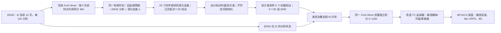

# FuXi-Short 的滞后预报演化扰动：五天台风路径集合与 2000 成员试验

> Jingchen Pu、Mu Mu、Jie Feng、Xiaohui Zhong、Hao Li，*A fast physics-based perturbation generator of machine learning weather model for efficient ensemble forecasts of tropical cyclone track*，*npj Climate and Atmospheric Science* **8**, 128，2025-03-29 正式发表，[DOI / 开放正文](https://doi.org/10.1038/s41612-025-01009-9)，[正式补充材料（14 页 PDF）](https://media.springernature.com/original/springer-static/esm/art%3A10.1038%2Fs41612-025-01009-9/MediaObjects/41612_2025_1009_MOESM1_ESM.pdf)。本笔记依据正式正文、主图 1–6 和补图 S1–S14；2026-09-25 核验。**实际验证的台风路径时效只有 0–120 h（5 天）**，不等于 FuXi 原始级联的 15 天全球评分。本篇按“中期前段/台风集合应用”归档。

## 一、研究问题与本文真正新增的对象

全球确定性 AI 天气模型虽然推理很快，但单条轨迹不提供登陆位置概率；直接给输入加独立高斯噪声又容易被平滑的 AI 动力消去。作者没有提出新的 FuXi 权重，也没有训练一个噪声生成神经网络，而是用**已有 FuXi-Short 的短程预报误差**做有大气流场结构的初值扰动样本，从这些样本估计协方差，再在 ERA5 初值上采样 50 或 2000 个成员。论文的科学问题是：这类扰动在 AI 模型内是否像物理模式的初值误差一样增长，以及它能否改善台风路径的概率预报。[正文 Results / Methods](https://www.nature.com/articles/s41612-025-01009-9)

与[独立训练的 FuXi-ENS](39-fuxi-ens.md)必须分清：FuXi-ENS 的条件潜变量扰动器与预报器通过 CRPS/KL 训练，并在逐 6 小时预报步骤采样；本文**冻结已有 FuXi-Short，只在起报初值做演化扰动采样**，不处理每一步的模式随机误差。原始 FuXi 有 Short、Medium、Long 接力覆盖 0–5、5–10、10–15 天，本实验只运行 Short 至 5 天；把“底座拥有 15 天模型”写成“本文 15 天集合已验证”是错误的。[正文 Methods: FuXi model](https://www.nature.com/articles/s41612-025-01009-9)

## 二、数据、版本、输入和处理链

| 对象 | 原文可核事实 | 对复现及公平比较的影响 |
| --- | --- | --- |
| FuXi 底座 | 以约 39 年 ERA5 的 6 小时、0.25° 场预训练；时空立方体嵌入、U-Transformer 处理器、FC 输出头；输入相邻两个天气状态，自回归步长 6 小时。此研究仅用 FuXi-Short。 | 39 年训练是**已有底座背景**，不是本文重新训练的数据集；本篇没有新网络参数、训练 epoch、优化器或学习率。 |
| 天气量 | 高空 Z、T、U、V、RH；地面 U10、V10、T2m、MSLP、6 小时总降水等。扰动方法段明确“全局施加”到高空 U/V/T/Z/RH 输入。 | 摘要式地面列举与实际高空层数、字段顺序不是完整可运行 schema；具体标准化、压强层索引、缺测填补及采样后的物理约束须核源码，不能据正文臆造。 |
| FuXi 起报与验证 | 以 ERA5 再分析初始化 FuXi；格点检验亦以 ERA5 为参考。 | 物理模式对照从其**业务分析**起报，不是 ERA5 同初值实验；来源差异可影响技巧。 |
| IFS 集合 | TIGGE 存档的 ECMWF IFS **48r1**，原生约 9 km、137 层，归档产品已插值到 0.25°；取 50 成员，与 FuXi-50 比较。 | 相同成员数、相近归档输出网格不等于相同原生分辨率、模型扰动或初值。不能将差异全归功于扰动算法。 |
| 台风真值与追踪 | TIGGE 的业务 TC track 产品；FuXi 用改过的 ECMWF 追踪器，除 MSLP 局部极小外，还考虑局地涡度极大，并对极值检测用 average pooling。最终路径以 **IBTrACS** 最佳路径核验。 | FuXi 平滑场与 IFS 路径提取算法不同；失踪、误检与路径配对细则未完整公开，概率指标受追踪器影响。 |
| 扰动动力诊断 | **2021-07-01 至 10-31**每 12 小时起报；滞后间隔 **12–120 h，每 12 h 一档**。区域 WNP 为 100–180°E、0–30°N；NA 为 20–100°W、0–30°N；NH 中纬度 30–70°N。 | 850–200 hPa 深层风动能范数用于分析扰动增长；不是全部预报变量的统一误差函数。 |
| 路径统计主样本 | **2021–2023 年 7–10 月**，WNP/NA 的登陆、强度达热带风暴以上个例；**36 场台风、113 次起报**（WNP 74、NA 39），首次在 TIGGE 出现后每两天起报一次。 | 选择登陆个例且抽稀起报；不能外推至所有海盆、全年或未登陆弱系统。36 场并非 113 个独立风暴。 |
| 小样本对照 | **2018 年 5 场台风、27 次起报**：与高斯噪声、FuXi-ENS 和 IFS 比；FuXi-ENS 当时未开源。 | 不是主样本 113 次的大范围同口径比较；不能用这一子集判定方法在所有海盆普遍优于 FuXi-ENS。 |

上述数据期、IFS 版本与追踪器细节来自[正式 Methods: Forecast and verification data / Experimental design](https://www.nature.com/articles/s41612-025-01009-9)，FuXi 原模型详细训练应回到其独立论文，不把跨论文参数填成本研究的超参。原文没有给出 ERA5 到 FuXi 所有输入通道的完整归一化均值/方差、TC 检出阈值、协方差抽样随机种子或 2000 成员硬件耗时明细。[数据地址：ERA5、TIGGE、IBTrACS 与 FuXi 底座](https://www.nature.com/articles/s41612-025-01009-9#data-availability)

## 三、从滞后预报差到任意成员数：原创流程图

此图依[正式 Fig. 6 与 Methods](https://www.nature.com/articles/s41612-025-01009-9)自行重绘，只表达可验证的数据依赖，不复制出版社原图。设 `F(t, lead)` 为某分析时刻起报到相同有效时间的预测，作者的滞后差可理解为 `e(iΔt,jΔt)=F(t−iΔt,(j+i)Δt)−F(t,jΔt)`；当 `j=0`，便是经过 `iΔt` 模型积分的旧预报与当前分析的差。增长因子为 `||e(iΔt,jΔt)||₂ / ||e(iΔt,0)||₂`。这不是对模型权重反向传播求雅可比，也不需要训练一个生成器。[正式 §Calculation of perturbation growth rate](https://www.nature.com/articles/s41612-025-01009-9)

主实验设 `Δt=12h`、`i=3`，即 **36h** 历史积分；对 t0、t0−12h、…、t0−288h 取 **25** 个演化误差，正负配对得 **50** 个初始样本。用它们的空间/变量联合协方差再抽取所需个数的扰动，叠加到 t0 的 ERA5 初值；窗口随起报滑动，因此有局地流场依赖，但 12 天时间窗也削弱了瞬时流依赖。原文明确**不施加 covariance localization**；采样分解算法、截断秩、尾部外推与变量尺度校正并未给出完整伪代码，不能把“协方差采样”当成可无歧义直接复现的实现。[正式 Fig. 6 / Methods](https://www.nature.com/articles/s41612-025-01009-9)

所谓“physics-based”指短程模型演化所赋予的波动结构/变量联系，而不是直接求解了额外物理方程，也不代表该统计协方差必然满足守恒律。它也不是实际同化后的分析误差协方差；这是从先前 FuXi 预报相对 ERA5 的差估计出的代理量。读者需区分“在 t0 之前已有的历史预报”与未来观测：只要按原文取此前 12 天、有效时刻不晚于 t0 的数据，方法原则上可实时生成；但论文没有完整公开运行时数据管线/时延和依赖的 ERA5 业务可用性，不能直接宣称业务即插即用。

## 四、训练、微调、参数设置：哪些存在，哪些不存在

本研究**没有重新训练/微调 FuXi-Short**。原 FuXi 的三段权重来自已有预训练与时效分段微调，但本文没有提供那些训练阶段的独立优化器、LR、batch、epoch、冻结层、损失权重或数据切分以供本实验复现；这些值不得从 FuXi-ENS 或其他伏羲衍生模型借来代填。这里真正调的“参数”是**推理时的扰动构造超参**：历史误差间隔 12h、样本数 25、窗口 12 天、历史积分 36h、目标 50/2000 成员、是否用高斯噪声对照，以及不做协方差局地化。[正式 §FuXi model、§A fast physics-based perturbation generator](https://www.nature.com/articles/s41612-025-01009-9)

36h 是作者依据主图 1–2 和补图 S6 在路径均值误差与 spread–skill 接近 1 的折中选择；补图比较 24、36、48h。更短间隔离散度不足，更长间隔离散度偏大。这里有潜在**评估集调参**风险：论文没有报告独立验证期专门选 36h 再对另一封存样本评价，故 113 次起报的提升不是完全盲测的扰动间隔结果。高斯对照用相同统计均值/标准差随机生成而缺少空间相干结构；并非经过相同校准优化的最强高斯基线。[正文 Fig. 1–3；补图 S6、S10](https://www.nature.com/articles/s41612-025-01009-9)

## 五、评估设计：怎样读误差、离散度、CRPS 和 BS

路径误差是**集合均值位置**与 IBTrACS 的球面距离（km），离散度是成员位置相对集合均值的样本标准差式距离；二者接近是 spread–skill 一致性的必要条件，但不能证明联合分布完全校准。作者把二维台风位置的广义 energy distance 称为 CRPS，正式正文给出 `2E||X−Y||−E||X−X′||−E||Y−Y′||` 并称使用 **fair CRPS**。正文没有完整列出有限成员的 fair 修正实现、地理经纬映射及分母；不同论文的单变量格点 CRPS 数值不能直接横比。[正式 §Evaluation metrics](https://www.nature.com/articles/s41612-025-01009-9)

BS 对每个地区格点计算台风路径在 **30/60/120 km** 半径内的经过概率与 IBTrACS 0/1 事件的平方差并求和；正式式子没有显示网格面积权重或归一化因子，因此数值大小依赖区域/网格，不宜和其他研究的逐格平均 BS 直接比。论文以 t 检验标 90%/95% 显著性，但同一台风的多个起报会相关，不能默认 113 次完全独立；也没对众多 lead/阈值做多重比较更正。[正式 Fig. 3 图注和 §Evaluation metrics](https://www.nature.com/articles/s41612-025-01009-9)

## 六、经原文核对的性能与边界表

下表仅记录作者在正文**明确写出的**量或方案设定，不从曲线估造精确像素读数；百分比均保留原文“约”“最高”等语气。不同样本/案例分行，不混作一个总平均。[正式 Results 与主图 1–5](https://www.nature.com/articles/s41612-025-01009-9)

| 比较对象 / 证据 | 样本与时效 | 作者报告 | 阅读判断 |
| --- | --- | --- | --- |
| FuXi 小扰动 vs IFS，Fig. 1 | 2021-07 至 10，48/72h 深风诊断 | FuXi 初始深风扰动低于约 **1.5 m² s⁻²** 时增长明显弱于 IFS；到约 **1.5–2 m² s⁻²** 增长接近。36h 滞后下 FuXi 初始约 **0.8**、IFS 约 **0.3 m² s⁻²**；WNP 48h 增长因子 **1.3 vs 4.2**。 | 幅度与结构共同重要；“达到阈值”不是每种起报都自动校准，且 0.8 与 1.5–2 的口径/区域不同。 |
| 既有确定性 TC 路径，补图 S5 | WNP/NA，0–120h | 五天附近 WNP：IFS 约 **370 → FuXi 300 km**；NA：IFS 约 **410 → FuXi 200 km**。 | 底座本身已有优势，集合比 IFS 好不能只归因于新扰动。 |
| FuXi-50 vs IFS-50，Fig. 3 | 主样本 113 次、0–120h；WNP 74、NA 39 | Day 1 后 WNP 集合均值路径误差约低 **20%**，NA 最多约低 **40%**；CRPS 约改善 **20%/40%**。 | 适用于筛选过的登陆台风样本。路径均值误差 Day 2–5 有显著区间；概率分数显著改进主要在 Day 2–3，Day 4 后无显著差不能写成全时效确定优越。 |
| 早期反例，Fig. 3 | 主样本，最初 **12h** | FuXi 路径/概率评分可比 IFS 恶化 **10%–20%**。 | 较大的初始扰动可能损伤短时效。 |
| FuXi-ENS / 高斯噪声对照，补图 S8 | **2018 年 5 场、27 次起报**，至 120h | FuXi-ENS 的路径均值误差与 CRPS 有些更好；演化扰动的 spread–error 差 **<60 km**，FuXi-ENS **>100 km**、高斯 **>200 km**，并有更好的 BS。 | 不可声称演化扰动在所有指标都击败 FuXi-ENS；也不可把 27 次子样本结果当主 113 次的结论。 |
| Chanthu 超大集合，Fig. 4 | **2021-09-09 00 UTC 单次起报**，50 对 2000 成员 | 2000 对 50 成员的 CRPS/BS 约改善 **10%**，路径集合均值误差变化很小；120h >240km 的成员占比 IFS-50 **39.53%**，FuXi 的报告值 **19.15%**。 | 单案例高 K 改善主要是采样分布/尾部平滑；原文没在这句清晰指明 19.15% 对应 FuXi-50 还是 FuXi-2000，保留指代歧义，不当总体百分比。 |
| 环流相关结构，Fig. 5 | Chanthu 起报，参考点 30°N、135°E；48h | 500hPa Z 的 FuXi-50 与 IFS-50 空间相关场相似系数约 **0.56**，FuXi-2000 对 IFS-50 约 **0.62**。 | 只是一个参考点/案例的空间相似，不等于协方差矩阵整体无偏；72h 后相似度下降。 |

原文中“TC track forecast errors within five days 370→300/410→200”是从[补图 S5](https://media.springernature.com/original/springer-static/esm/art%3A10.1038%2Fs41612-025-01009-9/MediaObjects/41612_2025_1009_MOESM1_ESM.pdf)曲线概括的作者正文数，不是我从曲线取数。Fig. 4 中 FuXi-50 和 IFS-50 的 Chanthu 120h 均值误差都 **<150km**，但 IFS-50 在 **100–120h** 反而更准确；不能把 50 成员结果概括成整个 5 天始终 FuXi 更好。[正式 Fig. 4 正文](https://www.nature.com/articles/s41612-025-01009-9)

## 七、主图与补图逐项读法：结构、性能和反例

| 图 | 内容及阅读关键点 |
| --- | --- |
| **主图 1** | WNP、NA、NH 三域 72h 深层风增长与初扰动幅度的散点/箱；同统计均值方差的高斯噪声仍增长慢，说明幅度相等不意味着动力可用。补图 **S1** 改看 48h，避免只依赖单一增长窗口。 |
| **主图 2** | 2021-07-20 In-Fa 起报的 0/24/48/72/96/120h Z500 扰动与谱。演化扰动同 IFS 在槽脊及 TC 环境附近增长，高斯扰动空间碎散、小尺度能量偏多且 >300 km 波长偏弱；补图 **S2–S4** 换三次起报重复此结构诊断。 |
| **主图 3** | 113 次起报：WNP 的 74 与 NA 的 39 分开画集合均值路径误差/离散度、二维 fair CRPS、30/60/120km BS 及相对改善。上面的 20%/40% 是作者正文给的近似百分比，不能改写成各 lead 精确数；早 12h 负面与 Day 4 后概率不显著同样重要。 |
| **主图 4** | Chanthu 一次起报的 IFS-50、FuXi-50、FuXi-2000 在 24/72/120h 的路径散点和误差直方图。2000 成员的尾部分布更连续，出现日本登陆的低概率成员；该轨迹“可能”并不是已实现预报命中，也不是大样本可靠性检验。补图 **S10** 显示此案例高斯扰动甚至可能有较好均值误差/CRPS，却因 spread 明显偏小而 BS 更差；**S11** 另给 Haikui 的 2000 成员案例。 |
| **主图 5** | 选 30°N、135°E 的单参考点分析 FuXi-50/2000 与 IFS-50 的 Z500 空间自相关，展示 48h 附近相关场更像 IFS，但初始 FuXi 正相关覆盖过宽、长距离仍有弱伪相关。补图 **S12/S13** 用其他海上/陆上参考点与 Haikui 复看，不构成全球协方差定量验证。 |
| **主图 6** | 三步结构示意：25 个 12 天窗口演化误差 → ±50 初扰动估协方差 → 抽样并积分。上方原创图重新绘制，不直接上传原图。 |
| **补图 S5–S7** | S5 确定性 FuXi/IFS TC 路径误差，为区分底座与扰动算法增益；S6 的 24/36/48h 滞后间隔展示 spread–skill 折中；S7 将集合均值与控制路径误差分别对照，勿把二者统称“确定性技巧”。 |
| **补图 S8–S9** | 2018 年五风暴、27 次起报比较演化扰动 / FuXi-ENS / 高斯；S8 显示 FuXi-ENS 的误差与 CRPS 未必差于本方案，但概率经过事件的 BS、离散度可能欠佳。S9 给 Cimaron 与 Florence 两场 72h 散点，个例不可代替全域统计。 |
| **补图 S10–S14** | S10 是高斯对照的 Chanthu 反例，S11 是 Haikui 2000 成员；S12/S13 抽样参考点的协方差相关，S14 比 2023 五场风暴每日全起报与抽稀起报。补图 S14 文字写“上排 25 次、下排 9 次”，末句却称另一隔日起报分组 **13 次**，**补图内计数不一致**，本笔记不替作者抹平。 |

补图目录和 S8/S10/S14 细节来自[正式独立补充 PDF](https://media.springernature.com/original/springer-static/esm/art%3A10.1038%2Fs41612-025-01009-9/MediaObjects/41612_2025_1009_MOESM1_ESM.pdf)，已逐页读取说明；图中未经正文给出数字的曲线只作定性判断。

## 八、方法收益的归因与不能越过的边界

1. **不是同初值纯算法消融。** FuXi 从 ERA5、IFS 从业务分析起报，分辨率、物理机制、随机物理、TC 追踪器也不同。主图 3 的 FuXi-50 vs IFS-50 是系统级比较；要单独量化演化扰动相对其他初扰动的净增益，应在同一 FuXi 权重、同一 ERA5 起报与同一 TC 检测器下大样本比较。补图 S8 的对照是小子集，S10 展示基线可能局部赢。
2. **只触及初值不确定性。** FuXi-Short 权重和滚动过程完全确定，不含逐步模式误差或随机物理；如果长期谱平滑/系统偏差占主导，初始的 25 维经验误差子空间很难覆盖。因此 2000 成员增加蒙特卡罗抽样数，不会凭空增加 25 个历史误差所张成空间的秩；文中也指出残留长距离弱相关及协方差秩不足风险。[正式 Discussion / Fig. 5](https://www.nature.com/articles/s41612-025-01009-9)
3. **重点是路径而非强度/降水。** 本文不报告台风最低气压/最大风、登陆强度、雨量或一般全球 10/15 天 CRPS。因此不能用此工作作为 FuXi 对台风强度或全部气象变量的概率技巧已证实的证据。
4. **2000 成员仅极少数案例。** 文中主要展示 Chanthu 与补图的 Haikui；文中约 10% 的 CRPS/BS 改善只适用于被展示的特定设置，不能宣称 2000 成员对 113 次起报平均提高 10%。论文未给生成 2000 成员的端到端时间、内存与能耗；“快速”有技术直觉，但业务成本优势需可比基准。
5. **复现缺项。** FuXi 基础模型有开放资源，但本篇没有公开扰动协方差抽样/追踪器/IBTrACS 配对的一体化训练或推理脚本、随机种子与全部成员输出。正负配对的具体协方差归一化、抽样分布、空间权重和高斯基线调参亦不完整；这决定是否能精确复现绝对 BS/CRPS。

## 九、对后续研究的具体启示

对 5 天台风路径，论文展示了“先检验模型能放大哪些尺度/结构的初值误差，再设计扰动”，比无诊断地加噪声更合理。下一步最有辨识力的实验应将 **同一 FuXi-Short 与相同 ERA5 初值**固定：随机噪声、Perlin、滞后差、优化型 SV/CNOP 与训练型 FuXi-ENS 用同一 113 次/独立年份统一评分；分别报告成员数 25/50/200/2000 的 fair CRPS、BS、SSR、TC 检出/漏检、强度、样本置信区间和完整吞吐成本。此外以独立验证年锁定 36h 和 12 天窗口，再在封存年份测试，才可排除选择超参的乐观偏差。这是阅读后的**复验建议**，不是原论文已完成的实验。

[返回仓库首页](../../README.md)
