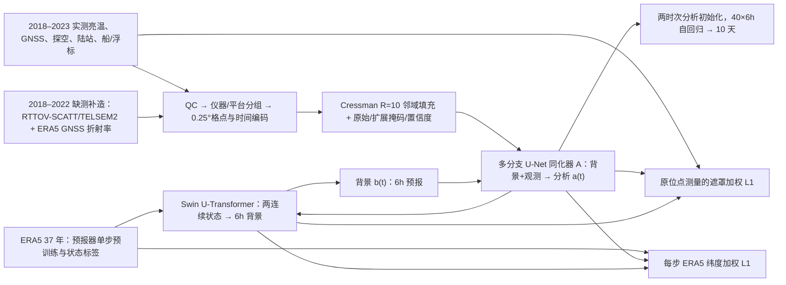

# FuXiWeather2：真实观测监督、递归同化训练与全球十天预报

> Xiaoze Xu、Xiuyu Sun、Songling Zhu、Xiaohui Zhong、Yuanqing Huang、Zijian Zhu、Jun Liu、Hao Li，*FuXiWeather2: Learning accurate atmospheric state estimation for operational global weather forecasting*，[arXiv:2603.15358v1](https://arxiv.org/abs/2603.15358)，**2026-03-16** 首发；[原始 HTML 全文与图 1–20、补图 S1–S6](https://arxiv.org/html/2603.15358v1)，[作者开放的 2023-07 至 2024-06 分析场数据集](https://doi.org/10.5281/zenodo.18872728)。截至 **2026-09-25** arXiv 所列为 v1；**预印本，不冒称同行评审正式版**。本笔记逐节核对 v1 的 Table 1–2、公式 1–26、主图图注/正文与数据归档 README。原 PDF 约 41 MB、网页读取服务未取得完整 PDF；图像的逐像素数值和未披露的模型参数量没有臆测。

## 一、先说结论：它与 FuXi Weather 不同在哪里

此前 [FuXi Weather](08-fuxi-weather.md)已经展示卫星亮温/GNSS-RO → FuXi-DA → FuXi-Short/Medium 的每 6 小时循环和 10 天预报，但较短的真实观测训练期、离线背景与自生背景的分布差异，以及以 ERA5 为主要监督的局限，仍限制分析质量。FuXiWeather2 是**另一篇独立论文、另一套联合训练的系统**，不能把前作参数或成绩直接挪用。它加入更多微波/红外仪器、探空/陆站/海上原位测量；针对近五年观测网络不齐，利用物理前向模式补造早期三类观测；再用 ERA5 网格场与真实原位点测量联合监督**循环同化和预报的每个展开步**。测试先从 2023-06-20 冷启动并做约 10 天 spin-up，再在 2023-07-01 至 2024-06-30 连续循环。[论文 §1–2](https://arxiv.org/html/2603.15358v1)

中期实验证明的是 **0.25° / 每步 6 小时 / 40 步＝10 天的确定性预报**，不是 15 天 FuXi-Long，也不是概率集合。作者给出的 Z500 `ACC≥0.6` 技巧时效为 **9.75 天**，同期 HRES **9.25 天**。作者统计空间是 **69 个非降水通道 × 40 个 lead**：以**各自分析场**为真值时，RMSE 胜率 **91.34%**、ACC **88.99%**；换成统一 ERA5 真值则降至 **85.40% / 84.75%**。这些是“变量–lead 单元中的胜出比例”，不是预报正确率、独立样本的胜率或所有变量每一时效获胜。[论文 §3.2 / 图 12–14](https://arxiv.org/html/2603.15358v1)

## 二、原创重绘：资料、训练和业务循环

此图按[原文 Fig. 1 与公式 10–18](https://arxiv.org/html/2603.15358v1)重画依赖关系，不复制作者图版。部署时观测只用真实数据，训练时才混入历史模拟观测；「无需外部 NWP 分析起报」不等于从无背景，**背景是上一轮本系统预报**。十天产品使用训练完成的预报器自回归，不在每一个未来 lead 都同化尚未发生的观测。[§2.3–2.4](https://arxiv.org/html/2603.15358v1)

## 三、数据来源、时间切分、字段与预处理

### 3.1 输出状态、观测种类与时间窗

| 对象 | 论文可核的配置 | 对训练/复现的意义 |
| --- | --- | --- |
| 全球分析与预报状态 | 五种高空变量 Z、T、U、V、相对湿度 R × **13 层**（50/100/150/200/250/300/400/500/600/700/850/925/1000 hPa）；地面 T2m、MSLP、U10m、V10m，加 6h 总降水 TP；0.25°、720×1440、6h 步长。 | 文中原位监督损失明言 **69 个非降水通道**＝65+4，开放**分析数据集**也只有这 69 个；Table 1 把 TP 列在预报任务内，不能因此说 DA 归档含 70 通道或原位点监督了降水。 |
| 八类微波/红外仪器 | ATMS（NOAA-20/NPP）、AMSU-A（NOAA-15/18/19、Metop-B/C）、MHS（NOAA-19、Metop-B/C）、MWTS-III/MWHS-II（FY-3E）、SSMIS（DMSP-F17/F18）、IASI（Metop-C）、HIRS-4（NOAA-19）。均接 Level-1 亮温。 | 多平台同类仪器并非相同校准；输入另附扫描天顶角和平台 one-hot，让网络学习偏差。以 ATMS 为例，**22 亮温+1 角度+2 平台位＝25 通道**。 |
| GNSS 掩星 | COSMIC-2、Metop、FY-3 等，折射率剖面；统一到约 50 km 的 **512** 个高度采样。 | 不是反演后的 ERA5 场。采样位置/时间稀疏且 COSMIC-2 主要在 ±45°；旧年用模拟分布补齐。 |
| 原位观测 | 全球探空 T、U、V、Q、Z；陆站 T2m、R2m、U10m、V10m、地面气压、MSLP；船/浮标再含 SST。 | 表中探空变量写 Q、方法段写 R，原位损失的 65 高空变量又称 13 层五变量；**比湿到相对湿度的明确变换未在本文给出**，勿将 Q 和 R 当同一原始量。 |
| 观测窗口 | 卫星、GNSS、陆站、海上：`[t0−3h,t0+5h)`；探空：`[t0−3h,t0+3h)`。 | 与以分析时刻 t0 即刻出报不同：大多观测窗口**包含 t0 之后近 5 小时资料**。文中“几分钟生成预报”只可理解为模型计算速度，不能直接宣称起报时刻零延迟的实时业务可用性。 |
| 训练/测试 | 预报器以 **37 年 ERA5** 单步预训练；联合观测期总述为 **2018-06-01–2023-06-01**；同化预训练方法段又写 **2018-06–2022-06**；测试 2023-07-01–2024-06-30、00/12 UTC 起报。 | **两个训练期表述不一致**：可能总联合训练跨 2023、同化预训练止 2022，但论文未给各阶段无歧义样本清单。数据泄漏审计应锁定全部实测/模拟/背景缓存的时间戳，而非把“五年”自动代入每个阶段。 |

以上来自[论文 Table 1–2、§2.1、§2.4](https://arxiv.org/html/2603.15358v1)。静态场为陆海掩码、湖泊、地形/地表位势、四类植被覆盖及纬经度；小时/年内日序是预报器时钟输入。作者未披露所有 69/70 通道具体标准化均值、降水变换和完整卫星缺测策略，不能从第一代 FuXi Weather 的脚本代填。

### 3.2 具体处理链：质控、伪观测、格点化

**质量控制。** 亮温先限于 **50–350 K**；其后所有观测做稳健 bi-weight 的均值/标准差筛查，按热带（±30°）、中纬（30°–60°）、高纬（60°–90°）分别估统计量。亮温 Z-score 门槛 **6**，其他观测门槛 **4**。这与第一代主要只作亮温宽范围筛选的设计不同。论文没有给出 bi-weight 的逐传感器训练/测试统计表、被过滤比例、平台漂移重估计划，因此“全天空无显式云筛选”不等于没有任何质量控制。[§2.1.3](https://arxiv.org/html/2603.15358v1)

**IASI 降维。** 8461 原始通道先取 GDAS 国际交换的 **616** 个，与另一套信息量前 400 通道交集得 **124**；留取温度 85 + 湿度 23＝**108**，按 Jacobian 峰高间隔取温度 16 + 湿度 9＝**25**，再补温度 5、湿度 7、窗口 1，最终 **38 通道**（CO₂ 带 21、水汽带 16、窗口 1）。这一筛选是信息/垂直覆盖折中，不是网络自动学习 8461→38 的端到端通道注意力。[§2.1.2 / Fig. 2](https://arxiv.org/html/2603.15358v1)

**旧年补造观测。** FY-3E MWHS-II/MWTS-III 在 2018-06 至 2022-06 用 **RTTOV-SCATT v13** 前向模式、ERA5 大气和 **TELSEM2** 陆地发射率生成亮温；以 2022-06 至 2023-06 的实际轨道坐标/观测角按年复制到早期日期，不能视为历史实测原始扫描。GNSS 折射率按 `N=77.6 P/T + 3.73×10⁵ e/T²` 算，再从 2022–23 的位置时刻表按小时抽 **500–2500** 条剖面，模拟时空分布。模拟数据可能比真实测量“过干净”；作者在剔除试验后也承认增强模型会**过度倚重**这三类资料。[§2.2.1、§3.4](https://arxiv.org/html/2603.15358v1)

**格点化/编码。** 先按仪器–平台单独最近邻投到 0.25° 网格，按 `[T0,T0+1h)` 小时桶对齐；同仪器不同平台落同格时随机留一条。逐通道归一化，空格点填 0，同时保留 one-hot 可用掩码。连续测量类（卫星、陆站、船）把 T 小时堆成 `T×C×720×1440`；移动/稀疏的 GNSS 和探空改用时间相位 `sin/cos(2πΔt/W)` 两通道，使 GNSS 从理论上的 `T×512×720×1440` 改成 `1×514×720×1440`，作者称可保留超过 **95%** 有效信息。[§2.2.2](https://arxiv.org/html/2603.15358v1)

**空间扩张。** 对无观测格，用半径 **R=10 个网格索引**内 Cressman 权重 `(R²−d²)/(R²+d²)`（`d<R`）作归一化卷积填充值；原观测格保持原值，掩码改记扩张覆盖，并给原位置置信度 1、填充位置由权重卷积和给置信度，作为额外通道送 DA。公式采用 `ε=10⁻⁴` 防零除。它是人为插值**输入特征**，并未凭空增加独立真实观测；复现要查核极区/经度边界和与最近邻投格的距离单位。原文没有公开这一流程的完整脚本或经度环绕实现。[§2.2.3 / 式 2–9](https://arxiv.org/html/2603.15358v1)

## 四、网络结构、损失、三个训练阶段与微调

同化器是多分支卷积 U-Net：背景和每类观测分别编码，在多尺度潜空间融合后输出分析；预报器是单一 **Swin U-Transformer**，读两个连续状态、预测下一个 6h 状态。与初版级联 Short/Medium/Long 不同，本文用**一个预报器**滚动十天，以免级联阶段切换引入活动度衰减。论文没有给 FuXiWeather2 两模块的准确总参数量、各层宽度、窗口大小、梯度裁剪、随机种子或全部损失字段权重表；不能把 FuXi-DA 的约 0.7B 自动移给此版。[§2.3 / Fig. 1](https://arxiv.org/html/2603.15358v1)

`L_state` 是对 ERA5 的**纬度加权 L1**；`L_obs` 仅在原位测量掩码处作纬度加权绝对误差，69 个非降水通道按变量/高度乘 `λc`，地面每变量权重 **0.2**；高空权重随高度升高线性减小，500 hPa 以上固定 **0.02**，T 的低层最大 **0.2**，R/U/V/Z 最大 **0.1**。总损失是两者相加；预报器最后的长程微调又改用 ERA5-only 的多步平均 `L_state`。因此**真实观测直接监督并不等于十天预报每个阶段都用观测监督**；极端降水也没有原位监督保证。[§2.4.1 / Fig. 3 / 式 13–18](https://arxiv.org/html/2603.15358v1)

| 阶段 | 起点、数据与可训练目标 | 原文明确的训练设置 | 未披露/读法 |
| --- | --- | --- | --- |
| ① 预报器独立预训练 | 37 年 ERA5 的两个连续状态 → 下一个 6h；只用单步 `L_state`，预报器单独学演化。 | AdamW β=(0.9,0.95)，weight decay **0.1**，**8×A100**、global batch **8**、初始 LR **2.5×10⁻⁴** 余弦降至 0、**40,000 更新**。 | 原文未给 37 年的首尾年份、精确验证集切分、截断样本清单。 |
| ② 同化器独立预训练 | 真实+物理模拟观测、ERA5 监督；背景从离线预报池随机抽 **6–180h（30 档）**，以变化的先验误差训练观测修正能力；预报器不在本段和它联合反传。 | AdamW β=(0.9,0.95)，weight decay **0.1**，**16×A100/两节点**、global batch **16**、**24,000 更新**；前 **5%** 步 LR 0→**2.5×10⁻⁴**，随后余弦到 0。 | 方法段日期为 2018-06 至 2022-06，与总述五年有差。背景池的逐起报索引/随机抽法和模拟噪声不足以独立复现。 |
| ③ 同化–预报递归展开联合训练 | 从离线的多时效预报**暖启动**；每个循环 `分析 A(b,y)` → `预报 F(a(t−6h),a(t))`，对**分析和背景每一步**同时用 `L_joint=L_state+L_obs`，梯度穿过两模块与时间。正文说可把零场所需 >10 步降至 **4–6 步**，示意图为 **4 循环**。 | AdamW β=(0.9,0.95)，weight decay **0.1**，**4 节点×8 GPU=32 GPU**、global batch **16**、**4,000 更新**；与同化预训练同型 warmup+cosine、峰值 LR **1×10⁻⁴**；A100 80GB，混合精度/activation checkpointing，另以四 GPU 管线拆 A 两段、F 两段并跨卡回送。 | 4–6 步的实际采样比例、某步是否截断梯度、所有显存/吞吐和各节点通信具体配置未披露；“完全可微”不能据此推断每个业务循环无限长反传。 |
| ④ 中期自回归微调 | 在联合训练后的**预报器**上继续训练；用 ERA5 多步 `L_state`，AR 步数由 **1 增至 20**，每增加一步 **500 更新**。 | AdamW β=(0.9,0.95)，weight decay **0.1**，**8×A100/一节点**、global batch **4**、固定 LR **1×10⁻⁷**。 | 原文未说明同化器是否在此阶段保留计算图或显式冻结，但此节描述的是增强预报器、只列预报多步损失；不能声称“整套联合系统继续观测监督 20 步”。20 步＝5 天训练 horizon，测试 40 步＝10 天 rollout，超过课程上限。 |

这里将两段“预训练”分别列出，所以表有四行；作者称**三阶段课程**是把二者合并为第一阶段。Fig. 4 的四卡管线是**每个流水线副本的模块划分**，与联合训练总计 32 GPU 不矛盾，也不代表总共只用四张卡。[§2.4 / Fig. 4](https://arxiv.org/html/2603.15358v1)

## 五、评测协议：同化质量、十天技巧与独立性

先于数值，必须厘清什么作真值。分析质量评估中，探空/站/ICOADS 与 COSMIC-2 都已被受评系统同化，所以作者用**从各分析场起报的 12h 预报**对它们验证，不能说是分析场的严格独立观测验证。商业 **YunYao GNSS-RO** 则未入任何受评分析系统、也不在本模型训练/测试输入中，用其直接检验分析场，是最强的独立证据；但只约束折射率的垂直层，不等于全球各变量站点均独立。作者另外把分析场对 ERA5 的格点 RMSE 当作一套**不同真值协议**，不能与原位评估混作同一排行。[§2.5、§3.1、Fig. 5–11](https://arxiv.org/html/2603.15358v1)

全球 10 天确定性预报取 2023-07 至 2024-06 一年、00/12 UTC 起报、每 6h 一 lead，报 RMSE 与 ACC；ACC 气候态由 ERA5 **1993–2016** 算。Fig. 12–13 的 HRES/GFS/FuXiWeather2 **各用自己的分析场**作参考：体系内误差可比，但真值不共用，尤其分析场本身表现不同。Fig. 14 统一改用 ERA5，胜率下降，证明“91%”对验证基准敏感；也不能说 ERA5 是独立的绝对真值，因为训练就是 ERA5+观测。空间误差地图 S1–S6 按各自分析场算且**未作纬度权重**，与全球曲线协议又不同。Fig. 15–16 的预报活动度相对 HRES 标准差归一至 1，越低可能意味着场更平滑，RMSE 降低不可自动等价于极端更好。[§2.5、§3.2、Fig. 12–16/S1–S6](https://arxiv.org/html/2603.15358v1)

| 图/证据 | 经原文核对的结果 | 正确解读或反例 |
| --- | --- | --- |
| Fig. 5–7：探空/站与 COSMIC-2 的 12h 预报；YunYao 的分析场 | 低层 R850/U850/V850/T2m 多数测试时段优于 HRES；**300 hPa 以下** YunYao 折射率分析误差较 ERA5/HRES/GFS 更低。 | 上层仍可不如 HRES；YunYao 是独立的，但其它资料已经同化，只能用 12h 预报缓解循环利用。原文“below 300 hPa”指气压更大、几何高度更低，不是 300 hPa 以上。 |
| Fig. 8–10：同一个预报器接 ERA5 或 FuXiWeather2 初值；分析相对 ERA5 | 固定 FuXi-Short 或本系统预报器后，低层和地面起报质量仍多有改善；ERA5 为参考的分析场格点评分并非所有高度都优。 | 同一预报器测试有助于隔离分析收益；但因分析最初含 ERA5 监督，不能把所有改善归因于某一仪器。 |
| Fig. 12：八个代表变量、0–10 天 | Z500 **ACC≥0.6：9.75 天 vs HRES 9.25 天**；Z500 RMSE 前 **3 天**与 HRES 接近，之后优势；T850/R850/U850 与四地面变量多数时效较优。 | **0.5 天**延长是代表变量的技巧阈值，不等于任意站点或强对流提前半天可预报。 |
| Fig. 13：69×40 同系统各自分析真值 | FuXiWeather2 对 HRES 的 RMSE 单元胜出 **91.34%**；ACC **88.99%**。地面四变量全 10 天方向均好；50 hPa 高空例外、Z 高层早期更差。 | 这不是 91% 的样本命中率或胜出天数；每个变量/lead 相关，不是 2760 个独立试验。 |
| Fig. 14：统一 ERA5 真值 | RMSE 单元胜出 **85.40%**，ACC **84.75%**。 | 更严格的同真值协议下比率下降；跨图的 91.34 与 85.40 不能合并平均。 |
| Fig. 15–16：预报活动度 | 相对 HRES 的标准差一般低于 1；作者承认强度极值可能被压弱。 | 缺谱、极端阈值命中和概率可靠性系统评估；不能以均方误差代替灾害强度证据。 |
| Fig. 18–20：模拟观测与剔除 | 混合观测训练相对仅实测训练，在 ERA5 分析格点 RMSE 上多数层/变量降低；去掉 GNSS/MWHS/MWTS 后增强版更显著变差。 | 消融支持模拟补齐带来利用率，但作者也指出模拟观测误差不真实可导致**贡献高估**；原图有不显著格，不能说每处均有确定增益。 |

以上数值均为论文正文**直接明写**的值，未从曲线取伪精确小数。Fig. 12 图注最后将“850 hPa geopotential”与变量名 `Z500` 并列，存在**压强层标注冲突**；本文按正文 `Z500` 技巧阈值表述，不把图注里的 850 hPa 当 Z500 的压强层。[§3.2 Fig. 12](https://arxiv.org/html/2603.15358v1)

## 六、台风 73 场与路径百分比复算

作者从 2023-07 至 2024-06 的 IBTrACS 与 HRES 同时可找到的 **73 场热带气旋**，用 6 小时步至 **5 天**统计路径；这不是十天台风路径评分。Fig. 17 另画 Saola（2023-08-27 00 UTC 起报，展示至 7 天的单例）和 Haikui（2023-08-29 12 UTC）登陆轨迹；正文的总体统计仍集中 5 天，7 天单例不能扩成 73 场七天可靠技巧。论文未给强度、最低海平面气压、降水或各海盆分层同等完整的分数。[§3.3 / Fig. 17](https://arxiv.org/html/2603.15358v1)

| 时效 | FuXiWeather2 路径误差 | HRES 路径误差 | 标准“相对 HRES 减少” `(HRES−FuXi)/HRES` | 论文写的百分比 |
| --- | ---: | ---: | ---: | ---: |
| 第 3 天 | **133.31 km** | **167.24 km** | **20.29%** | **25.45%** |
| 第 5 天 | **283.18 km** | **348.00 km** | **18.63%** | **22.89%** |

原文的 **25.45% / 22.89%** 恰等于 `(HRES−FuXi)/FuXi`，是以 FuXiWeather2 为分母的*相对 HRES 超额误差*，不是通常以 HRES 为基线分母的“误差降幅”。故本笔记保留原始公里值并显式列两个口径，**不照搬“降低 25.45%/22.89%”**。这也显示模型比较应先看绝对值、基线与样本再看宣传百分比。[§3.3 原数值](https://arxiv.org/html/2603.15358v1)

## 七、复现条件、可靠性缺口与前作比较

[Zenodo 分析数据集](https://doi.org/10.5281/zenodo.18872728)公开 **2023-07 至 2024-06 十二个月归档**、每个 `.nc` 分析场的 SHA-256 清单、月包 SHA-256 清单及 `mean.npy`/`std.npy` 逆标准化统计；其 README 列出的变量是 **65 个高空 + 4 个地面**。它是**结果数据集**，并非观测原始输入包、同化器/预报器权重、端到端训练代码或随机种子；月包每份约 10–11 GB，本笔记只核对记录元数据与 README，未下载重跑。这与[旧 FuXi Weather 公共 ONNX 推理归档](https://zenodo.org/records/15762985)不是同一资源。[Zenodo 归档 README](https://zenodo.org/records/18872728)

FuXiWeather2 的增量价值在于**实测点值纠偏 + 模拟早年观测补齐 + 自生背景的递归展开**。但现有证据不足以隔离这三项各自对最终 10 天预报的贡献：Fig. 18 的纯实测 vs 混合实测对照针对 DA 分析且以 ERA5 为真值；Fig. 19/20 的单仪器剔除改变输入组合，与联合训练/真实模拟噪声相互作用，不能简单看成每类卫星的独立边际“价值”。要公平比较前作 FuXi Weather，还须固定同一观测清单、起报年份、spin-up、预报器架构、输入时间窗与验证真值；这里同时更换了观测类型、训练长度和目标，并不是单因素升级。[§3.4–4](https://arxiv.org/html/2603.15358v1)

论文自己承认 0.25°/13 层相对 HRES 原生约 9 km/137 层更粗，上层分析仍有弱点；活动度偏低会压弱极端。更进一步，含起报后近 5 小时的观测窗口，使“几分钟计算”与“实时起报端到端时延”成为两件事。没有正式业务运行时可得观测的截止规则、资料延迟、缺报回退、NWP 零依赖冷启动压力测试与代码/权重，不能把论文连续回报等同已在实况系统认证。建议后续在统一真值的 10 天逐 lead 表外，加独立站点/卫星留出、各高度/海盆、强降水和 TC 强度、频谱/极端阈值、实时资料时延及概率集合检验。这些是阅读建议，**不是作者已做的实验**。

[返回仓库首页](../../README.md) · [返回总追踪表](../../气象大模型_中期预报论文追踪.md)
