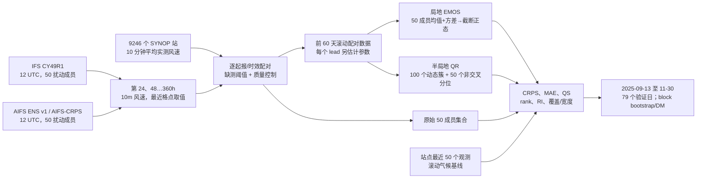

# AIFS ENS v1 与 IFS ENS：全球站点第 1–15 天风速集合预报及统计后处理的独立比较

> Mátyás Kocsis, Sándor Baran. **AI and physics-based weather forecasting: A comparative study.** [arXiv:2606.02508v1](https://arxiv.org/abs/2606.02508)，2026-06-01；[官方 HTML 全文](https://arxiv.org/html/2606.02508v1)｜[24 页 PDF](https://arxiv.org/pdf/2606.02508v1)。截至本次核验为 v1 预印本，尚未把可能出现的期刊版本混入。本笔记依据全文、9 幅图与附录表 1，并用 [ECMWF 的 AIFS ENS v1 业务说明](https://confluence.ecmwf.int/spaces/FCST/pages/540554034/Implementation%2Bof%2BAIFS%2BENS%2Bv1) 核对模型版别。

**归档与性质**：`medium-range/`；中期预报集合**评测＋统计后处理**论文，不是重新提出/训练一个深度学习天气模型。涉及 AIFS ENS v1（神经网络底座）和传统 IFS ENS 的 **1–15 天、10m 风速**概率预报。只评一个变量、以 SYNOP 站点风速为真值，不能外推到所有变量、格点或 2026 年升级后的 AIFS ENS v2。论文的最大研究价值，是补充在同一批业务初值/站点真值下的**负面证据**：原始 AIFS 风速集合整体落后 IFS，但经局地/半局地后处理后差距明显收窄；极端分位与校准取向不等于总体 CRPS 排名。

## 1. 研究问题与真正的新意

ECMWF 的 AIFS ENS 已在 **2025-07-01** 业务上线；它是直接可用的集合底座，不是本文作者训练的网络。AIFS 正式系统给出全球 15 天集合预报，但早期公开评估常按大区域、不同变量或格点分析真值统计。本文问的是更接近使用场景的问题：**AIFS ENS v1 与同日 IFS ENS 的原始 10m 风速集合，在全球九千余真实 SYNOP 站上谁更好？**如各自加同类后处理、同一验证真值，结论如何变化？

本文首次系统地在这套资料上同时试两种简单校准：左截断正态的 **EMOS**，以及受非交叉约束的样条 **QR**。这两种都是**统计模型**，不存在本文新神经网络架构、AIFS 权重重训或对 AIFS 的微调。被比较的 AIFS ENS v1 底座训练应参看仓库已有的[独立 AIFS-CRPS 笔记](37-aifs-crps.md)，不要把那篇底座论文的训练轮数、损失和本篇 60 天后处理窗口混为同一个阶段。

2026 年 5 月 12 日 ECMWF 将 AIFS ENS v1 升到 v2、IFS CY49R1 升到 CY50R1；[ECMWF 公告](https://www.ecmwf.int/en/about/media-centre/news/2026/ifs-cycle-50r1-aifsv2-live)确认日期。本篇的 **2025-07 至 2025-11** 样本不包含上述升级。若未来复现当前业务结果，必须重新取版并重训后处理，不可把这份论文的负面结论直接称作对 v2 的实测。

## 2. 数据链、时间切分和对比协议

该图为根据原文 §2–4 **原创重绘**的实验流程，不转载原文图片；箭头表明“后处理拟合”只在底座输出和站点观测之上进行。AIFS 与 IFS 的**集合成员同为 50 个有初值扰动的成员**；ECMWF 对外可称 51 轨（含控制），但此文实际评分对象是各自 50 成员，不应把“51 个业务轨”写成文中样本数。

| 项目 | 原文设置 | 读者需要留意 |
| --- | --- | --- |
| 预报系统 | IFS ENS **CY49R1**，AIFS-CRPS **AIFS ENS v1**；原文背景给 IFS 约 9km、AIFS 约 30km | 底座分辨率差使“AI vs 物理”的解释不纯；本研究未对相同空间分辨率重新训练两系统 |
| 起报/lead | 全部取 **12 UTC**；`24, 48, …, 360h`，即 Day 1–15，每隔 24h | 不能声称研究了其 6h 子日变化、其他起报时刻或 16 天 |
| 观测与空间匹配 | 16,367 候选站中留下 **9,246** 个 SYNOP 站；观测是指定时刻的 **10 分钟平均 10m 风速**，预报直接用站点**最近格点** | 不是观测内插或高分辨率下垫面订正；格距差和地形/海岸代表性误差没有从底座误差中剥离 |
| 缺测/QC | 只保留缺测日期比例 **≤5%** 的站点，预报－观测配对另做 QC | 论文未给所有极端风速/QC 标志详细阈值，不能凭空补造；站点筛选使少站区更稀疏 |
| 时间窗 | 全资料 `2025-07-01—11-30`，153 个日历日；后处理用前 **60 天滑动窗口**；真正检验为 **2025-09-13—11-30，79 天** | 153 天不是 153 个完全独立封存验证日；验证日与初值日的对应/晚到观测需在重现实验时仔细对齐 |
| 空间覆盖 | 北半球温带 **7,533** 站、南半球温带 **914** 站、热带 **799** 站，合计 9,246 | 全站平均强烈偏向北半球陆地；不能当等面积全球风速技巧 |
| 基线 | “climatology”用该站最近 **50 个风速观测**构造预测分布；原始集合直接由 50 扰动成员经验分布 | 这不是固定 30 年气候态；滚动近 50 观测的基线定义影响长 lead 比较 |

正文 §2 给出集合均值 `f̄=(1/50)Σf_k` 和无偏样本方差 `S²=(1/49)Σ(f_k−f̄)²`；两个系统分别处理。模型没有把 AIFS/IFS 的风向、粗糙度、地形或时刻信息作为后处理协变量，因此这里只比较**单变量、低维**校准策略。站点风速是一种比大尺度 Z500 更严苛、且明显受 9km/30km 网格差影响的落地指标。

## 3. 两套后处理模型：结构、目标、参数与训练细节

### 3.1 截断正态 EMOS：四参数的局地 CRPS 优化

风速非负、偏态，本文令 `Y|F ~ N₀(μ,σ²)`，即在零左截断的正态分布；位置和方差与集合统计量连接为

`μ = a + b² f̄`，`σ² = c² + d² S²`。

`a,b,c,d` 四个待估参数对同一站、同一 lead 单独估计；`b²/c²/d²` 在式子中保证相关尺度项非负，但 `a` 可以负。50 个扰动成员可交换，故都通过同一均值/方差进入，而非每个成员一个权重。参数以过去 **60 天**该站、该 lead 的预报－观测对，最小化累计 **CRPS** 拟合，每天滚动更新。论文报告较短 30 天窗在第 10 天以后造成不稳定，因此主结果固定 60 天。极端大风在少量站会使拟合出的负位置、大尺度失控；若四参数绝对值之和 **>50**，损失加上等于参数平方和 **0.1%** 的 L2 正则。原文没有披露优化器、初始值、收敛停止阈值、每站失败重试计数；不能写成 Adam/SGD 或神经网络微调。

EMOS 输出连续预测分布。为了与 QR 的 50 个分位公平比较，实验时从其截断正态 CDF 取 **50 个等距分位点**形成后处理“成员”。这一步是评分表示转换，不是 EMOS 自己另训一个 50 成员网络。

### 3.2 半局地样条 QR：对数风速、动态分簇、非交叉

目标改成 `z = log(y+0.01)`，其中 `y` 是 SYNOP 非负风速；对每个概率水平 `τ∈{1/51,2/51,…,50/51}` 都拟合一个预测分位。协变量为原集合的 **10%、50%、90%** 分位（`q10/q50/q90`），每个协变量通过一个三次 B 样条函数，另外有截距。目标为所有样本的 pinball loss 加对样条系数**三阶差分绝对值**的平滑惩罚；对各分位的解施加非交叉约束，防止输出 CDF 反常。最后再从对数尺度反变换回非负风速；论文没给出逐分位截断/外推的其它工程规则。

QR 比 EMOS 参数多，不逐站拟合；每天以此前 **60 天**的每站 **24 维**特征重新聚成 **100 个 k-means 簇**：前 12 维是当地观测分布的等距分位，后 12 维是集合均值预报误差经验分布的等距分位。簇内共用回归参数。作者试过 20–500 簇，主结果选 100。用 R 的 `quantregGrowth` 估计 penalized quantile splines，默认样本量决定节点数；平滑系数 `λ=1`。若一次估计失败，则退回 `λ=1.2`、固定 5 节点；这个回退在 IFS/AIFS 预报样本中分别仅约 **0.03%/0.02%**。不能把这些称作神经模型训练的 epoch/学习率/微调冻结层，它们是独立统计拟合。

上述两个后处理器都是**按 lead 分别**拟合，训练时每个验证日只使用过去窗口资料；作者未公布该原始业务观测和全部后处理脚本的固定代码归档，本笔记不能替代逐日数据重放。尤其最长 15 天 lead 的标签须等实测到达，若实际业务要复算，需要明示“过去 60 天”究竟按**起报日还是验证日**筛选以避免未来标签进入训练；文章未给足够细节证明某种具体实现，故这里只把它列为复现核查点，不断言作者已泄漏。

## 4. 评分协议：六种视角不能只挑一项

1. **CRPS**：对完整预测 CDF 与观测阶跃 CDF 的平方差积分，单位 m/s，越低越好；CRPSS=`1−CRPS方法/CRPS参照`，正值代表胜参照。全文 Figure 2b 用“最近 50 观测”气候分布作参照；Figure 4 用**同类型 IFS**作参照，例如 EMOS AIFS 对 EMOS IFS、QR AIFS 对 QR IFS，不能互换解读。
2. **MAE**：取预测分布中位数的点误差（m/s）；MAES 同理是对参照的相对提升。MAE 与集合均值 RMSE 不同，体现另一个决策口径。
3. **QS/QSS**：各分位的 pinball loss 及相对技巧。方法段 §3.4 一处写 `5/10/20/80/90/95%`，但 **Figure 5/6 的标题和图面实际为 `5/10/25/75/90/95%`**；解读图 5/6 以图面为准，并记录正文冲突，不擅自统一。
4. **可靠性**：50 成员预测对应 **51 档 rank histogram**，RI=`Σ_r |观测落第r档频率−1/51|`；RI 越低越接近均匀。标称中心覆盖 `(50−1)/(50+1)=96.08%`；覆盖率检验校准，区间平均宽度检验尖锐度，不应只看覆盖率越高越好。
5. **显著性**：总体技巧差的 95% Gaussian 区间来自对**每日空间平均分数**作 stationary block bootstrap **2000 次**，保留时间相关性；空间地图另逐站进行单侧 Diebold–Mariano 检验，以 5% 判显著。逐站检验的显著站点比例是**站点占比，不是全球面积占比**。
6. **可比性**：同一 79 天、同一批站点、同一种风速定义下比较是长处；但 50 成员配置、站点 nearest-grid 配准、系统原始分辨率差、北半球站点密集仍限定了因果归因。

## 5. 原始结果：明确数值与图上方向

### 5.1 原始集合与后处理后的总体排序

- **原始集合**：Figure 2a 的 IFS mean CRPS 在 Day 1–15 **全程低于 AIFS**；Figure 4 相对 IFS 的原始 AIFS CRPSS 约 **−4%**、MAES 约 **−3%**，并且整段置信区间偏负。附录有更精确的全站例子：Day 1 **−4.578%**、Day 10 **−3.687%**（AIFS 相对 IFS CRPSS）。原始 IFS 与 AIFS 的 CRPS 曲线**都劣于该研究的滚动 50 观测“气候”基线**；这说明未经局地校准的风速概率分布存在较大系统误差，不是说业务 IFS/AIFS 在所有预报任务都弱于气候态。
- **后处理总体**：EMOS 与 QR 均显著降低 CRPS 和中位数 MAE。相对滚动气候基线，四个校准集合的 CRPSS 在 Day 1 约 **27%–32%**，之后下降，到第 11 天仍显著高于零；本文没有将后续小正值冒充仍然显著。EMOS 总体 CRPS 在 Day 1–7 略优 QR，但相互差异的统计显著性主要限于 **IFS Day 1–3、AIFS Day 1–4**。在第 5–12 天，EMOS AIFS 相对 EMOS IFS 的总体 CRPSS 有时略正，但**不显著**；Day 15 IFS 反有显著优势，不能概括为后处理后 AI 全程领先。
- **保持参考相同**：附录列相对匹配 IFS 的 EMOS AIFS CRPSS，Day 1 **−2.687%**，Day 10 **+0.128%**；QR AIFS 分别 **−2.844%** 与 **+0.011%**。Day 10 的极小正数接近零且不足统计显著，不是 AIFS 业务优势的证据。Figure 4a/b 的三个曲线组分别以各自匹配 IFS 为分母，只能在组内解读 AIFS–IFS 差，不能从该图独自推断 EMOS、QR、raw 三者的绝对排名。

### 5.2 原文附录 Table 1：有显著差异的站点占比（%）

以下值逐格转录自 PDF p24 的 Table 1。表中“IFS 胜/AIFS 胜”分别是**该区域所有站点中**某系统 mean CRPS 显著较低的比例；两数相加不会达到 100%，余下多数站差异不显著。为了突出中期时效，仅选 Day 1 / Day 10 / Day 15；完整 1–15 天见原表。`N/S/T` 站数分别为 **7533/914/799**，绝不把这些比例当等权纬带/面积结果。

| 区域与系统 | Day 1 IFS / AIFS 胜站比 | Day 10 IFS / AIFS 胜站比 | Day 15 IFS / AIFS 胜站比 |
| --- | ---: | ---: | ---: |
| 北温带，原始集合 | **34.6 / 28.8** | **28.4 / 23.2** | **30.2 / 20.7** |
| 北温带，EMOS | 19.4 / 6.3 | 8.4 / 7.2 | 8.1 / 5.7 |
| 北温带，QR | 18.9 / 7.2 | 10.1 / 8.9 | 10.5 / 8.2 |
| 南温带，原始集合 | 36.7 / 25.9 | 31.0 / 25.1 | 30.2 / 23.3 |
| 南温带，EMOS | 13.2 / 9.8 | 7.9 / 8.6 | 6.9 / 10.2 |
| 南温带，QR | 17.1 / 11.6 | 8.9 / 11.9 | 7.9 / 9.8 |
| 热带，原始集合 | 36.2 / 36.0 | 34.0 / 23.5 | 33.0 / 25.4 |
| 热带，EMOS | 8.5 / 11.6 | 5.0 / 14.0 | 5.9 / 9.6 |
| 热带，QR | 11.0 / 13.3 | 7.1 / 11.6 | 8.1 / 11.3 |

热带的后处理 AIFS 显著胜站比可高于匹配 IFS，但热带仅 799 个站、占全站不到九分之一；其局地优势不能推翻以 9246 站加权的总体结果。作者同时指出后处理后**超过 70% 站**在匹配系统间的 mean CRPS 差异不显著。空间地图没有清晰的全球一边倒格局；站点不均匀更应防止把“全球站点平均”说成“全球平均技能”。

### 5.3 分位尾部、可靠性与尖锐度：总体 CRPS 之外的权衡

- Figure 5：低端 **5% 分位**，QR 明显胜 EMOS，且 AIFS/IFS 各自如此；EMOS AIFS 对滚动气候的显著正 QSS 只到 **Day 5**。在 90%、95% 高端，四组校准法 Day 1 QSS 皆 >30%；**90% 至 Day 11、95% 至 Day 8** 仍显著优气候；95% 分位 Day 7 后 EMOS 显著落后 QR。故不能因为 EMOS 的总体 CRPS 更好就说它对尾部风险也更好。
- Figure 6：原始 AIFS 在所有所画分位和 lead 相对原始 IFS 的 QSS 都负；校准后差距缩小，尾端某些日的差异不显著。图中的“正”必须对照对应匹配 IFS，而不能和 Figure 5 的气候基线混为同一参照。
- Figure 7：原始 IFS 与 AIFS 的 rank histogram 是强烈 U 形（欠离散）并有偏；原始 AIFS 在 Day 1/5/10/15 的 RI≈**0.783/0.559/0.438/0.420**，原始 IFS≈**0.773/0.507/0.362/0.335**。EMOS 两者 Day 1 RI≈**0.217/0.217**，QR≈**0.164/0.162**，QR 更接近均匀，但 EMOS 对均值 CRPS 可略占优；“校准更好”和“综合 proper score 更好”不能互相代替。
- Figure 8：原始预测的 96.08% 区间覆盖率不足，随 lead/离散度增大而上升；校准后更接近标称，IFS/AIFS 后处理曲线几乎重合。原始 IFS 在 Day 10 后区间宽度甚至高于滚动气候基线；因此更高覆盖若只靠**更宽**的区间，并非真正提高质量，须一起看 CRPS 和宽度。

## 6. 主图与附图逐图定位、原文矛盾

| 原文图/表 | 能支持的证据 | 不能说成什么 |
| --- | --- | --- |
| Figure 1 | 9246 个 SYNOP 站全球分布，北半球陆地密度极高 | 均匀全球或海洋验证 |
| Figure 2 | 原始/EMOS/QR/50 观测气候的 CRPS 及对气候 CRPSS；校准最初强、Day 11 后逐渐失去显著优势 | AIFS v2 测试；某条曲线的肉眼读值即精确数据 |
| Figure 3 | 中位数 MAE/MAES 与 CRPS 一致但相对基线强弱不同 | 中位数 MAE 代表概率校准全貌 |
| Figure 4 | 同种方法的 AIFS 相对 IFS：raw 显著负，校准后中后段多不显著 | 图 4 同时提供 EMOS 对 QR 的绝对比较；或 Day10 +0.128% 显著胜出 |
| Figure 5 | 分位对滚动气候的 QSS，低端 QR、高端长 lead QR 更好 | 所有分位都由 EMOS 最优；正文 §3.4 的 20/80 与图面 25/75 完全一致 |
| Figure 6 | 各分位 AIFS 相对匹配 IFS，强调底座差异在后处理后缩小 | 图 5/6 分母相同 |
| Figure 7 | rank histogram 与精确 RI，原始欠离散，QR 的 RI 一般更低 | 校准后完全均匀或 QR 总体 CRPS 必然最佳 |
| Figure 8 | 96.08% 覆盖和区间宽度，应联合读“可靠性－尖锐度” | 只凭覆盖率上升证明预报更好 |
| Figure 9（PDF p23） | 图面六块清楚标 **Day 1/Day 10**，正文附录也明确 Day 1/10；绿色 IFS 显著优、红色 AIFS 优、白色不显著 | **图注却写 Day 1/Day 5**：这是原稿内部矛盾，按图面/正文解读，复引用时注明冲突 |
| Table 1（PDF p24） | 三纬区×六系统×15 lead 的站点显著胜出比例，原始 IFS 多数更强、后处理后差异大减 | “AIFS/IFS 预测更准确百分比”——其余站点多数是不显著，不计入任一胜方 |

图 9 的 day 标签冲突与 Figure 5/6 分位标签冲突，是复现和引用时最容易被忽略的两个文字错误；本笔记保留原始不一致，不替作者默默修正。上述“约 −4%/−3%”来自正文概括，而四个带三位小数的 CRPSS 值来自附录段落；未从图像曲线人工估造小数。论文自身没有把 AIFS/IFS 的网格场输出成性能原始数值表，故只转录 Table 1 与明确叙述数字。

## 7. 如何理解与 ECMWF 其他 AIFS 报告看似冲突的结论

本篇 raw AIFS 在**站点 10m 风速**上全时效落后 raw IFS；作者自己对照了早期 Lang 等的区域 scorecard：那里 AIFS 在若干区域/变量更优。两个结论不必有一个错误——数据期不同、站点集合和空间权重不同、**9km vs 30km** 分辨率对近地风特别关键，而且站点代表性与格点场评分是不同问题。本研究没有把系统仅以风速变量重新训练到相同 9km，也没有地形、城市粗糙度或海岸分类消融，所以可以说“在此样本和协议下，原始业务 IFS 更好”，**不能**说“物理模型总体优于所有 AI 中期预报”或“AIFS 的训练目标导致风速必然不佳”。

经过 60 天校准，两个系统的风速分布改善且差距接近零，说明相当一部分站点风速劣势具有**可校准**成分；但不能断言全部底座差距仅是偏差，因为后处理模型容量、当地可得观测、网格分辨率和台站抽样都混在结果里。QR 低尾/可靠性表现常更好，EMOS 短 lead 总体 CRPS 常更好，这为能源和极端风险应用提供了“目标指标先于模型选择”的操作启示。

## 8. 复现清单、未披露项与下一步验证

- 固定 IFS **CY49R1**、AIFS ENS **v1** 的 12 UTC 业务 50 扰动成员，不能把 AIFS-DIFF、AIFS Single 或 2026 v2 权重混入。本文不提供新底座网络结构/训练优化器；若要研究底座训练，转读[现有 AIFS ENS v1 独立笔记](37-aifs-crps.md)与[ECMWF v1 实施说明](https://confluence.ecmwf.int/spaces/FCST/pages/540554034/Implementation%2Bof%2BAIFS%2BENS%2Bv1)。
- 明确站点全集、`≤5%` 缺测选择、其他 QC、最近网格查找、10 分钟观测时间定义、60 天滑窗如何处理**尚未完成验证的长 lead 标签**。文章未给逐站配对数据及完整固定代码存档，本笔记不把重现所需实施细节伪装为已知。
- 每 lead 分别跑 local TN-EMOS 与 100 簇 QR；记录异常 EMOS 正则触发、QR 回退率、解的非交叉约束和观测反变换；与 raw、最近 50 观测基线以同一 79 天样本对照。
- 同报 CRPS/MAE、5/10/25/75/90/95% QS、rank/RI、96.08% 覆盖和宽度，时间相关用 2000 stationary block bootstrap；逐站 DM 的多重比较问题论文没有系统调整，解释“显著胜站比”时需保守。
- 更公平的后续实验应把 station matching、地形/粗糙度、纬带等面积加权、冷暖季封存、多年份和升级版 v2 全部单独做敏感性；也应报告 100m 风等能源变量。若要推出“深度学习后处理更好”，还需另训并验证 DRN 等高级网络；本论文并没有做。

**阅读结论**：AIFS ENS v1 的 15 天能力与本文的实证结论分别属于“**底座支持的预报时效**”和“**这批站点风速的评分结果**”。本篇最扎实的事实是：2025 年秋季 9246 站的原始 IFS 风速集合在 Day 1–15 稳定优于原始 AIFS；相同 60 天训练资料经 EMOS/QR 校准后，概率性能整体改善，二者差距多数中期 lead 已不显著。它为 AIFS 系列补上关键的变量/地面真值反例，同时清楚暴露新旧版本、地理采样和评价指标的边界。
