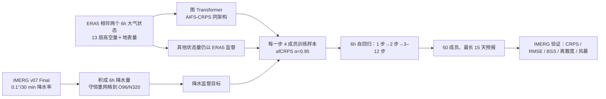

# Laxmi：以 IMERG 卫星降水监督 AIFS 的十五天集合预报

> Julian F. Schmitt、Bertrand Delorme、Robert C. King、Yashica Patodia、Tapio Schneider、Aditi Sheshadri、Ravi Jain，*Improving global precipitation forecasts with an AI weather model trained on satellite observations*。[arXiv:2609.03210v3，2026-09-23](https://arxiv.org/html/2609.03210v3)；[arXiv 版本记录](https://arxiv.org/abs/2609.03210)显示初版 2026-09-02、v2 2026-09-10、v3 2026-09-23。2026-09-25 按 **v3 正文、Methods、主图 1–4 与内嵌 Supplementary Figures 1–13 的图注**复核。此时仍是提交中的预印本，不把 v2 旧题名或图号冒充最新版。

## 一、研究问题：概率损失之外，训练真值本身有什么偏差？

传统 AI 天气模型多用 ERA5 再分析作为降水目标。ERA5 的对流和微物理参数化会传递到学习目标：毛毛雨过多、强雨偏弱。AIFS-CRPS 虽然用集合概率损失减少 MSE 式平滑，若目标场仍是 ERA5，总降水的频率分布仍受其约束。本文提出 Laxmi，把 AIFS-CRPS 的图 Transformer、核心 ERA5 大气状态和近公平 CRPS（afCRPS）保留，**把降水的训练目标替换为 GPM IMERG v07 Final 卫星降水**，检验卫星监督能否改善 15 天 24 小时累计降水的集合分布。[引言与 Methods](https://arxiv.org/html/2609.03210v3)

这里的“卫星到预报”要精确理解：IMERG 是**监督标签**，论文仍以 ERA5 的两个 6 小时大气状态启动并滚动。它没有把原始微波/红外亮温直接送入推理网络，也没有建立独立卫星同化初值。作者在结尾明确指出实时部署还需要适配业务分析初值；所以这不是 FuXi Weather / AIFS-DOP 式观测直接生成全大气分析的系统。[Methods §Data and pre-processing、Discussion](https://arxiv.org/html/2609.03210v3)

## 二、模型结构和数据流

此图是依据论文文字的**原创流程重绘**，不是原图截图。原文只说 Laxmi 与 AIFS-CRPS 使用同一图 Transformer 架构，没有在本文重新列逐层隐藏维、注意力头数和总参数量；[AIFS-CRPS 的单独笔记](37-aifs-crps.md)可作背景，但不能在缺少 Laxmi 权重配置时把旧模型的全部超参数宣布为新模型已逐项核验。本文内**没有独立“先冻结主干、只训降水头”的实验说明**；补充材料说“precipitation attention head”所受监督改变，但它不等于给出了冻结范围。[Methods §Model architecture and optimization、补充材料 Note](https://arxiv.org/html/2609.03210v3)

### 输入、目标与变量处理

| 环节 | v3 原文披露 | 对复现的具体影响 |
|---|---|---|
| 大气驱动 | ERA5，两个相邻 6 小时状态，形式为 $x_{i+1}=\mathcal M(x_i,x_{i-1})$；13 个垂直层和 **31 个地表变量**，字段集参照 AIFS 1.1.0。 | 31 是本文给出的地表变量总称，不等于它逐项公开列出了 31 个名字；不得用其它 AIFS 版本变量表填空。 |
| 需要排除的 ERA5 字段 | 排除 **convective precipitation、surface runoff、snowfall**，避免与 IMERG 降水监督发生明确不一致。 | 主文未提供每个被排除字段原本属于输入、输出还是双向状态的完整配置。不能据这句话推导最终通道数。 |
| 降水真值 | IMERG v07 **Final**，2000 年 6 月起可用；原生约 0.1°、30 分钟的即时降水率。 | 按 30 分钟时长乘降水率并求和成 **6 小时累计量**，随后**守恒重网格**至 O96（约 1°）或 N320（约 0.25°）训练网格。不是简单最近邻、也不是把 30 分钟率直接当 6 小时总量。 |
| 时间划分 | IMERG 训练 **2000-06 至 2023-12**；**2024 和 2025 留作验证**。 | 2024 用于全球 94 次起报评分；2024–2025 的风暴个例/统计不是额外训练数据。 |
| 空间范围 | 全球评分只在 **60°S–60°N**。 | IMERG 在更高纬冻结表面的被动微波检索不完整；不能把论文的“全球”结果外推到两极。 |
| 未披露 | ERA5 逐字段归一化统计、IMERG 缺测/质量旗标逐项筛选、守恒插值权重、批次如何处理海陆边界，均未在本文给到可直接运行的配置文件。 | Anemoi 框架公开不代表 Laxmi 的专用训练 YAML/权重已公开；缺失配置应当明说，而非补造。 |

[Methods §Data and pre-processing、Data/Code availability](https://arxiv.org/html/2609.03210v3)

## 三、训练目标、阶段与“微调”的准确含义

训练一个 4 成员集合，原文 afCRPS 的绝对误差项衡量成员接近真值，成员两两距离项鼓励合理离散。设 $M=4$、$\alpha=0.95$、$\epsilon=(1-\alpha)/M=0.0125$；公式中的成员间距系数是 $1-\epsilon=0.9875$。这里的 4 是**训练时用于评分的成员数**，不是部署时的 50；评价时还要另算公平 CRPS/BS，不能把优化损失直接当全部验证指标。[Methods 公式 (1)](https://arxiv.org/html/2609.03210v3)

| 阶段 | 作者在 v3 公布的流程 | 数据、微调和限制 |
|---|---|---|
| 1：一步预报 | 1 个 6h 步，**75,000 次更新**；最大学习率 **1.6×10⁻³**。 | 对 ERA5 大气字段和 IMERG 降水目标一同优化；不是先对 ERA5 降水训练 75k 步。 |
| 2：两步预报 | 2 个 6h 自回归步，**20,000 次更新**；最大学习率 **1×10⁻⁵**。 | 续用第 1 阶段参数，开始适应自己的预测作为下一步输入。 |
| 3：延长滚动 | 每 epoch 把 rollout 从 **3 步增至 12 步**，共 **3,100 次更新**；最大学习率 **2×10⁻⁶**。 | 最长训练展开 72h，推理却滚动到 15 天；15 天不是直接跨 60 步反传的训练目标。 |
| 全阶段优化 | 原文写 **Adam**，$\beta_1=0.9$、$\beta_2=0.95$、weight decay **0.1**；三阶段均用余弦学习率日程。N320 batch **32**；O96 batch **20**。 | 不能擅自把原文的“Adam + weight decay”改写为“AdamW 分离衰减”，也未给 warm-up、梯度裁剪或冻结列表。 |
| 计算资源 | O96：**10×A100 80GB**；N320：**128×A100 40GB**，两种配置均约 **10 天**。 | 概率训练需多成员，算力差异大；O96/N320 性能差异不能只归因于分辨率。 |

原文在摘要和讨论用“fine-tune”描述卫星观测适配，但 Methods 展示的是以上三阶段重新训练日程，并未明确给出**从哪一个 AIFS-CRPS checkpoint 初始化、哪些层冻结/解冻、是否从零初始化**。因此本笔记把可以核实的事实写为“同架构、IMERG 降水监督、三阶段优化”；不把它具体化成“仅微调降水头”或“全网从头训练”。另一个与 AIFS-CRPS 旧版不同的地方是：作者称**所有三个阶段都用 ERA5 分析**（降水例外为 IMERG），没有做先前 AIFS-CRPS 研究使用的最终业务分析阶段。对当前实时 IFS 初值的分布迁移问题，作者自己列为尚需解决。[Methods §Model architecture and optimization、Discussion](https://arxiv.org/html/2609.03210v3)

## 四、评测协议：先辨明“同一赛道”

主实验用 WeatherBenchX 对 2024 年 **94 次起报**、每次 **50 成员**、6 小时步最长 15 天的集合预报，评价 24 小时累计降水，对照 AIFS-CRPS、IFS ENS、AIFS-MSE、IMERG 再抽样的 50 成员气候态。主分数区域 60°S–60°N、0.25°；另将资料守恒重网格到 1°/2.8°与 O96 版、NeuralGCM-precip 做分辨率比较。对照不是“全部模型同网络同训练预算”：AIFS-MSE 是确定性目标、NeuralGCM 是不同架构、O96 的 batch/GPU 与 N320 也不同。[主图 1–2，补图 4、10](https://arxiv.org/html/2609.03210v3)

作者选 **2024-02 至 2024-12、06/18 UTC** 的周起报以避免 ERA5 12 小时同化窗的未来信息；图 2 标出 **IFS 的这些时次只覆盖到第 6 天**，之后 IFS 分数切为 **00/12 UTC** 起报。后段不是完全相同的起报时刻配对；补图 4 称此切换或许略有利于 IFS，但读 7–15 天曲线时仍必须说明。气候态从 **2001–2019 IMERG** 抽 50 个不同成员，约同一季节（年内日 ±7 天）和相同日内时刻；故不是逐日固定常数，也不含 2024 测试年。[图 2 图注、Methods 气候态](https://arxiv.org/html/2609.03210v3)

原文把 50 成员超阈概率 $p$ 做有限样本订正 $BS_{fair}=(p-o)^2-p(1-p)/(M-1)$，再用 IMERG 气候态的 fair BS 计算 $BSS=1-BS_{fair}/BS_{clim}$。**BSS 改善 57.2%**是相对基线的比例变化，不是 BSS 的绝对分值 +0.572；原文未在正文表格列对应的每一个绝对 BSS 值。集合均值 RMSE 报的是 unbiased ensemble mean 版本，离散度以 spread–skill ratio 衡量，理想约 1；而 CRPS 和 BSS 并不直接揭示空间联合轨迹是否真实。[Methods 公式 (2)–(3)、图 2](https://arxiv.org/html/2609.03210v3)

## 五、主图与数值：亮点、持续性、反例

| 来源和口径 | Laxmi 相对对照的原文数字 | 正确阅读 |
|---|---|---|
| Fig. 1g / 分布频率，0.25°、24h 累计 | 对 **>50 mm/day**，Laxmi 捕获观测事件频率约 **68%**，AIFS-CRPS/IFS 各约 **30%**；对 **>100 mm/day**，Laxmi **38%**、IFS **17%**、AIFS-MSE **4%**。 | 是频率比，不是格点命中率、POD 或 15 天逐 lead 的 BS；作者称 **>300 mm/day** Laxmi 未产生降水，IFS 仍有约观测频率的 **10%**。 |
| Fig. 2，2024 年 94 起报/50 成员，Day 1 | 24h 降水 CRPS 比 AIFS-CRPS **低 19.3%**、比 IFS **低 20.1%**；集合均值 RMSE 低 **8.7%/8.9%**；95 百分位 BSS 相对改善 **57.2%/54.4%**。 | 分母分别是 AIFS-CRPS/IFS；不能把两个改善百分数混加。正文称整段至 Day 15 的四类指标均优，但没有给每一天可转录精确表。 |
| Fig. 2d，Day 1 / Day 15 离散度 | Laxmi spread–skill ratio **0.83**（Day 1），Day 15 **>0.97**；AIFS-CRPS/IFS Day 1 **0.50/0.66**，全 lead 未超 **0.77/0.83**。 | 仅说明该比值趋近 1；不能把“更接近 1”扩张为所有阈值、时空尺度都可靠。 |
| Discussion，Day 10 | Laxmi 对 AIFS-CRPS 的 CRPS 改善 **3.4%**。 | 优势随时效缩小，不能把 Day 1 的 19.3% 当 Day 10/15 的改善。 |
| Fig. 4d，10 场印度登陆风暴 | 50/100 mm 的 **20 个风暴×阈值**比较里 Laxmi 最低 BS **12 次**，AIFS-CRPS/IFS 各 **4 次**；250 mm 的 **10 次**里 IFS/Laxmi 各 **5 次**。摘要另说 150 mm 事件累计阈值 **7/1/2**。 | 对极端尾部 IFS 仍有价值；摘要的 150 mm 计数与正文引用的 50/100/250 mm 分母不同，不应合并。 |

[原文 Figs. 1–4 与 Discussion](https://arxiv.org/html/2609.03210v3)。摘要称“<3 mm/day 毛毛雨过报减少 33%”，但正文相应图是频率曲线、没有一张列全区域/lead 绝对误差的表；这里保留其摘要归属，不把 33% 写成所有区域和时效统一减少。图 1a–f 展示 **2001–2023** ERA5/IMERG 的 99 百分位和 0.1–1 mm/6h 小雨出现率差；图 1g 的频率比又用 **2023-01 至 2025-09** 的 IMERG 分布。两种时间分母不可混作同一训练/测试集合。[Fig. 1 图注](https://arxiv.org/html/2609.03210v3)

### 每张主图的实际证据范围

| 图 | 支持什么 | 不支持什么 |
|---|---|---|
| Fig. 1 | ERA5/IMERG 强度分布差与多模型预测频率比；说明目标偏差与改善机制。 | 频率比曲线不能证明一场暴雨在正确地点/时间被预报。 |
| Fig. 2 | 94 起报的 CRPS、unbiased mean RMSE、95 分位 BSS 与 spread–skill；阴影为起报平均分数的 95% 置信区间。 | 不等于 2025 全年全球即时业务评分；IFS Day 6 后时次切换。 |
| Fig. 3 | Remal、Asna、Dana、Fengal 四场印度登陆系统：1 天前至 3 天后累计雨量、100 mm 概率图及活跃区 Brier。 | 四场示例图不能代替全部 10 场或全球 46 场汇总。 |
| Fig. 4 | 十场印度系统的 CSI/POD/FAR 和各阈值最低 BS 次数；30% 警报概率阈值。 | 单一概率阈值与约定活跃区不能自动外推所有预警用户成本。 |

补图 1–3 描述原始均值/频率分布；补图 4 把 N320/O96 在 0.25°/1°分开；补图 5–9 把全球/热带的 90、95、99 分位 BS/BSS 与四评分拆开；补图 10 是 **104 个 00/12 UTC 初值**且统一到 2.8° 的 NeuralGCM 对比，**不是主图 94 次 06/18 UTC 的同批起报**；补图 11 是十场印度风暴平均 BS；补图 12 展示美国五场登陆气旋；补图 13 才是全球 **46 场登陆气旋**的决策类指标。没有补图的原始逐点评分数组，不能从曲线像素编出额外三位小数。[v3 Supplementary Figures 1–13 图注](https://arxiv.org/html/2609.03210v3)

## 六、印度风暴实验的物理量与决策阈值

十场样本取自 **2024-02-08 至 2025-09-30** 印度登陆、至少达到 depression 强度的 IBTrACS 系统。每场选登陆前**至少 72 小时**且最近的 06/18 UTC 起报，计算从登陆前 1 天至登陆后 3 天的**四天事件累计降水**；主图 3 仅画其中四场。统计活跃区是 IBTrACS 四天轨迹外加 500 km 缓冲，再限制为观测或任一模型有非零超阈概率的格点；二元警报概率阈值为 **30% = 50 成员中的至少 15 个**。CSI/POD/FAR 和 50–250 mm 事件累计阈值由此得到。[Methods §Indian monsoon case study setup / Evaluation metrics、Figs. 3–4](https://arxiv.org/html/2609.03210v3)

一个需要复核的**原稿口径不一致**：Fig. 4 图注把五个阈值写为 `mm day⁻¹`，Methods 却明确计算四天事件累计，Fig. 3 图注的 100 mm 也写“event-integrated accumulation”。本笔记把次数和模型排序归于**四天累计实验**，但**不自行将 50–250 mm 阈值换算成日雨强**。另外 2025 风暴在原文虽是训练外留出年，主 94 起报全球评分仅是 2024；不应说两者有同样的统计分母。[Figs. 3–4、Methods](https://arxiv.org/html/2609.03210v3)

## 七、如何复现、哪些结论目前不能下

这项研究最有力的结论是：在相近的 AIFS 架构和 afCRPS 目标下，**改用卫星降水监督**可以明显修正 ERA5 学到的降水分布偏差，并在作者的 2024、60°S–60°N、IMERG 真值协议下，提升 Day 1–15 的集合降水评分。近似 1° 对比也显示，N320 的较高分辨率与误差增长形态重要；但两版架构细节、训练 batch/设备、训练日程及字段处理可能并不完全等同，不能凭这些图推断“分辨率本身单独造成了全部增益”。[Results 与 Methods](https://arxiv.org/html/2609.03210v3)

复现最小核对单是：取得相同版本的 IMERG v07 Final 与 ERA5；确认 30 分钟率→6 小时量的时间边界和守恒重网格；核实 13 层/31 地表字段最终配置与排除项；确认权重初始化、各阶段是否冻结任何参数、随机噪声/成员生成方式、逐字段标准化、Anemoi 训练 YAML；在 94 个共同初值上跑 50 成员并保留 IFS Day 6 后时次切换；另算 10 场印度、5 场美国和 46 场全球登陆气旋，不混其分母。作者写明 **Laxmi 专用代码仅在同行评审需要时可按请求提供**，并没有在论文中给公开 checkpoint 或可运行训练配置；所以上述若干关键点目前不可独立核验。[Data/Code availability、Methods](https://arxiv.org/html/2609.03210v3)

最后要保留三个局限。第一，IMERG 本身含卫星检索、区域覆盖和标定偏差，尤其高纬不在主评分范围；对 IMERG 的优势不自动等于对独立雨量计/雷达的同幅度优势。第二，Day 1 的大增益到 Day 10 缩为 3.4%，**>300 mm/day** 的最重雨尾仍弱于 IFS；高影响阈值需要分别评估。第三，推理仍依赖 ERA5/分析场而非实时卫星原始观测，且业务初值的最终适配尚未完成。这是“卫星资料改进中期降水目标”的强证据，**不是完全观测驱动、已部署的全球十五天系统**。[Discussion](https://arxiv.org/html/2609.03210v3)

[返回首页](../../README.md) · [返回追踪表](../../气象大模型_中期预报论文追踪.md)
