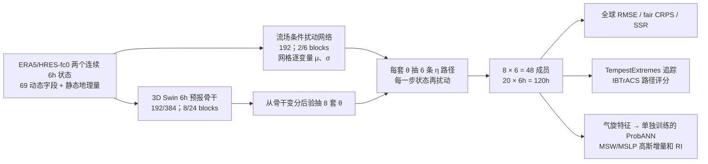

# Pangu-Bayes：把大气状态与模型参数两类不确定性正交抽样的五天集合预报

> Wenbo Hu、Xinlei Xiong、Shuxun Zhou、Kaifeng Bi、Lingxi Xie、Jun Zhu、Richang Hong、Qi Tian，*Resolving sources of uncertainty in AI weather forecasting*，[arXiv:2511.14218v2，2026-09-06](https://arxiv.org/html/2511.14218v2)。[书目页](https://arxiv.org/abs/2511.14218)显示 v1 于 2025-11-18 首发，v2 大幅改写题名、作者列表及内容；本笔记只按 **v2** 正文、附录 A–H、表 S1–S8、主图 1–6 和补图 S1–S11 归属结果。它是预印本，不把报告的集合优势写成已独立复现的业务成绩。

## 研究问题与适用时效

把许多不同扰动成员汇成一个集合，常能估计总不确定性，却不能直接说明误差来自**大气状态**还是**学习所得的模型**，也不能说明哪一类扰动更有利于不同下游指标。本文构造两个可在同一预报骨干内分别抽样的轴：条件于当前流场、逐步加入的大气状态扰动，以及共享预测模型权重的变分后验抽样。然后比较它们对台风路径、气压/风速强度和全球格点概率评分的作用。[摘要、Results 1.1](https://arxiv.org/html/2511.14218v2)

**时效边界：全部定量预报只到 120 小时 / 五天**，每 6 小时一步。按库的分类规则它是中期前段的概率集合方法；不能据题名里的 medium-range、全球评测或补表 S8 的“60 steps/member”推断已有第 10–15 天技巧。后者是硬件成本的标准化口径，不是本研究的五天评测扩展。[Methods 3.1、Table S8](https://arxiv.org/html/2511.14218v2)

## 数据、处理和切分

| 数据链 | 原文可确认的处理 | 对结论的影响与尚缺的信息 |
|---|---|---|
| ERA5 预训练与台风起报 | CDS 插值后的全球常规 **0.25°、721×1440** 格点；资料池 **1979-01-01 至 2023-12-31**，取每日 00/06/12/18 UTC。预报字段 69 个：Z/T/U/V/Q 各 13 层（50、100、150、200、250、300、400、500、600、700、850、925、1000 hPa），加 T2M/U10/V10/MSL。输入额外有地形、陆海掩码、土壤类型，静态量不作预测。两幅连续状态起报，6 小时递归 20 步。 | **1979–2023 是取得资料范围，不等于全用于优化**；公开 v2 没有明确列出每阶段 ERA5 训练/验证年界、变量逐格标准化统计和完整缺测处理脚本。2023 台风为留出评测，但需分别验证骨干的训练窗口是否排除了 2023。不能自行写“1979–2021 训练”等未经披露的年份。 |
| HRES-fc0 业务分析微调与全球评测 | 为了与 GenCast、FGN 的业务分析初值版本对齐，对已完成 ERA5 阶段的概率模型进一步使用 **HRES-fc0** 优化；全球 2022 WeatherBench2 的 00/12 UTC 起报用 HRES-fc0，**以 ERA5 验证**。HRES-fc0 不是 HRES Analysis，且可吸收起报后最多 +3h 观测。极少 Z850/Z925 NaN 用左右/上下权重 1、对角 0.5 的邻域加权填补。 | 2022 全球测试与 2023 台风测试使用**不同初值、不同模型适配状态**，不能拼成一张同协议排行榜。正文明确微调目标/参数，但未单列 HRES-fc0 的训练年界、样本数和独立优化步数；“相同渐长时效 schedule”不足以推定完全相同训练成本。 |
| IBTrACS 台风位置/强度 | 全球 **2023 年 90 场留出气旋**，6 小时时刻；00/12 UTC 起报、最长 120h。强度采用 1 分钟 10m 最大持续风 MSW 和最低海平面气压 MSLP；2023 记录不参加强度后处理训练/模型选择。 | 2023 台风子集是台风路径/强度任务，不是全球格点概率评测年份。不同机构的强度定义和起始记录时间有异，作者说明采用美国业务常用口径做协调；具体 IBTrACS 版本/逐盆地机构优先级不够完整。 |

[Methods 3.1、Appendix A 与 Table S1](https://arxiv.org/html/2511.14218v2)。ERA5 是再分析，不是独立观测真值；HRES-fc0 与 ERA5 的生成链也不相同。因此分开读两项试验比把所有曲线称作“同等业务条件”更准确。

## 模型结构、生成流程与原始结构图

确定性骨干是 **3D Swin Transformer 编码器–解码器**：高空字段按 `(2,4,4)` 的垂直×纬×经 patch 嵌入，地表量与地形/陆海/土壤类型单独嵌入后作为额外垂直片，合并成 3D token；两级隐维 **192→384**、深度 **8/24**、局部注意力窗口 `(2,6,12)`，水平 2×2 patch merging/上采样及 skip connection。它接收 `x(t−1),x(t)` 并预测 `x(t+1)`，与旧版 Pangu-Weather 的多个定长时效模型不能简单混为一谈。[Methods 3.4、Appendix D.1](https://arxiv.org/html/2511.14218v2)

扰动网络是较浅的同类 3D Swin：深度 **2/6**、起始隐维 192，对每个网格和变量输出高斯扰动的均值与标准差，标准差经过 shifted softplus；每次递归把抽得的扰动加到当前状态，而不是只在 t0 随机一次。另一轴把模型参数设为 mean-field Gaussian 后验 `q(θ)`，8 个权重样本各配 6 条状态扰动轨迹，总共 **48 个成员**。主论文把两条轴分别称 atmospheric-state/aleatoric (AU) 与 learned-model/epistemic (EU)；这些是该模型的**定义性分解**，不是证明自然界的观测误差与模式误差可唯一且因果地拆开。[Methods 3.2、Appendix D.2](https://arxiv.org/html/2511.14218v2)

结构图为按本文方法**原创重绘**，非复制 Figure 1。对标量预报量 `Y`，全方差公式为 `Var(Y)=Eθ[Varη(Y|θ)]+Varθ[Eη(Y|θ)]`。两个项分别由同一权重组内 6 个扰动成员的样本方差平均、8 个权重组的条件均值方差估计；**48 个有限样本估计带有蒙特卡洛误差**，不能把精确的总体等式误说成有限抽样逐格精确相等。[Methods 3.2](https://arxiv.org/html/2511.14218v2)

台风**强度**另有 ProbANN，并非 3D Swin 原始气压/10m 风格点直接赢得所有比较。它从初时刻气旋中心周边 60°×60°、241×241 网格提取 10m 风模最大/范围、MSL 最小/范围、Z500 最小、T850 范围、当前 MSW/MSLP、预报 lead 等，输出未来 MSW/MSLP **增量的高斯均值和标准差**。掩模半径随 6–120h 从 **6 到 120 个格点**增大，外侧缓冲宽 24 格；数值以格点为单位，非角度。该后处理器只直接解释强度/快速增强指标的收益，不能用其效果代表全球原生字段的收益。[Appendix D.3、E.4](https://arxiv.org/html/2511.14218v2)

## 训练、微调：分阶段而非一句“端到端训练”

| 阶段 | 初始化和真正更新的对象 | 目标、优化设置与样本 |
|---|---|---|
| 1. 确定性 6h 预训练 | 从头训练预报骨干；两帧输入、一帧目标。 | 纬度面积加权、按变量加权的 `L1`；高空 Z/Q/T/U/V 权重 **3/.6/1.5/.77/.54**；地面 MSL/U10/V10/T2M 有效权重 **.375/.1925/.165/.75**（先列 1.5/.77/.66/3 再乘地面系数 .25）。AdamW、余弦 LR、batch8、**60,000 步**、初始 LR `3e−4`、weight decay .1、drop-path .2、attention dropout 0。[Appendix E.1、Table S3](https://arxiv.org/html/2511.14218v2) |
| 2. 参数不确定性 | 后验均值以阶段 1 权重初始化；逐参数 mean-field Gaussian；先验以相同确定性权重为均值、标准差 **1.0**。学习后验均值/尺度。 | 每次前向重参数化抽 **1 套权重**，同样的加权 L1 + `β KL(q‖p)`，`β=1e−4`。AdamW、余弦、batch8、**30,000 步**、初始 LR `2e−5`、weight decay .1、drop-path .2。[Appendix E.2、Table S4](https://arxiv.org/html/2511.14218v2) |
| 3. 概率集合联合细化 | **同时更新**扰动网络 `φ` 与权重后验的均值/尺度，不是冻结骨干只调扰动。八张 A800 各抽一组权重和一条扰动路径，形成训练用 **8 成员**，不同于推理 48 成员。 | 逐格面积/变量加权的 **fair CRPS**，含有限集合成员间距离修正；1、2、3、4 步自回归 rollout 分别优化 **5000/3000/3000/3000** 步，总 **14,000** 步；AdamW、恒定 LR `3e−6`、batch1、weight decay .1、drop-path0。[Appendix E.3、Table S5](https://arxiv.org/html/2511.14218v2) |
| 4. 业务分析适配 | 把已联合细化的模型继续在 **HRES-fc0** 字段上微调，**后验与扰动网络都继续优化**。 | 仍用自回归 fair CRPS、LR `3e−6`、batch1、WD .1 和渐长 rollout。仅此版本用于 **2022 全球 HRES-fc0 起报**比较；本文未单独披露微调训练年界/确切步数，不能擅称它重做了 14k 步。[Methods 3.5](https://arxiv.org/html/2511.14218v2) |
| 5. 台风强度后处理 | ProbANN 与全球模型**单独训练**；6 层 hidden、宽 44、GELU、dropout .2，输出 MSW/MSLP 增量分布。 | IBTrACS 气旋级监督，两个高斯 **CRPS** 的平均；AdamW、指数 LR 衰减、初始 LR `1e−4`、batch32、**100 epoch**、WD `1e−4`，2023 台风测试集不入训练/选择。[Appendix E.4、Table S6](https://arxiv.org/html/2511.14218v2) |

阶段 1 只训练单步，不代表后面直接自由滚动 20 步毫无误差累积；阶段 3 把至多四步反馈误差显式纳入目标，但没有训练 20 步展开。阶段 4 是实质微调，且对全球比较的初始化公平性很关键；不应简化为“所有 Pangu-Bayes 都仅用 ERA5”。[Methods 3.5、Appendix E](https://arxiv.org/html/2511.14218v2)

## 评测、模型性能与图表对读

### 台风追踪和公平口径

用 TempestExtremes 找 MSL 局地低压、闭合等压线和上层暖核，再按最大 8°/6h 等约束串接，HuracanPy 与 IBTrACS **同有效时次且中心距 ≤300 km** 配对，**不使用强度做配对**。主图采用 fair protocol：未成功追踪的系统以起报时位置/强度的**持续性**填入，使各系统在同一核验对上计分；S2 则仅对各系统实际检出的台风用 raw protocol。持续性补缺会改变难例权重，不能把两套曲线的数字混用。基线含 TIGGE IFS/GEFS、Pangu、FourCastNetv2、AIFS、GenCast、WeatherNext Cyclones；Google 后两者直接取 WeatherLab 气旋级数据，其余从全局字段追踪，依然存在产品/追踪链差异。[Methods 3.6、Appendix B、Figs. 2/S1/S2](https://arxiv.org/html/2511.14218v2)

| 主图 2 报告的平均相对误差降幅 | DPE / MAE | fair CRPS | 作者合成口径 |
|---|---:|---:|---:|
| 台风路径 | **51.6%** | **56.9%** | 54.2% |
| 最低海平面气压 | **9.4%** | **25.0%** | 17.2% |
| 最大持续风 | **18.9%** | **30.9%** | 24.9% |

上表不是“对 WN-C 单一系统降低 54.2%”：作者先对**各竞争模型 × 各 lead**分别算 `(baseline−PB)/baseline`，再做算术平均，最后把同目标的 MAE/DPE 与 CRPS 两种百分比各取平均。正文另称在所评指标中路径 DPE/CRPS 与气压/风 CRPS 优于 WN-C，但这不赋予上表三个合成数“均相对 WN-C”的含义。强度收益必须归到**另训的 ProbANN**，不是原始 0.25° 格点风/压自动有 24.9% 提升。[Results 1.2、Methods 3.6 式(21)](https://arxiv.org/html/2511.14218v2)

快速增强定义 24h 内 MSW 增 **≥30 kt**。图 2b 在 24–120h 把竞争系统均值 CSI **0.0087** 与 Pangu-Bayes **0.0804**、PSS **0.0066→0.0866** 对照；原文明确不认为对 WN-C 的 RI 技巧处处领先。这些值虽呈倍数增益，但**绝对 CSI 仍只有 0.0804**，罕见事件检测难度未解决。[Results 1.2、Methods 3.6](https://arxiv.org/html/2511.14218v2)

### 哪种扰动对哪项台风指标有用

| 图/表 | 可核数值或图中关系 | 解释边界 |
|---|---|---|
| Table S7、Figure 3 | 90 场里 **88 场**可比较两条路径；**69/88=78.41%** 至少有一个起报使状态路径的路径误差较低，**58/88=65.91%** 至少有一个起报使参数路径的强度误差较低。**49/88=55.68%** 是两种方向在同一气旋的**不同或相同**起报中都曾出现；更严格的“同一个起报同时成立”是 **37/88=42.05%**。 | 69/88、58/88 均为“**至少一次**”的气旋比例，非随机起报成功率；Table S7 的 both 37/88 是严格同起报口径，不能与正文 49/88 视为自相矛盾。 |
| Figure 3 的选择性子样本 | 对同时满足方向条件的子集，AU 相对 EU 路径 DPE **−28.64%**、路径 CRPS **−25.73%**；EU 对 AU 的气压 MAE **−2.88%**、气压 CRPS **−9.23%**；但 EU 风速 MAE **+2.66%**（更差）、风速 CRPS 仅 **−0.55%**。四个强度指标均值净改善约 **2.50%**。 | 子集正是按相关差异选出，存在**选择效应**；这组百分比只描述随 lead 的形状，不是无偏总体效应。EU 的“强度更好”主要集中在气压概率分数，不能忽略风速 MAE 反例。 |
| Figure 4、5；S4–S7 | EU 的路径/气压/风速成员散布通常更宽，AU 的位置 spread 较窄却常有更小路径误差。Mawar、Khanun 两个弯折个例中，AU 成员更早包含转向及 120h 西太平洋副高 5880 gpm 边界的不同演变。 | **更宽≠更有技巧**；两场个例和 U10 EOF / 副高边界的动力解释与结果相容，但不是单一环流因子的因果证明。S7 Khanun 图注日期与 S6 相隔一个月，引用个例前应按图注查起报时刻。 |

[Results 1.3、Figs. 3–5、Appendix F](https://arxiv.org/html/2511.14218v2)。局地一阶推导 `e(t+1)≈A[e(t)+η(t)]+Be(t−1)+GΔθ` 只解释两种扰动进入当前预报的通道；它是**切线线性近似**，与上面的全方差**精确但模型内定义**等式不是同一层级的证明。[Methods 3.3、Appendix G](https://arxiv.org/html/2511.14218v2)

补图 **S8–S11** 是 2023 气旋群多次起报的 AU/EU 路径集合可视化，而非另一组独立测试或可直接读出总体百分比的统计表；其图注没有逐幅提供可核对的精确性能数。因此这里用 **S7 的 88 场统计**回答总体方向，用这些轨迹图只检查不同扰动轴产生的形状/转向多样性，避免挑选漂亮个例代表全体。[Appendix H、Figs. S8–S11](https://arxiv.org/html/2511.14218v2)

### 全球 2022 WeatherBench2：有优势，也有负面结果

**Figure 6** 的四列为 T850/U850/T2M/U10，四行依次是集合均值的面积加权 RMSE、有限成员校正 CRPS、成员 spread、spread–skill ratio（SSR）；**S3** 扩展为 Z500/V850/V10/MSL。Pangu-Bayes 的最明确优势是 **T2M 在短至中等 lead 的 RMSE/CRPS**，U850/U10 及更多高空/风场则表现不均，FGN 在五天评测后端的多项指标更强。T2M SSR 在较短 lead 接近 1，但 U850/U10 多处 **SSR<1、欠离散**；不能用“总体 credible”替代逐变量校准结论。原文正文没有列可精确转录的逐日逐变量原始表值，本笔记也不从压缩曲线臆造小数。[Results 1.4、Figs. 6/S3](https://arxiv.org/html/2511.14218v2)

**Table S8** 报 Pangu-Bayes 训练成本 **120 A800 GPU-days**，并列 GenCast 160 TPU-days、FGN 1960 TPU-days；还给“每成员 60 步推理”PB 0.54min、GenCast 16min、FGN 1min，及按设备**峰值 BF16 吞吐**标准化的比值。跨 A800 GPU 和不同 TPU 的峰值理论吞吐不等于真实能耗、总推理延迟或采购费用；48 成员总成本不能简单当 0.54min。FGN 的平均约 163 设备是作者由训练天数倒推，非明确固定设备数。[Appendix F Table S8](https://arxiv.org/html/2511.14218v2)

## 复现清单与批判性结论

作者在原文指向 [Pangu-Bayes 代码](https://github.com/hfutml/pangu-bayes) 和 [模型权重](https://huggingface.co/xionge/pangu-bayes)，但本笔记**未逐文件审计当前仓库或重新运行权重**。完整复现需固定 arXiv **v2**、ERA5 CDS 变量/单位/归一化及精确训练年界、HRES-fc0 微调样本和确切步数、静态字段映射、八 GPU 的随机种子和 ensemble 交叉规则、IBTrACS 机构优先级/强度换算、TempestExtremes/HuracanPy 配置、WeatherLab 产品日期与 fair/raw 双协议分母，并公开逐 lead 原值/置信区间。尤其 stage 4 微调年界若覆盖 2022 全球测试，时间外推解释会受影响，必须核证后才可作独立测试宣称；目前仅按论文所述标为测试年。

本文真正有方法论价值的是**同一套预报模型里可控制两轴的 8×6 嵌套集合**，因而能区分模型内的方差来源，并用同初值/同真值去问“哪条路径更有用”。然而状态扰动不是完整现实初值误差，参数后验也不是完整物理模式结构误差；台风强度成绩大量依赖单独监督的后处理器。五天台风结果适合作为中期集合设计的前段证据，**不能替代 10–15 天全局集合、极端降水或 S2S 验证**。[摘要、讨论与 Methods](https://arxiv.org/html/2511.14218v2)

[返回首页](../../README.md) · [返回追踪表](../../气象大模型_中期预报论文追踪.md)
