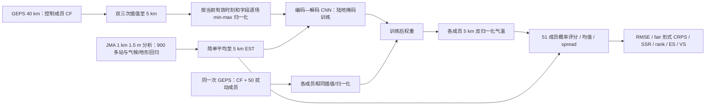

# Inoue–Kawabata：把 40 km 集合的每个成员先用 CNN 订正为 5 km，再验证 132 小时气温概率预报

> Takuya Inoue、Takuya Kawabata，*CNN-Based Surface Temperature Forecasts with Ensemble Numerical Weather Prediction*，*Monthly Weather Review* **154** (2026), 1527–1547，[期刊 DOI](https://doi.org/10.1175/MWR-D-26-0003.1)。[arXiv:2507.18937](https://arxiv.org/abs/2507.18937) 初版 2025-07-25，本文精读 [v3，2026-04-08，48 页 PDF](https://arxiv.org/pdf/2507.18937v3)；[v1，32 页 PDF](https://arxiv.org/pdf/2507.18937v1) 旧题末尾还有 *over Medium-range Forecast Periods*。核对日期：2026-09-25。**本研究是日本区域地面气温的数值预报集合后处理，不是从卫星观测直接起报的全球基础模型；真实试验最远仅 132 h（5.5 天），不是 10–15 天。**

## 先读结论及其条件

论文处理日本气象厅 GEPS 的 40 km、51 成员气温集合。作者在历史资料上用一个编码—解码 CNN 学习“低分辨率数值模式 7 个字段 → 5 km 地面气温真值”；推理时，把**同一已训练网络逐成员**施于控制成员和 50 个扰动成员，再计算新的集合均值、CRPS 和离散度。2022 年中部日本陆地格点的全年测试显示，控制成员平均 RMSE 比原始 GEPS 降约 **1.2 K / 46%**，51 成员集合 CRPS 降约 **0.8 K / 47%**，并改善山区/平原分层 rank histogram。但局地 2022-06-30 酷热个例仍低估最高温，远不足以宣称极端热浪已解决。[论文 Fig. 5–9、13–14](https://arxiv.org/pdf/2507.18937v3)

最值得借鉴的是“**先订正每个成员，再做集合统计**”保留了成员间差异，使 40 km 业务集合可产出细网格概率场；并不是训练一个可独立演化大气状态的深度学习预报器。题目中的 medium-range 按作者采用的 72–240 h 定义成立，但**证据只覆盖 Day 1–5.5 的中期前段**。仅 2022 年、仅中部日本陆地、仅 1.5 m 气温；同一网络对升级到 27 km 后的 GEPS 或其他国家的泛化尚未实测。[数据 §2、讨论 §6](https://arxiv.org/pdf/2507.18937v3)

## 1. 科学问题与可检验的设计

GEPS 在本文采用的历史配置为 40 km，分辨率低使山地/海陆附近 1.5 m 气温有系统偏差；初值扰动又导致随机误差。单纯对 51 成员求均值会减小一部分随机误差，却使温度边界变模糊，也不去除共同偏差。作者问：CNN 对单成员的订正能否减误差？从哪种成员训练更合适？它减误差与集合均值的平滑有何不同？方案用可操作的对照回答：CF/GSM 原场及其 CNN、GSM/MSM 的业务 Kalman 订正、GEPS 原集合/订正集合；另把训练输入换成 CF、PF10、原始集合均值，网络架构及训练设置保持相同。[引言与 §§4–6](https://arxiv.org/pdf/2507.18937v3)

### 原创重绘：训练、逐成员推理、三类评分

图根据原文 Fig. 1、3 和 §§2–4 自绘；为避免伪精确，只示意可核验的输入/输出关系。**这里的 JMA 1 km 产品是由观测和统计背景构建的分析估计，不是每个 5 km 格点都有独立温度计**。原文的 GEPS 有初值扰动，CNN 本身不产生随机扰动。[数据与方法](https://arxiv.org/pdf/2507.18937v3)

## 2. 数据链、切分和预处理

| 角色 | 原始资料及分辨率 | 本文实际用法与防误读点 |
| --- | --- | --- |
| 主输入 GEPS | JMA 全球集合：1 控制成员 CF + 50 扰动成员 PF；本文取历史 **40 km** 配置。每日 00/12 UTC 起报，最长取 132 h；扰动结合奇异向量和 LETKF。 | GEPS 业务 2022-03-15 已升 27 km，但论文固定用 40 km 历史数据保持训练/推理一致，**不等于测了新版**。2017–2020 训练期历史 GEPS 最初只有 27 成员，因此主网络只需 CF 训练、再跨成员使用；不应假设训练期已有 51 个成员。[§2b](https://arxiv.org/pdf/2507.18937v3) |
| 对照 GSM、MSM | JMA 全球确定性 GSM 本文约 **20 km**，区域 MSM **5 km**；GSM 用与 GEPS 可比的 00/12 UTC 132 h，MSM 短期可用时效约 51 h。 | GSM–KF、MSM–KF 的站点递推订正再按地形/距离插到 5 km；GSM–KF 在本实验仅可用到 **84 h**，MSM–KF 仅至约 **51 h**。曲线尾端没有这些基线不能被解释为 CNN 在 Day 5.5 仍“击败”它们。[§2a,c、表 2](https://arxiv.org/pdf/2507.18937v3) |
| 监督/验证 EST | JMA 业务“气温分布”每小时 1 km 1.5 m 温度；由 **900 多个站**和 30 年气候常态、地形及城市因子的多元回归/插值生成。 | 简单平均成 **5 km** 并作为监督与测试真值。原产品在 2013-01–2015-05 留一站交叉验证的全国 RMSE **1.19 K**、偏差约 **0.01 K**；这是**标签产品误差**，绝不是 CNN 的 2022 技巧。山区估计误差更大；分析和站点观测不能混称。[§2d](https://arxiv.org/pdf/2507.18937v3) |
| 时段与区域 | 2017-01-17–2022-12-31 的 00/12 UTC 配对，研究区为**中部日本陆地**。 | 训练 2017-01-17–2020-12-31；验证 2021 全年；**测试 2022 全年**，在每个 12 h 验证时刻评分。年份切分不交叉，但仅一次封存测试年。[表 1、§3d](https://arxiv.org/pdf/2507.18937v3) |

**输入、重网格及尺度变换。**七个 NWP 字段是地表气温、975/925/850 hPa 气温、海平面气压和地面水平风 U/V。GEPS 40 km 和 GSM 20 km 在对比前用相同**双三次插值**升到 5 km；CNN 在这一共同细网格上学习误差校正，不是直接生成 5 km 的动力积分。对每字段的**每个目标有效时刻**，取该幅 NWP 场的空间最小/最大作 min–max，把输入规范到 [0,1]；四个温度字段先将最大值加 **3 K**、最小值减 **3 K**，给超出当前 NWP 范围的真值留余量。EST 标签采用与对应 NWP 样本相同的区间标准化，模型输出用它反变换回 K；压强和风不扩展区间。这个“实例依赖范围”不是用完整测试年统计的全局均值，复现时必须保存每个样本的区间；对突破 ±3 K 边界的异常温度仍可能饱和。地形和时刻**不作为显式 CNN 输入**；陆海掩码只把损失限制在陆地。[§3a](https://arxiv.org/pdf/2507.18937v3)

## 3. 结构、训练与微调：哪些参数真的公开

原文的 Fig. 1 和附录 Table A1 给出层次，但没有发布训练脚本。网络从 7 通道开始：`Conv2d(7→32, kernel 5, stride 1, padding 2) → MaxPool 2 → BN32 → ReLU`；再 `Conv2d(32→64, kernel 5, stride 1, padding 2) → MaxPool 2 → BN64 → ReLU`；瓶颈由 `Linear(65536→4096) → BN4096 → ReLU → Linear(4096→65536) → BN65536 → ReLU`；解码端是 `ConvTranspose2d(64→32, kernel 2, stride 2) → BN32 → ReLU → ConvTranspose2d(32→1, kernel 2, stride 2) → BN1 → Sigmoid`。这是**带全连接瓶颈的编码—解码 CNN**，不是 U-Net，不要臆加跳连或注意力。Sigmoid 与 [0,1] 标签尺度相配，末端依样本 min–max 反变换。[附录 Table A1、Fig. 1](https://arxiv.org/pdf/2507.18937v3)

| 实验网络 | 训练输入 → 监督目标 | 推理与辨析 |
| --- | --- | --- |
| 主实验 `CNN(CF)` | 历史 CF 的七字段 → 同期 EST；2017–2020 训练，2021 验证。 | 固定一套训练后权重处理测试年 CF 和全部 PF，输出 GEPS–CNN；**不是为 51 个成员各自微调**。CF/PF 共用 NWP 物理方案、不同初值，迁移是实验假设并由 PF 结果检验。[§§3b、4c](https://arxiv.org/pdf/2507.18937v3) |
| 训练成员消融 `CNN(PF10)` / `CNN(GEPS–EM)` | 仅把训练源换成一个第 10 扰动成员或原始集合均值，仍是同一时期的 EST 标签。 | 三套**分别训练**的网络各自施于全体成员，不能把它们说成一次联合训练或预训练→微调课程；其 RMSE/CRPS 结果无显著差别，作者随后采用 CF 方案。[§4b、Fig. 6](https://arxiv.org/pdf/2507.18937v3) |
| 分辨率对照 `CNN(GSM)` | GSM 20 km 的七字段 → EST，另训一套。 | 与 40 km CF 方案比较输入分辨率，不能把 GSM–CNN 说成从 GEPS 权重微调而来。[§4a、Table 2](https://arxiv.org/pdf/2507.18937v3) |

**复现缺口。**v3 本文和 Table A1 未给出 CNN 训练的损失函数具体形式（除了“只在陆地计损失”）、优化器、学习率/调度、batch、epoch、权重衰减、早停细则、随机种子、GPU 用量、训练耗时或完整网格裁切和边界处理。不能根据既往 Inoue et al. 2024 的架构图自行移植其训练配方；亦不能把用于**评分**的 CRPS 误认为网络训练目标。论文数据可用性段说 CNN 源码依与 MRI 的合作协议“按请求提供”，部分 JMA 业务资料通过 JMBSC 提供；未见可独立下载的权重/脚本。本论文也**没有披露预训练模型权重或专门微调阶段**：成员训练对照是从训练源切换，不能写成微调。[§3a、附录 A、Data Availability](https://arxiv.org/pdf/2507.18937v3)

## 4. 评测协议先于性能排行榜

共同真值是 5 km EST 陆地网格，00/12 UTC 起报、2022 全年、至 132 h。单成员的 RMSE/平均误差 ME 测逐点准确度及偏差；51 成员计算 CRPS（原文式含 $M(M-1)$ 的成员两两项，接近有限样本 fair 形式）、集合均值 RMSE、spread/skill 比 SSR，并按地形高度 **≥200 m 山地 / <200 m 平原**分层看 rank histogram。CRPS 小且 SSR 近 1 是概率技巧/离散度证据，不等于每个极端温度条件都校准。FSS 只在 **48 h** 比较夏季 >25°C 与冬季 <−2°C、不同邻域尺寸；多变量 Energy Score（ES，$\beta=1$）及 Variogram Score（VS，$p=1$、各格点对权重为 1）检查空间场。FI/NE/ACC 则用**2017–2020 训练期** EST 的逐日逐时气候态（15 天中心滑动平滑）求距平，旨在辨别“降低噪声”与“均值平滑也损失有用信号”。这些指标不共享同一解释，不可合并为单个“精度”。[§3d、Figs. 4–9、12](https://arxiv.org/pdf/2507.18937v3)

## 5. 原文可直接核对的性能与图表

以下数值只取 v3 正文/图注**明确写出的数**，不从曲线像素外推某日的假精确值；“平均”是研究区 2022 年跨可用时效的原文概括，**不是 Day 10 或 Day 15**。图 10 和热浪单例另列，不与全年统计混算。[原文 §§5–6](https://arxiv.org/pdf/2507.18937v3)

| 原文位置、样本口径 | 指标 / 对照 | 可核对结果 | 应怎样读 |
| --- | --- | --- | --- |
| Fig. 5a–b；2022 全年 | CF–CNN 对原始 GEPS CF | 平均 RMSE **−1.2 K / −46%**；CF–CNN/GSM–CNN 的 ME 在 **±0.05 K** 内。 | GEPS 控制成员的区域气温订正；不是完整 51 成员在 15 天的技巧。[§5a](https://arxiv.org/pdf/2507.18937v3) |
| Fig. 5a；2022 全年 | GSM–CNN 对 20 km GSM；GSM–KF 对同 GSM | 前者平均 RMSE **−0.99 K / −39%**；KF **−0.76 K / −29%**。 | 相同起报/真值的中部日本对比；KF 可用 lead 更短，别把曲线不同末端误作头对头。[§5a](https://arxiv.org/pdf/2507.18937v3) |
| Fig. 6a–b；2022 全年 | CF、PF10 或 GEPS–EM 各自训练 CNN，再处理 51 成员 | 三种 CNN 的结果无统计显著差别；对原始 GEPS，集合 CRPS 平均约 **−0.8 K / −47%**。 | 不需要给每成员独立训网；并不证明任意不同 NWP 物理方案也可迁移。[§5b](https://arxiv.org/pdf/2507.18937v3) |
| Fig. 7–9；2022 全年 | 51 成员 GEPS–CNN 对 GEPS | spread 只缩 **0.1–0.2 K**，均值 RMSE 降约 **1.2 K**，SSR 更近 1；ES **降低 >50%**、VS **约 −75%**，分地形 rank histogram 较平。 | 主要是**误差降得比 spread 快**，不是把集合做得更分散。ES/VS 改善支撑空间评分，但不保证极端条件概率完美。[§5c](https://arxiv.org/pdf/2507.18937v3) |
| Fig. 10；**单个 84h 个例**，2022-06-13 | CF → 简单地形直减率订正 CF–Hcorr → CF–CNN | 原 CF RMSE **2.9 K** / ME **−0.84 K**；地形订正 RMSE **2.3 K** / ME **−1.2 K**；CNN **1.4 K** / **−0.24 K**。 | 显示 CNN 超过简单 −6 K/km 直减率修正，但不能拿个例数字替代全年。[Fig. 10](https://arxiv.org/pdf/2507.18937v3) |
| Fig. 13–14；**单个 78h 热浪**，2022-06-30 | GEPS → GEPS–CNN | spread **0.93→0.84 K**；CRPS **3.19→2.62 K**，但 CNN–EM 的高温峰值仍低估。 | 从 40 km 输入补回一些暖区，不等于消除高温尾部偏差；MSM–KF 的分布更接近 EST。[§6b](https://arxiv.org/pdf/2507.18937v3) |

**逐图阅读，避免主结论掩盖负面结果。**Fig. 5 的 48h FSS 夏/冬阈值检验说明 CNN 纠正后空间连贯性改善；它不能代表 132h FSS。Fig. 6 同训练配置比较与 Fig. 7 spread–RMSE 拆分相互补充，表明成员级增益主要来自共同偏差修正。Fig. 8 的原始 rank histogram 山/平原极端不对称暴露条件偏差；订正后趋平仍须对高温尾端单独验证。Fig. 9 的 ES/VS 使“空间细节”有比分点 RMSE 更直接的支持。Fig. 10 山地案例与 Fig. 11 2022-02-13 近冻结案例都是 84h 定性展示；Fig. 12 的 FI/NE 诊断认为 CNN 主要降低 noise，而直接集合均值同时降低有用 forecast information。Fig. 13–14 酷热案例和 Q–Q 上尾表明校正仍留负偏：**对极端热浪不应只报全年平均相对降幅**。[Figs. 5–14](https://arxiv.org/pdf/2507.18937v3)

## 6. 判断、复现实验与文献定位

**证据支持**：在给定中部日本 EST 真值、40 km GEPS 历史版、2022 年的实验下，逐成员 CNN 订正同时改善确定性气温误差、边际集合概率评分及多个空间指标；用 CF、单个 PF 或原始集合均值作训练输入的三套网络最后性能相近。输出 5 km 是**统计降尺度网格**，不是 NWP 真正以 5 km 解析动力学。[§§5–7](https://arxiv.org/pdf/2507.18937v3)

**证据没有覆盖**：Day 6–15、全球气候带、台风/降水、GEPS 2022 后业务 27 km 版本、跨年份模式升级的稳定性、无需当地高质量格点监督的迁移。EST 既用于训练又用于评分但时段分离；它本身由站点/气候/地形回归推估，有区域相关的分析误差。全文未给出可逐步重训的 optimizer/loss/epoch/代码，因此可重建方法轮廓，但不能声称已做到位级复现。极端热浪的 78h 单例被改进但峰值仍偏低，揭示 [0,1] 输出边界和粗输入信息共同可能限制上尾，具体各因素贡献未做受控消融。[数据 §2、讨论 §6、Data Availability](https://arxiv.org/pdf/2507.18937v3)

**版本与分类**：arXiv 2025 v1 题名含 *over Medium-range Forecast Periods*；2026 v3/期刊名缩短，结论加入更完整的可靠性、空间 score 和信息量诊断。本笔记以 v3 为唯一性能/方法基准，v1 只用于说明书目沿革。归于 `medium-range` 是按论文自身的 **72–240h 定义及已测 132h 前段**，不将它与本库 10–15 天 AIFS/FuXi/GenCast 全球模型混排；它也不训练/微调这些全球基础模型。[arXiv 修订史](https://arxiv.org/abs/2507.18937) · [期刊页](https://journals.ametsoc.org/view/journals/mwre/154/7/MWR-D-26-0003.1.xml)
