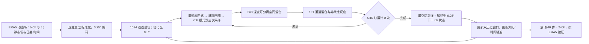

# PARADIS 精读：在球面潜空间把平流、混合和局地反应分开，能否保住十天预报的细尺度结构？

> Carlos A. Pereira、Stéphane Gaudreault、Valentin Dallerit、Christopher Subich、Shoyon Panday、Siqi Wei、Sasa Zhang、Siddharth Rout、Eldad Haber、Raymond J. Spiteri、David Millard。arXiv:2601.21151，2026-01-29 首发，2026-05-14 v2，**2026-09-18 v3**；本文按[完整 v3 HTML 正文及附录](https://arxiv.org/html/2601.21151v3)核对，[摘要页/版本历史](https://arxiv.org/abs/2601.21151)，[作者代码仓库](https://github.com/Wx-Alliance-Alliance-Meteo/paradis_model)。核查日：2026-09-25。书目注意：摘要页题名为 *Learning to Advect: A Neural Semi-Lagrangian Architecture for Weather Forecasting*，v3 HTML 稿内题名却为 *Learning to Advect: A Neural Semi-Lagrangian Approach for Data-Driven Weather Forecasting*；**同一 arXiv ID 的元数据与稿件题名不一致，按 ID 去重**，下述方法和成绩仅归于 v3。

## 0. 五分钟判断：创新点、强项和反例

PARADIS（*Physics-inspired Advection, Reaction And DIffusion on Sphere*）不是把整步大气演化交给单个 Transformer，而是把格点状态编码为球面潜场，依次让可学习速度场执行半拉格朗日回溯/插值、让局地空间卷积混合、让逐格点通道网络表示非平流过程，再解码为下一 6 小时天气场。其物理灵感是**算子分工与几何约束**，不是把真实动力方程精确求解；潜空间“风”不是观测的风。模型以 ERA5 训练，0.25° 输入/输出、0.5° 潜空间处理器，确定性递归至 **240 h（十天）**，参数 **63,328,715**。[§§2–4、Table 2](https://arxiv.org/html/2601.21151v3)

最有说服力的结果不是“所有时效第一”：2020 年 Z500 的 1/3/5 天 RMSE 依次为 **38.6/119/272**，优于列出的同行；**第 10 天 748**，不如 Baguan **628**、FuXi **634**、GraphCast **734**。2022 年第十天 **754**，不如 Aurora **673** 和 GraphCast **735**，尽管比 HRES **813** 低。作者的强项是长滚动中**频谱振幅、相位连贯性和预报活动度**，其“细节保真”不能替代 RMSE/ACC 或集合概率验证。[Table 3、Figs. 6–12](https://arxiv.org/html/2601.21151v3)

## 1. 为什么要分解算子？

中期自回归模型每 6 小时反复预测一次，局地位置误差会随时间积累。只靠卷积堆叠或全局注意力学平流，可能把移动中的锋面和涡旋平滑掉。传统后向半拉格朗日法对目标格点沿速度场回溯，再从出发点插值原场；它允许一次采样跨多个网格，和固定卷积核的感受野不同。论文将这个思想搬入**可学习的潜空间**：网络自己选择传输哪些模式、沿哪条球面轨迹传输；不要求潜速度就是大气实测水平风。[§2.3、§3](https://arxiv.org/html/2601.21151v3)

“Advection–Diffusion–Reaction”是有意分工：A 负责位移，D 负责邻域交换/亚网格耗散，R 负责每格点的通道间非线性变换与源汇/垂直耦合。**D 是深度可分离卷积的混合算子，不是生成式 diffusion 去噪模型；R 也不保证严格的物理化学反应方程。**这种归纳偏置有可解释性，但消融在较小 1° 配置上进行，不能自动推断每个组件在 0.25° 完整版上贡献相同百分点。[§3、§4.8](https://arxiv.org/html/2601.21151v3)

### 原创重绘：从 ERA5 状态到十天递归

此图按原文 Fig. 3–4、附录 A/C 自绘；为免误解，**循环中的“8 次”是单次 6 小时映射内部的潜空间处理层，“40 步”才是十天外部自回归**。静态场和随有效时刻更新的强迫需在每次映射提供，后者不从上一帧输出凭空预测。[模型流水线与训练附录](https://arxiv.org/html/2601.21151v3)

## 2. 数据、预处理及其复现边界

| 环节 | v3 披露的实际配置 | 解读时必须保留的限定 |
| --- | --- | --- |
| 动态资料 | WeatherBench2 的 **ERA5 0.25°**，每 6 小时 00/06/12/18 UTC；**1979–2019** 用于训练，**2020 和 2022** 评分。 | 2021 不是本文两个主评分年份；不要把 2020/2022 拼成同一赛季，也不把 ERA5 再分析说成实时业务观测。[附录 C.1–C.2](https://arxiv.org/html/2601.21151v3) |
| 高空状态 | **13 个气压层：50、100、150、200、250、300、400、500、600、700、850、925、1000 hPa**；各层位势、温度、U/V 风、比湿、垂直速度。 | 对照模型的输入层数不完全相同；特别不能将 Z500 一项优劣归因于 ADR 而忽视输入与训练方案差异。[Table C.1](https://arxiv.org/html/2601.21151v3) |
| 地面状态 | 10 m U/V、2 m 气温、海平面气压、地面气压、总柱水。 | 文中主要评分不含降水；不能推论强降水技巧。总柱水与湿度的误差也不等价。[Table C.1](https://arxiv.org/html/2601.21151v3) |
| 静态/强迫 | 地表位势、海陆掩码、地形坡度/子格地形标准差、反经向格距、纬经度及三角编码；有效时间和年内周期编码、一小时累计顶层太阳辐射。 | 日射按附录 F 的轨道/地方太阳时近似计算；它是已知外强迫，不是卫星辐射亮温输入。[附录 C.1、F.2](https://arxiv.org/html/2601.21151v3) |
| 时序预处理 | 取两个历史天气状态为模型输入；训练数据按时间轴重分块，适配双帧输入与多步监督；各变量/气压层独立标准化。 | Table B.1 给出**总输入特征 216**，但正文未把每一种编码与双历史复制完整列成可逐项核算的 216 通道清单；不要自行拼凑。附录 C.3 描述均值/标准差预处理，但未公开可直接复用的完整统计文件。[附录 B/C](https://arxiv.org/html/2601.21151v3) |

归一化与损失加权是两回事：输入按物理变量/层标准化，目标误差再按纬度面积与气压层加权。高纬格点面积小，不能按普通像素均值给极区过大权重；作者还在极点附近处理特殊权重。气压权重为 `max(p/1000 hPa, 0.2)`，使高空层相对低权，但不完全消失；变量之间未再施人工重要性系数。若把模型移植到独立雷达/卫星直接起报，这些是新的输入/监督问题，**本文没有做观测到预报的同化端到端实验**。[附录 B.1、C.3](https://arxiv.org/html/2601.21151v3)

## 3. 模型细节：每个模块实际上做什么

单步映射先编码多源 0.25° 输入为 **1024 维潜状态**，将处理器网格粗化为 **0.5°**，最后升回 0.25° 解码。处理器重复 **8 个 ADR 块**，并有潜空间整段残差/跳连以利优化。A 块含学习速度的网络、球面目标格点回溯和可微插值：对 **768 个可传输模式**采样，按通道学习混合，不是平移全部 1024 通道。回溯显式处理经度周期边界和越极后的 180° 经度换位/极点连续性；插值采用**双三次**。球面约束是几何而非质量/能量守恒证明。[§3、附录 A.2](https://arxiv.org/html/2601.21151v3)

D 块用 **3×3 深度可分离空间混合**与通道混合；R 块主要由逐点 `1×1` 通道混合、非线性变换构成。模型还使用秩 **128** 的低秩偏置和 **8** 个偏置潜通道，补偿仅靠平移/局地算子难表达的系统空间效应。不要把 D 的“diffusion”误标为扩散生成器，也不要把速度潜变量替换成数据集中 10m/850hPa 风而当作同一实验。[附录 A、Table B.1](https://arxiv.org/html/2601.21151v3)

| v3 Table 2 模块 | 参数 | 总参数占比 | 阅读含义 |
| --- | ---: | ---: | --- |
| 平流：速度网＋NSL 模块 | 21,922,816 | 34.6% | 位移并不是“免费物理层”；可学习投影/速度网络占可观容量。 |
| 扩散式混合 | 9,798,656 | 15.5% | 其中 3×3 空间混合仅 204,800，通道混合约 8.40M。 |
| 反应式逐点通道网络 | 29,663,232 | 46.8% | 最大模块；架构并非只有轨迹插值。 |
| 输入/输出/静态编码 | 1,944,011 | 3.1% | 计入总模型参数。 |
| **合计** | **63,328,715** | **100%** | 与 1° 组件消融表的“完整模型约 61.5M”非同一配置，不可混写。 |

参数来自 [Table 2](https://arxiv.org/html/2601.21151v3)。附录 A 还解释通道归一化、低秩偏置、球面旋转坐标回溯、可微双三次采样；**没有直接证据证明学出的每个潜速度分量都与某个具体物理风层一一对应**。作者的潜速度/偏置可视化更接近解释性诊断，不是守恒定律验证。[§5、附录 A](https://arxiv.org/html/2601.21151v3)

## 4. 完整训练流程、损失、微调与计算

作者采用平滑的 **pseudo reversed Huber**，转折尺度 `δ=1`：小残差近似线性，大残差给予更重的二次惩罚，意在抑制灾难性大错而不过度追逐所有小误差。它**不是**普通 MSE，也不是集合 CRPS。使用面积/气压层权重并按预报时效累积损失；自回归微调对整个窗口**完整反传**，不是逐步停止梯度。附录给出 sigmoid 平滑权重表达，不应把它简化成硬阈值经典 BerHu 而假装完全同式。[§4.2、附录 B.1](https://arxiv.org/html/2601.21151v3)

| 阶段 | 输入/目标和长度 | 权重初始化、优化更新 | 关键作用 |
| --- | --- | --- | --- |
| 6h 单步预训练 | 两历史态 + 静态/强迫 → 下一 6h ERA5 | 从头训练 **260,000** 次更新；AdamW、全局 batch **16**、基础 LR **5×10⁻⁴**；WSD 先 **1,000** 步 warmup，最后 **20%** 衰减。 | 学到单次映射；这不是 260,000 个 epoch。[Table B.2](https://arxiv.org/html/2601.21151v3) |
| AR 微调 1–6 | 从前一阶段权重依次滚动 **2/4/6/8/10/12 个 6h 步**，即 **12/24/36/48/60/72h** 标签；每阶段 **1,000** 更新。 | 同一模型逐阶段继承权重，总共 **6,000** 更新，LR **5×10⁻⁶**；预测前一帧喂给下一步、各步损失累加，窗口内全反传。未报告冻结模块。 | 明确存在**自回归微调**，但最后训练窗口止于 72h；十天是这套模型推理时**继续外推 40 步**，不是用 240h 监督直接训练。[附录 B.4](https://arxiv.org/html/2601.21151v3) |

共同优化设置：AdamW `β₁=0.9, β₂=0.95`、权重衰减 `10⁻²`、无 dropout、无梯度裁剪（Table B.1），bf16 自动混合精度、DDP **16×H100**、gradient checkpointing。文中估算单步阶段约 **0.30 GPU-year**、AR 阶段 **0.05 GPU-year**，合计 **0.35 GPU-year**；是 GPU 总量折算，不能说“训练墙钟耗时 0.35 年”。作者称单张 H100 生成一次 10 天预报约 **35 秒**，它与单独 NSL 算子毫秒表以及训练耗时不是同一种计量。[Table B.1–B.2、§4.2、附录 B.4](https://arxiv.org/html/2601.21151v3)

源码边界：[作者公开仓库](https://github.com/Wx-Alliance-Alliance-Meteo/paradis_model)含训练/模型入口，便于检查实现；仓库 README 的 `5.625deg_wb2` 示范命令是小网格上手例子，**不能当成本文 0.25° 最终实验配方**。本文没有报告另一个下游领域适配/LoRA 或业务分析微调阶段；本节所说“微调”专指同一 ERA5 数据上的 2–12 步 AR 训练。[论文附录 B；作者仓库](https://arxiv.org/html/2601.21151v3)

## 5. 评分协议和原文数值重建

测试从 ERA5 分析起报，以每 **36h** 一个初始化抽样，循环输出每 6h 一帧至第 10 天；2020 与 2022 按基线是否可得分别报。全球纬度面积加权 RMSE/ACC 查点误差及距平形态，活动度和球谐谱振幅/相位连贯性查平滑与结构，另用 IBTrACS 检查气旋路径/中心强度。部分对照是 HRES 确定性，部分概率系统取**单成员**（GenCast/FGN），`IFS ens` 是不同统计对象；**这不是同配置/同训练资料/同算力的受控模型消融，也不能由单成员 RMSE 得出集合概率技巧排行榜**。[§4.2、附录 C/D](https://arxiv.org/html/2601.21151v3)

### Table 3：Z500 RMSE，原表数值（越小越好）

| 年份/模型 | 24h | 72h | 120h | **240h（十天）** |
| --- | ---: | ---: | ---: | ---: |
| 2020 PARADIS | **38.6** | **119** | **272** | 748 |
| 2020 Baguan | 43.0 | 129 | 275 | **628** |
| 2020 FuXi | 42.8 | 128 | 280 | 634 |
| 2020 GraphCast | 41.2 | 126 | 276 | 734 |
| 2020 HRES | 48.6 | 139 | 308 | 805 |
| 2022 PARADIS | **39.3** | **120** | 271 | 754 |
| 2022 Aurora | 44.4 | 123 | **266** | **673** |
| 2022 GraphCast | 40.5 | 124 | 272 | 735 |
| 2022 HRES | 48.2 | 141 | 310 | 813 |

从 [Table 3](https://arxiv.org/html/2601.21151v3)逐格转录。表内未给数值列单位；Z500 变量通常为位势而非“500hPa 高度米数”，因此保留原表数值，不擅自将 748 标成 m 或 gpm。2020/2022 行不可直接跨年相减当同样本提升；**2020 五天以内领先**也不等于 2022 五天每个格均领先：2022 Aurora 120h 的 266 低于 PARADIS 271。

### 附表 E.1/E.2：其他变量与 ACC 的反向证据

| 2022、十天；ERA5 真值 | PARADIS | Aurora | GraphCast | HRES | 说明 |
| --- | ---: | ---: | ---: | ---: | --- |
| T850 RMSE | 3.46 | **3.05** | 3.42 | 3.73 | 温度单位 K；PARADIS 优于 HRES，但落后两 AI 对照。 |
| U850 RMSE | 6.18 | **5.24** | 5.96 | 6.67 | 风单位 m/s，同样不支持十天全面最好。 |
| Z500 ACC | **0.552** | **0.588** | **0.565** | 原表另列 | 这里前三个数字来自 E.2，ACC 越高越好。 |

T/U 来自 [附表 E.1](https://arxiv.org/html/2601.21151v3)，ACC 来自 [E.2](https://arxiv.org/html/2601.21151v3)。不能把高频能谱更完整翻译成“所有变量十天 RMSE 最小”；也不应仅用 HRES 对比隐藏 Aurora/Baguan 的长时效优势。比湿 q700 十天 PARADIS **0.00180 kg/kg**、Aurora **0.00152**、GraphCast **0.00167**，同样提示湿度端并非最优。[附表 E.1](https://arxiv.org/html/2601.21151v3)

## 6. 每张关键图真正提供了什么证据

| 原文图/表 | 所示实验 | 能够支持 / 不能据此声称 |
| --- | --- | --- |
| Fig. 1–2、Table 1 | 一维被动示踪物及单独 NSL 插值算子的数值/耗时试验；1024×2048、32 个传输模式的双三次 NSL 前向 **19.45 ms**，前/后向合计 **31.38 ms**。 | 支持回溯算子传输与成本可行；**并非完整天气模型一次六小时预测的耗时**。一维 toy 的约 20 参数也不是 PARADIS 总参。[§2.1、§4.1](https://arxiv.org/html/2601.21151v3) |
| Fig. 3–4、Table 2 | 编码→ADR→解码的球面潜空间设计及 63.3M 参数分布。 | 支持“专用传输算子”确实落入完整结构；图示物理分工不等于证明每个隐状态满足物理守恒。[§3](https://arxiv.org/html/2601.21151v3) |
| Fig. 5–7、Table 3/E.1/E.2 | 各变量高度/lead 的 2020 或 2022 RMSE/ACC。 | 短中期竞争力有量化证据；第十天不再全部领先，不同基线年份须拆开。[§4.3–4.4](https://arxiv.org/html/2601.21151v3) |
| Fig. 8–12 | 预报活动度、纬带和球谐能谱振幅、相位连贯性。 | 说明某些对照的较低 RMSE 伴更强平滑，而 PARADIS 留住更多高波数能量/结构；“谱好”与“点误差小”是不同维度，不能互相替代。[§4.5–4.6](https://arxiv.org/html/2601.21151v3) |
| Fig. 13 | 2020 年**91 个所有模型可配对风暴**的五天路径和最低气压。 | 路径有竞争力，但强度落后 HRES；追踪器从 IBTrACS 已知位置给搜索窗并做 ±3h 配对，不能称无需任何观测定位辅助的完全自由业务追踪。[§4.7](https://arxiv.org/html/2601.21151v3) |
| Fig. 14–16、Table 4 | pseudo reversed Huber、A/D/R 组件消融；主要在 **1° 缩小模型**评估。 | 去掉 A 损失最大，支持结构归因；**1° 的全模型 61.5M** 和本文 0.25° 正式 63.3M/十天分数不能一一对应。[§4.8](https://arxiv.org/html/2601.21151v3) |

## 7. 批判性复现清单与文献定位

如果以它为基线，先固定 arXiv **v3**、ERA5/WB2 0.25° 版本、1979–2019 训练与 2020/2022 测试、起报每 36h、两历史态、标准化统计来源、太阳辐射公式、6h 40 步，才谈结构对照。任何替换为业务初值、独立卫星观测、不同 0.5° 插值/越极处理或不同逐变量加权，都不是论文原数值的严格复现。若做真正受控消融，应保持同训练数据、参数量、课程与验证年份，再分别移除 A/D/R；不能仅拿 Table 3 的他人模型排行榜推断 NSL 单独的因果收益。[附录 A–D、§4.8](https://arxiv.org/html/2601.21151v3)

本文明确解决的是**确定性、基于再分析初值的十天全球天气预报结构**，不是 S2S 第 3–6 周，不是直接卫星观测到预报，也不是概率集合生成。十天成绩在标准点误差上并非全面最优，但高波数保真与局地路径诊断有价值。后续值得检验：（1）相同初值/变量/参数预算下与 Transformer 或 GNN 的谱—RMSE Pareto 前沿；（2）更长 AR 训练窗口能否改善第 10 天落后；（3）水分/降水守恒与极端尾部；（4）随机扰动与概率校准。以上是**我们提出的复现实验方向**，不是作者已完成的结果。[原文结论及附录](https://arxiv.org/html/2601.21151v3)
