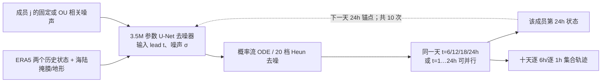

# Continuous Ensemble Weather Forecasting：相关噪声、逐小时轨迹与十天 ARCI 集合

> Martin Andrae、Tomas Landelius、Joel Oskarsson、Fredrik Lindsten，*Continuous Ensemble Weather Forecasting with Diffusion models*，[arXiv:2410.05431v1，2024-10-07；v2，2025-04-12](https://arxiv.org/abs/2410.05431)，[ICLR 2025 正式收录稿](https://openreview.net/forum?id=ePEZvQNFDW)。本文按[25 页 v2 PDF、正文和附录 A–E](https://arxiv.org/pdf/2410.05431v2)及[作者代码](https://github.com/martinandrae/Continuous-Ensemble-Forecasting)核验，阅读于 2026-09-25。同一成果的 2024 预印本和 2025 会议论文只计**一篇**。

## 一、核心问题与结论先行

普通扩散天气模型一次生成下一时刻，再多次递归；若把步长缩到一小时，十天需要 240 次串行天气状态推进，误差和采样时间都会累积。直接分别生成每个时效的概率边缘分布虽可并行，却不保证这些样本属于同一条随时间连续的成员轨迹。作者把**同一潜噪声**或**时间相关的潜噪声过程**复用于不同 lead，形成 Continuous Ensemble Forecasting（CI）；再以每日一次自回归起点和日内直接生成结合为 ARCI-24/1h 或 ARCI-24/6h。[原文 §1、§4、Algorithms 1–3](https://arxiv.org/html/2410.05431v2)

结果是一个有意义但有明确尺度限制的证明：在 **WeatherBench ERA5 5.625°、五个预报变量、2018 年测试**上，ARCI-24/6h 的第十天 Z500 集合均值 RMSE **765.6**、CRPS **355.2**、SSR **0.93**，同架构 AR-6h 对照为 **811.8/391.9/0.88**；而日步长 AR-24h 为更好的 **750.6/335.2/0.94**，只是它不能原生给每六小时预报。此处 AR-6h 是作者的 U-Net **重实现**，绝不是官方 GenCast 的 0.25°/15 天权重。所有这些数值都是粗网格同资料实验，不能声称 ARCI 超越业务 IFS/GenCast。[原文 Table 1、§5.1、§6](https://arxiv.org/html/2410.05431v2)

## 二、算法：把“相同边缘分布”变成一条成员轨迹

### 2.1 三种预报方式的区别

给定前两个状态和静态地形，扩散去噪器以目标 lead `t` 和噪声强度 `σ` 为条件，学习 `p(X(t) | X(Ω), t)` 的**单时刻边缘**；它并未直接学习整个十天联合分布。概率流 ODE 从高斯噪声 `Z` 开始，以二阶 Heun 法逐级去噪。若每个时效独立抽一份 `Z(t)`，相邻一小时天气图可突然跳变；若一个集合成员对全部目标时效固定同一份 `Z`，则每个 lead 的去噪过程虽独立并行，产物仍由同一潜在随机来源耦合，形成较平滑的路径。重复采样不同 `Z` 产生多个成员。[原文式 (2)、Algorithm 1、Fig. 1–2](https://arxiv.org/html/2410.05431v2)

固定 `Z` 也有缺点：给定某一时刻的成员状态，理论上可能反演出驱动噪声，之后路径条件上过于确定。Algorithm 2 改用边缘保持 `N(0,I)` 的 Ornstein–Uhlenbeck（OU）噪声过程：`Zᵢ = exp(−ρΔt) Zᵢ₋₁ + sqrt(1−exp(−2ρΔt)) νᵢ`。`ρ=0` 是完全固定噪声、`ρ→∞` 近似各时效独立、`ρ=ln(10)` 允许缓慢变化。三者在**每个单独 lead 的边缘分布**相同，时间协方差却不同，故逐 lead RMSE/CRPS 相同并不足以证明轨迹合理。附录 E 的连续性证明只覆盖固定噪声且满足去噪器正则性假设的 ODE 解；随机 OU 路径的对应严格证明被作者留作未来工作。[原文 §4.1–4.2、Fig. 5、Appendix E](https://arxiv.org/html/2410.05431v2)

### 2.2 为什么十天仍有自回归

纯 CI-6h 从第一组初值直接询问十天每个六小时时刻，远期初值相关性弱，Table 1 第十天 Z500 为 RMSE **885.7**、CRPS **406.6**，明显弱于 ARCI。ARCI 将 **24 小时**设为更新锚点：先生成日内 6/12/18/24 小时各场，以第 24 小时成员状态作为下一天条件，再重复 10 次。每天的四个日内 lead 可并行去噪，**跨日的十次锚点仍必须串行**。ARCI-24/1h 同理，每天可给出 1–24 小时连续成员轨迹，但绝不是“十天 240 小时全链零递归”；论文“完全并行”指单个连续段内或纯 CI 的多个 lead，而非十天 ARCI 整体。[原文 Algorithm 3、§5](https://arxiv.org/html/2410.05431v2)

图为按原文 Algorithms 1–3 和附录 B **原创重绘**，不是原图截取。若把纯 CI 和 ARCI 混成一条“完全并行的十天链”，会同时错读方法贡献和推理成本。[原文方法](https://arxiv.org/html/2410.05431v2)

## 三、数据来源、处理与测试隔离

| 环节 | 可核对的公开设置 | 为什么重要 |
| --- | --- | --- |
| 气象资料 | WeatherBench 提供的 ERA5 **5.625°、每小时**全球网格；论文模型输入形状对应 **32×64** 经纬格。 | 与官方 GenCast 的 0.25°不同，粗网格不能检验小尺度强降水、地形风或台风核心。 |
| 预测/输入变量 | Z500、T850、T2M、U10、V10 共五个直接训练目标；WS10=`sqrt(U10²+V10²)` 由输出派生，仅作第六个评分变量。另将海陆掩膜和地形两个静态场归一到 `[0,1]` 并拼接条件输入。 | WS10 不是另训第六个输出通道；没有湿度、降水、海温或完整多层大气。 |
| 标准化 | 动态字段各自减均值/除标准差；噪声目标再用**随变量和 lead 变化**的预计算残差标准差 `sⱼ(t)` 调整损失权重。 | 两级缩放的目的不同：前者统一输入量纲，后者避免短/长 lead 损失贡献失衡。 |
| 年份 | **1979–2015** 训练，**2016–2017** 验证，**2018** 测试。起报按每小时遍历各年，但去掉各切分首 24h 和末 10 天，防止条件帧/目标跨年界。 | 论文报告的 2018 全年分数并不是一场天气事件或滚动业务测试。 |

这些是论文 §5 的评测协议；公开 `create_dataset.py` 的当前 `main`（核对提交 `bece7d96`）把 1979–2018 全时段写入数据阵列，并在拆分年份**之前**计算归一化统计。它还在循环每个变量时未显式清零均值/平方和累加器，用单个 10,000 样本 batch 估各 lead 的残差标准差。因此按该脚本重做时应检查训练年统计量和残差估计的切分与数值；**源码现状不足以证明论文发布时训练权重也按有泄漏的统计量生成**。[论文 §5](https://arxiv.org/html/2410.05431v2)、[作者数据脚本](https://github.com/martinandrae/Continuous-Ensemble-Forecasting/blob/main/create_dataset.py)

## 四、网络、扩散训练与“微调”是否存在

附录 B 的主干是约 **350 万参数**的卷积 U-Net：32 基础 filters，空间尺度 **32×64→16×32→8×16** 后再逐级上采样；每个块有两层卷积、必要时的 1×1 投影/残差支路，在 16×32 级加入单头注意力。卷积的经度左右边界作周期填充，极区边界作零填充；这仍不是一个保球面面积/物理守恒的动力求解器。历史状态与静态场在通道维拼接，`t` 与 `σ` 各以 32 频率 Fourier 编码并经两层 SiLU 全连接网络形成 128 维条件，再送入各 U-Net 块。[原文 Fig. 6–7、Appendix B](https://arxiv.org/html/2410.05431v2)

训练时先抽一个起报及 `t`（ARCI-24/6h 从 `{6,12,18,24}` 小时均匀抽；纯 CI-6h 从 6 至 240 小时每 6h 抽），取该 lead 真值加噪，网络在历史状态、静态图、时间及噪声级条件下预测去噪场。原文损失为按纬度面积加权、按 `sⱼ(t)` 调整的去噪平方误差；`σ` 由 `ρ=7` 噪声日程抽样。推理时使用 EDM 式 preconditioning，`σdata=1`；二阶 Heun 以 `σmax=80`、`σmin=0.03`、`ρ=7` 的 **20 档**去噪。训练噪声上下限分别是 **88/0.02**。这一 `ρ` 是**噪声级日程形状参数**，和 OU 时间相关率的 `ρ` 虽同符号却是两个概念。[原文 Appendix B Tables 2–3](https://arxiv.org/html/2410.05431v2)

| 训练项 | 作者公开值 | 备注 |
| --- | --- | --- |
| 初始化/优化 | Xavier uniform；AdamW，peak LR **5×10⁻⁴**、weight decay **0.1**；**1000 更新** warmup 后 cosine | 论文未列 AdamW β；不得代填默认值为论文配置。 |
| 总训练 | **300 epochs**、batch **256**、dropout **0.1**；单张 **A100 40GB** 上约 **2 天** | 该训练时长指 ARCI-24/6h 案例，不是所有模型、全部对照或每套 50 成员推理时间。 |
| ARCI-24/1h | 与 6h 版同法但日内 `t=1…24h`，历史条件为 `{0,−24h}` | 逐小时结果用 **10 成员**，与主表 6h **50 成员**协议分开。 |
| 作者主模型微调 | **未报告基础模型预训练或后续微调**；各 AR/CI/ARCI 方案按各自目标训练 | 不能把“在推理中逐日递归”说成“多步微调”。对照 Graph-EFM 才有单步预训→4/8 步滚动、KL/CRPS 课程。 |

按附录 B 的 Graph-EFM 重新训练对照，四阶段是 **20 epoch、LR1e−3、1步、KL0/CRPS0 → 75 epoch、LR1e−3、1步、KL0.1 → 20 epoch、LR1e−4、4步、KL0.1 → 8 epoch、LR1e−4、8步、KL0.1/CRPS1e5**。其球面图为二次剖分的三级图，与主模型的 2D U-Net 架构不同；这不是一项仅切换训练策略的纯消融。DYffusion 则被作者以同 U-Net 重训到 24h、1h 间隔，dropout 0.2 且不用人工扩散步骤。[原文 Appendix B Tables 4–5](https://arxiv.org/html/2410.05431v2)

公开 `train.py`/配置同样给 300 epoch、batch256、LR5e−4、32 filters；但论文附录的损失印作 `1/σ²`，公开 `loss.py` 实现的是 EDM 权重 `(σ²+σdata²)/(σ² σdata²)`。两式并不恒等，作者没有在稿内解释这个差别；代码应作为**复现时需要核对的实现版本**，不可替论文公式做静默修正。作者当前预测配置文件默认 `n_ens=10`，代码 `predict.py` 实际调用 Heun 时显式设 **20 步**，所以不应因 `sampler.py` 函数签名里默认 18 步就误写论文用了 18 步。[正文/附录 B](https://arxiv.org/html/2410.05431v2)、[公开代码](https://github.com/martinandrae/Continuous-Ensemble-Forecasting/tree/main)

## 五、评分定义和原始性能表

各分数按格点面积权重；RMSE 是**先对每一起报的集合均值场算空间 RMSE，再对起报平均**。CRPS 是逐格基于所有成员与实况绝对差、扣去成员对间距的集合估计；SSR 用成员 spread 对 ensemble-mean RMSE 的比值，含 `sqrt((M+1)/M)` 有限成员修正，理想接近 1，低于 1 通常是欠离散。Table 1 的 6 小时试验有 **50 成员**；逐小时 Figure 4(b) 由于计算成本只用 **10 成员**，两协议的 CRPS/SSR 不能直接当等成员排名。[原文 §5、Appendix A 式 (3)–(6)](https://arxiv.org/html/2410.05431v2)

### 主表：原文 Table 1，单位沿各变量原值

| 变量/lead | Graph-EFM RMSE / CRPS / SSR | 作者 AR-6h | 纯 CI-6h | **ARCI-24/6h** | AR-24h（不同输出频率，仅参考） |
| --- | --- | --- | --- | --- | --- |
| Z500，Day 5 | 699.1 / 317.5 / 1.13 | 602.3 / 287.8 / 0.75 | 707.8 / 321.2 / 0.59 | **560.9 / 256.7 / 0.86** | 544.2 / 242.7 / 0.84 |
| Z500，Day 10 | 817.1 / 373.6 / 1.10 | 811.8 / 391.9 / 0.88 | 885.7 / 406.6 / 0.60 | **765.6 / 355.2 / 0.93** | 750.6 / 335.2 / 0.94 |
| T850，Day 5 | 3.12 / 1.56 / 1.11 | 2.72 / 1.34 / 0.82 | 3.06 / 1.50 / 0.74 | **2.60 / 1.27 / 0.90** | 2.55 / 1.24 / 0.89 |
| T850，Day 10 | 3.51 / 1.77 / 1.12 | 3.39 / 1.69 / 0.92 | 3.68 / 1.85 / 0.71 | **3.29 / 1.63 / 0.95** | 3.25 / 1.60 / 0.96 |

表中 RMSE/CRPS 越低越好、SSR 越接近 1 越好；**Z500 的单位为 m²/s²，T850 为 K**。粗体仅突出研究方法，**不是声称全列最好**：AR-24h 在上述点误差上仍较低，且 Graph-EFM 在若干时效 SSR 偏高。原文 Appendix C Tables 6–7 另给五次重训 ARCI 的标准差，如 Day10 Z500 RMSE `765.6±21.4`、CRPS `355.2±33.0`；不是 2018 每日起报 bootstrap 置信区间。[原文 Table 1、Tables 6–7](https://arxiv.org/html/2410.05431v2)

### 附表：第十天其它变量，原文 Table 7

| 变量 | AR-6h RMSE / CRPS / SSR | ARCI-24/6h RMSE / CRPS / SSR | AR-24h RMSE / CRPS / SSR |
| --- | --- | --- | --- |
| T2M | 2.62 / 1.18 / 0.89 | **2.51 / 1.11 / 0.94** | 2.48 / 1.09 / 0.95 |
| U10 | 3.95 / 1.97 / 0.94 | **3.87 / 1.92 / 0.97** | 3.85 / 1.90 / 0.97 |
| V10 | 4.02 / 2.00 / 0.96 | **3.97 / 1.97 / 0.99** | 3.96 / 1.96 / 0.99 |
| WS10（派生） | 2.57 / 1.34 / 0.96 | **2.54 / 1.32 / 0.99** | 2.53 / 1.31 / 0.99 |

附表说明收益随字段变化，不能把 Z500 的差距当全部五字段的共同降幅。T2M、U10、V10 为 K、m/s、m/s，WS10 为 m/s。论文 Table 7 只在固定 5.625°/2018/ERA5 协议内比较，未给 IFS 或真实观测站点分数。[原文 Appendix C Table 7](https://arxiv.org/html/2410.05431v2)

## 六、图 1–17 怎样读，以及负面证据

| 原图/表 | 具体显示 | 可支持与不可支持的结论 |
| --- | --- | --- |
| Fig. 1–2、Algorithms 1–3 | 相同/相关潜噪声把逐 lead 去噪联成成员轨迹；ARCI 每 24h 交回滚动锚点 | 解释时间耦合和可并行范围；**不证明学得了真实天气联合分布或十天完全零递归**。 |
| Fig. 3、Fig. 12–17 | 第十天场图：2018 某一次样例的真值、确定性场、50 成员均值/标准差及随机选四条成员 | 能看出成员比均值更锐利，但样例图不等于极端事件命中率或全球统计。 |
| Table 1、Fig. 4(a)、Tables 6–7 / Fig. 9 | 6h、50 成员的 RMSE/CRPS/SSR 随 lead 和变量的比较 | ARCI 同分辨率优于作者重训 AR-6h；纯 CI 的 Day10 退化、扩散模型多有 SSR<1 都需同时报告。 |
| Fig. 4(b)、Fig. 10 | 1h、**10 成员**，ARCI-24/1h 对 AR-1h/DYffusion；2h 训练、1h 测试的 `*` 配置 | 逐小时 ARCI 比 AR-1h 更稳、与 AR-24h 接近；2h→1h 对 T2M 在每个 24h 段首小时（1h、25h…）退化，因为训练没见 0h 邻点。 |
| Fig. 5 / 11 | 固定噪声、OU 相关噪声与不相关噪声的相邻时刻平均绝对变化；黑线为 ERA5 | 不相关噪声造成明显跳变，固定噪声后段变化太小，OU 更接近真值；这只是连续性代理，不是时间相关误差/事件追踪的完整验证。 |
| Fig. 8 | 用线性插值 AR 场产生 1h/6h 场的对照 | 简单线性插值在 RMSE/SSR 上不及 ARCI，说明网络学到的不只是对两端预报场做直线插值。 |

论文称单成员 10 天/6h 的 AR-6h 采样约 **32 秒**、ARCI-24/6h 约 **8 秒**；这是同实验设置的采样比较，不是 50 成员整套、数据加载/后处理、或对业务系统的端到端成本。Fig. 5 中固定噪声的 `ΔX` 后期偏低，意味着“连续”也可能是**过平滑**；所有基于扩散的主表 SSR 仍小于 1，概率可靠性没有完结。[原文 §5.1、Figs. 4–5、Appendix C](https://arxiv.org/html/2410.05431v2)

## 七、复现边界与和本库其它中期集合工作的定位

这里的贡献重点是**时间分辨率与并行采样机制**。它在 5.625° 五变量上做到了十天逐小时成员，不等于与 [GenCast](43-gencast.md) 的 0.25°/15 天、[FuXi-ENS](39-fuxi-ens.md) 的 0.25°/15 天或 [AIFS-CRPS](37-aifs-crps.md) 的业务级 15 天在同分辨率同真值下直接胜出。作者没有报告 10–15 天之外的 S2S 技巧、降水、卫星原始观测起报、台风路径可靠性或逐小时能量守恒。[原文 §6 Limitations](https://arxiv.org/html/2410.05431v2)

若进一步做业务验证，至少要保持相同 0.25°/成员数/初值/验证年，对逐小时场加入真实探空或站点、降水与高风阈值评分、跨日锚点跳变、完整时序协方差/轨迹排名和概率校准；并固定公开代码提交后重算只由训练年估得的标准化常数。这些是**本笔记的后续检验建议**，不是原文已完成的试验。

[返回首页](../../README.md) · [返回总追踪表](../../气象大模型_中期预报论文追踪.md)
