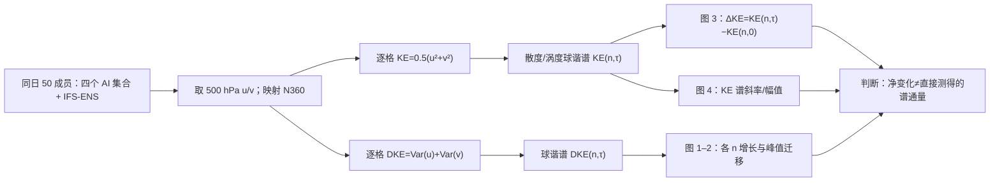

# 五种集合预报的动能级联与蝴蝶效应：谱形真实不等于跨尺度传输真实

> Jiakai Chen、Joel Oskarsson、Simon Driscoll、Sebastian Schemm，*Butterfly Effect and the Kinetic Energy Cascade in Probabilistic Machine Learning Weather Prediction Models*，[arXiv:2609.18489v1，2026-09-16](https://arxiv.org/abs/2609.18489)。本笔记依据[16 页预印本 PDF](https://arxiv.org/pdf/2609.18489v1)及[HTML 全文](https://arxiv.org/html/2609.18489v1)的式 (1)–(3)、主图 1–4、正文和数据声明逐项核对，阅读于 2026-09-25。PDF 页眉为“manuscript submitted to *Geophysical Research Letters*”；截至本次核验，arXiv 摘要页只列 v1，**不能当作已正式发表的期刊论文**。文中提到的补图 S1–S5 不在所取得的 16 页 PDF 中，以下只引用作者对补图的文字说明，不冒称已检视补图。

## 一、研究问题：三种常被混为一谈的“真实”

该文不是开发第六个天气大模型，而是对现成的 **NeuralGCM-ENS、FourCastNet 3（FCN3）、AIFS-ENS v1、GenCast** 和物理集合 **IFS-ENS** 做谱诊断。若只问 RMSE/CRPS，模型可能输出技巧很高的平均场，却仍在集合小尺度离散、风场动能谱以及小尺度向大尺度演化方面不真实。作者据此同时看 **KE（风场动能）**、**DKE（集合风场差异能量）** 和 **ΔKE（相对初始时刻各波数的 KE 改变量）**。[原文摘要与 §1–2](https://arxiv.org/html/2609.18489v1)

核心结果应拆成三层：四个 AI 集合的 DKE 谱峰随时间向低波数移动，表明存在**定性的误差向大尺度增长**；AIFS-ENS、FCN3、GenCast 的 KE 谱幅值接近 IFS-ENS，NeuralGCM-ENS 在高波数处偏低；但跨时刻的 ΔKE 显示，纯数据模型在小尺度没有重现 IFS-ENS 式高波数能量减少，尤其 AIFS-ENS/GenCast 出现高波数正尾。**这些是一个五天案例的物理结构诊断，不是对十天/十五天 RMSE、CRPS 或极端概率技巧的重新排名。**[原文图 1–4 与 §5](https://arxiv.org/html/2609.18489v1)

## 二、数据、起报、预处理和可比性

| 环节 | 本文实际做法 | 不能忽略的边界 |
| --- | --- | --- |
| 日期和范围 | **2021-06-26 00 UTC** 一次起报，之后最长 **120 小时/五天**。该日期因北美强对流背景而选；诊断为全球 **500 hPa 水平风 u/v**。 | 只有一场天气过程，未抽样其他季节、多个初始日或全部气压层；5 天只是中期前段，本身没有第 10–15 天证据。 |
| 初值 | 四个机器学习模型从 ERA5 分析出发，各取 **50 成员**；IFS-ENS 为 WeatherBench 2 所存、原由 TIGGE 提供的 **50 成员 EDA 初始化**物理集合。 | 同一日期、成员数不等于相同逐成员初值；IFS 的 EDA 初始离散度与 AI 模型单一 ERA5 场加内部随机源不同。 |
| 原生产品 | NeuralGCM-ENS **1.4°/1h**；FCN3、AIFS-ENS v1 **0.25°/6h**；GenCast **0.25°/12h**；IFS-ENS **0.25°/6h**。 | 前 12h 细尺度增长的取样时间点不同；1.4° NeuralGCM 无法凭事后插值恢复 0.25°模型的高波数结构。 |
| 统一网格 | 各场保守映射到 **N360 高斯网格，360 经度×180 纬度、约 1°**，以 `pyshtools` 做球谐分析；谱度数 **n=1…179**。 | 保守重网格可保全局均值，不能使各底座的原始有效分辨率或初值扰动生成方式相同；n≈100/约 400 km 已接近 NeuralGCM 的高频边界。 |

这些日期、字段、格距和数据链来自[原文 §3.1–3.3](https://arxiv.org/html/2609.18489v1)。作者**未报告**与此诊断配套的多年逐起报验证集、训练/验证/测试划分、缺测风场处理清单、每个模型的逐成员随机种子表或独立台站/卫星评分；不能把底座各自原论文的多年训练集误记为本研究新建的数据集。文中数据声明指向 [TIGGE/WeatherBench 2](https://weatherbench2.readthedocs.io/)、[WeatherNext GenCast 历史产品](https://developers.google.com/earth-engine/datasets/catalog/projects_gcp-public-data-weathernext_assets_126478713_1_0)、[ECMWF AIFS ENS v1 权重](https://huggingface.co/ecmwf/aifs-ens-1.0)、[NVIDIA FCN3 权重](https://huggingface.co/nvidia/fourcastnet3)及[NeuralGCM 软件](https://github.com/neuralgcm/neuralgcm)，没有给出本诊断的固定源码/谱数组版本；WeatherNext 旧产品页面现标记 deprecated，复现需确认归档权限与数据版别。[原文 Open Research](https://arxiv.org/html/2609.18489v1)

## 三、评价量怎么计算：集合扩散与动能转移不是同一指标

每个网格点、时效 `τ` 上，动能 `KE(r,τ)=0.5(u²+v²)`，差动能 `DKE(r,τ)=Var_members(u)+Var_members(v)`，单位都为 **m²/s²**。前者看某条/平均风场的运动能量，后者量化成员间风矢量分歧；它**不是**各成员对 ERA5 真值的误差平方，也不等于 ensemble-mean RMSE。先从水平风求散度与涡度，再对二者作球谐变换，并按原文式 (3) 将同一球谐度数 `n` 的各阶模系数平方求和得到 `KE(n,τ)`，DKE 同法分解。`n=1/10/100` 对应作者图注约 **40,000/4,000/400 km**，高 `n` 是小尺度。[原文式 (1)–(3)、§3.2](https://arxiv.org/html/2609.18489v1)

作者用两类随时间比较：其一是 `DKE(n,τ)` 谱峰是否从高 `n` 向低 `n` 移动，即“误差向大尺度增长”；其二是 `ΔKE(n,τ)=KE(n,τ)−KE(n,0)`，比较各尺度相对初值增加还是减少。图 3 的 ΔKE 按**邻近 10 个波数移动平均**平滑，蓝线 24h、红线 108h；横轴波数、纵轴是有正负号的能量差。不能在对数图上把零线下负值当成“能量幅值为负”。[原文 §4.1–4.2、图 1–3](https://arxiv.org/html/2609.18489v1)

**物理解释的重要限定**：ΔKE 是谱能量的**净时间变化**，其中可能同时包含跨尺度非线性传输、外强迫、参数化、耗散和再映射/离散误差；论文没有单独计算三波相互作用或闭合的 spectral flux budget。因此“高波数 ΔKE 为负、低波数为正”与向上尺度传输**一致**，但不单凭此证明能量实际从某一高波数单向流到某一低波数。类似地，KE 谱斜率接近 `n⁻³` 表示一时刻的尺度**分布**较合理，不说明随时间的能量交换路径也合理。这是本笔记对作者“级联”措辞所作的诊断边界，不是否定图中差异。[原文式 (3)、图 3–4 与 §4](https://arxiv.org/html/2609.18489v1)

此流程图据原文 §3–4 **原创重绘**，未复制论文图像。它把“集合 spread 的尺度增长”（DKE）与“每条风场包含的尺度能量”（KE）分开，避免把图 1 的欠离散误作图 3 的动能衰减。[原文方法](https://arxiv.org/html/2609.18489v1)

## 四、五个被评估模型的结构、原训练与本文训练边界

| 预报器 | 原系统的生成/训练机制，按本文明确披露 | 本次使用及不可混写的参数 |
| --- | --- | --- |
| IFS-ENS | 数值动力/物理参数化，EDA 为不同初始分析提供离散度；不属于本研究训练出的深度学习模型。 | TIGGE→WB2 0.25°、6h、50 成员；没有本研究的新 NWP 参数优化。 |
| [NeuralGCM-ENS](44-neuralgcm.md) | 可微物理动力核＋逐列学习物理；编码器和学习物理中引入**有时空相关的球谐高斯随机场**，原模型以格点与谱 CRPS 训练；谱损失**只到 n=80**，更高模态被动力核过滤。 | 本文调用现有集合版推理到 **1.4°、1h、50 成员**；没有针对这场个例或 500 hPa 再训练/微调。原模型多阶段训练、优化超参见链接笔记。 |
| [FourCastNet 3](62-fourcastnet3.md) | 纯数据模型，空间 CRPS＋全已解析模态谱 CRPS；潜随机场用球面扩散生成**有时空相关**的噪声，主架构结合球面几何算子。 | 本文使用既有 **0.25°、6h** 权重生成 50 成员；没有重新求 CRPS 梯度或改训练损失。 |
| [GenCast](43-gencast.md) | 条件扩散/Transformer；每一预报步从空间独立高斯噪声生成状态，条件含前两状态。 | 本文从 WeatherNext **0.25°、12h** 档案取成员；这项诊断没有重新执行原 GenCast 的训练/微调。 |
| [AIFS-ENS v1 / AIFS-CRPS](37-aifs-crps.md) | 编码器—Transformer 处理器—解码器；在潜网格采样空间独立噪声，以 CRPS 类 proper score 训练可交换集合；此处**明确是 v1.0**，不是 2026 年业务 v2。 | 本文用[官方 v1 权重](https://huggingface.co/ecmwf/aifs-ens-1.0)推理 **0.25°、6h、50 成员**；不在本研究重新做 ERA5 预训练或 IFS 分析微调。 |

这张表只列**本文用于解释谱结果所需**的底座机制；各底座各自的原训练年份、优化器、batch、阶段式微调和模型参数量应按上表链接的独立精读及其原文核对，不可汇成“本论文采用的统一训练配置”。**Chen 等本文没有训练新模型，也没有微调已有权重**，所以不存在本论文的学习率、epoch、冻结层或新损失权重；新计算发生在固定权重推理、统一网格与球谐诊断阶段。[原文 §3.3、Open Research](https://arxiv.org/html/2609.18489v1)

## 五、图 1–4 与能核对的定量锚点

此稿没有“模型 A 的十天 RMSE/CRPS 比模型 B 低 X%”数值表，也未公开逐点谱数组。下表只转录**图注/正文明确给出的**尺度、时刻和定性对照；不从曲线像素估造小数。[原文图 1–4](https://arxiv.org/pdf/2609.18489v1)

| 图与实验 | 原文给出的实际观察 | 对性能的含义与负面结果 |
| --- | --- | --- |
| **图 1**：`n=1/10/100` 的 DKE 时间线，0–120h | 在 `n=1/10`，起始较弱的 AI 模型约 **12h** 后与 IFS-ENS 靠近，此后大尺度误差增长相似；在 `n=100≈400 km`，IFS 初始离散度已高且近饱和，AIFS/FCN3/GenCast 相近，**NeuralGCM 初始 DKE 比 IFS 低一个数量级以上且未快速补足**。 | 大尺度相似不能掩盖小尺度 NeuralGCM 欠离散；底座初值机制不同，“快速增长”不能只看曲线末端是否相交。 |
| **图 2**：各 lead 的 DKE 球谐谱 | 四个 AI 集合均出现谱峰由较高向较低 `n` 迁移；NeuralGCM 初期 `n>100` 谱几乎平坦，随后高频 DKE 未出现预期增长。 | 峰迁移是误差 upscale growth 的**定性**证据；近白噪声的高频初始扰动与平衡动力演化不同。 |
| **图 3**：24h 蓝线、108h 红线的 `ΔKE(n,τ)` | 低 `n<约 50` 时 AI 与 IFS 变化相近；IFS 高 `n` 为负，NeuralGCM 也有负尾但幅值/斜率不同；FCN3 在 `n≥约 100` 附近徘徊零线并有局部正峰，AIFS/GenCast 高 `n` 多为正尾。 | 同一条图的 **ΔKE 净变化**不能当作直接测量的非线性谱通量；高 `n` 正尾也不是对每个灾害事件的直接误报计数。 |
| **图 4**：各 lead 的 KE 谱和 `n⁻³` 参考线 | IFS、AIFS、FCN3、GenCast 的高波数谱幅值/斜率接近参考；NeuralGCM 到约 `n=70` 后明显欠能量，原训练谱损失只到 **n=80**。 | 谱幅值“长得像真值”≠传输过程合理；NeuralGCM 的高频退化还可能受 **1.4° 原生分辨率**和动力核过滤影响，不能把它纯归因于单一损失截断。 |

作者另提到补图 **S1 总 DKE、S2 NeuralGCM 散度/旋转分量、S3 `n>70` 积分 KE、S4 108h 横向比较、S5 未平滑 ΔKE**。本次可取得的 16 页 v1 PDF 没有这些补图文件，故只保留它们在正文中的**用途说明**，不引用尚未核过的图形数值。图 3 的尖峰/正负跳变在所见 PDF 可见，解读时应同时看未平滑敏感性、N360 限频和再网格选择；原文尚没有多个初始日的区间估计。[原文 §4](https://arxiv.org/html/2609.18489v1)

## 六、作者解释与本笔记的独立判断

作者推测 AIFS/GenCast 的空间不相关噪声是高波数 KE 累积的原因；相关球面随机场的 FCN3 与 NeuralGCM 没有相同正尾，机制上有说服力，但**本文没有只切换噪声相关结构、保持骨干/损失/训练资料相同的消融**，故不能声称因果已经隔离。NeuralGCM 的高频欠能量也同时伴随 1.4° 原生网格、动力核过滤以及 `n≤80` 谱损失限定；仅凭这次五天案例不能量化每一项单独贡献。[原文 §4.1–5](https://arxiv.org/html/2609.18489v1)

要将该诊断提升为可靠的中期集合模型比较，至少需要多季节多起报、统一**初值扰动协议**与原生/共同网格敏感性检查，分别报告 6h 和 12h 共同采样点、逐 lead KE/DKE 置信区间；若要说“能量级联被验证”，再显式计算非线性谱通量及强迫/耗散收支。最好同时提供同批样本的 ERA5/观测风速、RMSE/CRPS/极端风事件概率，以判断物理谱诊断与预测用途如何相连。这是**本笔记提出的后续检验**，不是原文已完成的试验。原研究的明确实测界限仍是 **一场 120h 集合诊断**，不能外推到 15 天，更不能作为替代 [AIFS-ENS](37-aifs-crps.md)、[GenCast](43-gencast.md) 或 [FCN3](62-fourcastnet3.md) 原论文多年性能表的新排行榜。

[返回仓库首页](../../README.md) · [返回总追踪表](../../气象大模型_中期预报论文追踪.md)
