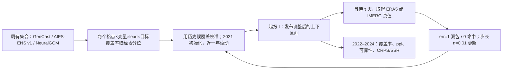

# GenCast、AIFS-ENS 与 NeuralGCM 的 1–15 天集合区间校准：在线共形保证不能代替极端降水保证

> Anna Asch、Raphael Rossellini、Pedram Hassanzadeh、Rebecca Willett，*Rigorous uncertainty quantification of probabilistic AI weather forecasts with conformal prediction*，[arXiv:2606.19642v1，2026-06-17 提交](https://arxiv.org/abs/2606.19642)，[开放 HTML 正文、附录 S1–S3](https://arxiv.org/html/2606.19642v1)。2026-09-25 阅读；arXiv 摘要页当时只列 v1，**预印本，不记作已同行评审发表**。本笔记核对了 HTML 全文、附录、原始图 1–3 与图 S1/S2 的在线图片；图 4、S3/S4 只依据作者的图注和正文文字，不从曲线估造未印出的精确数值。原文称结果代码将在论文获接收后提供，本次没有可核对的专用实现源码。

## 一、核心问题和结论边界

GenCast、AIFS-ENS 与 NeuralGCM 都能产生集合，但训练中考虑概率目标、或在 CRPS/SSR 上表现好，**不意味着其标称 90% 的预测区间真的覆盖未来真值 90% 的时间**。作者把已有集合的经验 5%/95% 分位点作为原始区间，再以逐次验证的在线共形预测调整上下端点；这是对**输出分布的后处理**，没有提出新天气预报骨干。逐格、逐变量、逐预报时效地更新校准量，最远评估到 **15 天**，所以本研究属于中期集合预报质量控制，而非次季节第 3–6 周预报。[原文 §1–3](https://arxiv.org/html/2606.19642v1)

最扎实的实证是第 5 天、2022–2024 全球面积加权平均：三种温度区间原始覆盖率 **65.9%–79.4%**，校准后约 **90%**；降水的常规样本也接近 90%。但筛选「真值超过当地当日气候 95 分位」的极端降水后，三个模型校准后只有 **68.7%、63.6%、65.3%**。在线共形理论控制的是按时间累计的**边际误覆盖**，并不为这样事后按真值筛选的稀有事件提供 90% 条件覆盖保证。这个反差是本文最重要的实践结论。[图 2–3、§2.3、§4](https://arxiv.org/html/2606.19642v1)

## 二、资料链：三个底座并不是同一场公平模型竞赛

| 项目 | GenCast | AIFS-ENS v1 | 随机版 NeuralGCM |
| --- | --- | --- | --- |
| 集合来源 | WeatherNext Gen 存档中的**业务运行版 GenCast**；按年有 **56 成员（2021–2023）/52 成员（2024）** | ECMWF AIFS-ENS **v1** 可用权重，作者生成 **25 成员** | 带卫星降水适配的 **2.8° 随机降水版**，作者生成 **51 成员** |
| 起报采样 | 每日 **00 UTC** | 每周两次 **00 UTC** | 每三日 **00 UTC** |
| 原生/评分空间格网 | 原生 **0.25°**，抽样到 **1°** | 原生 **0.25°**，抽样到 **1°** | **2.8°**；原文未说明进一步到 1° 的重网格，不能假定它与前两者同格距 |
| 温度目标 | **2 m 温度** | **2 m 温度** | **1000 hPa 温度**，因该版本没有 2 m 温度 |
| 降水目标 | 12 小时总累计 | 12 小时总累计 | 12 小时总累计 |
| 验证真值 | 温度/降水均用 **ERA5** | 温度/降水均用 **ERA5** | 温度用 **ERA5**；降水用 **GPM IMERG** |
| 时间划分 | 2021 年纯校准；2022–2024 年按时间前进评测 | 同左，但 **AIFS-ENS v1 曾用包括 2021–2023 年的 IFS 业务分析微调**，故这些年份不严格样本外 | 同左，作者称 2021–2024 对此底座为样本外 |

以上依据[原文 §2.3、附录 S3 与 Open Research](https://arxiv.org/html/2606.19642v1)。作者按集合成员线性插值求任意分位点，2021 年只供初始校准；进入 2022–2024 年后，在线使用**最近一年的非符合度分数**作为校准资料，并等对应时效的预报真值可用才更新。附录没有披露每个起报日未到验证时的所有边界处理、缺测掩码、IMERG 与 2.8° 网格的逐格配准算子、随机种子及完整可执行配置。2021/2022–2024 是**后处理器**的数据切分，不是三套底座共同的预训练/验证/测试切分。[附录 S2.1、S3](https://arxiv.org/html/2606.19642v1)

「极端」的门槛对每个空间点和日历日分别由 **1979–2018 ERA5** 的 95 分位构造；仅 NeuralGCM 降水改用 **2000–2018 IMERG**。因此把图中 GenCast/AIFS 的数值与 NeuralGCM 横排，最多是三种实际部署设置下的诊断，**不能解释为相同输入、分辨率、真值、样本数和训练期的模型优劣排名**。极端图的斜线网纹表示该格点整个测试期超过门槛的日期**不超过 10 天**，这些位置的条件覆盖尤其不稳。[§2.3 与图 2–3 图注](https://arxiv.org/html/2606.19642v1)

## 三、方法：从 5/95 分位到带验证延迟的自适应区间

固定一个地点、变量和时效 `τ`，设起报 `t` 的集合经验低/高分位为 `q_lo(t)`、`q_hi(t)`；目标覆盖率 `1−α`。`α=0.1` 时取 5%/95% 分位。正文式 (2) 将发布区间写成 `C_t=[q_lo(t)−c_t, q_hi(t)+c_t]`：`c_t>0` 加宽，`c_t<0` 收窄；不单独纠正中心偏差。`err_t=1` 表示到 `t+τ` 得到真值后发现其落在区间外，否则为 0。带时效延迟的更新为

`c_(t+τ) = c_(t+τ−1) + η(err_t−α)`。

在 `α=0.1` 时，一次漏包让校准量增加 `0.9η`，一次命中让其减少 `0.1η`；九次命中才抵消一次漏包。作者按**每一地点×时效×变量×目标分位/覆盖层级**分别运行在线校准，不把今天尚未发生的第十天真值提前用于今天的起报。附录 S2.1 给出 `η=0.01`、最近一年滚动校准；各覆盖层级如何在代码中处理未公开。[正文式 (1)–(4)、附录 S2.1](https://arxiv.org/html/2606.19642v1)

该流程图依据[§2、附录 S2–S3](https://arxiv.org/html/2606.19642v1)**原创重绘**。它特意把天气模型推理与校准器状态分开：本论文更新的是共形调整量，不是天气网络权重，也不是在线重新训练 GenCast/AIFS/NeuralGCM。

### 保证究竟覆盖什么？

将式 (4) 跨 `T` 个已验证预报相加，原文式 (5) 为 `平均(err) = α + [c_(T+τ)−c_τ]/(ηT)`。附录命题 S1 在**真值和原始分位都落在有界区间**、初始 `c_1…c_τ=0` 且「倒置区间视为漏包」的约定下，进一步给出误覆盖频率偏差上界 `(b+τη)/(ηT)`。因此这是对**一条时间序列的长期平均频率**、在这些条件成立时趋向 `α` 的无分布假设保证；它既非每一次起报的 90% 条件概率，也非任意空间区域联合覆盖或极端降水子集的同等保证。[正文式 (5)、附录 S2.2](https://arxiv.org/html/2606.19642v1)

**实现口径的审慎说明**：正文式 (2) 把 `c_t` 描述为和目标变量同物理单位的端点填充，§2.1 随后又明确说实际采用 *quantile space* 适应，使 `η` 无量纲、各地区可共用 `0.01`；附录 S2.1 没给出两者间每一步的完整映射伪代码。复现时不应直接把 `η=0.01` 理解成固定 `0.01 °C` 或 `0.01 mm`，也不应擅自声称已唯一确定作者的实际分位修正实现。理论式和公开实现说明各有可核范围。[正文 §2.1、附录 S2.1](https://arxiv.org/html/2606.19642v1)

## 四、训练、微调、基线和计算配置

**底座训练边界**：这项研究没有给 GenCast、AIFS-ENS 或 NeuralGCM 新增预训练、回传梯度或参数微调。AIFS-ENS v1「曾用 IFS 分析微调」、NeuralGCM「曾用 IMERG 适配降水」都是所调用现成模型的**先前历史**，不能写成 Asch 等在 2026 年为此实验又做的一轮微调。若需天气底座架构/原始训练阶段，应分别看本库的 [GenCast](43-gencast.md)、[AIFS-CRPS/AIFS-ENS](37-aifs-crps.md)、[NeuralGCM](44-neuralgcm.md) 笔记并核对各自版本；本文没有公布可以拼成「三模型统一学习率、batch、epoch」的配置。[原文 §2.3、附录 S3](https://arxiv.org/html/2606.19642v1)

**本研究真正可复现的校准参数**是 `α=0.1` 的主图实验、`η=0.01`、2021 年初始校准、2022–2024 顺时序测试、最近一年非符合度窗口、逐格/时效/变量调整；图 4 还考察多个目标覆盖层级，但 HTML 没列出精确 `α` 网格。天气模型成员数/起报频率/真值已在第二节逐项列清。校准过程不需要训练新的深度网络，实时更新主要是分位计算与标量状态更新；**不能把「后处理器在线学习」混成「微调天气骨干」**。[附录 S2.1、S3；§4](https://arxiv.org/html/2606.19642v1)

比较基线 EMOS 的配置也不是一句「用了统计订正」：温度于各格点拟合高斯 `N(a+b·集合均值, c+d·集合方差)`，四个回归系数由最近 **30 个已验证日**通过最小化 CRPS 求得。降水用**左截断 GEV**，令 GEV 均值 `m=α0+α1·集合均值+α2·报零成员比例`，尺度 `σ=β0+β1·成员两两平均绝对差`，另拟合形状 `ξ`；为稳定每一格点的估计，训练样本合并周边 **3×3** 格点，仍用最近 30 日 CRPS 优化。原文承认 EMOS 超参搜索未必充分，现代业务后处理可能是更强对照；因此「CP 优于此 EMOS 可靠性线」不能推广成优于所有后处理。[§2.2、附录 S2.3、§4](https://arxiv.org/html/2606.19642v1)

## 五、图表与数值：把总体、极端和局地误差分开读

以下均为**第 5 天、90% 目标区间、2022–2024 测试**；百分比由[原图 2](https://arxiv.org/html/2606.19642v1/fig2.png)、[原图 3](https://arxiv.org/html/2606.19642v1/fig3.png)在面板直接印出的面积加权均值转录，`ppi` 单位为**百分点**，不是相对百分比。

| 变量/底座 | 全部日：原始→共形覆盖 | 全部日平均 ppi | 极端日：原始→共形覆盖 | 极端日平均 ppi |
| --- | ---: | ---: | ---: | ---: |
| 温度：GenCast T2M | 78.5%→90.1% | +11.2 | 75.8%→89.1% | +9.5 |
| 温度：NeuralGCM T1000 | 65.9%→90.0% | +23.6 | 38.9%→76.2% | +36.9 |
| 温度：AIFS-ENS T2M | 79.4%→90.4% | +9.8 | 74.0%→87.9% | +10.4 |
| 12h 降水：GenCast | 84.0%→90.4% | +6.9 | 68.1%→68.7% | +0.7 |
| 12h 降水：NeuralGCM/IMERG | 91.4%→91.1% | +3.4 | 61.9%→63.6% | +1.8 |
| 12h 降水：AIFS-ENS | 84.0%→90.2% | +5.5 | 63.2%→65.3% | +2.1 |

`ppi_i=|原始格点覆盖−0.9|−|校准后格点覆盖−0.9|`，之后才对格点面积加权平均；**不等于**右边全球平均覆盖率的相减。例如 NeuralGCM 降水从 91.4% 到 91.1%，若只看全球均值似乎更远离 90%，但其**平均局地绝对偏差**仍改善 +3.4 ppi。文中图 2/3 的蓝色表示该格点的局地绝对偏差变小，红色为变差；斜线少样本网纹不是显著性检验。[式 (6)–(7)、图注](https://arxiv.org/html/2606.19642v1)

**图 1：芝加哥附近单点演示。** 展示集合直方图、端点填充、五天后才验证并更新、以及 2023 热浪时调整量随时间变化。示例能说明反馈顺序，不是全球覆盖率的独立统计，也不能把一段局地热浪演示误写为「极端温度保证」。[图 1](https://arxiv.org/html/2606.19642v1/schematic.png)

**图 2：温度空间图。** `a` 行上半是局地 ppi、括号是全球均值变化；`b` 行下半才是原始模型各格点覆盖率。NeuralGCM 对极端 T1000 从 **38.9%** 提到 **76.2%**，增益大但仍显著低于 90%；GenCast 和 AIFS 极端 T2M 已接近但未完全达标。海陆关系并不统一：作者观察 GenCast 原始温度海洋区校准较好，NeuralGCM 则相反。附图 S1 是**共形后的覆盖率地图**，不是额外一个模型。[图 2、附图 S1](https://arxiv.org/html/2606.19642v1)

**图 3：降水空间图。** 常规日覆盖率几乎校到目标，但极端降水在三底座上都约 **63%–69%**；GenCast 极端只提高 **0.6 个全球均值百分点**、局地平均 ppi **+0.7**，不能称极端降水已解决。NeuralGCM 原始常规降水全球略过覆盖，并不否定不同地区仍有各自偏差；附图 S2 的校准地图也仍可有过覆盖。作者指出大量零降水位置的原始两端点与真值同为零，若不允许**空预测区间**，某些情况下无法再缩窄以恰好达到 90%。[图 3、附图 S2、§3](https://arxiv.org/html/2606.19642v1)

**图 4：可靠性/时效，不是新 RMSE 排行。** 横轴标称覆盖、纵轴实测面积加权覆盖；黑虚线为理想，红为原集合，金为 EMOS，蓝为共形。原文图注与正文报告蓝线在多个标称层级贴近理想线，内嵌图在目标 90% 时显示 **第 1–15 天** 的覆盖校准。作者只给曲线、不在 HTML 正文列 Day10/Day15 的逐模型精确数字；因此本笔记不把像素读数写成两位小数，也不把第 5 天上表的极端条件覆盖自动推广到第 15 天。[图 4 图注、§3](https://arxiv.org/html/2606.19642v1)

**附图 S3/S4：另两个评分维度。** S3 报告校准后的 spread-skill ratio 总体更接近 1，S4 的 CRPS 与原集合**基本相当**，这支持「校准未以显著牺牲整体 CRPS 换取」；然而附图可获得的 HTML 仅有图注/文字描述，此处不写未经逐点提取的曲线数值。作者为区间输出在多个分位层级上积分**分位数损失**近似 CRPS，SSR 也由分位函数积分估计均值/方差，再与原成员版比较；两套计算不是将同一成员直接微调后重算的结果。[附录 S1、图 S3/S4 图注](https://arxiv.org/html/2606.19642v1)

## 六、关键局限、复现清单和独立判断

1. **保证层级**：本文证明的是每个校准序列随 `T` 增大时的时间平均覆盖；图中「极端」先按**真实结果**是否超过气候阈值筛样，属于条件覆盖。二者不同；尤其极端降水的 63%–69% 是明确负面证据，不可用总体 90% 掩盖。
2. **天气变量不是同一个**：NeuralGCM 是 **T1000**、其他是 **T2M**；其降水真值是 **IMERG**，其他为 ERA5；不同格距、起报频率和成员数进一步影响覆盖率。不能据本表断言「NeuralGCM 天生比 GenCast 差 12.6 个百分点」。
3. **AIFS 测试期重叠**：其 v1 底座微调资料包括 **2021–2023 IFS 分析**，而后处理器测试窗口为 2022–2024。即使校准器遵守时间先后，AIFS 底座本身在前两年的评测并非严格样本外；应在未来测试年重新验证。
4. **订正形式与时空一致性**：同一 `c_t` 对低端减、高端加，主要调区间宽度，**不修正预报中心偏差**；逐格、逐变量、逐时效各自校准后，原集合的空间协方差、跨变量关系及成员轨迹一致性**未被保留为有保证的联合分布**。业务上若要连片暴雨、流域总量或路径情景，还需要联合一致性处理和相应检验。
5. **零降水与有限样本**：大量点质量集中在零，作者为了不输出空区间容忍部分过覆盖；极端样本在很多网格不足 10 日，不能仅凭色块判定区域稳定收益。附录理论的有界值/分位条件与实践中的降水极尾如何截断并未交代。
6. **复现缺口**：发表时仅指向底座权重、ERA5、IMERG、WeatherNext 数据，专用结果代码承诺「接受后提供」而非当前已公开；正文物理量填充和量纲无关分位空间更新之间的实施细节也不足以逐字复刻。重做本研究至少需锁定三个底座/WeatherNext 的精确版别、起报日期表、数据重网格与日历门槛、每个 lead 的真值延迟队列、逐格分位校准法，以及 EMOS 最优化设置。[原文 §4、Open Research、附录 S2–S3](https://arxiv.org/html/2606.19642v1)

我的综合判断是：这篇文章把「大集合或优秀 CRPS 自带可靠概率」这个常见直觉变成了可检验的逐格覆盖问题，并提供低成本、明确理论条件的**边际校准层**。实际决策若关注 10–15 天高温/降水风险，下一步应按同一真值与完全样本外年份报告第 10/15 天数值，增加**单边上尾区间、极端条件覆盖、联合空间事件**和区间宽度代价；这属于本笔记提出的复验方向，**不是原文已经完成的结论**。

[返回仓库首页](../../README.md) · [返回总追踪表](../../气象大模型_中期预报论文追踪.md)
