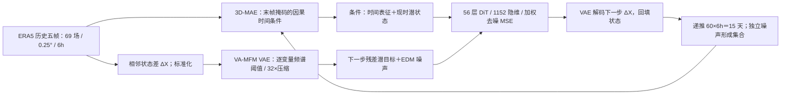

# PuYun-LDM：0.25°、15 天潜扩散集合的时间表征与逐变量频率正则化

> Lianjun Wu、Shengchen Zhu、Yuxuan Liu、Liuyu Kai、Xiaoduan Feng、Duomin Wang、Wenshuo Liu、Jingxuan Zhang、Kelvin Li、Bin Wang，*PuYun-LDM: A Latent Diffusion Model for High-Resolution Ensemble Weather Forecasts*；[arXiv:2602.11807](https://arxiv.org/abs/2602.11807)，**v1 2026-02-12、v2 2026-02-13**。[v2 11 页 PDF](https://arxiv.org/pdf/2602.11807v2)、[v2 HTML 全文](https://arxiv.org/html/2602.11807v2)。2026-09-25 逐页阅读 v2 的方法、表 1/2、图 1–5；这是预印本，未查到应按正式期刊或会议稿记载的版本。PDF 首页另印“Preprint. February 16, 2026”，与 arXiv 的**提交/修订时间**不是同一个字段；v1/v2 首页的机构署名也不完全相同，本文书目以 v2 作者及 arXiv 元数据为准。

## 一、论文实际做了什么，以及与旧 PuYun 的关系

该文试图在 **0.25° 全球网格**做 **6 小时间隔、60 步／15 天**的概率集合。常规高压缩自编码器若把高分辨率场压成太少潜通道，重建误差大；把潜通道加多，重建虽然变好，扩散去噪器却更难生成高维潜变量。作者称此为潜空间 *diffusability* 问题，提出两个相互补充的模块：其一是从历史五帧学习时间演化条件的 **3D-MAE**；其二是 VAE 预训练时按每个气象变量的频谱选择不同低通阈值的 **VA-MFM**。两者服务于 56 层 DiT 潜扩散器，在每一步生成下一时刻**状态增量**的潜表示。[§1、§3、图 1–2](https://arxiv.org/html/2602.11807v2)

这**不是**本库已有的 [2024 年确定性 PuYun](66-puyun.md) 的小版本更新。旧 PuYun 是大核注意力卷积的短/中期两级级联、到第 10 天，未训练概率生成器；PuYun-LDM 是另一篇 2026 年的 VAE＋3D-MAE＋潜扩散研究，到第 15 天、报告 CRPS/SSR/秩直方图。作者和名称有延续，但不能把旧 PuYun 的 120k＋两次 10k 步配置套给这篇。与 [LaDCast](132-ladcast-latent-diffusion-ensemble.md)、[GenCast](43-gencast.md)、[FuXi-ENS](39-fuxi-ens.md) 的关系也须按各自初值、真值与网格分别理解，不能凭论文背景段落拼成同协议排行榜。[旧 PuYun 原文](https://arxiv.org/html/2409.02123v2)、[本文 §2–4](https://arxiv.org/html/2602.11807v2)

## 二、数据、预处理、目标与评分协议

| 环节 | v2 明确披露的做法 | 复现/比较边界 |
| --- | --- | --- |
| 原始资料 | **ERA5** 再分析原生 **0.25°**；取每日 **00、06、12、18 UTC**，也即每 6 小时一帧。全球高分辨率训练场为 **720×1440**。 | 使用再分析场初始化，不是直接把卫星辐亮度或站点观测输入端到端预报器；论文没有独立观测同化模块。 |
| 年份 | **1979–2017 训练、2018 验证、2019 测试**。 | 全部主图/台风个例属于 2019 测试年；没有 2020–2026 跨年代业务检验，也未给多年独立起报置信区间。 |
| 大气变量 | 位势 Z、比湿 Q、温度 T、水平风 U/V × **13 层**：50、100、150、200、250、300、400、500、600、700、850、925、1000 hPa，共 65 场；地面 MSL、T2M、U10、V10 共 4 场；合计 **69 场**。 | 本文不预测降水或海洋/陆面额外场；不能把该架构的 15 天能力泛称为「全部气象变量及暴雨概率」。 |
| 增量处理 | VAE 训练目标为**标准化的 6 小时相邻状态差** `ΔX=X_t−X_(t−1)`；重建误差采用纬度面积和不同气压层权重。推理将去噪得到的增量逐步解码并自回归回填未来天气状态。 | 各字段均值/标准差、异常/缺测、经度接缝、重网格算法和推理中的完整状态/增量反标准化细节未作为清单公开，不能沿用旧 PuYun 的统计文件自行填补。 |
| ENS 对照 | PuYun-LDM 从 **ERA5** 起报、对 **ERA5** 评分；ECMWF ENS 从 **HRES-fc0** 起报、对其相应**分析场**评分。作者称图 3 按“48 ensembles”结果计算。 | **初值与真值均不相同**；这不是严格同初值/同真值的业务对决。文稿没有在图 3 段把“48 ensembles”进一步拆解为起报次数×成员数，不能凭此推断整年样本或固定集合规模。 |
| 指标与样例 | 15 天内给集合均值 **RMSE**、**CRPS**、**SSR** 与秩直方图；图 5 以 **2019 Dorian** 一场风暴、TempestExtremes v2.1 同参数追踪、IBTrACS 落点为真值。 | 台风样例只是单个 2019 风暴；不等于全球台风路径或登陆概率可靠性评分。 |

资料来自[§3.1、§4 与图 3/5 图注](https://arxiv.org/html/2602.11807v2)。正文未披露 ERA5 数据的下载批次、标准化统计的确切年份/逐变量数值、ERA5 与 HRES 分析之间的偏差校正、2019 具体起报日历/样本数及不确定性区间；这是已核到的方法信息缺口，而不是允许用其他论文常见值代填。

## 三、结构：三套模型的职责必须分清

**VAE／DC-AE 压缩器。** 源自 DC-AE 的分层卷积降采样和残差式 auto-encoding shortcuts，用于把高分辨率 **69 场状态增量**压入空间缩小 **32 倍**的潜场。默认潜通道为 **1152**；图 1 另用 **144/576/1152** 通道观察“重建更好但普通 DiT 生成退化”的权衡。VAE 目标是低通重建误差加 `β·KL`，实际 `λ_KL=10^-5`。这里的 VAE 重建值只是**理想上限/编码器质量检查**，不等同于 60 步生成预报的误差。[§3.2、式 (14)、图 1、§4 Implementation](https://arxiv.org/html/2602.11807v2)

**3D-MAE 时间条件编码器。** 与 VAE 共享 DC-AE 的核心编码—解码设计，但把 2D 卷积换为**因果 3D 卷积**，通过缓存上一时间阶段的特征和中间 stride=2 降采样处理连续帧。示例 `k=4`：输入五帧 `X0…X4`，在目标阶段把 `X4` 替为全零，要求模型只依赖前序特征重建包括最后一帧在内的五帧；其训练为掩码重建 L2，**3D-MAE 本身没有 KL 项**。推理把该编码器给出的时间表征作为扩散模型的一个条件，不能称作「未来真值辅助输入」。[§3.3、式 (5)–(7)、图 2b](https://arxiv.org/html/2602.11807v2)

**VA-MFM 逐变量频率正则化。** VAE 训练时，从 `{0.25,0.5,0.75,1.0}` 等概率抽取目标保留比例 `γ`；小于 1 时对每个输入变量做 2D Fourier 变换、按半径求各环平均**幅值** `A_v(r)`，找其累计比率首次达到 `γ` 的变量专属阈值 `r_v(γ)`，给该变量重建目标做低通；潜场因多变量耦合，统一按 `γ` 作频域低通，再由解码器去重建各变量的低通目标。`γ=1` 则普通 VAE 训练。这一处理要使 Z、T、风、MSL 等各场的保留幅值比例更接近，而不是所有变量套相同物理波数阈值。[式 (8)–(14)、图 1 下半/图 2c](https://arxiv.org/html/2602.11807v2)

**扩散／DiT 生成器。** 干净目标 `z_(t+1)=E(X_(t+1)−X_t)`，加从对数正态噪声尺度抽样的高斯扰动，网络以 EDM 式预条件和噪声加权 MSE 预测干净增量潜变量。输入还拼接 3D-MAE 时间表征及当前潜状态，经过 **1×1×1 3D 卷积**投影、**56 个 1152 隐维 DiT 块**（RMSNorm、多头注意力、固定 3D RoPE、SwiGLU、时间步自适应 LayerNorm），最后线性映回潜变量。每个未来步重复去噪并把所生成状态喂给下一步；推理默认 **25 次去噪**，不同随机噪声形成集合。摘要说**单张 H200 约 5 分钟**可产出一条 15 天、6h 间隔全球预报，未给 48 成员端到端墙钟耗时。[§3.5、§4](https://arxiv.org/html/2602.11807v2)

此为按[图 2 和 §3](https://arxiv.org/html/2602.11807v2)**原创重绘**的训练—推理职责图，不复制论文原图。实际推理滚动时历史窗口如何缓存、每一步使用同一还是重采样的噪声序列，以及所有维度/可训练参数量，论文没有给出可执行逐层清单。

## 四、训练、微调与参数：本文最需要保留的复现信息

| 阶段 | 输入、目标与是否微调 | 优化器/迭代/分辨率/批量/资源 |
| --- | --- | --- |
| **VAE 预训练** | 对标准化 `ΔX` 作 VA-MFM 或普通重建，纬度/气压层加权，重建＋KL。文中没有另一个独立 VAE 下游微调阶段。 | AdamW `β1=0.9, β2=0.95`；常数 LR **5×10^-5**；KL 权重 **1×10^-5**；**70k steps**；默认潜通道 1152／空间 32× 压缩；8×H200 约 **2 天**。VAE batch 未披露。 |
| **3D-MAE 阶段 1** | 低分辨率**单帧**预训练，先建立空间编码器。 | **180×360**，30k steps，batch **128**，LR **1×10^-4**。 |
| **3D-MAE 阶段 2** | 低分辨率**五帧**、最后帧掩码，开始时间演化学习。 | **180×360**，15k steps，batch **64**，LR **5×10^-5**。 |
| **3D-MAE 阶段 3** | 转到高分辨率单帧继续训练；这是同一模型的分辨率迁移。 | **720×1440**，30k steps，batch **16**，LR **5×10^-5**。 |
| **3D-MAE 阶段 4／fine-tune** | 在高分辨率**五帧末帧掩码**序列上继续微调。论文称 *fine-tuned*，但**未说明冻结哪些层、是否重新初始化编码器/解码器或更换哪些统计量**；不能自己补写冻结方案。 | **720×1440**，15k steps，batch **8**，LR **1×10^-5**。四阶段合计 **90k steps**，8×H200 约 **2.5 天**。 |
| **DiT／扩散训练** | 目标为 6h **增量潜变量**，用 EDM 预条件/噪声加权 MSE；时间条件来自 3D-MAE。正文没有写一轮额外「15 天集合 CRPS 微调」。 | AdamW，**100k steps**，global batch **32**，常数 LR **1×10^-3**，8×H200 约 **2 天**；具体扩散训练噪声分布参数、AdamW 权重衰减、warmup、EMA、混合精度、随机种子和预训模型冻结清单未披露。 |
| **推理采样** | 默认 EDM **25 去噪步**；正文图 3 的 SSR 是**确定性 ODE 采样器**的集合结果，集合成员仍因初始噪声不同而异。 | 另试验 `S_churn=2.5, S_min=0.75, S_max=68, S_noise=1.1` 的**随机采样**，仅明确报告首个 MSL lead：RMSE **30.5→30.9**（略差），SSR **0.801→0.902**（更接近 1）。这不是把表 1 全部结果改成随机采样。 |

以上为[§4 Implementation Details、表 1、采样段落](https://arxiv.org/html/2602.11807v2)逐项拆解。两处**原文内部口径风险**值得记下：图 2c 的示意小字把 `γ` 候选写成类似 `{0,0.25,0.75,1.0}`，而正文式 (8) 明确为 `{0.25,0.5,0.75,1.0}`，这应由作者配置核验，暂以正文公式为报告值；式 (10) 把按**频谱幅值**累计的比率命名为 *spectral energy*，不是通常按模平方求能量的定义，复现时必须按原式而不能自行换成 `|F|²`。[图 2c、式 (8)–(10)](https://arxiv.org/html/2602.11807v2)

## 五、表 1/2：首个 6 小时预报的消融，不是第十五天表

**表 1：MSL 首个 lead（原表未给 RMSE 的物理单位）**。以下数值均照[v2 表 1](https://arxiv.org/html/2602.11807v2)；SSR 理想为 1，RMSE 越低越好。

| DiT 条件／VAE 频率策略 | MSL RMSE ↓ | SSR →1 | 可支持的结论 |
| --- | ---: | ---: | --- |
| 无额外编码器条件 | 43.2 | 0.806 | 增加额外编码器之前的基线。 |
| 2D-AE 条件 | 37.7 | 0.823 | 单帧空间条件已有收益。 |
| 3D-MAE 条件 | 35.5 | **0.876** | 时间条件进一步改善 RMSE，且本表中 SSR 最接近 1。 |
| 3D-MAE＋固定频率掩码 FFM | 31.4 | 0.812 | RMSE 继续下降，**SSR 较单独 3D-MAE 变差**。 |
| 3D-MAE＋VA-MFM | **30.5** | 0.801 | **最小 RMSE 不等于最佳离散度/校准**；随机采样另将 SSR 拉至 0.902，但 RMSE 略增至 30.9。 |

作者正文将 3D-MAE 的 35.5/0.876 写成更好校准，表格确实支持；但如果把 **30.5** 单独当「全方位最好」，会漏掉 SSR **0.801** 比无编码器的 **0.806** 还略低。该表也没有报告 CRPS 或第 10/15 天的同结构消融，不能把首步 RMSE 改善率转写为中期全时效收益。[表 1、§4 消融](https://arxiv.org/html/2602.11807v2)

**表 2：同为首个 lead 的多变量 RMSE**。原表把 **Q700 乘 1000** 后展示，且未在表头逐列标明物理单位；因此按**表内显示值**转录，不补造 hPa/K/m/s。比较基线为 DiT＋3D-MAE。[v2 表 2](https://arxiv.org/html/2602.11807v2)

| 策略 | Z500 | T850 | U850 | Q700×1000 | T2M | V10 | MSL |
| --- | ---: | ---: | ---: | ---: | ---: | ---: | ---: |
| 基线 | 26.1 | 0.418 | 0.800 | 0.371 | 0.654 | 0.703 | 35.5 |
| SE 尺度等变 | 22.4 | 0.402 | 0.787 | 0.366 | 0.642 | 0.694 | 33.2 |
| FFM 固定掩码 | 21.6 | 0.410 | 0.779 | 0.362 | **0.657** | 0.700 | 31.4 |
| VA-MFM | **21.0** | **0.380** | **0.721** | **0.344** | **0.639** | **0.677** | **30.5** |

VA-MFM 在这七个字段**全低于基线与两替代法**；FFM 的 T2M **0.657** 反而高于基线 **0.654**，支持「固定同阈值会让个别变量退步」。但表 2 仍是首步 RMSE 消融，不是所有 69 场、第 15 天、极端尾部的全面胜利。表 1 的 SSR 又提示「VA-MFM 的点误差最优」与「默认采样可靠度最佳」不是同一目标。[表 1–2](https://arxiv.org/html/2602.11807v2)

## 六、图 1–5：长时效、谱诊断和台风正反证据

| 原图 | 可核内容 | 解读时不能越过的边界 |
| --- | --- | --- |
| **图 1**：首个 lead 的潜通道与频率实验 | VAE 的 144→576→1152 潜通道重建 RMSE 一直下降；普通 DiT 的 MSL 生成 RMSE 从 144→576 明显变好、到 1152 反而回升；完整 PuYun-LDM 在高通道时继续改善。下半图 FFM 的各变量保留比严重不均，VA-MFM 更接近统一目标。 | 图注说 Z500/MSL 的 RMSE 为同轴显示**除以 50**，不能从混合双轴图直接当原物理成绩。图上曲线点无全部精确表值，本笔记不从像素抄小数。[图 1](https://arxiv.org/html/2602.11807v2) |
| **图 2**：VAE/3D-MAE/DiT 流程 | 历史状态→时间条件与状态增量编码→下一步潜去噪→解码回填→60 步滚动；右侧分别说明五帧末帧掩码和逐变量目标低通。 | 结构示意的 `γ` 候选与正文式 (8) 冲突；图 2 不是开源可执行配置，也没展示全部网络通道/残差捷径参数。[图 2](https://arxiv.org/html/2602.11807v2) |
| **图 3**：15 天 Z500/T850/V10/MSL 集合 | 顶两行是 ENS 黑线、PuYun-LDM 粉线的**绝对 RMSE/CRPS**；另两列是相对差，SSR 与 rank histogram 表示离散度。早期 RMSE/CRPS 在所列变量多较低，中后期大体接近；粉色 SSR 的前几天明显低于 1，尤其 V10，至后期逐渐靠近 1；V10 的 CRPS 末段和相对技巧面板并非全程占优。 | **ENS 对 HRES-fc0 分析，LDM 对 ERA5**；图只画四变量，曲线没有逐日精确表格及不确定性区间，不能声称「第 15 天四项均显著胜 ENS」；图中秩直方图注明的是**历史 3 天**而非全部 15 天。[图 3、§4](https://arxiv.org/html/2602.11807v2) |
| **图 4**：潜空间能量／截频 | `r<0.2` 编码与生成潜谱接近，`r≥0.2` 扩散潜场更缺高频；在 `r>0.8` 对编码潜场截频会更快恶化其 RMSE，而扩散潜场原本高频就少，受影响较小。 | 这是**潜表示**的频率诊断，不是地球大气的实际动能通量或风场物理谱；它解释 VA-MFM 的设计动机，但不证明所有强对流小尺度过程真实。[图 4、§4](https://arxiv.org/html/2602.11807v2) |
| **图 5**：Dorian 登陆 | 同一跟踪器/IBTrACS，把 1/3/5/7/9 天前起报的成员轨迹与真实登陆点画在一起。具体均值和离散见下表；作者说 3、9 天较优。 | 单风暴、同一登陆时刻回看多次起报；淡线是偏离真实登陆**超过 200 km**的成员，不是删除这些成员再算均值。[图 5](https://arxiv.org/html/2602.11807v2) |

图 5 每面板直接标注的**登陆点误差均值±标准差，km**如下；这是我们能按图转录的数字，而非从曲线估计：[v2 图 5 原图](https://arxiv.org/html/2602.11807v2/final_fig.png)。

| 提前期 | ENS | PuYun-LDM | 哪个均值更小 |
| --- | ---: | ---: | --- |
| **9 天** | 985.3±300.7 | **744.4±327.6** | PuYun-LDM |
| **7 天** | **419.3±241.6** | 616.5±355.0 | ENS |
| **5 天** | **339.7±196.1** | 467.8±226.4 | ENS |
| **3 天** | 210.1±112.1 | **120.1±86.9** | PuYun-LDM |
| **1 天** | **31.4±15.3** | 57.6±21.4 | ENS |

因此「3 和 9 天赢」与图一致，但正文所谓其他 lead「相当」应谨慎：该单例 7、5、1 天的均值确实**均高于 ENS**，且没有成员相关性/显著性检验。图注把展示量称“mean, variance and minimum”，面板实际写的是 **mean ± std** 与 min；本表按可见标签记录**标准差**，不把 ± 后数字误作方差，也不把最小成员误差当集合均值。[图 5 与 §4](https://arxiv.org/html/2602.11807v2)

## 七、复现缺口和本笔记判断

1. **真值/初值混杂是最大的比较限制。** 分别对各自分析评分有助减少底座与自家分析偏差，但这也意味着图 3 的 LDM/ENS 绝对和相对差可能掺入 ERA5 与 HRES-fc0 分析本身差异。若要严谨排名，应补同批起报、同一真值（最好还包括站点/卫星观测）、同成员数和同原生网格的敏感性实验。此项为**本笔记建议**，不是原文已经做过的实验。
2. **训练配方有分段细节，但并非全可复刻。** VAE batch、权重衰减、EMA、预训权重冻结范围、EDM 噪声超参数、成员随机种子、全字段标准化统计、DataLoader/QC 与 2019 起报表未披露；本次未找到专用 PuYun-LDM 代码/权重链接。论文的“约 5 分钟”限定为单 H200 15 天预报，不应换算成 48 成员整套业务成本。
3. **首步胜利与长期集合可靠度不能混为一谈。** 表 1/2 只证首个 6h MSL/七变量消融；图 3 给 15 天四变量曲线但无逐日数值，默认采样 SSR 的短 lead 偏低。随机 EDM `S_churn` 改善的明确数字又只有**首步 MSL**，不能延伸为所有时效都已校准。
4. **方法谱量的物理语义要克制。** 式 (10) 累计幅值却命名能量，图 4 是**潜空间**高频缺失；即使表 2 的第 6h RMSE 降了，也不推出物理尺度能量传输合理、极端降水再现或长期 S2S 技巧。作者在结论中说未来拟延伸到高分辨率 S2S，**本文尚未评第 3–6 周**。[式 (10)、图 4、§5](https://arxiv.org/html/2602.11807v2)

总体而言，这项研究有价值的地方是把**天气变量频谱异质性**引入 VAE 训练，并把**因果时间表示**显式送入潜扩散器；它也公开了较完整的 3D-MAE 四阶段微调和 DiT 训练时长。但其“优于 ENS”主要是不同分析场口径下的短 lead 结果；图 3 的后段和图 5 的单风暴反例，都不支持把它宣传成已全面超越业务 ENS 的 15 天集合系统。该结论区分了作者自述与本文所见图表的证据强度。[原文图 3/5、表 1/2、§4–5](https://arxiv.org/html/2602.11807v2)

[返回仓库首页](../../README.md) · [返回总追踪表](../../气象大模型_中期预报论文追踪.md)
