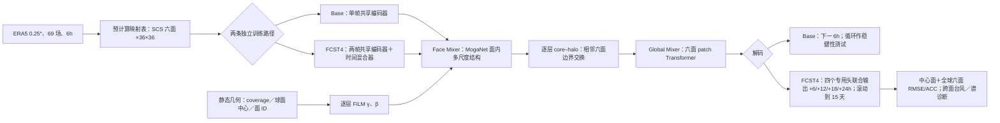

# StretchCast：伸展立方球网格上的全球—区域十五天天气预报

> 正式论文：Jin Feng、Weiwen Ji，*Global-Regional AI Weather Forecasting on a Stretched Cubed Sphere*，*Geophysical Research Letters* **53(16)**, e2026GL124199，[DOI 10.1029/2026GL124199](https://doi.org/10.1029/2026GL124199)，**2026-08-11 首次在线发表**。[arXiv:2603.27288v1](https://arxiv.org/abs/2603.27288) 于 **2026-03-28** 首发，题名 *StretchCast: Global-Regional AI Weather Forecasting on Stretched Cubed-Sphere Mesh*，当时作者栏仅 Jin Feng。两者研究对象、两模型、数据年份、核心图表相同，按**同一研究**去重；作者、标题以正式版为准。本文于 2026-09-25 核对[正式开放 HTML](https://agupubs.onlinelibrary.wiley.com/doi/10.1029/2026GL124199)、[arXiv v1 完整 HTML](https://arxiv.org/html/2603.27288v1)及[作者推理仓库](https://github.com/cvonfj/stretchcast_pub)。期刊独立 **29 MB Supporting Information S1 的下载端返回 403**，因此以下凡涉及该补充文件的层级/超参/曲线细节均不冒称已经逐页核实。

## 一、问题与结论先读

这篇不是卫星观测直接起报、不是同化、不是集合概率预报，也不属于 S2S 第 3–6 周验证。它研究一个几何问题：能否只用 **6 个各 36×36 的规则张量面片、共 7,776 个全球格点**，通过在华东附近拉密网格、远处放粗网格，同时保留全球闭合和双向大尺度约束？这个网格称为 stretched cubed sphere（SCS，伸展立方球）。它不像普通区域模型那样需要从另一个全球模式逐时提供侧边界，也不像统一 0.25° 全球网格那样在远离目标区的地方支付同样高的空间成本。[正式文 §1–2、图 1](https://agupubs.onlinelibrary.wiley.com/doi/10.1029/2026GL124199)

作者先训练每次前进 **6 小时**的 `SCS_Base`，检验这种表示及跨面通信是否可用；再训练用**两个历史时次联合预测未来四个 6 小时时次**的 `SCS_FCST4`，以 24 小时为一个预测块滚动到 **15 天**。正式版图 2 展示 6 小时至 15 天、中心加密面 19 个代表变量的 ACC 曲线，论点是四步联合训练比单步自回归在若干高度场、湿度场和 U850 上衰减更慢；**原图并未在表中给出第 10/15 天每变量精确数值**，本笔记不从像素估造。`SCS_Base` 的 +36h 消融则有完整印刷数字，见下文。[正式文 §3、图 2、表 1](https://agupubs.onlinelibrary.wiley.com/doi/10.1029/2026GL124199)

## 二、ERA5 数据、网格变换与输入张量

| 环节 | 可由正文核实的处理 | 缺口与复现注意 |
| --- | --- | --- |
| 原始资料与年份 | ERA5 0.25° 经纬度再分析；每 **6h** 取样。**1998–2020** 训练、**2021** 验证、**2022** 留出测试。文中主结果在 2022 测试集。 | 不是 2022 实测站点/独立卫星真值；ERA5 本身含同化。未见明确列出一天中的 00/06/12/18 UTC 配对过滤、缺测处理及全部下载请求版本。 |
| 大气变量 | 5 个三维变量：位势高度 Z、比湿 Q、温度 T、纬向风 U、经向风 V，各取 **13 个 1000–50 hPa 的标准气压层**，共 65；地面 U10m、V10m、T2m、海平面气压 SLP 再加 4，合计 **69 通道**。 | 正文未逐项列完 13 层的具体 hPa 值及每通道归一化均值/方差文件；不能从另一家模型的 69 场配置直接代填。 |
| 重网格 | ERA5 经纬网格先通过**预先计算的映射表**变为六面 SCS 场。单步输入形状 `(69,6,36,36)`；四步预测器历史输入形状 `(2,69,6,36,36)`。 | 正文只说 remap/precomputed table，未披露插值阶数、守恒与否、边界权重、海陆处理、映射表生成脚本/哈希；正式补充 S1 可能补充映射误差图，但本次未取得。 |
| 伸展后的物理分辨率 | 加密中心面约覆盖 **15.6–47.9°N、90.7–130.9°E**；局地角间距 **0.67–1.11°**，平均约 **0.875°**。四个过渡面的间距约 **0.67–3.12°**，对侧粗面最大约 **9°**。 | 六面 `36×36` 的张量形状相同，不代表地球上每格面积相同；远端粗网格能否准确承载反馈到东亚的遥相关，是关键外推风险。 |
| 几何条件 | 模型按正文使用格点局地 coverage、球面中心坐标、面 ID，生成 FiLM 条件；邻面关系用于 halo 交换。 | coverage 的具体面积/坐标编码、旋转方向和 FiLM MLP 尺寸在可读正文未完整给出；不能假定是简单纬经度位置编码。 |

作者用理想化场和真实 T2m 作经纬网格→SCS→回原网格的重构检查，认为面边界未出现明显接缝；误差主要在远离加密中心的粗面变大。这只测试**插值/表示误差**，不等于模型 15 天预报误差。期刊版图 1 与补图 S1/S2、预印本图 1/2 的编号不同；本笔记以下优先使用**正式版编号**。[正式文 §2.1–2.2](https://agupubs.onlinelibrary.wiley.com/doi/10.1029/2026GL124199)、[预印本 §3.2](https://arxiv.org/html/2603.27288v1)

## 三、模型结构：局部、邻面、远程与时间各有职责

`SCS_Base` 的一条路径是编码当前 69 场→共享参数的面内 `Face Mixer`→六面远程 `Global Mixer`→解码下一 6 小时 69 场。面内混合器采用 MogaNet 式多尺度 token mixing；每层面内混合前后通过 core–halo 操作引入邻面边缘，防止把六面当互不相干的图像。静态几何场经逐层可学习映射生成 FiLM 的缩放 `γ` 和偏移 `β`，因此地理位置/伸展程度不是只在输入层注入一次。`Global Mixer` 把六个面的潜在特征 patch 化交给 Transformer，补充 halo 有限层数难以覆盖的长距离环流/遥相关信息。[正式文 §2.3、预印本 §3.3 式 (2)–(4)](https://arxiv.org/html/2603.27288v1)

`SCS_FCST4` 额外用**共享编码器**编码 `t−1,t` 两帧，经 temporal mixer 集成时序后复用相同职能的空间骨干，再分成 4 个 lead 专用解码分支输出 `t+1…t+4`。它是另外训练的 **83.4M** 参数模型，不是把 23.9M 的单步网络运行四次，也不能仅凭文字推断一定从 `SCS_Base` 权重微调而来。长预报需继续按 24h 块推进；论文的表述没有给出跨块如何组织两帧历史、推理过程是否再做纠偏的所有实现细节。[正式文 §2.3](https://agupubs.onlinelibrary.wiley.com/doi/10.1029/2026GL124199)、[作者推理脚本/README](https://github.com/cvonfj/stretchcast_pub)

上图依据[正式版 §2.2–2.4、预印本图 3/公式](https://arxiv.org/html/2603.27288v1)原创重绘，只表达公开的模块职责；箭头不表示论文开放了完整训练源码。正式版正文给出 `SCS_Base≈23.9M`、`SCS_FCST4≈83.4M`，预印本摘要四舍五入为 23M/83M。[正式文 §2.3](https://agupubs.onlinelibrary.wiley.com/doi/10.1029/2026GL124199)

## 四、完整训练链与可核参数：何处是真披露、何处不是

1. **数据构造。** 每个训练样本由 6h 间隔 ERA5 经同一 SCS 映射得到；单步目标为下一时次，四步网络目标为**连续四个未来时次**。`SCS_FCST4` 的训练不是只在第 24 小时打一个误差，而是四个未来帧共同受监督；长时效推理再滚动调用。训练/验证/测试跨年隔离，正文未给精确窗口采样步距、随机起报打乱方式或跨年边界窗口是否剔除。[正式文 §2.1–2.3](https://agupubs.onlinelibrary.wiley.com/doi/10.1029/2026GL124199)
2. **损失及选优。** 用 SCS 六面上的**通道加权均方误差**，通道权重沿用 Pangu-Weather 变量权重方案；验证与选最佳权重使用该加权误差的平方根。作者**故意不再乘纬度/面积权重**，因为伸展网格本身让加密区域格点更多，未面积加权会提高其优化比重。这一目标与全球等面积 RMSE 不同，不能将表中中心和全球汇总解读成相同区域权重。[正式文 §2.1、表 1 注](https://agupubs.onlinelibrary.wiley.com/doi/10.1029/2026GL124199)
3. **资源与规模。** 正式版报告四步模型约 **18 小时 × 8 张 Hygon K100_AI**；作者仅将本机环境下计算量粗略类比为约 **3 张 NVIDIA A100**。这是一个大致算力参照，非同硬件、同数据管线的实测成本。六面共 7,776 格与 0.25° 全球约 111 万格相比密度低，但一个网格单元的物理尺度不一，网格数之比不能直接等于墙钟速度比。[正式文 §2.3](https://agupubs.onlinelibrary.wiley.com/doi/10.1029/2026GL124199)
4. **可核验的超参与复现空白。** 可读正式正文和 arXiv v1 未列完整优化器类型、学习率/日程、batch size、epoch/总更新步、warm-up、权重衰减、混合精度、梯度裁剪、随机种子、每通道统计量、窗口采样策略、halo 宽度、patch/Transformer 层数、各解码头层数、所有通道权重常数及训练检查点 hash。正式补充 S1 下载受限，故这里只写**“本次未核验”**，不将它们断言为论文任何版本都未披露。作者 GitHub 公开的是 **Linux/Python 3.12 推理 wheel、推理脚本和个例数据说明**，不是可审计的训练源码及训练配置；本笔记未把 wheel 中不可见的实现臆作原文参数。[作者仓库](https://github.com/cvonfj/stretchcast_pub)
5. **预训练／微调关系。** 主文展示分别训练的 Base 和 FCST4，没有证据表明先用 Base 权重预训练、再冻结/解冻某些层做 FCST4 微调，也没有 ERA5→业务分析微调或针对台风的再训练。`SCS_FCST4` 是**多步训练目标/独立预测器**，不能把“以多步改善 rollout”偷换成“已做某种微调”。如果需要复现训练迁移，必须取得实际配置或作者说明。[正式文 §2.3](https://agupubs.onlinelibrary.wiley.com/doi/10.1029/2026GL124199)

## 五、验证设计、可转录性能表与图表解读

中心面和全球六面分别算 RMSE/ACC。外部 Pangu-Weather、FengWu、FuXi 的现成预报经 Earth2Studio 调用后统一**投影到 SCS 网格**再评分；因此这不是原生 0.25° 分辨率、相同初始化、相同训练数据和相同算力下的公平重训练赛。平均 RMSE 表值是**归一化通道加权量**，无 K/m/s 物理单位；ACC 无量纲。另有预印本表 3 给若干物理量的反归一化 RMSE，应与汇总表分开。[正式文 §2.4、表 1 注](https://agupubs.onlinelibrary.wiley.com/doi/10.1029/2026GL124199)

| `SCS_Base` +36h 变体 | 中心平均 RMSE ↓ | 中心平均 ACC ↑ | 全球平均 RMSE ↓ | 全球平均 ACC ↑ | 中心 Q850 ACC ↑ | 中心 T2m ACC ↑ | 中心 Z500 ACC ↑ |
| --- | ---: | ---: | ---: | ---: | ---: | ---: | ---: |
| 完整模型 | **0.210** | **0.930** | **0.189** | **0.929** | **0.955** | **0.988** | **0.996** |
| 用 Swin 式 Face Mixer 替换 MogaNet | 0.222 | 0.924 | 0.201 | 0.923 | 0.951 | 0.986 | 0.995 |
| 去掉 Face Mixer | 0.231 | 0.918 | 0.212 | 0.916 | 0.946 | 0.984 | 0.994 |
| 去掉 Global Mixer | 0.230 | 0.918 | 0.209 | 0.918 | 0.946 | 0.977 | 0.994 |

数据**直接转录正式版表 1**；平均 RMSE 为归一化加权量，ACC 无单位；变量 ACC 也是中心面口径。[正式原表及表注](https://agupubs.onlinelibrary.wiley.com/doi/10.1029/2026GL124199)。“完整网络在这些 +36h 消融中最佳”成立；却不能由这个表证明 **15 天 FCST4 对 Pangu/FengWu/FuXi 全变量最优**。更具体的[预印本表 3](https://arxiv.org/html/2603.27288v1)报中心 +36h T2m RMSE：完整/无 Global Mixer **1.578/2.184 K**（后者约高 38.4%）；U10m **1.141/1.397 m/s**（约高 22.5%）；Z500 完整/无 Face Mixer **9.284/12.308 m**。这些是反归一化**具体变量**，不可与上表 0.210 作同单位排名。

| 原文图表 | 实际展示及阅读结论 | 不可推出的结论 |
| --- | --- | --- |
| **正式图 1／补图 S1–S2** | 六面伸展网格、展开拓扑和 core–halo 通信；理想场/T2m 回映射无明显面接缝，但远侧粗面误差更大。 | “无明显接缝”不是任意天气系统跨边界都守恒的数值证明；补图未逐页取得。 |
| **正式表 1** | 上表完整 +36h 消融：去 Face Mixer/Global Mixer 都损害中心和全球汇总 ACC；Swin 替换介于完整与删除变体之间。 | 这只测 Base 的短期消融，并未分离多步训练的所有影响。 |
| **正式图 2** | 2022 测试集 6h–15 天中心面 ACC，FCST4 对 Base 尤其在 Q200/Q500/Q850、Z850、U850 的持续性更好；V 风和部分低层风仍困难。原纬经模型输出先投到 SCS。 | 曲线无逐 lead 印刷数字，不抄第 10/15 天“精确 ACC”，也不宣称所有场/所有时效赢重模型。 |
| **正式图 3／补图 S8–S13** | Q850 同一个例的 +6/+24/+48/+96/+120h 预测、真值和误差；四步模型比 Base 更能维持华南湿区与东北太平洋水汽带。补图分别涉及平均误差和风/高度场。 | 个例不等于全年降水/大气河预报技术评分；未逐页核验补图，保持正文概括。 |
| **正式图 4** | 2022 年 Muifa 台风 **8 个连续 6h 有效时次**，强风核心与外圈梯度跨加密面边界未出现明显断裂，路径大体合理。 | 视觉连续不是定量的台风路径 km、强度误差或多海盆统计；不能据此称台风第 15 天可靠。 |
| **补图 S14–S16** | 正文称 +36/+120/+240h 的中心面功率谱，Z/T 较接近真值，Q/V 高频有所亏损；偏差并非所有变量都持续崩溃。 | 未取得补充 PDF 和原始谱数组，不给精确波长/功率差值，也不能称已充分保持极端降水能量。 |

图表编号按[期刊正式版](https://agupubs.onlinelibrary.wiley.com/doi/10.1029/2026GL124199)。预印本多出独立相关工作节、图号如 ACC 在图 7、台风在图 9，**不要交叉误引**。预印本表 1 的 Pangu 参数正文声称“512M（合并 6h/24h）”、表内却列 **0.256B**；本笔记不把这个跨模型成本表当成统一口径，也不由它推算 StretchCast 相对所有模型的准确加速倍数。[预印本 §3.4、表 1](https://arxiv.org/html/2603.27288v1)

## 六、证据边界与后续复现实验

作者的核心贡献是**网格和算子协同设计**：让全球闭合、区域加密和规则张量计算同时存在。完整 Base 对照证实面内混合、全局混合两个模块在现有测试上均有贡献，四步模型的 15 天曲线也支持“联合多时次目标比单步滚动更稳”的方向性结论。但这是**特定东亚中心/ERA5 真值/确定性预报**的可行性证明，不是 0.25° 业务全球模型的等分辨率取代。[正式文 §4](https://agupubs.onlinelibrary.wiley.com/doi/10.1029/2026GL124199)

下一步可验证的问题（**阅读建议，不是作者已完成的实验**）：① 固定训练预算下设置非伸展六面/同格数经纬网格的严格对照，分辨伸展本身与算子架构效应；② 换欧洲/北美中心并报告远侧粗面误差向目标区传播的事件；③ 用独立站点和卫星/雨量真值检查 ERA5 上的优势是否真实；④ 提供同起报、同插值与面积权重的 +10/+15 天精确 ACC/RMSE 表和极端事件样本分母；⑤ 开放训练配置/通道标准化表、插值权重、模型检查点及 SI，使 18 小时训练声明可复算。当前[作者仓库](https://github.com/cvonfj/stretchcast_pub)能帮助审计推理接口（Base 要 1 帧、6h 整倍数；四步版要 2 帧、24h 整倍数），**不能代替完整训练复现**。

[返回仓库首页](../../README.md) · [返回论文追踪表](../../气象大模型_中期预报论文追踪.md)
