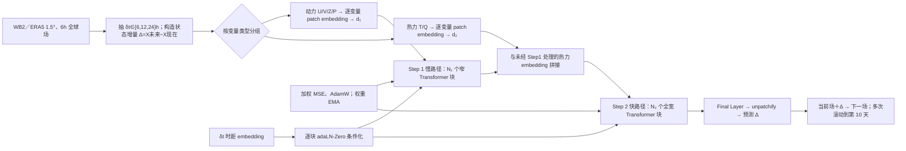

# Sonny：单卡训练的双阶段 Transformer 中期天气预报

> Minjong Cheon，*Sonny: Breaking the Compute Wall in Medium-Range Weather Forecasting*，[arXiv:2603.21284v1](https://arxiv.org/abs/2603.21284)，**2026-03-22** 首发；截至 2026-09-25 arXiv 摘要页只有 v1，未核到正式同行评审期刊版本。本笔记核对[原始 HTML 全文、表 1–3 和图注](https://arxiv.org/html/2603.21284v1)、[作者公开模型结构代码](https://github.com/jmj2316/Sonny)、[关联模型卡](https://huggingface.co/Francismj/sonny)，并查看原始图 2–4 的图像。16 MB 原文 PDF 的直连下载未完成，故不宣称已逐页读完 PDF 版式或图 1/5/6 原图；对这些图只按可读的作者正文与图注记述。此篇与同作者后续的 [Rescene 冻结 Sonny 做气候模拟](https://arxiv.org/abs/2608.09971)不同，**本篇是 Sonny 本体的确定性中期预报实验**。

## 一、研究目标、真正的时效和结论

论文的主要问题是：在单卡训练成本下，能否用较小 Transformer 维持 6 小时步长的**全球第 1–10 天**确定性预报？作者把动力变量先放入较窄、较深的“慢路径”，再与温湿变量合流，在全宽度“快路径”中处理相互作用；模型学习多种时距的**状态增量**，而不是直接回归绝对天气场。训练时对权重做指数移动平均（EMA），原文称不需要后续长滚动微调。原文报告 **20.5M 参数、单张 NVIDIA A40、约 5.5 天、峰值显存约 32 GB**，但这些是作者该数据/实现环境的报告，不应直接与不同分辨率、模式版本、硬件的超大模型表作公平速度倍率比较。[原文 §1–2、表 2–3](https://arxiv.org/html/2603.21284v1)

真正量化主图是 2022 年测试集上的 **Day 1–10 RMSE/ACC**；对 Met Office GM/FastNet 的图只到 **Day 7**，两场气旋/冬季风暴各只看 **+120 小时**。这不是 15 天技巧、集合概率或卫星观测直接起报，更不是长期 S2S 模型。[原文图 2–6](https://arxiv.org/html/2603.21284v1)

## 二、数据与预处理：论文清单和通道数发生冲突

| 环节 | 原文明确给出的事实 | 对复现的限制 |
| --- | --- | --- |
| 数据源/网格 | WeatherBench 2（WB2）的 ERA5 风格全球场，**1.5°、121×240、每 6h 一帧**。 | 文中未说明从 WB2 哪个具体存储版本、下载路径、是否在 121 纬点中保留双极点、经纬重网格/缺测处理和数据版本。 |
| 年份切分 | **1979–2018 训练、2019 验证、2022 测试**，依时间划分。 | **2020–2021 两年在正文切分中缺席**；未说完全排除还是用于别的选择，不能擅自补入训练。也未交代对跨年随机时距窗口的截断方式。 |
| 高空字段 | U、V、T、Q、Z，各在 **1000、925、850、700、600、500、400、300、250、200、150、100、50 hPa** 十三层；按清单是 **65 个高空通道**。Z 在表中写地球重力位势，单位 **m²/s²**，不是已换算的位势高度米。 | 按表列法数通道，不把 Z 单位偷换成 m。论文未给 69/70 通道逐项训练标准化统计量。 |
| 近地面字段 | 正文称“**4 个地面变量**”，表 1 却列 **T2m、MSLP、SP、U10、V10 共 5 个**；65+5＝**70**，不是“65+4＝69”。[原表 1](https://arxiv.org/html/2603.21284v1) | 作者[模型卡](https://huggingface.co/Francismj/sonny)也写 **69**，但并未列出被排除的地面字段。缺训练配置/变量顺序文件，当前无法判明论文训练究竟用了 69 还是 70，也不能猜测把 SP 或 MSLP 删掉。 |
| 时间差分监督 | 每次从 `{6,12,24}h` **离散均匀抽一个预测时距**，标签是 `Δ_δt=X(t+δt)−X(t)`；推理时把预测增量加回当前场。 | 原文未给输入/目标按通道如何归一化、增量是否另按时距标准化、每个时距采样权重是否执行时再调、**10 天滚动实际选择的 6/12/24h 路径**。台风段仅说 6h 输出，并非证明全局主评测只以 6h 自回归。 |

以上是从[原文 §2.1–2.2、表 1](https://arxiv.org/html/2603.21284v1)直接得出的算术核对。由“69 通道”推断具体删掉哪个地表量将影响动态/热力分组、输出头维度和检查点加载，故必须在复现实验前取得作者训练清单；这不是无关紧要的排版小错。

## 三、结构：为何先慢后快，而不把所有变量从头到尾同宽处理

作者将输入变量分为动力组 **U、V、Z、P** 与热力组 **T、Q**：动力组先经过独立的 variable-aware patch embedding，进入宽度 `d₁` 的 `N₁` 个 Transformer 块；热力组另编码为 `d₂`，在中途与处理后的动力特征拼接，再由宽度 `d=d₁+d₂` 的 `N₂` 个块混合。该顺序的作者解释是先抽取大尺度风压结构，再为温湿及相互作用提供动力背景；“慢/快”是网络**处理路径**名称，不意味着两组变量分别以不同物理时间步积分。[原文 §2.5、图 1](https://arxiv.org/html/2603.21284v1)

每个块接受 `{6,12,24}h` 时距的 embedding，借 **adaLN-Zero** 条件化；最后将 token 经 Final Layer/unpatchify 还原网格增量。作者当前[公开 `networks/sonny.py`](https://github.com/jmj2316/Sonny/blob/main/networks/sonny.py)构造函数的**默认值**是 patch `2`、hidden size `384`、总 `12` 层、`6` heads、Step1 宽度比 `0.5`，`depth_step1` 默认 `6`，于是默认剩余 `6` 层在 Step2；`networks/weather_embedding.py` 为每个变量单独做 patch embedding，再用可学习 query/交叉注意力汇聚变量。**这些是当下源码默认参数，不是已找到的论文评分用训练配置**：仓库树只有网络文件和 README，没有训练入口、数据/评测配置、权重引用或针对表 2 的精确实例化命令。[作者网络源码](https://github.com/jmj2316/Sonny/tree/main/networks)

此为依据[论文 §2.2–2.5](https://arxiv.org/html/2603.21284v1)与[作者公开网络源码](https://github.com/jmj2316/Sonny/blob/main/networks/sonny.py)原创重绘的**职责图**，不是转载原图；图中的训练 EMA 不表示在推理时重新训练。源码对变量组的自动分类是按名称中的 `u_component/v_component/geopotential/pressure/mslp`、`temperature/specific_humidity/humidity` 等子串匹配，其他默认进动力组；若真实数据采用缩写名 `U10/T2m`，必须确认当时是否传入了**显式分组列表**，公开仓库没有训练调用点可核。[作者源码 `_classify_variables`](https://github.com/jmj2316/Sonny/blob/main/networks/sonny.py)

## 四、训练流程、超参数及“未微调”的精确含义

训练步骤按正文可重建为：① 按时间切分和 WB2 格网构造样本，随机抽一个 `δt`，取归一化后（具体统计未给）的当前状态及对应增量目标；② 双阶段 Transformer 输出同形状增量；③ 在所有输出通道/格点上使用**变量压力权重 `w(v)` × 纬度权重 `L(i)` 的均方误差**训练；④ 每次训练权重更新期间维护 **EMA 衰减 0.9** 的影子权重；⑤ 用验证年选择权重，对 2022 年起报做自回归到 10 天。论文把较低层气象量给更高压力权重的理由是接近地面/社会影响较大，但 `w(v)` 的**完整逐层常数与地表权重表**及 `L(i)` 的精确实现式不在可读正文中。[原文式 (1)、§2.3–2.4](https://arxiv.org/html/2603.21284v1)

| 参数/阶段 | 论文明确值 | 来源与限制 |
| --- | --- | --- |
| Backbone/参数 | ViT-S 变体、**20.5M** 参数 | [原表 2](https://arxiv.org/html/2603.21284v1)。当前[关联 HF 模型卡](https://huggingface.co/Francismj/sonny)标“69 字段”，页面文件元信息却显示 **23.6M** 参数；无法证明该检查点就是论文表 2 的 20.5M 评分权重。 |
| 优化器与超参 | **AdamW、LR 5×10⁻⁴、β₁=0.9、β₂=0.95、weight decay=10⁻⁵、batch 16、50 epochs** | [原表 2](https://arxiv.org/html/2603.21284v1)。原文没有印刷可核的 LR 调度/warmup、梯度裁剪、随机种子或精确总更新数；不可从其它 StepsNet 论文代填。 |
| 稳定化 | 训练时 **EMA decay 0.9**；正文报告九变量/全部时效汇总 RMSE 平均相对降低约 **3.34%**，第 3 天峰值约 **4.75%**，第 10 天仍约 **2.00%**。 | [原文 §3.1、图 2](https://arxiv.org/html/2603.21284v1)。这些百分数来自作者文字；未给各变量/lead 的原始数表和“平均”的分母/加权，不能据图像再声称精确逐日百分点。 |
| 训练硬件/耗时 | 单张 **NVIDIA A40**，约 **5.5 天**，峰值显存约 **32 GB**。 | [原文 §2.4、表 3](https://arxiv.org/html/2603.21284v1)。表 3 拼接不同资料/硬件/分辨率的他文成本，不是统一复现实验。 |
| 预训练／微调 | 原文称**无额外长期 rollout 微调阶段**；没有报告 HRES 分布微调、台风专项微调或后续冻结层训练。 | `EMA` 是训练期间权重平滑，**不是“微调”**；不能自行给出微调起点、冻结范围或学习率。作者源码也没有可核的训练脚本。 |

源码的默认构造值有助于理解架构，却不能填补评分权重的变量列表/训练日期/学习率日程；模型卡参数数目还与论文不符。若复现者只拿公开 `sonny.py` 与 HF checkpoint，不应宣称自动复刻“单 A40 5.5 天的论文训练”。[作者仓库](https://github.com/jmj2316/Sonny)、[模型卡](https://huggingface.co/Francismj/sonny)

## 五、性能图表：确实赢了什么、没有赢什么

| 图表、评测时效 | 图中/文字所显示的结果 | 必须保留的协议和负例 |
| --- | --- | --- |
| **图 2，2022 全局 Day 1–10，九个代表量的 RMSE** | EMA 曲线在 T2m、U10、V10、MSLP、Z500、T850、Q700、U850、V850 各图总体低于不做 EMA 的模型；作者汇总称平均 **−3.34%**、第 3 天最大 **−4.75%**、第 10 天约 **−2%**。 | 差异并非每个变量/时效都有同等幅度，图没给逐点精确表和不确定性区间；仅对**同一架构是否 EMA**作消融。 |
| **图 3，对 HRES，2022 全局 Day 1–10 ACC** | U10/V10 多时效近似重合，Q700 与 U850/V850 中后期 Sonny 常高于 HRES；Z500 和 MSLP 到长 lead 接近交叉。 | **T2m HRES 全程较高且第 10 天 Sonny 更早跌破 0.5**；Z500 前中期也通常 HRES 稍好。第 10 天两者是否>0.5因变量而异，“接近 HRES”不能写为全面胜出。曲线无原始逐日数字，故不从像素造数。 |
| **图 4，NHET/SHET/热带 Day 1–7 ACC** | 每区展示 Z500、T850、MSLP，比较 Sonny、Met Office GM 与 FastNet O96；热带 Z500 在中后期 Sonny 高于两对照，T850 Sonny 高于 Met Office GM。 | **热带 T850 FastNet 前几天可高于 Sonny，热带 MSLP 后段 Met Office GM 高于 Sonny**；温带多条曲线十分接近，并非显著领先。图 4 把无量纲 ACC 纵轴标签写成 `Z500 (m²/s²)`、`T850 (K)`、`MSLP (Pa)`，这是**变量单位误置在 ACC 轴上**，不应把 0.7 ACC 当作 0.7 Pa/K。 |
| **表 3，模型规模/成本/延迟** | Sonny 行 **20.50M、96.81 GMAC、1×A40/5.5 天、125.48 ms**，并列 Pangu、GraphCast、FengWu、FastNet 等不同条件报告。 | Sonny 原生 **1.5°/121×240**，若干对照原生 0.25°/721×1440 或约 1.4°；硬件/代码、是否包含预处理、batch 与真值不同，不是同预算 Pareto 排名或公平加速倍率。 |

图 2/3/4 的**原始图像**可从[arXiv HTML 图 2](https://arxiv.org/html/2603.21284v1/Sonny_fig2.png)、[图 3](https://arxiv.org/html/2603.21284v1/Sonny_fig3.png)、[图 4](https://arxiv.org/html/2603.21284v1/Sonny_fig4.png)查看；本仓库只重绘结构和转录论文**明印的数字**，不再上传论文原图。论文未报告这些曲线的逐起报样本数、置信区间、起报时次或 HRES 产品/分析真值的精确版本；这是作者“与业务模式竞争”结论的关键比较边界。[原文 §3.1–3.2](https://arxiv.org/html/2603.21284v1)

### 两场 +120h 个例不能代替全年极端评测

**Nanmadol 台风**：作者选 **2022-09-14 00 UTC** 起报、120h 后比较 10m 风和 MSLP，正文报路径误差约 **137.5 km**；最低中心气压“预测 977 hPa、ERA5 979 hPa”，但紧接着写误差“约 **1.4 hPa**”。若只按这两个四舍五入整数相减应是 **2 hPa**，两者需由未取整原始值/追踪算法解释，不能原封不动把 1.4 当直接差值。所谓“媲美 Pangu/GraphCast”的个例参照在文中没有同起报/同初值/同风暴追踪阈值的完整并列数表。[原文 §3.3、图 5 图注](https://arxiv.org/html/2603.21284v1)

**Elliott 冬季风暴**：作者选 **2022-12-19 00 UTC** 起报，+120h 最低中心气压 **976.7 vs ERA5 971.8 hPa**，差 **4.9 hPa**；中心位置写经纬各约 **4.5°**、相当于各方向约三个 1.5° 格点。它展示粗网格能表现一个强烈系统，但不是所有冬季风暴的均值，也未给极端风/降雪的站点评分。台风/冬季风暴仅是两张选择性案例图，不应凭此宣称强度预报已业务可用。[原文 §3.4、图 6 图注](https://arxiv.org/html/2603.21284v1)

## 六、复现和结论边界

最优先的复现问题是**变量清单 69/70 冲突**、HF checkpoint **20.5M/23.6M 冲突**，以及作者仓库**无训练/评测入口与数据标准化配置**。另外，时间切分跳过 2020–21、压力/纬度权重表及滚动时距路径不完整、HRES 具体版本与对比的初始化/真值不清，都妨碍把图 3/4 变成严格同条件结论。以上是基于开放材料的证据审计，**不是断言论文结果必然错误**。[原论文](https://arxiv.org/html/2603.21284v1)、[代码](https://github.com/jmj2316/Sonny)、[模型卡](https://huggingface.co/Francismj/sonny)

作者的可支持结论是：在 1.5° ERA5/WB2 设置下，小模型＋多时距增量目标＋EMA 可以产出可延伸到**第 10 天**的确定性曲线，且单 A40 训练成本确实按论文报告较低。**阅读判断**则是：在 T2m 等变量上 HRES 仍优，热带跨模型优势有变量例外，绝不能将这个设置说成“全面击败 HRES／FastNet”“15 天集合系统”或“已证明真实观测直达起报”。若后续作者放出 69 场明确清单、真实评分检查点、标准化文件、训练/评测脚本和逐日评分数组，本条应按新证据更新并同次同步 GitHub。

[返回仓库首页](../../README.md) · [返回论文追踪表](../../气象大模型_中期预报论文追踪.md)
