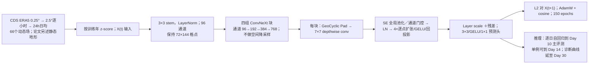

# KARINA：地理循环填充与通道注意力的低成本全球预报

> **同一研究的版本链**：Minjong Cheon、Yo-Hwan Choi、Seon-Yu Kang、Yumi Choi、Jeong-Gil Lee、Daehyun Kang，[《KARINA: An Efficient Deep Learning Model for Global Weather Forecast》arXiv:2403.10555v1](https://arxiv.org/abs/2403.10555)，**2024-03-13** 首发；Minjong Cheon、Jeong-Hwan Kim、Yumi Choi、Yo-Hwan Choi、Seon-Yu Kang、Jeong-Gil Lee、Yoo-Geun Ham、Jin Young Kim、Daehyun Kang，[《Understanding machine learning weather prediction by designing a cost-efficient model with knowledge-oriented modules》](https://doi.org/10.1038/s41598-025-32366-3)，*Scientific Reports* **2025-12-15 在线发表，2026 年卷 16、文章 2413**。正式版增加作者、修改题名并扩展实验；**不是两篇应分别计数的 KARINA 论文**。下文以[期刊正式正文与 12 页 PDF](https://www.nature.com/articles/s41598-025-32366-3.pdf)、[期刊补充材料](https://media.springernature.com/original/springer-static/esm/art%3A10.1038%2Fs41598-025-32366-3/MediaObjects/41598_2025_32366_MOESM1_ESM.docx)为准，对照[2024 预印本](https://arxiv.org/html/2403.10555v1)及[作者公开代码和配置](https://github.com/jmj2316/KARINA)。已直接核对正式版主图 2、4、补图 S8/S9 原图及补表 S1–S5；未把图上线条当未印刷的精确观测值。

## 一、问题、结论与时效边界

作者的核心问题是：能否在低分辨率和较少训练计算量下，构建具有竞争力的全球逐日自回归天气预报，并通过可消融的模块理解误差改善来自哪里？KARINA 把保持原网格的 ConvNeXt 主干、处理经度接缝和极点的 GeoCyclic Padding、按特征通道重加权的 Squeeze-and-Excitation（SE）结合起来。其贡献不在提出全新观测同化或扩散集合，而在**球面边界处理和多变量/垂直层通道耦合**的可测试设计。[正式正文 Results／Methods](https://www.nature.com/articles/s41598-025-32366-3)

需要把几个时效分开：**主全球交叉模型评分是 2018 年第 1–10 天**；补表 S1/S2 的精确 RMSE 只印到**第 7 天**；正式图 4 展示延伸到**第 30 天**的纬度带 ACC 衰减，但不是 30 天全面对照；图 5 的 2018 欧洲寒潮是**第 14 天单案例**，东亚热浪是第 7 天；补图 S8/S9 的 bred-vector 集合分别展示约 20 天全球示意及该寒潮的成员分化，不是全年第 2–4 周 CRPS/可靠性评分。2024 预印本强调 ECMWF S2S 重预报和最长七天，正式版改为 WeatherBench 2 的 Pangu/GraphCast/HRES 对比并报告十天，因此**预印本七天表不能代作正式十天成绩**。[正式图 2、4、5，补图 S8/S9](https://doi.org/10.1038/s41598-025-32366-3)

## 二、ERA5 数据、预处理、切分与比较协议

| 环节 | 正式版可核事实 | 影响结论的边界 |
| --- | --- | --- |
| 数据源与空间处理 | 从 Copernicus CDS 获取 ERA5，原始 0.25° 资料在 CDS API 中先插值为 **2.5°** 每小时场，之后将每天 **24 小时平均**成逐日场；最终经纬格为 **72×144**。 | 论文未列出 CDS 插值方法、逐日窗口采用的时区/起止小时、资料集版本、静态场重网格方式；后续严格复现要固定这些步骤。不能把“低分辨率压制高频噪声”的解释当已单独验证的因果实验。 |
| 预报变量 | **五个高空变量 U/V/T/Q/Z × 十二层** `1000,925,850,800,700,600,500,400,300,200,100,50 hPa`＝60；**六个地表量** T2M、MSLP、SP、TCWV、SKT、TISR；合计 **66 个随时间变化的场**。补表 S3 列出单位；Z 是 `m²/s²`，Q 是 `kg/kg`。 | 论文写 66 动态场另加**静态地形位势**作第 67 输入通道，却在主文 Methods 写 66 场为输入/输出；补表 S4 写 67 个输入和 **67 个输出**。静态地形是否也是输出目标，在正式文本内部仍不一致。 |
| 分年和监督 | **1979–2015 训练、2016–17 验证、2018 测试**；每个样本由当天 `X(t)` 预测下一天 `X(t+1)`，损失为 L2，动态变量按 z-score 归一化。 | 正文未印标准化均值/标准差具体数组、是否仅按训练年计算、地形通道如何标准化；公开配置需用户填 `global_means_path`/`global_stds_path`，不能从论文恢复数值。2018 测试不进入训练。 |
| 全球评分起报 | 2018 年与 S2S 时次对齐的**周一、周四** ERA5 起报；KARINA 每日迭代，真值 ERA5。正式对照的 Pangu/GraphCast/HRES 评分取 WeatherBench 2 **1.5°、6h** 输出，作者把连续四个 6h 技巧分数平均到一个“日”与 KARINA 比。 | **把四个评分值平均不等于先平均四个预报场再评分**；日均真值和瞬时真值/格距/模型初值也不完全统一。正式图 2 中 KARINA 有重插值至 1.5°的红色虚线，但各序列的对齐文件/样本配对清单未公开。不可直接称严格同资料、同时间、同格距的业务排名。 |

作者[补表 S4](https://media.springernature.com/original/springer-static/esm/art%3A10.1038%2Fs41598-025-32366-3/MediaObjects/41598_2025_32366_MOESM1_ESM.docx)和[公开 YAML](https://github.com/jmj2316/KARINA/blob/main/config/KARINA.yaml)均写 `in_channels/out_channels=0..66`，但 YAML **`orography: false`**；训练入口若 `orography: true` 才会在 67 个列举输入之上再加一通道。这与正式主文“66+静态地形＝67 输入”的描述不能同时照默认配置直接运行，亦无对应论文评分的锁定配置和数据清单可判明。对“地形敏感性”不能据此宣称已经独立控制变量验证。[源码输入通道逻辑](https://github.com/jmj2316/KARINA/blob/main/train_KARINA.py)

## 三、模型结构：空间尺寸不降采样，感受野与几何边界分别解决

论文把 ConvNeXt 的“分层”改为**只增通道、不减 72×144 空间尺寸**：3×3、stride 1 的 stem 卷积与 LayerNorm 从约 67 通道映到 96；三次 3×3 通道扩展使宽度顺次变为 **96→192→384→768**。每个 ConvNeXt 块先用 7×7 depthwise convolution 提取每个通道的空间结构，再接 SE 全局池化/瓶颈 FC/ReLU/sigmoid 做通道门控、LayerNorm、逐点线性层 4 倍扩张／GELU／回投影，并经 layer scale 与残差/可选 drop path 保持稳定。最终 3×3 卷积＋GELU＋1×1 卷积还原输出通道。[正式 Methods；作者结构实现](https://github.com/jmj2316/KARINA/blob/main/networks/karina.py)

GeoCyclic Padding 对经度左右边做循环拼接，让 0°/360° 接缝可跨界卷积；对极区边缘取邻行并按 **180° 经度移位**重排，近似极点穿越后的相邻地理关系，而不是南北两端简单补零。它只改变卷积的边界取样，**不是球面守恒方程或显式平流算子**。SE 的门控是在隐藏通道而非直接给每个气压变量一个可解释的固定物理权重；从“热带中层增益较大”可推断关联，却不能证明网络已学到完整对流机理。[正式图 1、图 3–4；补图 S1/S5–S7](https://doi.org/10.1038/s41598-025-32366-3)

这是依正式正文与[代码](https://github.com/jmj2316/KARINA)重绘的**职责流程图**，非论文原图。结构深度存在一个需保留的文本冲突：正式图 1 图注称四组块为 **`[3,3,3,9]`**，正式 Methods 和作者 `karina.py` 默认值则是 **`[3,3,9,3]`**；两者参数和计算分布不同。公开网络默认 `drop_path_rate=0`，每块 `layer_scale_init_value=1e−6`；不能证明论文主图评分所用检查点一定使用所有这些默认项。[正式图 1 图注与 Methods；代码 `ConvNeXt` 默认参数](https://github.com/jmj2316/KARINA/blob/main/networks/karina.py)

## 四、训练流程、超参、微调及集合的真实操作

正式版明确的一阶段训练是：① 生成上述 ERA5 日样本并分年；② z-score 归一化后输入当前日，直接拟合下一日**绝对状态**（公开 YAML 的 `target: default`），而非逐步增量；③ 对输出场做 L2 损失，使用 **AdamW、初始 LR 0.001、CosineAnnealingLR、150 epochs**；④ 用验证年检查，再把同一单步模型递归调用。作者报告 **4 张 NVIDIA A100、不到 12 小时**，补表 S4 写**每卡显存 33 GB**。公开 YAML 还给 `batch_size=16`、`num_data_workers=4`、`n_history=0`、`lag=0`；训练脚本在分布式训练时将 `batch_size` 整除 GPU 数，若按该配置跑四卡即每卡 4，但公开 YAML 不等于正式评分的运行日志。优化器 `β`、weight decay、梯度裁剪、热身步数、随机种子与精确迭代次数未在正式文表中完整披露。[正式 Methods Training；补表 S4–S5；公开配置](https://github.com/jmj2316/KARINA/blob/main/config/KARINA.yaml)

**正式版没有报告额外预训练、长滚动微调、目标域微调、冻结层计划或微调后的独立 checkpoint。**2024 [arXiv v1 §3.7](https://arxiv.org/html/2403.10555v1)曾写三段 time-lag 数据细化：lag 0/12，继而 0/6/12/18，最后 0–23 h；LR 印为 **0.005→0.0025→0.0001**，且首段 0.005 高于正文 0.001 却称“较低 LR”。正式文没有延续这段流程，公开默认 YAML 仅 `lag=0`；因此不能把旧稿 time-lag 方案无证据地写成正式版主图结果的微调路线。若要确认正式权重有无这种步骤，需作者日志/checkpoint 元数据及运行脚本。这里的区分直接影响“第十天提升来自架构还是数据扩增”的因果解释。[预印本 §3.6–3.7；正式 Methods](https://arxiv.org/html/2403.10555v1)

**集合不是重训一个生成模型**：正式补图 S8 的文字称在每次起报初始态的 **Z500 随机加扰**，再用 KARINA 做 bred-vector breeding，得到全变量动态扰动；以原控制成员和 11/51 成员的集合均值对比。图 S8 的 TCWV、T2M、Z500、Q700 全球 RMSE 曲线到约第 20 天，11 与 51 成员的均值均显著低于单成员，而 51 对 11 的增益较小；图无印刷逐日精确值/CRPS/可靠性图，不能从像素造分。扰动振幅、breeding 周期/重标定范数、成员关联性、是否交换符号和每个成员成本均未在补文给足。图 S9 则在 2018-02-06 欧洲寒潮起报的 51 成员中，**依据未来 2 月 26–28 日欧洲 T2M 事后选择**十个“最冷”和十个“最暖”成员，并追踪北大西洋 Z500 波列差异；这是过程诊断，非在起报时就知道哪些成员将正确。[正式补图 S8/S9 与文字](https://media.springernature.com/original/springer-static/esm/art%3A10.1038%2Fs41598-025-32366-3/MediaObjects/41598_2025_32366_MOESM1_ESM.docx)

## 五、原文性能表与主图：同时看优势和负例

### 补表 S1：正式版本逐日数值，不与 2024 预印本表混用

下表只列 S1 的三种代表 lead；单位 Z500 为 `m²/s²`、T2M 为 K，均是 2018 全球纬度加权 RMSE 对 ERA5。表 S1 原列 Day 1–7，**没有 Day 10 精确值**。IFS ENSmean 是外部集合均值基线，不是 KARINA 集合。[正式补表 S1](https://media.springernature.com/original/springer-static/esm/art%3A10.1038%2Fs41598-025-32366-3/MediaObjects/41598_2025_32366_MOESM1_ESM.docx)

| 变量/模式 | Day 1 | Day 3 | Day 5 | Day 7 |
| --- | ---: | ---: | ---: | ---: |
| Z500 · GraphCast | 27.84 | 103.43 | 240.12 | 428.67 |
| Z500 · Pangu-Weather | 30.22 | 111.03 | 258.05 | 460.94 |
| Z500 · IFS HRES | 32.17 | 107.40 | 257.76 | 467.55 |
| Z500 · IFS ENSmean | 32.70 | 105.90 | 240.25 | **404.10** |
| Z500 · KARINA | 52.79 | 154.48 | 303.64 | 463.66 |
| T2M · GraphCast | 0.445 | 0.758 | 1.164 | 1.698 |
| T2M · Pangu-Weather | 0.535 | 0.888 | 1.331 | 1.887 |
| T2M · IFS HRES | 0.808 | 1.040 | 1.400 | 1.913 |
| T2M · IFS ENSmean | 0.857 | 1.013 | 1.300 | 1.660 |
| T2M · KARINA | 0.483 | 0.779 | **1.157** | **1.551** |

表的正反面都重要：KARINA 的 T2M 前 3 天不及 GraphCast，到 Day 5–7 转好；Z500 到 Day 7 才略好于 HRES，却仍不及 GraphCast 和 **IFS ENSmean**。若只报“第 7 天胜 HRES”，会漏掉早期与最强基线的明显差距。补表 S1 另有 1995–2015 同日历日的 climatology 基线，但气候态不应和实际天气预报的同起报分数直接解释为业务竞争。[正式补表 S1](https://media.springernature.com/original/springer-static/esm/art%3A10.1038%2Fs41598-025-32366-3/MediaObjects/41598_2025_32366_MOESM1_ESM.docx)

### 图 2 的十天信息：RMSE 与 ACC 给出不同评价

[正式图 2](https://www.nature.com/articles/s41598-025-32366-3/figures/2) 第一排显示多个变量的 RMSE 到第 10 天，正文称第 10 天 KARINA 相对 GraphCast 的 RMSE 优势约 **7.7%–17.9%**；T2M、U850、V850、Q700 更常有利于 KARINA，而 T850、MSLP、Z500 在 Day 7 前更常利于 GraphCast。第二排画相对 HRES 的“normalized RMSE”，采用差值/基线的相对刻度，不可把负数轴当原单位 RMSE。**第三排 ACC 中，GraphCast 的多数曲线仍高于 KARINA，后者的 T2M/低层温度 ACC 往往更快衰减**；因此按 RMSE 的第十天收益不能被转述成“所有技巧指标全面获胜”。图 2 原图的横轴只有逐日刻度，没有逐点数字表；不人为从图片读取精确第十天 RMSE。图注把 7 个变量错误列为“8 列”且重复 T850，并把“下采样至 1.5°”写在由 2.5°向更细 1.5°重网格的红虚线上；这些措辞问题不应改变对实际原图的判断。[正式正文、图 2、补表 S1](https://doi.org/10.1038/s41598-025-32366-3)

### 补表 S2：架构消融并非所有指标都同方向

同一 2018 协议下、Z500/T2M 的 day 3 与 day 7 RMSE（越低越好）：[正式补表 S2](https://media.springernature.com/original/springer-static/esm/art%3A10.1038%2Fs41598-025-32366-3/MediaObjects/41598_2025_32366_MOESM1_ESM.docx)

| 结构 | Z500 D3 | Z500 D7 | T2M D3 | T2M D7 |
| --- | ---: | ---: | ---: | ---: |
| 完整 KARINA | **154.48** | **463.66** | **0.779** | **1.551** |
| 去掉 GeoCyclic Padding | 219.56 | 553.93 | 0.945 | 1.937 |
| 去掉 SENet | 174.92 | 491.51 | 0.796 | 1.592 |
| 两者都去掉 | 252.17 | 581.89 | 0.928 | 1.816 |
| 完整模型但 stem 5×5 | 161.67 | 471.77 | 0.826 | 1.682 |
| 完整模型但 stem 7×7 | 157.26 | 463.95 | 0.826 | 1.640 |

GeoCyclic 的去除损失远大于去 SE，尤其 Z500；但**T2M D1 去 SE 的 0.480 还略优于完整 0.483**，而“两者都去掉”的 T2M D7 1.816 优于“只去 Padding”的 1.937，说明模块作用并非各时效简单相加。表无多次随机种子误差条，微小差不能自动判显著。5×5/7×7 消融是**stem 核大小**，不能写成 backbone 7×7 depthwise conv 已被替换。2024 预印本表 1 的结构顺序是 plain→padding→padding+SE；正式 S2 是围绕完整模型删除模块，读者不能把名称一一混同。[正式补表 S2；预印本表 1](https://arxiv.org/html/2403.10555v1)

### 图 3–5 与补图 S1–S9 的物理解释：证据等级要分开

| 图表 | 原图支持的具体观察 | 不应扩大成的结论 |
| --- | --- | --- |
| 正式图 3，2018 年 Day 5 T2M/Z500 ACC 空间分布 | 去 Padding 与完整模型差异集中在经度接缝和极区、随纬向西风输送向内传播；去 SE 与完整模型的 Z500 差异在赤道附近明显，T2M 较弱。 | 这是预测误差和模块消融，尚未直接测量动量/水汽输送通量，不能证明模型严格满足物理守恒。 |
| 正式图 4，纬度×lead 至 Day 30 | 纬度带 ACC>0.5 在中高纬约一周、热带更久；Padding 的早期高纬收益和后期热带扩散、SE 的热带 Z500/MSLP/U850/Q700 作用均有颜色证据，南半球若干变量收益很小。 | 第 20–30 天热带 ACC 保留不等于全球 3–4 周逐日起报技巧超过 ECMWF S2S；图未给同期基线 CRPS/ACC 全表。图注称红线是 95% Student t 区间，但原图看起来更像单条边界线，未据此估计显著性。 |
| 正式图 5，寒潮与热浪 | 2018-02-12 起报的欧洲 **Day 14** 寒潮图可见完整模型重建 NAO 背景与区域低温；去 Padding 产生 0°边界畸变，去 SE 冷异常较弱。2018-07-26 起报的东亚 **Day 7** 热浪重现部分暖区/高压波列，去模块后空间/持续性恶化。 | 只选两场极端。图 5 的欧洲寒潮不是所有第 14 天起报的统计分数，也未给站点逐点热浪阈值评分。 |
| 补图 S2/S3 | S2 展示 66 场到 Day 10 的 ACC；S3 的 TCWV 画出从 2018-01-01 **单次起报 Day 1、90、180** 的空间场，没有明显数值爆炸。 | 数值长期稳定和维持统计纹理，不等于 Day 90/180 的可验证逐日天气技巧。 |
| 补图 S4–S7 | S4 的 Day 1/3/5 显示边界收益向内扩散；S5 的“与仅经度循环填充”对照分离出极点作用；S6 的 Q/Z 在 **700–500 hPa** 热带误差改善明显；S7 用印度洋 **85–95°E、5°S–5°N** 的湿度—MSLP 回归作柱状过程诊断。 | 回归与消融只支持“与这些过程有关”，不是独立动力/对流方程检验。 |
| 补图 S8/S9 | 11/51 成员 bred-vector 集合均值对单成员 RMSE 下降，四量改善曲线至约 Day 20；寒潮成员分组随北大西洋波列发展分离。 | S8 无 IFS-ENS 配对、CRPS/SSR/可靠性或原始逐日表；S9 最冷/最暖组依**未来实况时段**事后挑选，不能冒称实时预测“选对成员”。 |

## 六、版本、代码与复现风险清单

1. **版本去重**：2024 arXiv v1 的 6 位作者、七天 S2S 重预报和 time-lag 细化，与 2025 在线/2026 卷期的 9 位作者、十天 WeatherBench 2 曲线、bred-vector 补图是同一 KARINA 研究的不同阶段。除非明确标“预印本旧结果”，本条以正式版为主；不能把旧稿表 7 的其他模型瞬时值直接拼入正式版日均表。[两版原文](https://arxiv.org/abs/2403.10555)
2. **输入/输出的 66/67 通道和地形字段**：正式正文前段称 66 动态＋1 静态地形作 67 输入，Methods/S3 又称 66 为输入输出；S4 和公开 YAML 写 67 输出，默认 `orography: false`。需要作者明确变量顺序及评分配置，否则训练标签、网络最后一层和评价是否含地形都不能可靠复现。[正式 Methods/S4；公开 YAML](https://github.com/jmj2316/KARINA/blob/main/config/KARINA.yaml)
3. **四阶段深度顺序不一**：正式图 1 图注 `[3,3,3,9]` 与 Methods/源码 `[3,3,9,3]` 不同；公开源码最终选择哪个在评分权重中不能仅靠图注推断。[正式图 1；源码](https://github.com/jmj2316/KARINA/blob/main/networks/karina.py)
4. **训练/微调未闭环**：正式版只披露 150 epoch 单步训练；旧稿的 lag 0–23 分阶段微调未在正式版被确认；公开 YAML 也没有现成数据路径、均值方差或权重文件。代码发布并不等于“一条命令可复刻图 2”。[正式代码可用性声明／作者仓库](https://github.com/jmj2316/KARINA)
5. **评分对齐并非完全等效**：KARINA 对每日平均状态，WeatherBench 2 对照把四个瞬时技巧分数平均；尽管期刊称这有助于可比，分数平均与场平均后算分数不交换，2.5°与 1.5°差异也未完全消除。图 2 的第十天 RMSE 较优不等同同变量 ACC 最优，补表 S1 的第七天 Z500 亦不及 IFS ENSmean。[正式评估节、图 2、补表 S1](https://doi.org/10.1038/s41598-025-32366-3)
6. **集合和长滚动不是已验证业务 S2S**：bred-vector 参数与集合评分欠缺，S3 半年场只说明滚动不爆炸，图 5 Day14 寒潮是单例。不能把这三者合称“全年 S2S 集合性能超过 ECMWF”。[正式图 4–5、补图 S3/S8/S9](https://media.springernature.com/original/springer-static/esm/art%3A10.1038%2Fs41598-025-32366-3/MediaObjects/41598_2025_32366_MOESM1_ESM.docx)

## 七、我的阅读判断与后续验证路径

KARINA 值得归在**中期预报**：正式版有真实 2018 年全球**第 1–10 天**比较，且第 14 天寒潮与集合补图触及中期后缘。它说明低分辨率逐日 CNN 在 RMSE 上可能有延迟衰减优势，特别是 T2M、低层风和湿度；GeoCyclic Padding 的位置收益有清楚的消融证据。但它还不能被视为已经提供第 10–15 天全变量公平领先、或可靠的 S2S 概率预报：Z500 前段不及多个基线、ACC 往往落后、日均/瞬时协议不完全等价、集合只有补图而非完整概率评分。

若做复现，优先向作者取得① 66 动态＋地形的**明确通道顺序、输入/输出目标**；② 2018 图 2 锁定的 YAML/代码提交/检查点和逐年 z-score 文件；③ 预印本 time-lag 训练是否进入正式版权重；④ 经纬格插值、逐日 UTC 窗口与 WB2 四个六小时评分平均的起报配对；⑤ bred-vector 幅值、breeding 周期、成员种子及原始评分数组。取得这些之前，不能用当前默认代码补造训练细节，也不应对不同协议第十天曲线进行过度排名。

[返回仓库首页](../../README.md) · [返回论文追踪表](../../气象大模型_中期预报论文追踪.md)
