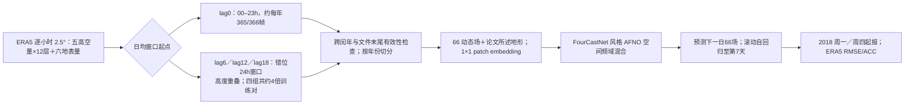

# ERA5 时间滑动日均增强：低分辨率 AFNO 的七天全球预报

> Minjong Cheon、Daehyun Kang、Yo-Hwan Choi、Seon-Yu Kang，[《Advancing Data-driven Weather Forecasting: Time-Sliding Data Augmentation of ERA5》](https://arxiv.org/abs/2402.08185)，**2024-02-13 arXiv:2402.08185v1**。截至 2026-09-25，arXiv 摘要页只有 v1 且无期刊版本号；本笔记按[作者开放全文](https://arxiv.org/html/2402.08185v1)的三幅图、表 1–3、两段数据处理伪代码和正文数字核对。作者后来的 [KARINA（#143）](143-karina-geocyclic-convnext.md)引用本工作，但它是基于 ConvNeXt/球面填充的另一篇研究，**不能把这里的 FourCastNet/AFNO 结果冒充 KARINA 消融或训练阶段**。本篇只验证至 **Day 7**，按中期前段归档；没有第 10–15 天或 S2S 集合技巧。

## 一、研究问题和可检验的主结论

一份每日一帧的 ERA5 资料从 1979 到 2015 年只有约一万三千个相邻日预测对，低分辨率天气模型是否能通过**改变日平均窗口起点**增加训练样本，并改善未来 1–7 天的自回归技巧？作者固定 2.5° ERA5 与 AFNO/FourCastNet 一类网络，把 00–23 UTC 的传统日均（`lag0`）扩为四套以 6 小时为间隔的错位 24 小时日均（`lag0/lag6/lag12/lag18`，合称 `lag4x`）。这不是增加四倍的独立天气日：同一天的四个窗口共享多数逐小时观测，且预测目标也被相应平移。[原文 §2–3](https://arxiv.org/html/2402.08185v1)

图 1/2 显示：在论文的 2018 起报条件下，`lag4x` 相比 `lag0` 的 Day 1 **T2M RMSE 0.488 vs 0.588 K，ACC 0.924 vs 0.886**；Z500 **RMSE 48.23 vs 61.16 m²/s²，ACC 0.989 vs 0.979**。图线至 Day 7 仍维持 `lag4x` 较优，但作者没有为每个 lead 印精确数字或样本/随机种子误差条。主要支持结论是“该数据增强配置在这个实验中有效”，而非已识别究竟是新增信息、更多优化更新、不同训练样本相关性还是平均窗口平滑度造成收益。[原文 §4.1，图 1–2](https://arxiv.org/html/2402.08185v1)

## 二、数据、样本构造和跨年处理

| 项目 | 论文提供的操作 | 尚缺或应谨慎解释之处 |
| --- | --- | --- |
| 来源与格点 | 全球 ERA5；在 **2.5°、72×144** 网格，每个时刻有 **66 个动态气象场**，把逐小时资料形成 24h 日均。 | 未给 ERA5 下载产品/版本、0.25°→2.5° 重网格函数、每日 UTC 边界之前/之后缺测处理、日均针对累计 TISR 是否先还原为率。 |
| 高空 60 场 | U、V、T、Q、Z 各有 12 个气压层：`1000,925,850,800,700,600,500,400,300,200,100,50 hPa`。 | 训练变量顺序、标准化常数与 Z 是否统一用位势高度未列；表 1 给 Z 的单位是 `m²/s²`，不能偷换成米。 |
| 地表 6 场 | T2M、MSL、SP、TCWV、SKT、TISR；正文称输入另有 orography，输出是下一日的 66 个场。 | 理论上是**66 动态输入＋静态地形**，但没有写明地形数值、归一化、通道拼接时序和源码配置，不宜断言它在所有消融/图中均启用。 |
| 数据分年 | **1979–2015 训练、2016–17 验证、2018 测试**；测试从与 ECMWF 周一/周四时次相同的日期起报。 | 主图未印每年有效起报数、训练/验证跨年配对策略、四窗口是否以同日历日标签同步评估。 |
| 越界修复 | 作者伪代码 1 按年份识别平/闰年，赋予 365/366 个日样本；伪代码 2 对没有下一日标签的文件尾进行跳过，避免错误“恒等映射”的训练例。 | 伪代码 2 对最后一份 `.nc` 显式抛 `IndexError`，而其它年界如何拼接下一日未完全明示。代码仓库未在论文内提供，无法静态审计真实执行路径。 |

具体的时间滑动应理解为对第 `h` 个小时起算的**连续 24 小时窗口**取均值：`lag0` 用 00–23，另有相隔 6、12、18 小时的三个窗口，同一原始小时往往进入多个训练样本。原文举 `lag6` 时写“前一日 06–23 + 次日 00–05”；这个语句的“前一日/次日”相对哪一个标签日不够清楚，至少说明窗口横跨午夜。它并不等于随机平移某一帧，也不等于以未来 6/12/18h 直接替代一日预报 lead；正式复现需要作者给出**窗口—标签配对的索引代码**。四组窗口只在训练年生成，跨 2015/2016、2017/2018 边界是否会共享小时也需要核验，不能从伪代码自动认定无泄漏。[原文 §3.3–3.4](https://arxiv.org/html/2402.08185v1)

## 三、AFNO/FourCastNet 结构和训练流程：哪些参数其实没披露

作者沿用 FourCastNet 的 Adaptive Fourier Neural Operator（AFNO）路线：把每个全球场切为 patch，映射成 token，在特征的空间频域执行可学习混合，再重构同网格下一日多变量场。本工作把原 FourCastNet 的 20 字段扩为上述 66 字段、增加静态地形的叙述，并将**patch 大小降到 1×1**，适应 2.5° 粗网格。论文没有给 AFNO 块数、token 宽度、频带保留比例、hidden size、参数量或训练脚本；因此这里只能重建模型职责，不能臆造精确层表。[原文 §2.2、§3.1–3.2](https://arxiv.org/html/2402.08185v1)

图为从[原文 §2–4](https://arxiv.org/html/2402.08185v1)原创重绘的流程，不是原图；AFNO 的频域混合只是架构类别，**论文并没有把本实验具体网络所有内部参数印出来**。作者也没说明 `lag4x` 是从 `lag0` 模型继续训练，还是两模型分别从头训练；用词为分别训练 `lag0` 与 `lag4x`，故不能当成一条已核实的“预训练→微调”链。**没有可核实的学习率、优化器、batch、epoch、LR 调度、硬件/显存、损失逐变量权重、早停标准或随机种子**。原文没有后续专用微调、冻结层或概率集合阶段的明示参数；不能从原 FourCastNet 配方或后来的 KARINA YAML 代填。[原文 §3.4、§4.1](https://arxiv.org/html/2402.08185v1)

特别要警惕训练预算：`lag4x` 有约四倍高度重叠的训练样本。如果两个模型都跑同样 epoch，`lag4x` 的参数更新次数可能约四倍；如果强制相同更新次数，则每个 epoch 的定义与采样又不同。论文没有给这个配平实验，所以图 1/2 是**实际训练方案整体消融**，不是已控制优化计算量的纯“资料多样性”因果消融。

## 四、图 1–3 和表 2–3：数值与错误解读边界

### 同架构 lag0 对 lag4x（真正可比的核心实验）

| 2018 测试／同一变量 | lag0 Day 1 | lag4x Day 1 | 第 1–7 天图上趋势 |
| --- | ---: | ---: | --- |
| T2M RMSE，K | 0.588 | **0.488** | 图 1 的 lag4x 红线每个 lead 都低于 lag0 蓝线；第七天图只显示约 1.6 对 1.7 的量级，未印精确对值。 |
| T2M ACC | 0.886 | **0.924** | 图 2 红线始终高于蓝线；Day 7 的 ACC 仍非接近 1。 |
| Z500 RMSE，m²/s² | 61.16 | **48.23** | 图 1 曲线全程红线较低，随自回归 lead 绝对误差持续增长。 |
| Z500 ACC | 0.979 | **0.989** | 图 2 红线较高；两线都随 lead 下降，不能说时间滑动消除了误差累积。 |

数字取自[原文 §4.1](https://arxiv.org/html/2402.08185v1)，曲线形状已按[图 1 原图](https://arxiv.org/html/2402.08185v1/Figure_1.png)、[图 2 原图](https://arxiv.org/html/2402.08185v1/Figure_2.png)核对。T2M Day1 RMSE 相对降约 `(0.588−0.488)/0.588 ≈ 17.0%`，Z500 约 `21.1%`，是本笔记用作者四舍五入数字**推算**，不是论文另印的均值。ACC 的 0.038/0.010 差值是**百分点式绝对差**，不能当 RMSE 百分比。无误差条/多种子分布，尤其高 ACC 近 1 的小差异需要配对显著性检验。

### 与其它模型比较：表 2、3 转录但不作同协议胜负

作者从 ClimaX 相关研究引用/转录 FourCastNet、Pangu、GraphCast 的旧评分，而本模型对**日均场**、其它模型对**某小时瞬时场**，原文 §4.2 承认这一点；格距分别约 5.625°、0.25°、2.5°，训练变量/初值也不统一。因此如下表是**论文的报告数字**，不是 WeatherBench2 统一重跑的公平排序。[原文表 2、表 3](https://arxiv.org/html/2402.08185v1)

| 变量、RMSE | Day 1：GraphCast / Pangu / 本文 lag4x | Day 3 | Day 5 | Day 7 |
| --- | --- | --- | --- | --- |
| T2M，K | 0.62 / 0.72 / **0.48** | 0.94 / 1.05 / **0.79** | 1.36 / 1.53 / **1.18** | 1.88 / 2.06 / **1.58** |
| Z500，m²/s² | **38.77** / 42.23 / 48.23 | **125.78** / 133.12 / 151.46 | **271.65** / 295.63 / 300.41 | 466.53 / 504.90 / **465.39** |

第 7 天 Z500 的 465.39 与 GraphCast 466.53 仅差 **1.14 m²/s²**，不仅协议不同，原文也未给不确定性区间；不能宣传为可靠领先。原表还列 ClimaX 与 FourCastNet：T2M Day7 **2.18/2.54 K**，Z500 Day7 **599.43/680 m²/s²**，但这并不证明粗网格方法本身比高分辨率更好。论文的“低分辨率也竞争”需要同一日均/同初值/同年份且等算力的重跑才能严格成立。

### 年代训练集对照（图 3）

作者再用 `lag4x` 各训练一个**十年样本**：较早的 1980–1989 与较近的 2006–2015，在同一个 2018 测试年比较。这是控制时间长度的大致对照，却不控制 ERA5 同化质量年代变化、外部变暖趋势与十年天气型/极端样本构成。图 3 的蓝色新年代曲线对 T2M/Z500 全 lead 较低；正文印数如下。[原文 §4.3、图 3](https://arxiv.org/html/2402.08185v1)

| 变量/训练十年 | Day 1 | Day 3 | Day 5 | Day 7 |
| --- | ---: | ---: | ---: | ---: |
| Z500 · 1980–1989 | 80.92 | 224.61 | 369.28 | 474.75 |
| Z500 · 2006–2015 | **60.67** | **178.15** | **326.03** | **443.33** |
| T2M · 1980–1989 | 0.72 | 1.15 | 原文未印精确值 | 2.31 |
| T2M · 2006–2015 | **0.64** | **1.05** | 原文未印精确值 | **1.90** |

虽然“较近十年优于较早十年”，作者还明确指出**整个 1979–2015 长训练期模型优于只用最近十年模型**；不能据此得出“应丢弃旧年样本”的建议。图 3 也不是对未来气候变化情景的外推实验：2018 仍在历史再分析范围内，只有单个测试年，未测试分布外长期变暖或不同年代的真正未来样本。[原文 §4.3–5](https://arxiv.org/html/2402.08185v1)

## 五、为什么本文与 KARINA 有联系但必须分篇

本篇以 AFNO/FourCastNet、1×1 patch 和**错位 24h 平均的数据增强**研究训练样本；[KARINA #143](143-karina-geocyclic-convnext.md)则以 ConvNeXt、GeoCyclic Padding、SE 模块分析空间边界和通道作用，2025/2026 正式版主评分到十天。两者同一作者脉络、66 动态场/2.5°/ERA5 年份切分相近，但**网络、时间增强是否进入评分权重、对照对象和评测时效不同**。KARINA 2024 预印本曾提 lag0–23h 细化，正式版未确认；不能把本篇的四窗口 lag4x 训练当作 KARINA 正式版微调参数。[两篇原文](https://arxiv.org/html/2402.08185v1)、[KARINA 正式论文](https://doi.org/10.1038/s41598-025-32366-3)

## 六、复现重点与阅读判断

在现有公开材料下，最需要补足的是：① 每个跨午夜窗口与未来**下一日标签的精确索引**，以及 2015/2016/2017/2018 年界小时有无交叠；② ERA5 的空间插值、TISR 累计量转换、地形通道和 66 通道顺序/标准化；③ AFNO 具体深度、宽度、频带/patch 参数、损失、AdamW 或其它优化器、学习率、batch、epoch、GPU 和四倍样本对应的**总更新数**；④ 两十年实验的同构/同计算预算与多随机种子区间；⑤ 与 GraphCast/Pangu 等在同日均场、同年份、同格距/初值上的重新评测。论文没有专用代码归档链接或完整运行配置，不把相关 FourCastNet 开源仓库冒充本实验复现包。

因此可以引用的结论是：在作者这组 2018 起报、2.5°/日均/AFNO 的**前七天**试验中，lag4x 配置比 lag0 的 T2M/Z500 RMSE 更低、ACC 更高，且全历史训练通常优于只取最近十年。不能据此认定“训练样本独立四倍”“已通过更多观测证明 S2S/气候可预报性”或“第七天严格击败所有 0.25° 全球模式”。

[返回仓库首页](../../README.md) · [返回论文追踪表](../../气象大模型_中期预报论文追踪.md)
