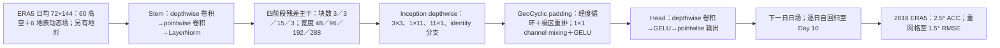

# KAI-α：约 700 万参数 InceptionNeXt 全球逐日预报，低训练成本与中期技巧的证据边界

> Minjong Cheon、Eunhan Goo、Su-Hyeon Shin、Muhammad Ahmed、Hyungjun Kim，[*Modernizing CNN-based Weather Forecast Model towards Higher Computational Efficiency*](https://arxiv.org/abs/2507.10893)，**2025-07-15 arXiv:2507.10893v1**。本文按[作者 arXiv v1 全文](https://arxiv.org/html/2507.10893v1)的表 1–4、图 1–9 和补图 10–19 逐项核对，检索截至 2026-09-25 未核实正式期刊版或作者公开的本模型训练代码。预印本 HTML 首页还印有“August 24, 2026”，与 arXiv 的 v1 上传时间不符；书目日期以 arXiv 元数据为准，不能把稿内日期当成另一个已发表版本。本篇与同组的[时间滑动 AFNO（#144）](144-era5-time-sliding-afno.md)、[KARINA（#143）](143-karina-geocyclic-convnext.md)和[Sonny（#142）](142-sonny-compute-efficient-forecasting.md)是**不同模型与论文**，不合并其训练曲线或结论。

## 一、问题、贡献与阅读结论

研究的问题不是创造新观测—预报链，也不是基础模型预训练，而是在 2.5° 日均 ERA5 上，能否用现代 CNN 组件，以约 700 万参数和一张 NVIDIA L40S 的约 12 小时训练，做出有竞争力的全球 **1–10 天**预报。其设计路线是：用可分离卷积 stem 与阶段化残差块替代较老的 CNN 基线；把大核分为 InceptionNeXt 的方向性分支；在经纬网格上施加经度循环、极区重排的 GeoCyclic padding；最终保留空间尺度，而不走 U-Net 式下采样—上采样。[摘要与 §2](https://arxiv.org/html/2507.10893v1)

这是一篇值得收录的**中期预报轻量模型与消融研究**，不过“十天全面优于 Pangu/GraphCast/HRES”的摘要式读法不被主图完整支持。[图 4 原图](https://arxiv.org/html/2507.10893v1/KAI_sota_comparisons.png)中，KAI-α 的 **T2M RMSE 在第 1–10 天均高于三组对照**；Z500 约第 5 天后、T850 约第 7 天后才相对对照更强，Q700 和 U850/V850 的中后期优势较清楚。因此能说的是“低成本方案在若干中期变量和时效有竞争力”，而不能说“全变量、全时效领先”。图 7 的欧洲热浪 T2M 案例到第 9 天 KAI-α 也是四模型中**最差**；个例的 U300/Z500 好成绩不应掩盖它。[§3、图 4、7](https://arxiv.org/html/2507.10893v1)

## 二、资料、变量、预处理与验证切分

| 环节 | 原文可核实的设置 | 不应自行补足的细节 |
| --- | --- | --- |
| 原始资料 | ECMWF ERA5 的逐小时再分析被聚合成**逐日均值**；全球 **2.5°、72×144** 网格。 | 未说明 0.25° 原场到 2.5° 的重网格核、逐日 UTC 窗口、缺测/闰年/跨年样本的处理、TISR 累积量如何转为日均；不能拿 #144 的 time-sliding 算法代填。 |
| 动态高空场 | U/V/T/Q/Z 五种变量，均在 `1000,925,850,800,700,600,500,400,300,200,100,50 hPa` 十二层；共 **5×12=60** 场。Z 的表列单位 `m²/s²`，是位势而非“位势高度米”。 | 没有给出各层过滤或极区裁剪规则。 |
| 动态地表场 | T2M、MSL、SP、TCWV、SKT、TISR 六场；60+6=**66 个动态场**。 | 没有公开每字段均值/方差、统计只用训练年与否、累计辐射的缩放细节。 |
| 静态资料 | 另纳入 orography，正文称 **67 个输入通道**，单帧张量 `72×144×67`。 | 地形的来源、插值、标准化和是否每步重新拼接未列。表 3 同时写 **67 输出通道**，与“66 动态＋1 静态”的物理目标产生歧义：模型是否也预测地形、是否在推理时覆盖地形，均未解释。 |
| 分年 | **1979–2015 训练、2016–2017 验证、2018 测试**。 | 未给每年有效起报数、抽样频率、2018 年具体时次、多个随机种子或独立年外推。 |
| 标准化 | 表 3 为 **Z-score**。 | 未写按变量/气压层还是统一统计，均值方差文件和地形的处理缺失。 |

每日 24 小时平均既可能平滑高频噪声，也改变了检验目标；原文的对照产品来自 WeatherBench 2 或业务 HRES，而其原生起报频率、日均转换与 ERA5 对齐办法没有逐字段、逐 lead 披露。虽然 §3.2 声称统一把 KAI-α 2.5° 预报双线性插到 **1.5°** 进行 RMSE 评估，但**同一空间网格不自动等于同一时间平均与初值协议**；图 4 的优劣不应被理解为严格控制所有条件的因果架构比较。[§2.1、§3.2](https://arxiv.org/html/2507.10893v1)

## 三、模型结构：从 67 通道日场到下一日场

此图依据[原图 1](https://arxiv.org/html/2507.10893v1/KAI_arch.png)和 §2 原创重绘，仅画**职责与已披露的块数/宽度**，不伪装为可执行源码：原图只以 `Stem → InceptionNext Block → Depth Scaling → Head` 概括主干，未印每层 tensor shape、残差次序和 stage 接口。四路 Inception depthwise 是按**通道拆分**后并行处理再拼接：方形 3×3 负责局地、1×11 和 11×1 分别拉长经/纬向感受野、identity 保留未卷积分支。后续 1×1 卷积做通道混合；残差连接帮助深层训练。GeoCyclic padding 不等于严格球面等距卷积，只是修补平面经纬展开图上的日期变更线与极区接缝。[§2.2–2.3](https://arxiv.org/html/2507.10893v1)

“**scale-invariant**”在该文指最终架构不采用 U-Net 式空间压缩再上采样，并非对不同分辨率天然等变。§2.3.1 的路线描述又称前两阶段后通过 **downsampling** 扩展通道，而 §2.3.3 称最终保留整个原网格。最保守的解读是作者混写了**阶段化消融/标准 InceptionNeXt 模板与最后的保尺度版本**；没有代码与逐层尺寸表，就不能确定 48→96→192→288 各转换究竟是空间下采样还是仅通道变化。最终 **156.72 GFLOPs**（图 3）也证明保网格有明显计算代价，不能简单把“7M 参数”当作推理 FLOPs 同样最小。[§2.3、图 1/3](https://arxiv.org/html/2507.10893v1)

## 四、训练流程、参数、损失与微调

1. 把训练年份的 ERA5 逐小时资料聚合成 2.5° 每日场；把动态 66 场与静态地形拼作论文所称 67 通道，按未公开的统计量进行 Z-score。2016–2017 年只作验证、2018 年留作独立测试。论文没有写是否采用 #144 的四个错位窗口，**不能假定继承**。[§2.1、表 3](https://arxiv.org/html/2507.10893v1)
2. 以日步长 `dt=1 day` 训练 CNN；公开配置是 **AdamW、初始 LR 0.001、CosineAnnealingLR、至多 150 epoch、混合精度、单张 NVIDIA L40S，约 12 小时**，参数量表列约 **7M**。没有 batch size、AdamW β/weight decay、余弦周期和最小 LR、梯度累计、随机种子、早停判据、实际跑满的 epoch、checkpoint 或完整训练脚本，因而 12 小时不能凭文复现。表 2 将它换算为约 **2.4 V100-equivalent GPU-days**，该表混合了不同硬件/分辨率/数据集，是粗成本背景，不是统一测量的能效基准。[§2.4、表 2–4](https://arxiv.org/html/2507.10893v1)
3. §2.4 文字把训练损失称为纬度加权 **RMSE**：先设 `A(φᵢ)=N_lat cosφᵢ / Σ_l cosφ_l`，再对时间、经纬加权平方差求均值并开方；低纬网格面积较大，获得较大权重。然而**表 3 写 Loss = L2**，没有阐明这表示同一平方损失、未开方 RMSE，还是表格标签误写；也没有说明多变量的单位归一化和变量权重在损失中如何组合。不能把公式直接转成唯一可复现的训练目标。[§2.4、表 3](https://arxiv.org/html/2507.10893v1)
4. 原文明确说 **“no additional fine-tuning was performed”**。因此不存在已核实的冻结层、训练后 domain adaptation、先单步再多步的微调课程，也没有扩散/集合阶段。十天评分靠逐日递推；文章没有讲训练时是否加入多步 rollout loss、teacher forcing 或推理时如何维持静态地形。不要把同组 KARINA 的旧版 time-lag 微调叙述挪到这里。[§2.4](https://arxiv.org/html/2507.10893v1)

## 五、原表/原图逐项核对：架构消融并非一条无歧义的直线

下表依[图 3 原图](https://arxiv.org/html/2507.10893v1/Figure_KAI_comparisons.jpg)中的**印刷数值**转录，均为 Z500 **Day 7 ACC**；不是本笔记从曲线估出的数字。

| 图 3 行标签 | Z500 Day 7 ACC | GFLOPs | 能得到的结论与矛盾 |
| --- | ---: | ---: | --- |
| Weyn et al. (2020) baseline | **0.452** | 2.41 | §3.1.1 正文写 **0.425**；原图与正文不一致，不能静默选其中一个算增益。 |
| “Patchify” Stem | 0.500 | 2.26 | 比图中基线 GFLOPs 更低，而正文误称 `2.26` 比 `2.41` “marginally higher”。 |
| Block Structure | 0.552 | 25.16 | 文中把此跳升归于 InceptionNeXt，但图中下一行才写 InceptionNeXt，命名不同。 |
| Channel Mixing | 0.576 | 29.59 | 1×1 通道混合可能改善 ACC，但计算也增加。 |
| InceptionNeXt | 0.644 | 10.80 | FLOPs 反而由上一行 29.59 **下降**；横行不能被误读成其他条件全固定、逐个模块累加。 |
| GELU（micro） | 0.664 | 10.80 | 原文以 0.644 作此实验基线；GELU 改善 0.020。 |
| GeoCyclic Padding（meta） | 0.646 | 10.80 | 此行又以 **0.644** 为基线，而非接上一行的 0.664；说明至少 micro/meta 是独立分支或图示未交代实验配对。 |
| Scale-Invariant Model（meta） | 0.692 | 156.72 | 相对图中的 0.646 +0.046，但 FLOPs 约 **14.5 倍**于 10.80；非免费增强。 |
| KAI-α＋GELU（最终） | **0.721** | **156.72** | 从 0.692 到 0.721 +0.029；按图中最终配置可称这一消融点的 Z500 Day7 ACC，但不推定其它变量同幅改善。 |

[图 2 原图](https://arxiv.org/html/2507.10893v1/KAI_spatial_maps.png)主要是 T2M/Z500 在第 1/3/5/7 天的空间 ACC 增益地图，显示地区差异，不等于每格均改善；论文没有为各经纬带印置信区间。[图 6 原图](https://arxiv.org/html/2507.10893v1/kai_ablation.png)的真实图例是 **MLP、ConvMLP、PointwiseConv**，而正文图注写“MLP、Conv1D、ConvMLP”；七变量 1–7 天三线多数很接近，MLP 通常略差，无法由该图读出精确参数量/时延收益。正文称 ACC，图注又称 pattern correlation，相关系数中心化定义见下一节。[§3.1/3.3](https://arxiv.org/html/2507.10893v1)

## 六、全球十天 RMSE/ACC：图上能说与不能说的事

[图 4 原图](https://arxiv.org/html/2507.10893v1/KAI_sota_comparisons.png)在 **2018 ERA5、1.5° 共同评价格网**上给 T2M、Z500、T850、Q700、U850、V850、MSL 七个 RMSE 曲线；红色 KAI-α、蓝色 Pangu、紫色 GraphCast、黑色 HRES，灰虚线是 climatology。正文/图注却写红线“across nearly all variables and lead times”或“consistently lower”。本笔记直接检查原图，得到更严格的变量级读数：

| 变量 | 早期 lead | 第 7–10 天 | 读图时的边界 |
| --- | --- | --- | --- |
| T2M | **KAI-α 最高 RMSE**，紫色 GraphCast 最低 | KAI-α 仍高于其余三组；Day 10 也高于灰色气候态虚线 | **与作者“几乎全项优势”文字直接冲突**，不应引用为 T2M 最佳。 |
| Z500 | 前数日 KAI-α 较差，约第 5 天附近接近其它曲线 | 中后期红线低于三组对照 | 可说长 lead 改善；不能抹掉早期代价。 |
| T850 | 早期不是最优 | 大约第 7 天后红线低于三组对照 | 交点和具体差值只在曲线中显示，未印数值表。 |
| Q700 | 红线较低或相当 | 红线明显最低；其余三条和气候态接近 | 纵轴是 **kg/kg**，不能把图上的 `0.001` 类数值当作 g/kg。 |
| U850、V850 | 早期差异较小，KAI-α 不总最佳 | 红线明显低于三组对照 | 高空风中期相对优势是本图最清楚的一组结果。 |
| MSL | 前 1–5 天红线偏高 | 约第 6 天后低于三组对照 | MSL 单位按图显示，但没有逐日印刷数字。 |

为了不制造“精确数据”，上表不从像素曲线反算 RMSE。论文也没有误差条、配对 bootstrap、不同 2018 起报月份的分层成绩；能称其为**图示比较**，不能称通过统计显著性检验。尤其模型训练真值是 2.5° 日均 ERA5，而评估对照产品时间聚合/初始化的细节未公开，重网格到 1.5°并不解决全部可比性问题。[§3.2](https://arxiv.org/html/2507.10893v1)

[图 5 原图](https://arxiv.org/html/2507.10893v1/kai_acc_graphs.png)是 KAI-α **单模型**在原生 2.5° 的七变量 ACC，不能从它推断“ACC 超过 GraphCast/Pangu/HRES”；T2M、MSL、T850、U850/V850、Q700 约到第 8 天仍在 0.5 附近，Z500 到第 9 天仍略高于 0.5，第 10 天全部降到 0.5 以下。图中标的 0.5 仅是作者画的经验线，不是业务统一可预报性边界。更根本的是其式 (3) 从每个**预报场/真值场减空间平均**来算相关，而通常气候异常 ACC 要减适当的**逐日期气候态**；若没有额外气候态处理，这更接近加权空间 pattern correlation。正文没交代公式与代码是否一致，因此不宜把这个 0.721 与别家的“气候异常 ACC”直接同口径排名。[§3.2、式 (3)](https://arxiv.org/html/2507.10893v1)

## 七、2018 两类天气个例与补图：正反证据并列

**欧洲热浪（图 7）。** [原图](https://arxiv.org/html/2507.10893v1/kai_heat_final.png)左上是 9 日滑动 T2M/Z500/U300 异常，右上是 2018-07-31 的 T2M 异常空间图，底部为四模型 3/5/7/9 天的 T2M、U300、Z500 图形相关。KAI-α 的 U300 在第 7/9 天、Z500 在第 7 天相对突出，但 **T2M 的 Pangu 曲线四个 lead 都更高；KAI-α 第 9 天最低**。这支持它在这场事件的环流型有一定技巧，不支持“热浪地面气温预测全优”。原文以九日移动异常与单例评分讲机理，但没有反事实试验或热浪全集、阈值命中率。[§3.4](https://arxiv.org/html/2507.10893v1)

**东亚梅雨锋/台风 Prapiroon（图 8–9）。** [图 8 原图](https://arxiv.org/html/2507.10893v1/Figure8_kai.png)的 PW 相关只评 **2018-06-28 一次天气形势、120°E–180°、0–60°N**：KAI-α Day3 约 **0.980**，与 HRES 最高；Day7 约 **0.961**，低于 GraphCast 约 **0.965**；Day9 约 **0.940**，也低于 GraphCast 约 **0.946**。这些是**按图刻度约读**，不是论文另给的精确表值。作者正文也承认 Day7 以后 GraphCast 最高。 [图 9 原图](https://arxiv.org/html/2507.10893v1/Figure9_kai.png)把 PW 底色、Z500 等高线、V850 矢量并排：Day3 HRES 对台风气压结构较准确，KAI-α 等容易高估强度；Day7 作者认为 KAI-α 的台风位置/强度更好；Day9 GraphCast 在北部 Z500/副高更好，KAI-α 对该气旋外形较好。个例图并非 IBTrACS 的路径/强度定量评测，也不能推成台风总体预报性能。[§3.5](https://arxiv.org/html/2507.10893v1)

**补图 10–19。** 补材料逐日展示一次 **2018-01-01 00 UTC** 初始化到 Day1–10 的七变量真值、预报与 bias 空间面板，是滚动场的定性诊断；其图目录只列到 **Day10**，补材料导语却写“1–14 days”，因此**没有可核实的 Day11–14 图或评分**。不能据导语把本模型标为 14 天。表 4 把 KAI-α 的约 7M 参数与 GraphCast 36.7M、Pangu-Weather 256M、Aurora 1.3B 等并列，说明体量小，但其中模型任务、格距和训练方案不同，不能单靠参数数目判断预测质量/能耗。[补材料 §5](https://arxiv.org/html/2507.10893v1)

## 八、复现清单、局限与下一步值得做的验证

| 需要复现者追问 | 为什么重要 |
| --- | --- |
| 67 输入与 67 输出中的静态地形，是作为目标预测、附加固定通道，还是表格笔误？ | 决定每日自回归时输入物理意义，也关系静态场 drift。 |
| 实际网络逐层张量尺寸、stage 的空间下采样行为、block 残差/归一化/分支通道比例、7M 计数脚本。 | 解决“四阶段 downsampling”与“最终全程保尺度”的矛盾，复现 156.72 GFLOPs。 |
| 每字段 Z-score 参数、ERA5 2.5° 聚合代码、日均窗口、测试初始化日期和对照产品时间聚合。 | 决定图 4 是否真正同起报/同真值、杜绝因日均平滑引入不公平对照。 |
| 损失到底是纬度加权 RMSE、纬度加权 MSE 还是表 3 的 L2；各变量权重。 | 不同量纲的变量若没标准化/加权会主导优化。 |
| Batch、β、weight decay、余弦周期/最低 LR、实际 epoch、种子、checkpoint、小时测量方法。 | 单 L40S 12h 是有价值的资源信息，但尚不足以独立复现。 |
| 至少多个测试年、多随机种子、同配置 2.5° CNN/ViT 对照、业务初始化评测及置信区间。 | 2018 一年和两个案例不足以支持可迁移的“全面更优”结论。 |
| 按图 3 修正基线 0.452/正文 0.425、各步 GFLOPs 非单调及图 4/7 反例。 | 读者若只抄摘要，会误判性能排序和成本—技巧权衡。 |

**本文明确没有**观测到预报的端到端流程、卫星输入、资料同化、后续微调、随机生成/集合成员、CRPS/可靠性评分或第 11–15 天/次季节验证。最合理的后续实验，是把 KAI-α 与[同组 KARINA](143-karina-geocyclic-convnext.md)放在完全相同的 ERA5 日均/变量/起报协议下，给出 66/67 通道清单和同算力消融；再做经度/极区接缝与 T2M 的误差分层，而不是仅凭图 4 的几个中后期优势下总体结论。

## 原始资料

- [arXiv 书目与版本日期](https://arxiv.org/abs/2507.10893)；[v1 完整 HTML（方法、表 1–4、图注和补材料）](https://arxiv.org/html/2507.10893v1)。
- [图 1 网络结构](https://arxiv.org/html/2507.10893v1/KAI_arch.png)；[图 3 原始消融柱图](https://arxiv.org/html/2507.10893v1/Figure_KAI_comparisons.jpg)；[图 4 七变量全球 RMSE](https://arxiv.org/html/2507.10893v1/KAI_sota_comparisons.png)；[图 5 单模型 ACC](https://arxiv.org/html/2507.10893v1/kai_acc_graphs.png)；[图 6 通道混合消融](https://arxiv.org/html/2507.10893v1/kai_ablation.png)。
- [图 7 欧洲热浪案例](https://arxiv.org/html/2507.10893v1/kai_heat_final.png)；[图 8 东亚 PW 相关](https://arxiv.org/html/2507.10893v1/Figure8_kai.png)；[图 9 东亚空间场](https://arxiv.org/html/2507.10893v1/Figure9_kai.png)。这些是作者原图链接，**没有将原图文件复制进仓库**；本笔记中 Mermaid 为独立重绘，表格为注明来源的数值/读图整理。
