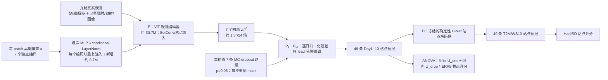

# Aardvark E2E 集合：把观测编码与预报动力的不确定性分开估计

> Rodrigo Almeida、Noelia Otero、Jost Arndt、Simon Baur、Wojciech Samek、Jackie Ma，[*Uncertainty-Aware End-to-End AI Weather Forecasting: Disentangling Observation and Model Contributions*](https://arxiv.org/abs/2608.30795)，**2026-08-31 arXiv:2608.30795v1**（17 页、主图 1–5、补图 S1–S2、补表 S1；截至 2026-09-25 未核实正式期刊版本）。本笔记对照[原文 HTML 全文](https://arxiv.org/html/2608.30795v1)、[v1 PDF](https://arxiv.org/pdf/2608.30795v1)、[作者代码项目](https://gitlab.hhi.fraunhofer.de/ai-aml/uqe2e)与[作者发布的微调权重/评测缓存说明](https://huggingface.co/datasets/rodrigoalmeida1994/uqe2e)。源于[2025 年 *Nature* Aardvark Weather](https://www.nature.com/articles/s41586-025-08897-0)，但这是**另一篇有新增概率微调、嵌套集合和不确定性归因实验的论文**，不与[原 Aardvark 精读](09-aardvark-weather.md)合并，也不把原论文的确定性站点微调结果当作本文基线。

## 一、研究问题与最重要的结论边界

原始 Aardvark 把卫星辐射、站点、船舶和探空等原始观测编码为全球格点初态，然后逐日预报、解码成站点温度/风速；它在推理时不用传统资料同化分析场作输入，但本来只给一条确定性预报。本文问三个可检验的问题：**能否从已有的确定性权重较低成本地训练出概率集合？能否把集合离散度分成观测编码器与动力处理器两份？分解是否会在删除某一观测流时给出相应的响应？** 作者在编码器接入输入依赖的高斯噪声、在预报处理器启用并微调 MC dropout，按 7 个初态噪声 × 每初态 7 条动力路径形成 **49 成员**。[引言、图 2、Methods](https://arxiv.org/html/2608.30795v1)

结果有正反两面：2018 年 ERA5 **1.5° 全球格点、1–10 天**，集合平均相对确定性 Aardvark 的六变量×十提前量 RMSE 平均改善 **4.2%**，fair CRPS 相对单条确定性预报的 absolute-error proper score 改善 **24–38%**，全变量/lead 平均 SSR **0.98**；但与同口径 IFS ENS 比较仍**每个 lead 的 CRPS 更差**，第 1 天平均差约 **80%**，第 10 天差约 **18–36%**。HadISD 站点 T2M/WS10 的集合 CRPS 虽改善，**站点 SSR 全程显著低于 1**。因此“格点总体接近校准”不能概括为“观测到站点的整条链都校准”。[Results、图 3–4](https://arxiv.org/html/2608.30795v1)

本文与[GraphDOP](47-graphdop.md)、[AIFS-DOP](42-aifs-dop.md)同属观测直接到预报路线，但主要贡献是**现有观测直达模型的概率化与归因**，不是新建业务同化系统。按实际主评测至 **Day 10** 放在 `medium-range/`；没有第 11–15 天或 S2S 技巧。与只在已训练权重上推理期加噪的[SPW（#60）](60-spw-deterministic-ensembles.md)不同，这篇确实用 fair CRPS **重新微调**编码器和处理器。[Methods](https://arxiv.org/html/2608.30795v1)

## 二、资料来源、时间切分和处理链

| 用途 | 数据/量级与明确操作 | 复现边界 |
| --- | --- | --- |
| 观测输入 | 沿用公开 Aardvark 预处理归档的 **九路**：HadISD 地表站 **23 GB**、ICOADS 船海观测 **11 GB**、IGRA 探空 **4 GB**、AMSU-A **69 GB**、AMSU-B **64 GB**、HIRS **139 GB**、IASI **296 GB**、ASCAT **91 GB**、GridSat 静止卫星 **37 GB**；总约 **0.73 TB**。 | 这些是作者列的预处理归档规模，不是本笔记重新下载计量；逐产品的 QC、缺测掩码/平台误差、扫描时刻与发布延迟依赖上游 Aardvark 数据管线。 |
| 分析场/监督 | ERA5 约 **156 GB**，在 **1.5° 全球格网**给编码器和处理器的 **24 个地表/气压层目标变量**，兼作格点评测真值。原 Aardvark 的 24 场为五高空量×4 层＋T2M/U10/V10/MSLP；本文沿用该配置。 | “观测到预报”是**部署输入**属性；训练仍依赖 ERA5 再分析作监督，不能称完全不使用 NWP 派生资料。字段级均值/标准差、辐射 QC 与 1°→1.5°处理参数应看上游归档/代码，本文正文未重新完整给出。 |
| 站点真值 | HadISD **T2M** 和 **10 m 风速 WS10**；基于原 Aardvark 的站点子集。 | WS10 是风速标量，不能与格点头条中的 U10/V10 分量混作同一目标或损失。站点测量/代表性误差不会被 ERA5 格点验证自动覆盖。 |
| 年份 | **2007–2017 训练、2019 验证及选择 checkpoint、2018 完全留出测试**；全球/站点测试只用 **00 UTC valid time**。 | 2019 验证晚于 2018 测试虽不常见，却是论文明确切分。测试有 **337 个起报**，不是将 365 个日子视作 365 个完整十天样本。 |
| 输入预处理继承 | 上游 Aardvark 在起报前窗口收集多源遥感/站船/探空，遥感作格点化、缺测处理，离散报告通过 density-aware SetConv 形成可编码嵌入；本文观察剥夺试验把某一路**格点编码嵌入置零**，相当于编码接口“该流缺席”。 | 本文没有逐项重述上游 IASI PCA、卫星最近邻重网格、观测时间窗/归一化数组的所有细节；可另见[原 Aardvark 正式论文 Methods](https://www.nature.com/articles/s41586-025-08897-0)和[本库原模型精读](09-aardvark-weather.md)，不要把上游处理创新记在此篇名下。 |

一条起报的实际资料路径是**真实观测→编码器得到 ERA5 24 场格式的初态→十个逐日处理器接力→冻结站点解码器**。评测中的 ERA5 是训练/检验目标，不是推理时提供给编码器的初值；IFS ENS 只作同期参照，不能把 IFS 成员暗中接到 Aardvark 输入。[原文 §Methods: Data and training、Experimental setup](https://arxiv.org/html/2608.30795v1)

## 三、结构：两种随机源各放在哪里，为什么要嵌套

这是依据[原图 2 和 Methods](https://arxiv.org/html/2608.30795v1)原创重绘的**信息流**，没有转载作者原图；箭头中的 7×7 是**推理/评测**的完整笛卡尔组合，而训练时每阶段按自己的七成员目标微调。上游确定性编码器和处理器为 ViT，站点解码器为 U-Net；本文 Methods 给 **E 30.7M、P 每步 54.0M、D 每变量/lead 21.1M**。但[原 Aardvark *Nature* Methods](https://www.nature.com/articles/s41586-025-08897-0)明确写每个解码器约 **2M**，与本篇 **21.1M** 相冲突；两个来源口径或本篇笔误未解释，不能把任一数字当成已确认的当前 checkpoint 精确参数量。[本文 Methods §End-to-end weather forecast](https://arxiv.org/html/2608.30795v1)

### 编码器：不均匀观测信息如何变成可学习的初态扰动

确定性初态是 `μθ(x)`。概率编码器在每个 patch 抽 `a∼N(0,I)`，让网络从**当前观测 x** 学得振幅 `σθ(x)`，形成 `z₀=μθ(x)+σθ(x)⊙a` 的概念表达：观测少或质量差的输入可以给更大的条件离散度。作者试了两种注入方式：一次性在输入 token 上加噪，新增 **0.3M** 参数；或把同一次高斯抽样通过小 MLP 映射到条件 LayerNorm，在**每个 encoder block**重复调制，零初始化投影以保持初始等同原权重，新增 **8.7M** 参数。主结果用后者。注意 `σ` 的“观测噪声”含义不是有仪器误差标签直接监督，而是对 ERA5 分析的 fair CRPS 学出来的；可能同时吸收初值模型偏差。[Methods §Encoder、补注 1](https://arxiv.org/html/2608.30795v1)

### 处理器：不是部署时才临时打开 dropout

动力处理器的 MC dropout 率 **p=0.05**，作者先在 ERA5 初值上的旧处理器比较 `p={0.05,0.1,0.2}`，以 spread–skill 选取 0.05。随后**打开 dropout 微调 P**，输入是已经带随机噪声的编码器分析，目标为每一日的概率预报；最终每个成员、每个逐日递推步骤都重新抽 dropout mask。这样得到的是在新初值分布下已适应的动力参数，不能写成“冻结 Aardvark，只在推理端加 dropout”。它更像逐步随机模型扰动，而非每个成员固定一个贝叶斯权重样本，作者也将此列为解释 epistemic 比例时的限制。站点 D 全程保持**确定性、冻结**，没有新的站点随机分支。[Methods §Dropout、Discussion](https://arxiv.org/html/2608.30795v1)

### 组内/组间方差：从设计归因到可证伪实验

对一个标量格点/站点值 `y`，先对每个编码噪声 `aᵢ` 运行 7 条 dropout 路径，求组内平均 `ȳᵢ`，再对 7 个组求总体平均。全方差定理在**先固定编码噪声、再对 dropout 求条件方差**的顺序下写作

`U_tot = Var_a(E_ω[y|x,a]) + E_a(Var_ω[y|x,a]) = U_enc + U_drop`。

前项看不同分析场的**组均值**差异；后项看同一初态内动力路径的差异。作者不只是拿 7 个组均值直接算方差，因为有限 N 的 dropout 噪声会污染“观测份额”；其 ANOVA 估计用 `MS_W` 为组内均方、`MS_B` 为组间均方，取 `Û_drop=MS_W`、`Û_enc=max(0,(MS_B−MS_W)/N)`，其中 **N=7**。`max(0,·)` 避免负方差，但长 lead、小编码器份额时这个截断偶尔会启动。由于模型非线性，**编码器×处理器交互被这个条件顺序放进 U_drop**，所以 `U_enc≈aleatoric`、`U_drop≈epistemic` 只是组件对齐的近似归因，不是对大气真实两类不确定性的唯一分解。[Methods 式 (2)–(4)](https://arxiv.org/html/2608.30795v1)

## 四、从既有权重到概率模型：完整已公开训练/微调流程

| 顺序 | 起点、可训练部分与监督 | 参数、训练量及未知项 |
| --- | --- | --- |
| 0：已有确定性底座 | 作者直接加载公开的 Aardvark 观测编码器、逐日处理器、站点解码器权重；它们此前已按上游论文在 ERA5/观测上训练。**本文不重新从零预训练整套系统。** | 上游分阶段预训练详见[原模型](09-aardvark-weather.md)；不能把本篇 65 A100h 当成 Aardvark 全套从零训练成本。 |
| 1：编码器概率微调 | 加每 patch 高斯噪声 MLP/条件 LayerNorm；把 E 连同噪声振幅**在原权重上微调**，对 **00 UTC ERA5 分析**做 7 成员 finite-ensemble-corrected fair CRPS。D 与 P 不参与此阶段监督。 | AdamW、LR **3×10⁻⁵**、weight decay **10⁻⁵**、余弦学习率、**20 epoch**、batch **4/GPU**、7 个编码成员/更新；约 **4.7h，4×A100 80GB**。未给每层冻结细表/Adam β、余弦周期下限及精确训练样本数；写“微调 E”而不是“只训练噪声头”。 |
| 2：处理器逐 lead 概率微调 | 用第 1 阶段随机 E 的分析场作初值，P 开启 **p=0.05** dropout；每更新 7 条 dropout 成员、fair CRPS 目标，并用 gradient checkpointing。第 **1 天**从确定性 P 权重出发，第 `k>1` 天从前一 lead 已微调权重初始化，目标是当前 lead 的输出；处理器学习**归一化的下一日差值**，加回当前状态进行递推。 | AdamW、LR **1×10⁻⁴→1×10⁻⁶**、weight decay **10⁻⁵**；Day1 **20 epoch**，Day2–10 **每段 12 epoch**；十段合计约 **11.5h，4×A100 80GB**。论文未给处理器 batch、每段有效更新数、变量损失权重/Adam β，不能捏造；不应把十段误作“只训练一个十天网络”。 |
| 3：站点推理 | 用前两段权重产生 49 条格点轨迹，套用**冻结**的上游 D 得站点 T2M/WS10。 | 此篇**没有站点解码器微调**或新站点损失；更早 Aardvark 论文的第 1 天端到端站点微调不是本文所用十天确定性对照。 |

论文报告本次概率微调共约 **65 A100 GPU-hour**（4 GPU 数据并行下约 **16.2 小时墙钟**），称为相对从零预训练系统约 **65%** 成本；“较低成本”指**已有底座后的增量**，不是无需再训练。论文没有单独测算 49 成员 10 天全链对业务 ENS 的统一硬件吞吐/能耗，不能把 65 GPU-hour 当推理成本。[Methods §Data and training](https://arxiv.org/html/2608.30795v1)

[作者权重说明](https://huggingface.co/datasets/rodrigoalmeida1994/uqe2e)进一步列出主结果的 `norm` 编码器运行 **selected epoch 10**，与它配套的处理器十个 lead 分别选 `9,1,0,0,0,1,1,0,0,0`；表中是保存/选择的 checkpoint 标号，不代表论文没有运行前述 20/12 epoch。资料集还列了 embedding-injection 消融的配套运行、normalization factors、静态地形等辅助数组、每起报缓存和观察剥夺结果；总文件约 **16.2 GB**，本次只核对了公开说明，**没有下载全部权重/缓存重跑分数**。GitLab 公开项目首页可见，仓库的具体训练脚本/固定提交尚未逐文件审计，不能从“代码可用”推断各项运行可即刻复现。

## 五、评测协议和统计显著性：四条曲线不在同一真值空间

**格点评测**：2018 年 **337 起报**、00 UTC 有效时次；ERA5 **1.5°** 作真值，六个 headline 场为 T2M/T850/U10/V10/Z500/MSLP。总计 Day1–10 的 **60 个变量×lead**。全球图 3 的确定性对照是上游公开的**模块化 E→P→D 配置**，不是曾在第 1 天做全链站点微调的版本；概率基线为同 ERA5 真值、同 00 UTC 的 IFS ENS。纬度加权 RMSE 衡量集合均值，finite-ensemble-corrected **fair CRPS**衡量概率技巧，SSR 用成员离散度除以集合均值 RMSE 并乘 `√((K+1)/K)` 有限样本修正，**K=49**。确定性单成员的 CRPS 等于绝对误差，因此该比较是适当的 proper-score 比较，但只意味着“新概率模型比旧确定性模型的概率误差好”，不自动意味着超越 IFS。[Methods §Experimental setup](https://arxiv.org/html/2608.30795v1)

**站点评测**：2018 HadISD 原 Aardvark 站集合，目标 T2M 与 **WS10**；这不是 ERA5 网格真值，也不包括高空 Z500 或风分量 U10/V10。只从格点同一权重经冻结 D 映射到站点，对同一 49 成员算 RMSE、fair CRPS、SSR。由于真实站点代表性误差和固定 D 的降尺度误差，格点 SSR≈1 与站点 SSR<1 可以同时成立。不能把原 Aardvark 正式论文的**第 1 天、站点目标联合微调**成绩作为这里的日 1–10 对照：作者明确表示那套权重只发布单 lead，且无法复现原文站点评分。[Methods 第 160 行附近、图 4](https://arxiv.org/html/2608.30795v1)

**置信区间**：先把每次起报的空间网格（纬度加权）或站点聚为一个分数，再对 **n=337** 起报序列做自相关长度 `ℓ=max(n^(1/3), 3(1+r₁)/(1−r₁))` 的循环移动块 bootstrap（**5000 次**）；非线性 RMSE/SSR/相对变化每次重算。两模型配对比较共用块索引，显著性再用有 Bartlett HAC 方差与小样本修正的 Diebold–Mariano 检验，论文图以填充/空心标记 5% 水平。因而 CI 是起报平均评分的不确定性，**不是**单次天气预报误差区间或空间格点独立样本 CI。[Methods §Experimental setup](https://arxiv.org/html/2608.30795v1)

## 六、图 1–5 与补图 S1–S2：原文明确数字、正反结果

下表只转录[原文结果段、主图图注和补注](https://arxiv.org/html/2608.30795v1)明确印出的数字；没有从曲线像素制造每一天、每字段的精确表值。

| 对应图/验证空间 | 作者明示的数字 | 正确读法与反例 |
| --- | --- | --- |
| 图 3a：格点集合均值对确定性 Aardvark | 六变量×十天 **平均 RMSE −4.2%**，95% CI **[−4.9%,−3.4%]**；Day1 平均 **−6.1%**，Day10 **−8.1%**；60 组合中 **50** 组合显著改善，余 **10** 组合变化绝对值 <1.5%、不显著。 | “50/60”是显著性不是 50 个独立模型；均值改善的机制作者解释为噪声诱导的 loss attenuation，但本文没有纯噪声、纯 dropout 的完全同预算因果剥离。 |
| 图 3b：格点 fair CRPS 对确定性单成员 | 每变量/lead **−24% 至 −38%**，作者称均显著。 | 确定性成员 CRPS=绝对误差；这不是与 IFS ENS 的优势幅度。 |
| 图 3c：格点 fair CRPS 对 IFS ENS | E2E 集合在所有 lead **落后**；变量均值 Day1 约 **+80%**，Day10 仍 **+18%–36%**，Z500/MSLP 最弱。 | 同真值 00 UTC 下业务集合仍是强基线；不能只报“新集合校准”而不报绝对技巧差距。 |
| 图 3d：ERA5 格点 SSR | 六变量 Day1 **1.21**、约 Day5 最低 **0.92**、Day10 **0.97**、Day1–10 全均 **0.98**；T2M 全期平均 **1.05**、Z500 **0.91**、MSLP **0.93**；初态（lead 0）**0.78**，Z500 初态 **0.64**。 | 总体 0.98 掩盖变量级欠离散；SSR 接近 1 只是二阶 spread/skill 匹配，不保证尾部概率可靠或多变量/空间联合校准。 |
| 图 4：HadISD 站点 | RMSE 相对模块化 Aardvark 在各 lead **±2.4% 内**，T2M Day9–10 **改善 4.2–5.2%**；T2M fair CRPS **改善 24–28%**、WS10 **11–19%**。 | 图 4c 站点 T2M/WS10 的 SSR **都低于 1**；温度偏冷、风速偏强的 rank-histogram 非对称有原文叙述，说明没有可靠的站点概率校准。 |
| 图 5：方差归因 | `U_enc/U_tot` 六变量均值 Day1 **0.14**→Day10 **0.04**；相应 dropout 份额 **0.86→0.96**；从 Day1 到 Day10 总方差约增 **7 倍**。 | dropout 占大头不证明“真实大气观测误差只占 4%”；编码噪声偏弱、解码器不随机、交互归入 dropout 都会影响比例。 |
| 图 5b–c：观测剥夺 | 对 **24 次起报**，去 IASI 在 Day1–3 使 `U_enc` 增 **96–111%**，Day10 剩 **+5%**；`U_drop` 响应幅度不超过 **8%**；去 IGRA 任一分量变化 **≤1%**。 | 这是当前已训练模型的定向响应，验证分支设计有选择性；IGRA 小响应不等于探空对所有天气系统无价值，也不能推断换仪器网络后不需重训。 |
| 补图 S1：两噪声注入版本 | 条件 LayerNorm 比单次 embedding 注入在 Day1–4 变量均值 CRPS **低 4–5%**，Day10 接近持平；初态 T2M RMSE **1.02 vs 1.06 K**，CRPS **0.54 vs 0.56 K**，而噪声前者 spread **0.82 vs 0.93 K**。 | 更多原始 spread 不必然更好；对照是**两套各自微调的 E+P 链**，非只改一个输入层的固定权重消融。 |
| 补图 S2：四地区站点 | CONUS、欧洲、西非、太平洋×T2M/WS10×11 leads 共 **88** 组合，论文说概率 CRPS 改善全部显著；西非约 **60 站**、太平洋约 **30 站**。 | 稀疏区 CI 更宽；这里是对确定性 proper-score 的优势，不是对业务站点概率产品的领先。 |

**图 1**只是系统类别的定性打点表（耗时、同化依赖、预报技巧、校准、归因等），不是可横向计算的综合分数；不能把黑点数相加得模型排名。**图 2**展示随机源位置和蓝色 7 个初态×橙色每初态 7 条递推，回答结构问题，不提供技巧幅度。**图 3**的四面板基线不同：a/b 对旧 Aardvark，c 对业务 IFS ENS，d 是两系统 SSR；不能把四条曲线当同一“收益”。**图 4**以站点观测为真值，含 T2M/WS10 的 RMSE、总/分支 spread、SSR 和第 5 天温度站点 SSR 地图；不能和图 3 的 ERA5 网格合并平均。**图 5**是按日、空间和观测剥夺的归因验证；IASI 被删后的数值是编码器分支的**相对方差变化**，不是总体 RMSE 改善/恶化百分比。[原文主图 1–5](https://arxiv.org/html/2608.30795v1)

## 七、作者主张、我的判断与复现缺口

1. **归因是“按组件可操作”的，不是物理真值分解。** 先固定编码器噪声的全方差公式数学上成立；但现有观测编码器可能只学到一部分初值/测量不确定性，固定 p 的 dropout 也只是近似后验。相互作用在当前条件顺序下划给 dropout，作者自述编码器占比可视为真实观测份额的下界、dropout 占比为纯模型不确定性的上界；最好与 ERA5 EDA 或冻结 mask 的交叉分解对照。[Discussion、Methods](https://arxiv.org/html/2608.30795v1)
2. **“观测剥夺”是很有用的可证伪检查，但样本仅 24 起报。** 删除 IASI 在当前观测网络/预训练权重下主要拉大编码器支路，支持机制选择性；删 IGRA 反应很小，可能受 Aardvark 观测处理能力和较少探空样本限制。所有种类、季节、极端事件和新增卫星的反应都未由这两条对照证明。[图 5、Methods §Observation-denial](https://arxiv.org/html/2608.30795v1)
3. **校准存在真值空间的明确反例。** ERA5 变量均值 SSR 0.98 与站点欠离散同时出现；冻结 D 不生成站点观测/地形下采样的不确定性，站点 rank histogram 的冷偏/风偏也未消除。未来可训练第三随机分支、站点偏差/尾部验证，或将正确的站点测量误差模型并入评测，但本文没有做。[图 4、Discussion](https://arxiv.org/html/2608.30795v1)
4. **数据和对照局限。** 只用一个 1.5°、九观测流的 Aardvark 底座和 2018 一个测试年；ERA5/IFS-ENS 同时次公平对照虽比跨年宣传严格，但模型既没有飞机/无线电掩星观测，原始输入数据的真实发布时间与业务实时可用性也未由本篇验证。第 10 天仍落后 IFS ENS 的 CRPS，不能把“端到端无需业务分析场输入”混写成“业务整体优于 ECMWF”。[Results、Discussion](https://arxiv.org/html/2608.30795v1)
5. **再现工作应从公开的四组运行与缓存开始。** 作者[HF 归档说明](https://huggingface.co/datasets/rodrigoalmeida1994/uqe2e)列模型选中 checkpoint、归一化数组和图表缓存，可核对头条数字；但本次未重算 337 个起报或审计[GitLab 训练实现](https://gitlab.hhi.fraunhofer.de/ai-aml/uqe2e)。要完整再训练还需约 0.73 TB 观测、ERA5/IFS-ENS 依赖、原 Aardvark 权重和环境；HF 仓库展示的 Dataset Viewer 格式报错不代表文件不存在，需按作者文件树/命令下载。未披露的精确变量权重、部分 batch、所有随机种子与硬件推理吞吐仍应标为**未核验**，不能从论文曲线反推。

## 一句话以外的结论

本文真正的新意是把**原始观测入口**做成带条件噪声的集合初态，再把**已微调的 dropout 动力**做成逐日成员，利用 7×7 嵌套设计在同一预报中估计组间观测方差与组内模型方差，并用 IASI/IGRA 剥夺检查解释是否会按预期移动。它证明了一个可行的 1–10 天研究原型：概率微调能同时改善 ERA5 格点平均技巧和格点 spread–skill，站点 CRPS 也优于旧确定性原型；但格点/站点校准不等价、IFS ENS 仍更强、组件占比不是物理真值，不能提前称其为 15 天业务集合或完整观测数字孪生。[原文完整讨论](https://arxiv.org/html/2608.30795v1)

## 原始资料与版权处理

- [arXiv 摘要、日期、v1](https://arxiv.org/abs/2608.30795)；[v1 正文含主图与补图](https://arxiv.org/html/2608.30795v1)；[v1 PDF（原始 17 页图版）](https://arxiv.org/pdf/2608.30795v1)。
- [作者 GitLab 代码项目](https://gitlab.hhi.fraunhofer.de/ai-aml/uqe2e)；[微调权重、normalization factors、评测缓存的 HF 说明](https://huggingface.co/datasets/rodrigoalmeida1994/uqe2e)；[上游 Aardvark *Nature* 正式论文](https://www.nature.com/articles/s41586-025-08897-0)。
- 本笔记的流程图为据原文**原创重绘**；各表为原文明确印刷数字的转录/读法说明。没有复制主图、卫星影像或附图图片文件到仓库，也**没有从像素曲线估造额外精确小数**。

[返回仓库首页](../../README.md) · [返回总追踪表](../../气象大模型_中期预报论文追踪.md)
