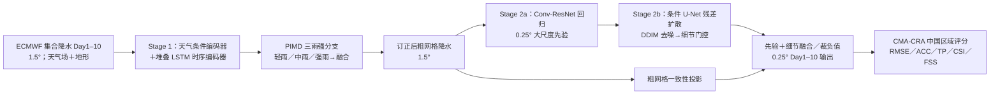

# PCSDiff：十天集合降水的动态偏差订正与扩散降尺度

> Yuze Sun、Shiyi Wang、Jiancheng Pan、Die Wang、Andreas F. Prein、Wentao Luo、Linhan Jiang、Jie Wu、Quan Zhang、Xiaomeng Huang，[*PCSDiff: Diffusion-Based Bias Correction and Super Resolution Toward Practical Operational Medium-Term Precipitation Forecast*](https://arxiv.org/abs/2609.06942)，**2026-09-07 arXiv:2609.06942v1**。本笔记逐节核对[作者 v1 全文及附录](https://arxiv.org/html/2609.06942v1)，截至 2026-09-26 未核实后续版本或正式发表。论文给出的[代码地址](https://github.com/zeaccepted/PCSDiff-Medium-term-precipitation-forecast)当前是**空仓库**，不能据“Code”链接推断训练/推理实现已公开。

## 一、问题、任务边界和核心判断

这是一篇**以已有 ECMWF 集合数值预报为输入的后处理论文**，而不是从观测或 ERA5 初态独立生成天气的全球基础模型。目标是把 1.5° 的逐日降水预报在 **Day 1–10** 订正并降到 0.25°；最终主要按中国大陆 CMA-CRA 降水参考资料评分。两个问题被拆开：预报日数越长、雨强越偏的系统误差交给 PIMD；1.5° 看不到的局地雨带细节交给先回归、再扩散的超分辨率模块。[摘要、§Method、§Data](https://arxiv.org/html/2609.06942v1)

作者报告第 3/5/7/10 天相对原始 ECMWF 的 RMSE 减少约 **14.8%–16.1%**，同时 CSI、FSS 等阈值和空间评分改善。最关键的证据是**同一论文、同一中国验证区域**的 Table 1/S1：第十天 ECMWF→PCSDiff 的 RMSE **6.402→5.423**、CSI **0.515→0.575**；这不能外推为全球 0.25° 的独立预报技巧，更不能称扩散模型改善了 ECMWF 本身的动力积分。[Table 1/S1](https://arxiv.org/html/2609.06942v1)

这里的“集合”指处理 ECMWF 的集合成员并测试 5/10 成员批量推理；论文**没有**给出经可靠度、CRPS 或 spread–skill 检验的概率集合成绩。DDIM 使用 `η=0` 的确定性采样，不能仅凭模型名称“diffusion”就说它提供校准的概率集合。论文称适于业务部署，但附录的硬件与采样协议叙述存在不一致，代码项目也尚未提供实现；部署性能只应称**作者报告的单机基准**。[§Deployment、Appendix S9](https://arxiv.org/html/2609.06942v1)

## 二、资料来源、切分、网格和预处理

| 环节 | 原文明示 | 必须保留的证据边界 |
| --- | --- | --- |
| 输入 | ECMWF 中期集合预报，含总降水 `tp`、控制/集合成员及大尺度天气变量；附录 S7 将其称为 **ECMWF S2S**。输入网格 **1.5°**，lead **1–10 天**。 | 使用 S2S *数据集* 不意味着本文完成第 2–4 周评测；按实际最长十天归 `medium-range/`。控制成员数、全部集合成员数、起报频率、累积降水转日降水的方法未披露。 |
| 辅助变量 | 附录 S2：2t；gh 的 850/700/500 hPa；msl；q 的 1000/925/850/700/500 hPa；sp；sst；tp；u/v/w 各 1000/925/850/700/500/300 hPa；正文另称静态地形。 | S2 所列**非 tp 字段恰为 29 层**，与 S5 的 **39 输入通道＝10 个“ensemble precipitation channels”＋29 个辅助大气通道**数量吻合。但这 10 个降水通道究竟是成员、日序列还是别的展开，以及地形是否另占通道，仍未解释；不能自造精确张量排列。 |
| 监督与验证参考 | 中国气象局 **CMA-CRA** 降水再分析，**0.25°**；中国及周边框 **15–55°N、70–140°E**，评测按中国大陆/适用陆地掩码。 | CMA-CRA 是格点融合/再分析参考，并非每个 0.25° 单元都等同独立雨量站实测。训练配对时如何把 CMA-CRA 扩展到作者所称“全球训练”，正文与 S7 未说明。 |
| 时间 | 全资料 **2004–2024**；训练 **2004–2021**，测试 **2022–2024**；文中说按时间顺序切分。 | **验证年份未单列**，然而 Stage 2 扩散早停基于“end-to-end validation score”；无法确认验证是否从训练期另切、起报是否跨年截断，以及所有测试样本是否完全互斥。 |
| 分辨率和配准 | Stage 1 **1.5°→1.5°** 订正；Stage 2 **1.5°→0.25°** 降尺度，名义上每维 6 倍。 | 原文未明确重网格核函数、时间对齐/累积窗口、海陆边界单元如何处理、地形来源及高分辨率目标降至粗网格的具体算子。 |
| 归一化 | Stage 1 用**训练集统计量的 min–max**；Stage 2 对降水做**对数缩放、250 mm 参考最大值**；ACC 异常采用**候平均气候态**（pentad climatology）；适用处用 land mask。推理另称按预报元数据 on-the-fly 归一化、无离线标准化文件。 | “训练集统计量”与“按当次预报元数据现算”是否同一变换不清楚；具体 min/max、异常基期、缺测/QC、极端值截断都未披露。250 mm 是缩放参考，不应误写成物理降水上限。 |

原文正文多次说“global-data training, China regional validation”，但附录 S7 唯一明确的 `Spatial domain` 是 **15–55°N、70–140°E**，高分辨率监督也只描述中国 CMA-CRA。两句话可能对应不同阶段或不同裁剪策略，但作者没有给全球监督资料、全球样本掩码和 Stage 1/2 的分别区域，**本笔记无法确认“全球训练”实际覆盖范围**。这是复现与外推判断的第一处关键缺口。[§Data、Table S7](https://arxiv.org/html/2609.06942v1)

## 三、模型结构：订正、回归和残差扩散各管什么

此图依据[原文 Fig. 1、式 (1)–(5)、Methods](https://arxiv.org/html/2609.06942v1)重新绘制的是**信息流**，并非复制论文原图；“粗网格一致性投影”接在最终融合前的具体代码位置需由实现核实。

**Stage 1**：天气条件编码器抽取环流、云/湿度、地形等背景表征；堆叠 LSTM 沿十个预报日编码误差演变。PIMD 把轻、中、强雨交给三个分支，再学习融合权重输出 1.5° 订正场。设计动机是不同雨强的样本分布与偏差不同，而非对 ECMWF 的每个成员单独重训一个网络。论文只给概念和 S5 宽度参数；各分支门控、LSTM 层数/hidden size、三档雨强训练标签或切分阈值没有完整披露。[§Stage 1、S5](https://arxiv.org/html/2609.06942v1)

**Stage 2a**：2-D Conv-ResNet 先从订正后的粗场回归高分辨率 `Y_prior`，保留大尺度和定位。Stage 2b 不从随机噪声生成整张降水图，而以 `Y_prior` 为条件，让 velocity-prediction U-Net 学细尺度残差 `ΔY`；DDIM 在 `η=0` 下去噪，再经可学习细节门和多尺度粗网格一致性投影与先验融合，防止细纹理改坏大范围雨量。这个“回归背景＋生成残差”的分工是本文区别于只把扩散当超分辨率黑盒的技术核心。[§Stage 2、式 (3)–(5)](https://arxiv.org/html/2609.06942v1)

**输出与集合**：推理时两阶段张量在显存中串接，不写中间磁盘；最终负降水截断为零，作者还说对集合输入的均值/方差做统计重标定。该后处理可能改变原始扩散输出分布，论文未给逐成员相关性、保序性或不同采样种子概率评分，不能将其称为已验证的随机集合校准。[§Deployment、Appendix pipeline](https://arxiv.org/html/2609.06942v1)

## 四、训练流程、损失、参数、微调

论文描述的是**按 Stage 1 → Stage 2a → Stage 2b 分阶段训练**，未说明加载已有气象基础模型权重，也未逐项确认所有模块是否随机初始化。它没有给出已实施的域适应/区域微调实验：结论的“将来探索 domain-adaptive fine-tuning”是**未来工作**。因此微调的起点、冻结范围、微调数据/目标/阶段在本文应标为**未报告／不适用**，不能把 3 个阶段训练擅写成“微调”。[§Training、§Conclusion](https://arxiv.org/html/2609.06942v1)

| 顺序 | 已公开的结构、目标与参数 | 未披露或易误读项 |
| --- | --- | --- |
| 1：PIMD 粗网格订正 | 39→1 通道；U-Net 基宽 **64**，倍率 `(1,2,4,8)`，**3** 雨强分支。损失为 MSE＋权重 **0.01** 的 TP 损失＋权重 **0.01** 的分支熵正则；TP 损失所列阈值 **0.1/1/5 mm**。**2 GPU × 每卡 batch 1 × 梯度累积 4＝有效 batch 8**；**5000 micro-iterations／1250 optimizer updates**；AdamW LR **1e−4**、weight decay **1e−2**，第 **3000 iteration** 后延迟余弦衰减，梯度裁剪 **0.5**，seed **42**，无早停；EMA 衰减 **0.995**，第 500 iteration 起每 10 iteration 更新。混合精度 PyTorch autocast，作者说不用梯度缩放。 | TP 作为**训练损失**的可微具体实现没有给出；附录定义的 TP **评测分数**涉及阈值化，不能把它原样视为可微梯度公式。3000 iteration 指累积前还是 optimizer update 后的日程没有落实到代码。PIMD 熵正则的符号/防止单分支塌缩方式未写。 |
| 2a：确定性超分回归 | Conv-ResNet 基宽 **64**、**8** residual blocks、残差缩放 **0.5**；1→1 通道；强度加权 Smooth L1＋权重 **0.05** 的梯度损失。batch **4**、**40 epoch**、AdamW LR **2e−4**、weight decay **1e−4**、梯度裁剪 **1.0**，无早停；FP32。 | 加权函数、空间梯度算子、优化器 β、学习率日程、是否用 Stage 1 **真输出还是真值粗化输入**（teacher forcing）未完整交代。 |
| 2b：条件残差扩散 | 去噪器 **3 输入通道**（1 个噪声残差＋2 个条件）→1 输出；基宽 **48**，扩散训练时间步 **100**；batch **4**、最多 **40 epoch**、AdamW LR **1e−4**、weight decay **1e−4**、以端到端验证分数 patience **8** 早停，FP32。复合损失附录列权重 **1.0/4.0/0.1/0.15/0.8/1.0/0.5**，对应 x0、reconstruction、consistency、gradient、structural、FSS、gate；强雨额外权重 **6.0**。S6 列 DDIM 采样 **25 步**。 | 正文称 U-Net **velocity prediction**，S6 却把第一项权重标作 **x0 loss**，同一段又写“Velocity”，目标与编号不一致；噪声日程、梯度/FSS 的可微窗/阈值、门控监督、两条件具体内容及验证集范围需代码核对。 |

训练硬件 S7 明示 **NVIDIA A100 PCIe 40 GB** 与 Kunpeng 920 CPU，Stage 1 用 **2 GPU**；Stage 2 的 GPU 数量、单阶段耗时、总参数量、数据加载/patch 大小未披露。正文“one-time pre-training”只是分阶段训练一次后的部署说法，并非另有独立大模型预训练/迁移阶段。[Tables S5–S7](https://arxiv.org/html/2609.06942v1)

**TP 的双重口径**：附录评测 TP 先以 **1 mm/day** 统计一般雨命中/漏报/空报，再以当地降水气候标准差、至少 **3 mm/day** 的门槛计算强雨 TS，结合正确率 PC，按 Day1–10 权重聚合。训练超参却列 `0.1/1/5 mm` 三档阈值；两处不是同一组阈值，作者没有明确桥接公式。ACC 以候平均为异常基准；CSI 为命中/(命中＋漏报＋空报)；FSS 为局地窗口降水占比相似度，但**具体窗口尺度、阈值、时空聚合权重和置信区间未充分披露**。[Appendix Evaluation Metrics、S5](https://arxiv.org/html/2609.06942v1)

## 五、评测协议、主结果和负面证据

下表直接转录[原文 Table 1 与 S1](https://arxiv.org/html/2609.06942v1)，均为**2022–2024 测试期、中国区域、同篇内的 3/5/7/10 天验证**，非不同论文的跨协议模型排行。RMSE 的物理单位在表题/列头**未印出**；结合降水通常会想到 `mm/day`，但日累计/逐日平均定义未核实，这里只能标为“论文未注明单位”。ACC/TP/CSI/FSS 是无量纲分数。箭头表示方向而非统计显著性；论文没有给这些表的 CI。

| lead | 方法 | RMSE↓（原表未注单位） | ACC↑ | TP↑ | CSI↑ | FSS↑ |
| --- | --- | ---: | ---: | ---: | ---: | ---: |
| Day 3 | 原始 ECMWF | 4.759 | 0.607 | 0.765 | 0.655 | 0.874 |
| Day 3 | ViT | 4.317 | 0.598 | 0.743 | 0.595 | 0.867 |
| Day 3 | ConvLSTM | 4.405 | 0.583 | 0.729 | 0.587 | 0.851 |
| Day 3 | TransUNet | 4.344 | 0.593 | 0.731 | 0.579 | 0.851 |
| Day 3 | CorrDiff | 4.404 | 0.589 | 0.737 | 0.602 | 0.855 |
| Day 3 | PCSDiff | **4.014** | **0.646** | **0.780** | **0.667** | **0.887** |
| Day 5 | 原始 ECMWF | 5.166 | 0.535 | 0.740 | 0.623 | 0.839 |
| Day 5 | ViT | 4.770 | 0.526 | 0.721 | 0.571 | 0.840 |
| Day 5 | ConvLSTM | 4.807 | 0.519 | 0.707 | 0.565 | 0.824 |
| Day 5 | TransUNet | 4.782 | 0.524 | 0.711 | 0.558 | 0.828 |
| Day 5 | CorrDiff | 4.830 | 0.522 | 0.715 | 0.572 | 0.829 |
| Day 5 | PCSDiff | **4.333** | **0.580** | **0.752** | **0.644** | **0.853** |
| Day 7 | 原始 ECMWF | 5.739 | 0.438 | 0.703 | 0.577 | 0.769 |
| Day 7 | ViT | 5.280 | 0.432 | 0.686 | 0.536 | 0.775 |
| Day 7 | ConvLSTM | 5.309 | 0.422 | 0.677 | 0.533 | 0.764 |
| Day 7 | TransUNet | 5.292 | 0.427 | 0.679 | 0.526 | 0.765 |
| Day 7 | CorrDiff | 5.325 | 0.422 | 0.681 | 0.527 | 0.761 |
| Day 7 | PCSDiff | **4.890** | **0.476** | **0.714** | **0.616** | **0.785** |
| Day 10 | 原始 ECMWF | 6.402 | 0.309 | 0.658 | 0.515 | 0.676 |
| Day 10 | ViT | 5.816 | 0.327 | 0.648 | 0.496 | **0.699** |
| Day 10 | ConvLSTM | 5.848 | 0.320 | 0.643 | 0.503 | 0.693 |
| Day 10 | TransUNet | 5.828 | 0.323 | 0.643 | 0.488 | 0.694 |
| Day 10 | CorrDiff | 5.821 | 0.317 | 0.644 | 0.478 | 0.686 |
| Day 10 | PCSDiff | **5.423** | **0.352** | **0.668** | **0.575** | 0.696 |

这里有一个**不能忽略的反例**：在 Day 10 的 FSS，**ViT 0.699 高于 PCSDiff 0.696**，虽 PCSDiff 其他四列更好。所以正文“consistently outperforms mainstream deep-learning baselines on both general and extreme metrics”的笼统表述不被 S1 的每一个单元支持。Day3 PCSDiff 与“only precipitation”消融在 ACC/TP/CSI/FSS **完全打平**，Day10 ACC/TP 也打平；辅助天气场的增益主要体现在 RMSE 和某些长 lead 的 CSI/FSS，不能笼统说所有指标都依赖它们。[Tables 1/S1/S3/S4](https://arxiv.org/html/2609.06942v1)

**图 2**逐日画出 1–10 天 RMSE/MAE/ACC/TP/CSI/FSS，并区分只用降水与完整大气输入；原文只给曲线，本文不从图像像素估造其它逐日小数。**图 3**展示 2022 年三个强雨个例的原始 ECMWF→粗网格订正→高分辨率输出→CMA-CRA 四列；它有助判断雨带形态，却不是随机选样的极端事件置信区间，不能把视觉贴近替代分类技能检验。作者没有给出跨年代、跨气候带或在中国之外的定量泛化表。[Figs. 2–3、§Results](https://arxiv.org/html/2609.06942v1)

## 六、消融与部署数字：能够和不能够推出什么

[原文 Tables S3/S4](https://arxiv.org/html/2609.06942v1)把输入、TP 损失、PIMD 拿掉或替换；下面只列**同一 Day10 中国测试**的关键列，不能把不同前处理或不同 lead 的表格混成一次消融。

| Day10 设定 | RMSE↓（单位未注） | CSI↑ | FSS↑ | 读法 |
| --- | ---: | ---: | ---: | --- |
| 仅降水输入 | 5.632 | 0.545 | 0.687 | 去其它天气场后 RMSE 变差 0.209；但 ACC/TP 与全模型同为 0.352/0.668。 |
| MSE 代替 TP loss | 5.600 | 0.562 | 0.685 | 去 TP 后 RMSE/CSI/FSS 均降，支持复合目标；未给同预算重复随机种子。 |
| MSE＋FSS loss 代替 TP loss | 5.642 | 0.562 | 0.689 | 换 FSS 辅助目标不能全面追上 TP 设定，但 FSS 比仅 MSE 略高。 |
| 去 PIMD | 5.613 | 0.559 | 0.683 | 三分支结构有相关增益，但未独立测 branch 数或同参数量单分支。 |
| 全 PCSDiff | **5.423** | **0.575** | **0.696** | S1 中仍略低于 ViT 的 Day10 FSS 0.699。 |

[附录 Table S9](https://arxiv.org/html/2609.06942v1)给 10 天**完整预报链路**的作者自报耗时/峰值显存；以下只在该表内部比较，不和其他论文不同硬件/预处理口径比较：

| DDIM 设置 | ECMWF 成员数 | 峰值显存 GB | 端到端耗时 s |
| --- | ---: | ---: | ---: |
| 50 步“full” | 5 | 12.4 | 14.7 |
| 50 步“full” | 10 | 18.7 | 38.2 |
| 10 步“accelerated” | 5 | 11.8 | 3.6 |
| 10 步“accelerated” | 10 | 17.2 | 13.1 |

这些数字提示推理的计算—细节权衡，但**没有配套印出的 10 步与 50 步评分表**，因此“只有轻微质量下降”是作者叙述、尚不能量化。S6 又列默认 DDIM **25 步**，与 S9 的 50/10 步业务试验不同；具体 Table 1/S1 究竟按 25 还是 50 步算分没有明确绑住。附录硬件描述同时写“single consumer-grade GPU”和 **RTX 4090 / A100 (40 GB)**；RTX 4090 与 A100 不是同一型号，也非相同显存，所以无法把 S9 四行稳定归因到某一确定 GPU/精度。论文还称后处理保持集合统计量，却没给该重标定对误差或概率可靠度的消融。[S6、S9、Appendix pipeline](https://arxiv.org/html/2609.06942v1)

## 七、作者主张与阅读判断分开

1. **作者主张**：PIMD 可应对 lead 依赖偏差，回归＋残差扩散同时改善一般和强雨降水，流水线可迁移业务系统。**阅读判断**：同一中国测试期的多指标表支持“相对 ECMWF 原始降水和若干重新对照方法有较好后处理评分”，但并未证明独立全球天气预报或所有单元的 SOTA；Day10 ViT FSS 是明确反例。
2. **作者主张**：“全球训练、中国验证”缓解地域过拟合。**阅读判断**：S7 仅列中国周边框，且 CMA-CRA 仅作中国参考；若无全球监督域、采样/掩码和验证分年细节，无法判断训练是真全球、粗网格预训练全球还是只是输入来自 ECMWF 全球产品。
3. **作者主张**：模型面对极端降水更稳健。**阅读判断**：CSI/FSS、三例可支持事件识别与空间细节改善，但没有尾部强度分位数、逐流域洪水后验或统计不确定性，也未对超出 2022–2024 和中国区域的极端事件评估。
4. **作者主张**：加速采样、显存流式处理带来实用时延。**阅读判断**：S9 是有价值的实测表，但 GPU 型号/precision/采样步与主技巧表的对应关系未清楚写出，缺离线 I/O 基线与独立复跑；“业务可用”仍是工程预期，不等于 24×7 在线试运行已完成。结论明确把实际气象局试运行写作**未来工作**。
5. **概率与因果边界**：本研究是在 ECMWF 已有数值预报上监督式订正/降尺度，不是对 ECMWF 物理误差机制的识别；DDIM `η=0` 的一次输出、5/10 成员耗时表，都不能替代 CRPS/可靠度、成员相关性和极端概率评测。

## 八、复现清单与待核证事项

- 首先要锁定**所用 ECMWF 产品/版别、回报/实时起报频率、控制/成员数、日累积时间窗**，以及 1.5° 输入与 0.25° CMA-CRA 的保守重网格/面积权重；原文不能单独生成完全同样的训练样本。
- 需要各年份的**训练/验证/测试起报 ID**、CMA-CRA 缺测/QC、地形网格、min/max 统计量、对数变换与 250 mm 缩放逆变换，并澄清“全球训练”与 S7 区域框关系。作者当前代码链接为空，不能取得这些文件核对。
- 训练要分开核对 **Stage 1 的可微 TP loss**、PIMD 强度路由与熵符号、Stage 2a 回归目标、Stage 2b velocity/x0 损失、扩散噪声调度及粗网格一致性投影；其中多处论文有名目但无精确实现。
- 主表复跑必须报告同一中国格网、相同时间窗/地形掩码/集合汇总、指定的 DDIM 步数和随机种子；再做 10/25/50 步技巧—时延配对试验及跨年 bootstrap CI。本文没有公开这样的复跑、因而本笔记所有表值均为**原文转录，而非本地复算**。
- 进一步研究可在第 8–10 天做分雨强、南北方/季节、山地/平原、不同 ECMWF 业务版本及独立雷达/站点检验，并对后处理集合算 CRPS、Brier、可靠度与尾部量化。但这些是**建议，不是本文已经完成的结果**。

**结论**：PCSDiff 是针对已有 ECMWF 10 天集合降水的两任务串联后处理：先用天气条件与逐日时序信息校正偏差，再用回归大尺度背景＋条件残差扩散恢复细雨带。它的中国区域 3/5/7/10 天表格为“中期降水后处理可同时改善多个指标”提供了相当具体的证据；但全球训练域、验证划分、通道清单、采样—评分对应、硬件基准口径与空代码仓库限制了独立复现，也不允许把这篇改写成已校准的 S2S 概率集合或全局观测到预报基础模型。
