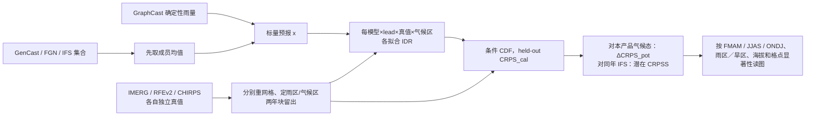

# 非洲降水的“潜在业务技巧”：GraphCast、GenCast、FGN 与 IFS 在统一校准下怎样比较

> Shruti Nath、Docko Sow、Koomi Toussaint Amoussouvi、Fenwick Cooper、Josiah Kiarie Kimani、John Bagiliko、Florian Pappenberger、Rendani Mbuvha，[*Suitable Measures for the Potential Operational Utility of AI NWP Rainfall Forecasts Over Africa*](https://arxiv.org/abs/2609.31775)，**2026-09-24 arXiv:2609.31775v1**。本笔记据[作者 v1 全文及补充图 S1–S5](https://arxiv.org/html/2609.31775v1)逐节核对；截至 2026-09-29 未核到正式同行评审版本。它是**现有预报系统的比较／后处理评估研究**，不是 GraphCast、GenCast 或 FGN 的新版本。Hugging Face 论文 API 本次未连通，书目与全文以 arXiv 原件为准。

## 一、它真正回答的问题及结论边界

现有 AI 天气模型的全球平均预报分数，不能直接说明在**非洲降水**尤其雨季、高地和缺站区对预报员有多大用处。原始 GraphCast 只有确定性轨迹；GenCast、FGN 与 IFS 虽有集合，各自概率校准机制和成员数不同。作者于是对**四套系统都施加同一个非参数后处理框架**：将各自预报值映射为条件降水分布，再对 IMERG、RFEv2、CHIRPS 三套卫星／雨量站混合资料分别计算校准后的 CRPS。这回答的是“若在历史资料上分别给各模式做合理统计校准，仍保留多少超出气候态的区分力？”而非“未经后处理的原始集合谁更校准”。[摘要、§1–2.3](https://arxiv.org/html/2609.31775v1)

结果必须分区、分真值读：在**湿润格点**，AI 系统对 IFS 通常更好；但在**干燥高地**，IFS 反而更有优势。对达到统计显著差异的格点作箱线汇总，GraphCast 与 FGN 相对 IFS 的潜在 CRPSS 中位数多在约 **+0.05**，不是整个非洲、所有日期、所有格点的固定“提速 5%”。用 CHIRPS 评“全域”时，除 GraphCast 外其他系统甚至可能不如气候态；这一反例显示验证资料选择会改变结论。[§3、图 3–11](https://arxiv.org/html/2609.31775v1)

评测只在 **Day 1/3/5/7/9** 给出分季和分区图；第九天位于中期预报前段，所以归入 `medium-range/`，**没有第 10–15 天、S2S 第 2–4 周或对极端降水的专门 proper-score 数值表**。本文没有重新训练天气底座，也没有实测新模型的在线生产成本。[§2.3.3、§4](https://arxiv.org/html/2609.31775v1)

## 二、数据、年份与可复现的处理顺序

| 角色 | 作者明确使用的版本和处理 | 不能擅自填补的空白 |
| --- | --- | --- |
| IFS ENS 物理基准 | ECMWF 50 个扰动成员，总降水主要取 WeatherBench2 存档，缺项/时期从 ECMWF MARS 取；评估期覆盖 **2020、2021、2022、2024、2025**，缺 **2023**。2023-06-27 起 48r1 将原约 18 km 的 TCo639 升至约 9 km 的 TCo1279；其间还有湿物理升级。 | 不能当 IFS 是不变版本，也不能用“同年比较”自动消除 2023 缺口；各 cycle 的逐日配对数未给出。 |
| GraphCast | 使用 **HRES-fc0 业务微调版**，0.25°、6h 两历史帧→自回归；原底座是 ERA5 1979–2017 训练、16 层 GNN、约 36.7M 参数。产品有 **2020–2025**。 | 本文**没有重训或微调** GraphCast；完整原始训练超参应查底座论文，不能把本篇 IDR 拟合写成 GNN 微调。 |
| GenCast | 使用业务微调版，0.25°、12h 条件扩散集合；原文概述约 57M 参数、16 层/512 潜维。产品 **2020–2025**。 | 本文没有扩散再训练；成员数、每年初始化版别和实际采样轨迹选取没有在评估方法中逐项列足。 |
| FGN / WeatherNext 2 | 使用业务 HRES-fc0 微调版，0.25°、6h；原模型 4 个独立 seed 的 deep ensemble，32 维共享高斯扰动经条件层归一化，约 180M 参数/seed、24 层/768 潜维；产品只有 **2022–2025**。 | 这是上游模型配方，不是本文重训。四个 seed 与本研究提取的所有预报成员组合方式、每产品的有效成员数未完整披露。 |
| IMERG Final V07 | NASA/JAXA GPM 多卫星＋雨量站月尺度调整，原始 0.1°/30 分钟；论文数据说明引用 **daily Final Run V07**。Final 约 3.5 个月延迟，只能作**事后验证真值**而非实时输入。 | 从 30 分钟率／daily 归档到论文所评降水率 `mm h⁻¹` 的时间窗口、时区/累计对齐和除法细节未逐项给出。 |
| CHIRPS v2.0 | 卫星红外冷云持续时间＋站点融合，0.05°，陆地约 50°S–50°N；可每日／候／月产品。本文使用非洲评测目标。 | 干旱区零气候均值的乘法订正可能把值压成 0；站点稀疏与陆地覆盖使其不等同无偏真值。 |
| RFEv2 | NOAA CPC/FEWS NET 非洲 0.1° 日雨量，**06:00–次日 06:00 UTC**，融入静止卫星红外、被动微波与 GTS 雨量站。 | 与 IMERG/CHIRPS 的日界/积算时段如何统一，正文未给可执行配准脚本；直接拼接三真值会造成假误差。 |

论文写“按**各验证产品的原生网格**计分”，预报场需要时以**双线性插值**重网格。这是从不同数值格网到不同验证网格的三个独立协议；不能把三套产品的格点数、覆盖范围或 CRPS 绝对值合并为一组分母。降水空间插值用双线性，不是守恒重网格；对极端与复杂地形的影响值得额外敏感性试验。三套真值每套分别定义气候态、雨区掩码、IDR、评分，不共同训练一个跨真值后处理器。[§2.1–2.3](https://arxiv.org/html/2609.31775v1)

**时间切分不等于底座完全时间外测试。** 方法用 2020–2025 产品做回报，在 IDR 拟合时按连续**两年块留出**（示例为 2020–21、2022–23、2024–25），把被留出的年份才用于该折评分。这减少后处理的样本内乐观偏差，但作者明确承认若底座曾在 2016–2022 做业务微调，早期回报仍可能与底座训练时间重叠；因此又称对 IFS 的相对分数会着重看 2024–25。**IFS 没有 2023、FGN 没有 2020–21**，所以共同年份随对照组合变化；本文没有一张可直接复算的逐模型×年份×季节起报数表。[Table 1、§2.3.2、§4](https://arxiv.org/html/2609.31775v1)

## 三、方法图：同一校准流程为何不等于同一信息量

这是据[Methods §2.3](https://arxiv.org/html/2609.31775v1)原创重绘的**评估数据流**，不是论文原图或新天气神经网络结构图。箭头上最关键的事实是：作者对原有三个集合模型**也只以成员均值作为 IDR 自变量**；模型成员的原始离散度、偏态、空间相干性和多变量轨迹信息没有直接进入 IDR。故 GraphCast 校准后与 FGN 的**逐格点边际 CRPS**接近，不等于确定性系统能像 FGN 那样给流域连贯的联合极端路径，更不证明初值/模型不确定性完全无用。[§2.3.2、§4](https://arxiv.org/html/2609.31775v1)

### IDR 的拟合、参数与“微调”分界

IDR（isotonic distributional regression）对给定标量预报 `x` 学条件分布 `F(y|x)`，假设更高的预报雨量对应随机意义上不更低的观测雨量，**不假设高斯或 Gamma 家族**。作者使用 EasyUQ 实现，为每个**模型×提前量×观测产品×Köppen–Geiger 气候区**单独拟合，在区内把全部格点与可用时次汇集（“空间换时间”）增加样本。训练折排除一个连续两年块，留出块得分，跨块汇总；没有本篇新增 GNN/扩散/FGN 权重训练，也没有天气底座层冻结/解冻。因而这里的“微调起点、冻结范围、学习率、batch、epoch、GPU”对天气模型是**不适用**；IDR 是非参数统计拟合，论文未披露 EasyUQ 精确版本、格点权重、每气候区样本量下限、随机种子和具体计算硬件。[§2.3.2](https://arxiv.org/html/2609.31775v1)

气候区内共享一条条件分布暗含“同气候区各格点条件雨量分布可汇集”的假设。埃塞俄比亚高地、东非裂谷与湿干带边缘可能不满足；它并非站点特定可靠度校准。两年块留出虽防止同折样本泄漏，**不能消除**同一区内空间相关、同一湿季强迫事件的相似性或上游底座训练期重叠。[§2.3.2](https://arxiv.org/html/2609.31775v1)

## 四、得分和分层：怎样解读“潜在”而不是误报原始技巧

对一个降水率观测 `y` 和预测 CDF `F`，CRPS 是两者 CDF 差平方沿全部阈值积分，**越小越好，单位 `mm h⁻¹`**（论文口径）。文章把未经校准的原始分数记 `CRPS`，把留出块 IDR 后的分数记 `CRPS_cal`；主图以**后者**作比较。定义 `ΔCRPS_pot = CRPS_cal − CRPS_clim`：**负值**说明有高于本产品气候态的区分力，正值反而劣于气候态。另定义 `CRPSS_IFS = 1 − CRPS_cal(模型)/CRPS_cal(IFS)`：正值是比经过**同样校准**的 IFS 好，不能翻译为“比原始 IFS 好这么多”。[式 (5)–(8)](https://arxiv.org/html/2609.31775v1)

原文借用分解 `CRPS = (CRPS−CRPS_cal) − (CRPS_clim−CRPS_cal) + CRPS_clim`，分别称 miscalibration、discrimination、uncertainty。但在**留出块而非样本内**拟合的场景，作者提示分解项的非负性不再保证，甚至会有小负“误校准项”；因此不可把每个网格的负值读成真实物理误差被反向消除。[§2.3.1](https://arxiv.org/html/2609.31775v1)

按 **FMAM（2–5 月）、JJAS（6–9 月）、ONDJ（10–1 月）**分季，lead **1/3/5/7/9 天**。每种真值单独按该月气候平均雨率 **≥1 mm/day**划“湿润”格，余为“干燥”；每月掩码可能不同，三产品也不同。另把海拔 `<500`、`500–1000`、`1000–2000`、`>2000 m` 四档，再分别看湿/干。`ΔCRPS_pot` 的带状不确定性由年/月值做 **100 次 bootstrap**；地图的 IFS 成对差用每格点 Diebold–Mariano 检验及小样本修正，`p<0.1` 才称该格点差异显著。论文未报告多格点多指标的统一多重检验校正，地图显著斑块不能直接等同全域显著。[§2.3.1–3.2](https://arxiv.org/html/2609.31775v1)

## 五、原图与正文中明确给出的正反数值

本篇主体是图 1–11 加补图 S1–S5，**没有统一逐 lead 的数字性能表**。下表仅转录正文明确写出的数值／区间和图注定义，不从曲线像素估造小数。`ΔCRPS_pot` 是 `mm h⁻¹`，CRPSS 是无量纲；数值与区域、季节、真值绑定。[§3、Figs. 1–11](https://arxiv.org/html/2609.31775v1)

| 原文位置与协议 | 原文明确数字／方向 | 不能忽略的反例和分母 |
| --- | --- | --- |
| 图 1–2，分层定义 | 湿润格为本产品、本月平均 **≥1 mm/day**；海拔四档为 `<500`、`500–1000`、`1000–2000`、`>2000 m` | 这是验证样本筛选，不是模型训练雨强标签；不同产品“湿润区”不完全相同。 |
| 图 3，全域/湿/干 `ΔCRPS_pot` | 湿润区 AI 相对 IFS 的分数差，IMERG 约 **−0.007 mm h⁻¹**，RFEv2/CHIRPS 约 **−0.0035 mm h⁻¹**（正文称后两者约一半）；IMERG、RFEv2 干区差异很小。 | 全域 IMERG 较有利于 AI；RFEv2 全域无明显差；CHIRPS 全域**除 GraphCast 外均可差于气候态**。不同真值的气候态基线不同，绝对差不应合并平均。 |
| 图 3，CHIRPS 干区 | GraphCast 差于气候态约 **+0.001 mm h⁻¹**；其他系统约 **+0.015 至 +0.02 mm h⁻¹**。 | 作者认为可能受 CHIRPS 干旱区零雨处理影响，也不排除模式本身毛毛雨偏差；尚无独立站点对干区反证。 |
| 图 4，分季湿区 | JJAS 的 IFS 在 **Day5–7** 对气候态失去分辨力；AI 在 RFEv2/CHIRPS 上到 **Day7** 也失去，在 IMERG 上仍保持。 | “AI 全季全时效都胜气候态”不是所有真值/季节的事实；不能只报 IMERG。 |
| 图 5–6，按海拔 | `>2000 m` **湿区** IMERG/RFEv2 上各系统差异不明显、RFEv2 的 IFS 在 `<7d` 略好；`>1000 m` **干区** CHIRPS/RFEv2 明确偏向 IFS。 | IFS 约 0.1° 业务网格、AI 0.25°；湿区复杂对流仍低于两者的可解析尺度，干高地雨影/下沉可能更受分辨率影响。 |
| 图 7–9，季节地图 | 刚果盆地约 **+3–5%** 较稳定；FMAM/ONDJ 东/南部非洲约 **+7–10%**；JJAS 喀麦隆、加蓬 Day1 可 **>15%**，较长时效回落到 **+2–5%**。 | 是区域地图作者文字概述，并非每个格点均值；萨赫勒/埃塞俄比亚高地有负区且多不显著。 |
| 图 10–11，**只取 DM 显著格点**的 CRPSS 箱线 | FGN 与 GraphCast 相对 IFS 的中位数大多约 **+0.05**，但 CHIRPS 的 FMAM/JJAS 在 Day7/9 是例外。IMERG 多数组合显著格点占比过 **50%**（若干 JJAS/ONDJ 早期 lead 除外）；RFEv2 约至少 **25%**，CHIRPS 长 lead 通常不足 **25%**。 | 约 5% 是**通过 p<0.1 筛选后的空间中位数**，不可报告成“全非洲所有格点平均 5%”；选择显著格点会放大视觉总体优势。 |
| 补图 S1–S5 | S1/S2 并排画原始 vs IDR 的 CRPS；S3–S5 画 IFS 对三个真值各自校准后的地图。 | 原图不提供逐格/逐日机器可读数表；本笔记不从着色地图制作假精度的分数网格。 |

**图号和统计口径自查**：正文讨论图 10–11 时有把显著格点箱线误指“图 8”的内部交叉引用；读者应依图注而不是错误链接。图 7–9 是**仅选 IMERG 真值的空间地图**，图 10–11 才将三产品一起放入季节箱线；不能把 IMERG 地图优势自动当 CHIRPS 的同一张图。图 10 的须线是格点 90% 空间范围，图 11 是 DM p 值，不是模型成员预测区间。[§3.2](https://arxiv.org/html/2609.31775v1)

## 六、训练、微调、消融与复现缺口：该写明“不适用”的地方

**本文新增的可学习步骤只有后处理 IDR**；没有新天气模型结构、损失、优化器或从某一 checkpoint 出发的微调。上表所列 GraphCast 的 ERA5 加权 MSE/1→12 步训练、GenCast 扩散和 FGN fair-CRPS＋业务微调，是**作者回顾的上游模型背景**，非本研究重新做的三个训练实验。本篇不提供这些底座训练的 batch、学习率、epoch 或硬件，也不应把其它论文详细超参无标签地移植过来。本篇的 IDR 也没有可调神经网络、冻结层或 GPU 训练时长可报。[§2.1–2.3](https://arxiv.org/html/2609.31775v1)

**没有规范的模型组件消融**。有意义的敏感性比较是：三种卫星/站点融合真值、湿/干掩码、季节、海拔、原始/校准 CRPS、GraphCast 确定性 vs FGN/GenCast 集合摘要，以及 2024–25 较少训练期重叠年份。这不是“去掉 FGN 噪声”或“对比四模型同架构随机种子”的控制试验；无法把约 5% 的差完全归因给集合生成方式。若把集合全分布输入 IDR/EMOS 与“只用集合均值”配对消融，才可测原成员离散信息在边际评分里剩余多少；本文**没有做**。[§2.3、§4](https://arxiv.org/html/2609.31775v1)

**对实用性的限制**至少有五条。① `CRPS_cal` 是回报资料块留出的**潜在后处理技巧**，作者承认短 lead 可能过于乐观、长 lead 又可能低估动态集合信息；不是已在非洲国家气象业务上线的实时评分。② 已微调底座的训练时间与早期回报可能交叉、IFS 缺 2023、FGN 缺 2020–21，且 IFS 产品跨业务 cycle。③ 雨量参考本身互有偏差，CHIRPS 干区结果对资料算法敏感。④ 空间平移的“双罚”及高雨强尾部尚未以邻域/加权 proper score 充分验证。⑤ 区域预测用户常需要**空间—时间联合轨迹和流域整合雨量**，每格点 IDR 的 CDF 无法代表原生集合成员的这种结构。[§4–5](https://arxiv.org/html/2609.31775v1)

如果复现：需锁定四系统逐年预报版本/每次起报 ID/成员数和初值、三套真值的日界与缺测、双线性配准及海陆掩码；公布按各产品算的 Köppen–Geiger 区映射和逐年分折索引；对同一模型与 IFS 只取共同年份／同一天样本，保存每 `模型×lead×真值×区×fold` 的 EasyUQ 拟合对象；以 100 次月/年 bootstrap 和每格 DM 检验重算，再加入多重比较敏感性、独立站点极端和全分布 ensemble-IDR 对照。论文提供了数据来源链接，却没有专用的完整预处理／IDR 运行仓库、逐样本预报和已拟合对象；本笔记**未声称复跑作者成绩**。[Data、Methods](https://arxiv.org/html/2609.31775v1)

## 七、一句话之外的结论

这篇论文的价值不在制造第五个天气模型，而在建立一个**对确定性与原生集合一视同仁的、带时间块留出的边际概率评价框架**，并展示为何非洲降水必须按雨区、地形、季节和观测产品拆开看。经 IDR 后，GraphCast 与 FGN 在许多显著格点上的中位边际 CRPSS 接近 +5%，湿区普遍比 IFS 有利；可是在 CHIRPS 干区、干燥高地和西非雨季后段，结论明显变弱甚至翻转。因作者把原生集合压成**均值**才校准，这些证据只支持“各模型的某些边际可校准信息相近”，不支持“确定性 GraphCast 已替代 FGN/GenCast 的空间联合概率集合”。
